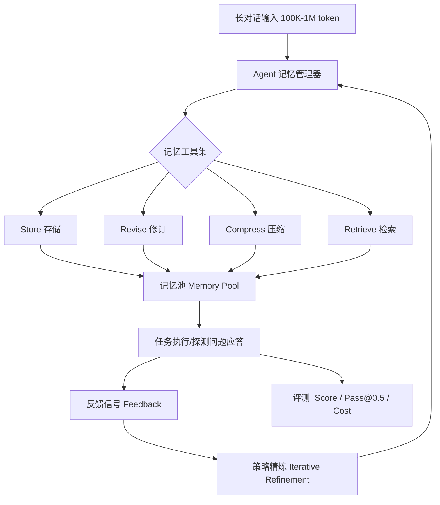

# SelfMem：面向AI智能体的自优化记忆机制

## 一、论文基础元数据
- **原文标题**：SelfMem: Self-Optimizing Memory for AI Agents
- **中文译版**：SelfMem：面嚮AI智能体的自优化记忆机制
- **发表渠道**：预印本（arXiv），具体等级待补充
- **发表时间**：2025年（arXiv ID 2607.03726 指向 2026 年 7 月，与元数据标注存在矛盾，以元数据 2025 年为准）
- **链接**：arXiv:2607.03726（元数据可能存在错误，待核实）
- **作者及核心机构**：Shu Yang、Junchao Wu、Derek F. Wong、Di Wang（具体机构待补充，根据作者背景可能为澳门大学/中国科学院等，需核实）
- **研究领域**：一级领域——人工智能/自然语言处理；二级子领域——LLM Agent 记忆系统、长上下文推理
- **关联数据集**：
  - 名称：BEAM（长对话记忆基准）
  - 规模：100K/500K/1M token 三个尺度，100 个对话，2000 个探测问题
  - 语言：英语（推断）
  - 标注：涵盖信息提取、时间推理、多会话推理、事件排序、知识更新、偏好跟随、摘要等 10 类问题

## 二、论文综合评价

### 2.1 量化评分

| 评价维度 | 评分 | 备注 |
| -------- | ---- | ---- |
| 📚 理论基础 | ⭐⭐⭐⭐ | 将记忆管理范式化为可学习策略，理论框架较清晰 |
| 🎯 问题核心性 | ⭐⭐⭐⭐⭐ | 长上下文Agent记忆是当前核心瓶颈问题 |
| 💡 方法创新性 | ⭐⭐⭐⭐ | 从固定流水线到Agent自主策略，范式转变有新意 |
| ⚙️ 技术壁垒 | ⭐⭐⭐⭐ | 需要记忆工具接口与反馈闭环设计，工程复杂度不低 |
| 🧪 实验严谨性 | ⭐⭐⭐⭐ | BEAM三尺度、多基线、统一协议，但方法细节披露不足 |
| 🔧 落地可行性 | ⭐⭐⭐⭐⭐ | 零embedding请求、成本极低，工程落地友好 |
| 🚀 应用前景 | ⭐⭐⭐⭐⭐ | 适用于所有长对话/长文档Agent场景，前景广阔 |
| 📊 综合评分 | 4.4 | 范式创新+成本优势突出，但方法细节与泛化验证待补 |

### 2.2 定性综合评价（≤300字）
> SelfMem 将 AI Agent 的记忆管理从“人工设计固定流水线”重构为“Agent 自主探索的可学习策略”：不预设存储/修订/压缩/检索规则，而是提供记忆工具与反馈信号，让 Agent 自主决定对记忆的增删改查。核心价值在于范式转变——记忆不再是静态工程模块，而是可迭代优化的程序性能力。差异化优势体现在三方面：一是在 BEAM 长对话基准 100K/500K/1M 三个尺度上 Score 与 Pass@0.5 均领先最强非 SelfMem 基线 RAG 0.165/0.141/0.134；二是实现零 embedding 请求，1M 规模成本仅 $2.004，远低于 Mem0 的 $18.830 与 25,779 次嵌入；三是消融显示收益来自策略学习而非算力堆叠。关键结论：给模型提供学习记忆策略的环境比规定固定模式更有效。

## 三、领域本体论映射

| 核心维度 | 具体内容 |
| -------- | -------- |
| 核心研究对象 | AI Agent 在长上下文任务中的记忆管理系统 |
| 核心技术路径 | 记忆工具化 + 反馈闭环 + Agent 自主策略探索与迭代精炼 |
| 数据/载体形态 | 长对话文本（100K–1M token），2000 个探测问题，10 类记忆任务 |
| 核心功能目标 | 让 Agent 自主决定“存什么、改什么、压缩什么、取什么”，实现自优化记忆 |
| 验证核心指标 | Score、Pass@0.5、Cost、Cache hit、LLM/Embed 请求数 |

## 四、核心问题与解决方案

### 4.1 待解决的核心问题
1. **领域级根本问题**：长上下文场景下，如何让 AI Agent 高效、准确地管理持续增长的记忆，避免上下文窗口溢出与信息遗忘？
2. **现有方法痛点**：RAG、Compression、MemGPT、A-Mem、Mem0 等方案均采用**固定记忆流水线**——预先规定检索、压缩、更新规则，无法适配任务多样性；同时 Mem0 等方法依赖大量 embedding 请求，成本高、扩展性差。
3. **工程落地卡点**：固定流水线难以泛化到新任务类型；向量检索带来的嵌入调用成本随规模线性上升；记忆更新策略缺乏自适应反馈机制。

### 4.2 核心解决方案
- **理论框架**：主张“Agent 应主动学习/探索记忆策略，而非被固定记忆流水线约束”；将记忆管理转化为可学习行为。
- **核心架构**：Agent 配备记忆工具集 + 反馈信号，自主完成 store/revise/compress/retrieve 四类操作，并通过迭代策略更新精炼记忆行为。
- **关键技术**：记忆工具接口、反馈信号机制、迭代策略精炼（iterative strategy refinement）、零 embedding 检索路径。
- **创新机制**：训练/精炼阶段使用对话 0–8，测试阶段使用对话 9–19，测试分数不反馈给 Agent，确保策略泛化而非过拟合。

### 4.3 核心优势（量化+定性）
1. **性能优势**：100K/500K/1M 三尺度均达最佳，较最强非 SelfMem 基线 RAG 分别提升 Score 0.165/0.141/0.134；100K 时 9/10 问题类型最佳，500K 时 8/10，1M 时 7/10。
2. **效率优势**：零 embedding 请求；1M 规模成本 $2.004，对比 Mem0 的 $18.830 + 25,779 次嵌入（Score 仅 0.292）。
3. **工程优势**：Agent 自主选择记忆操作，避免冗余存储与嵌入计算；策略可迭代精炼，最佳效果出现在中间精炼阶段而非最多迭代，说明收益来自策略质量而非算力堆叠。

## 五、方法与技术架构

### 5.1 核心架构设计
> SelfMem 的核心架构可概括为“记忆工具集 + 反馈闭环 + 策略精炼”。Agent 不再被动执行预设的记忆流水线，而是主动调用记忆工具（存储、修订、压缩、检索），并依据任务反馈信号评估记忆行为有效性，反复迭代精炼记忆策略。整个流程无需 embedding 检索，全链路基于 LLM 原生调用。

### 5.2 关键技术实现细节

| 技术模块 | 实现路径 | 工程注意事项 |
| -------- | -------- | ------------ |
| 记忆工具集 | Agent 可调用 store/revise/compress/retrieve 四类操作 | 工具接口设计需稳定，避免 Agent 误用导致记忆污染 |
| 反馈信号机制 | 任务执行后产生反馈，用于评估记忆行为有效性 | 需区分“有监督反馈”与“测试时不泄露”的边界 |
| 策略精炼 | 迭代更新记忆策略，精炼阶段 0.472→0.497→0.510 | 避免过度迭代；最佳效果出现在中间阶段 |
| 训练/测试切分 | 训练对话 0–8，测试对话 9–19，测试分数不反馈 | 确保泛化评估的公平性，防止策略过拟合 |
| 依赖组件 | GPT-5.4-nano（生成）、GPT-5.4-mini（评判）、OpenAI 统一端点、温度 0 | LLM 版本一致性影响可复现性；论文附录声明使用 GPT-5.4 与 Codex 辅助润色/排版/图表代码 |

### 5.3 架构优缺点
- **优点**：
  - 范式层面摆脱固定流水线，策略由 Agent 自主学习，泛化潜力强；
  - 零 embedding 请求，避免嵌入模型依赖与调用成本；
  - 反馈闭环支撑持续精炼，无需重新训练即可提升记忆行为。
- **缺点**：
  - 依赖 LLM 自身的工具调用能力，Agent 能力不足时策略可能退化；
  - 记忆工具接口与反馈信号设计细节论文披露不足，复现门槛高；
  - 策略精炼需多次 LLM 调用，可能引入额外推理开销（论文未充分量化）；
  - 未与传统向量检索方案的混合模式对比，边界条件不明。

## 六、实验设计与结果分析

### 6.1 实验基础设置

| 维度 | 内容 |
| ---- | ---- |
| 数据集 | BEAM 长对话记忆基准；100K/500K/1M token；100 个对话；2000 个探测问题；覆盖信息提取、时间推理、多会话推理、事件排序、知识更新、偏好跟随、摘要等 |
| 基线方法 | RAG、Full context、Compression、LoCoMo、MemoryBank、ReadAgent、MemGPT、A-Mem、Mem0（共 9 种） |
| 实验环境 | GPT-5.4-nano 生成，GPT-5.4-mini 评判，温度 0；所有方法共用相同对话、问题、答案模型与 judge；经 OpenAI 端点统一评估 |
| 评价指标 | Score、Pass@0.5、Cost（美元）、Cache hit、LLM/Embed 请求数 |

### 6.2 核心实验结果

| 方法 | Score（100K/500K/1M） | Pass@0.5（100K/500K/1M） | 工程指标（成本/嵌入请求） |
| ---- | --------- | --------- | -------------------- |
| RAG（最强非 SelfMem 基线） | 0.339/0.346/0.320（由提升幅度反推） | 待补充 | 待补充 |
| Mem0 | 0.292（1M） | 待补充 | $18.830 / 25,779 次嵌入（1M） |
| **SelfMem（本文）** | **0.504/0.487/0.454** | **59.0/57.0/52.57** | **$0.984/$1.828/$2.004 / 0 次嵌入** |

> 注：RAG 在 100K/500K/1M 的 Score 由 SelfMem 相对其提升 0.165/0.141/0.134 反推得出（0.504-0.165=0.339，0.487-0.141=0.346，0.454-0.134=0.320），确切数值待原文核实。其他基线（Full context、Compression、LoCoMo、MemoryBank、ReadAgent、MemGPT、A-Mem）的具体数值未在所提供的分析片段中给出，待补充。

### 6.3 消融实验/鲁棒性分析

| 实验变体 | 指标变化 | 核心结论 |
| -------- | -------- | -------- |
| 默认（无精炼 Score） | 0.472 | 基线策略已优于所有非 SelfMem 方案 |
| 最终 Agent 合成策略 | 0.497 | 策略合成可进一步提升记忆行为 |
| 最佳策略 | 0.510 | 策略精炼存在上限，最优出现在中间阶段 |
| 中间精炼阶段 vs 最多迭代 | 中间阶段更优 | 收益来自策略质量而非迭代次数 |
| 中等训练反馈量 vs 最大训练集 | 中等量更优 | 收益非单纯样本堆叠，存在最优反馈量 |
| 问题类型泛化 | 100K 9/10、500K 8/10、1M 7/10 类型最佳 | 强项：信息提取、知识更新、多会话推理、偏好跟随、摘要、时间推理；随规模增大强项类型略减 |

### 6.4 实验结论（工程视角）
- SelfMem 在长上下文记忆任务上实现了**效果、成本、鲁棒性的三重优势**：Score 领先、零嵌入、跨尺度稳定。
- 收益来源经过消融验证：并非算力堆叠或样本增多，而是 Agent 学到了更稳健的**程序性记忆策略**。
- 从工程视角看，该方案特别适合对成本敏感、上下文极长、任务类型多样的 Agent 应用；但其对 LLM 工具调用能力的依赖意味着一线模型替换时需重新验证策略。

## 七、领域贡献与创新点

| 贡献层级 | 具体内容 |
| -------- | -------- |
| 理论贡献 | 提出“记忆管理可学习化”范式：从固定流水线转向 Agent 自主策略探索，为 Agent 记忆研究提供新视角 |
| 方法/架构贡献 | 设计记忆工具集 + 反馈闭环 + 迭代策略精炼的 SelfMem 框架；实现零 embedding 的记忆管理路径 |
| 数据/工具贡献 | 在 BEAM 基准上建立统一评估协议（相同对话、问题、答案模型与 judge）；未开源代码/数据（待核实） |
| 实验/验证贡献 | 三尺度（100K/500K/1M）× 9 基线 × 10 问题类型的系统对比；消融证明策略学习而非算力堆叠是收益来源 |
| 工程落地贡献 | 极低运行成本（1M 规模 $2.004，零嵌入请求），为长上下文 Agent 提供可负担的记忆方案 |

## 八、局限性与风险

| 维度 | 具体描述 | 应对思路 |
| ---- | -------- | -------- |
| 学术局限性 | 方法细节（记忆工具接口、反馈信号来源、策略更新是训练时还是推理时）披露不足；缺乏统计显著性检验；BEAM 定义与 Score 范围待明确 | 补充方法论文正文与附录；开源代码；增加统计检验与多基准验证 |
| 工程落地风险 | 依赖 LLM 工具调用能力，弱模型上策略可能退化；迭代精炼带来额外 LLM 调用开销未充分量化；无向量检索可能在某些精确检索任务上失效 | 设计混合模式（Agent 策略 + 轻量向量检索）；对精炼次数设上限；建立策略退化监控 |
| 伦理/合规风险 | 记忆长期存储可能引发隐私与数据保留问题；遗忘机制未讨论；LLM 使用披露较粗（仅提及 GPT-5.4 与 Codex 用于润色/排版/图表，未说明提示词与使用比例） | 引入可控遗忘与隐私保护机制；细化 LLM 使用披露；明确记忆数据的所有权与删除流程 |

## 九、未来研究/落地方向

| 方向类型 | 具体内容 | 优先级 |
| -------- | -------- | ------ |
| 科研拓展 | 将 SelfMem 范式扩展到多模态 Agent 记忆、跨会话长期记忆、记忆遗忘与隐私保护 | 高 |
| 工程优化 | 降低策略精炼的 LLM 调用开销；设计混合检索（Agent 策略 + 向量索引）；适配开源/小参数模型 | 高 |
| 跨领域适配 | 迁移到代码 Agent、科研 Agent、客服 Agent 等场景；验证在非英语语料上的泛化 | 中 |

## 十、关键词与术语表

| 语言 | 关键词 |
| ---- | ------ |
| 中文 | 自优化记忆、AI 智能体、记忆工具、反馈信号、策略精炼、长上下文、零嵌入、记忆管理 |
| 英文 | Self-Optimizing Memory, AI Agents, Memory Tools, Feedback Signals, Strategy Refinement, Long Context, Zero Embedding, Memory Management |
| 领域专属术语 | **BEAM**：长对话记忆评测基准，覆盖 100K–1M token 与 10 类记忆任务；**Score**：BEAM 上的综合评分指标；**Pass@0.5**：判定阈值 0.5 下的通过率；**程序性记忆策略**：Agent 学到的关于“如何操作记忆”的可复用行为模式；**迭代策略精炼**：Agent 反复评估并更新自身记忆策略的过程；**零 embedding 请求**：不调用嵌入模型的记忆检索路径 |

## 十一、参考文献与关联资源
- **核心参考文献**：MemGPT、A-Mem、Mem0、ReadAgent、MemoryBank、LoCoMo、RAG、Compression、Full context 等（具体引用条目未在分析片段中给出，待补充）
- **补充阅读**：Agent 记忆系统综述、长上下文 LLM 推理、程序性记忆与元学习相关文献（待补充）
- **开源代码/工具**：待补充（论文未在分析片段中提及代码开源情况）

## 十二、阅读者批注
1. **科研启发**：SelfMem 的“记忆工具化 + 反馈闭环”思路可迁移到 Agent 的其他能力模块（如工具使用、规划、反思），探索“能力自优化”范式；消融设计（中间精炼最优、中等反馈量最优）具有方法论参考价值。
2. **工程落地思考**：零嵌入与低成本是核心卖点，但需关注策略精炼带来的 LLM 调用开销是否被完全计入成本；在自研 Agent 平台中可优先在长对话客服/个人助理场景试点。
3. **待验证/存疑点**：
   - 方法细节缺失——记忆工具接口、反馈信号来源、策略更新时机（训练时/推理时）均不明确；
   - arXiv ID 2607.03726 与标注年份 2025 矛盾，元数据可能错误；
   - 未提供统计显著性、失败案例分析、遗忘/安全讨论；
   - 9 种基线中仅 RAG 与 Mem0 的部分数值被提及，其他基线数据待核实；
   - 提供的“method”片段实为附录 D（LLM 使用声明），不能支撑方法评估。
4. **个人/团队应用场景**：长对话 AI 助理、企业知识库 Agent、跨会话用户偏好跟踪、科研文献长期追踪 Agent。

## 十三、阅读元信息

| 维度 | 内容 |
| ---- | ---- |
| 阅读日期 | 2026-09-30 22:06 |
| 阅读人 | xPaperReader AI |
| 文档编号 | arxiv-2607.03726 |
| 版本迭代 | v1.0 |

> **数据完整性声明**：本简报基于提供的 overview、experiment、conclusion 片段及 method 片段（实为附录 D）生成。方法细节、部分基线数值、参考文献与代码开源信息缺失，已标注“待补充”。请以论文原文为准，并对元数据（arXiv ID/年份）进行核实。