# 保留什么，遗忘什么：LLM 与智能体记忆压缩的率–失真视角

## 一、论文基础元数据
- **原文标题**：What to Keep, What to Forget: A Rate–Distortion View of Memory Compaction in LLMs and Agents
- **中文译版**：保留什么，遗忘什么：LLM 与智能体记忆压缩的率–失真视角
- **发表渠道**：arXiv 预印本（综述 + 初步实证，未标注会议/期刊等级；待补充）
- **发表时间**：2025 年
- **链接**：arXiv:2607.08032
- **作者及核心机构**：Ashwin Gerard Colaco、Nada Lahjouji（所属核心机构待补充）
- **研究领域**：
  - 一级领域：人工智能 / 大语言模型
  - 二级子领域：LLM 与 Agent 记忆管理、上下文压缩、长上下文推理、信息论与率–失真理论
- **关联数据集**：
  - Wikitext（英文；用于 NIAH 负样本填充）
  - COMPACT-Bench（论文**提议**的新基准；规模/语言/标注待补充）
  - 参考实验数据：12 个分散 key–value facts 的长文档（规模极小，仅用于概念验证）

## 二、论文综合评价
### 2.1 量化评分（1-5分，5分为最优）

| 评价维度 | 评分 | 备注 |
| -------- | ---- | ---- |
| 📚 理论基础 | ⭐⭐⭐⭐ | 引入率–失真统一框架，含信息论下界推导 |
| 🎯 问题核心性 | ⭐⭐⭐⭐⭐ | 直击长上下文与 Agent 记忆的核心矛盾 |
| 💡 方法创新性 | ⭐⭐⭐⭐ | 统一形式化 + 七轴分类 + COMPACT-Bench 提议 |
| ⚙️ 技术壁垒 | ⭐⭐⭐ | 综述性质，缺全新算法，实现壁垒较低 |
| 🧪 实验严谨性 | ⭐⭐⭐ | 规模小（1.5B 模型、1,395 次生成、12 facts） |
| 🔧 落地可行性 | ⭐⭐⭐⭐ | 五条设计原则可直接指导 Agent 记忆架构 |
| 🚀 应用前景 | ⭐⭐⭐⭐⭐ | 与 Agent、长上下文服务高度契合，前景广阔 |
| 📊 综合评分 | 4.0 | 框架统一性强、观点锐利，但实证规模有限，需更大复现 |

### 2.2 定性综合评价（≤300字）
> 本文是一篇将 LLM 与 Agent 的"记忆压缩"统一为**率–失真决策问题**的综述：在预算约束下决定保留/丢弃哪些上下文信息、以何种保真度与可逆性保留，从而最小化下游任务效用损失。其核心价值有三：其一，提出七轴分类框架，使 KV 驱逐、Prompt 压缩、架构状态、Agent 长期记忆四层方法可用同一语言比较；其二，给出层无关下界，指出查询无关算子需付出 H(Q) 熵代价，不可逆压缩复合并放大误差；其三，提出 COMPACT-Bench 并给出五条设计原则（P1–P5）。差异化优势在于其最尖锐的预测——**等预算下可逆压缩支配不可逆压缩**，参考实验显示 recall 差距约 0.5。关键结论：单轮基准无法揭示长期误差累积，Agent 记忆设计应以可逆归档 + 查询条件化检索为核心目标。整体为观点性综述，实证规模有限，属"问题重述 + 议程设定"型工作。

## 三、领域本体论映射
| 核心维度 | 具体内容 |
| -------- | -------- |
| 核心研究对象 | LLM 与 Agent 中的记忆压缩算子（KV cache / Prompt / 架构状态 / Agent 长期记忆） |
| 核心技术路径 | 以率–失真理论统一形式化；按七轴分类现有方法；提出统一预算轴 BPT 与基准 COMPACT-Bench |
| 数据/载体形态 | KV token/bit/head、NL span、soft token、循环状态、语义事实、视觉 token、外部归档 |
| 核心功能目标 | 在预算下保留未来查询所需信息，最小化下游任务效用损失，并保持可逆性与可归因性 |
| 验证核心指标 | Recall/Accuracy、latency、memory (bytes)、dollar cost、bytes-per-token-of-history（BPT）、误差随压缩次数曲线 |

## 四、核心问题与解决方案
### 4.1 待解决的核心问题
1. **领域级根本问题**：不同社区（KV cache、Prompt 压缩、架构记忆、Agent 记忆）用不同术语解决同一问题，缺乏共同货币与统一基准，难以横向比较；长期/重复压缩效应几乎未被测量。
2. **现有方法痛点**：
   - 保留信号多为 attention magnitude 或 recency，查询未知且不可逆时**系统性失败**；
   - 单轮长上下文探测（如 NIAH 字面匹配）会**高估保留质量**，无法区分可逆与不可逆算子；
   - 不可逆驱逐/摘要在被重复调用时误差**超线性复合**。
3. **工程落地卡点**：
   - 缺乏统一预算轴，工程上难以公平选型；
   - Agent 长期运行中"摘要覆盖"策略累积性丢失事实；
   - 缺少数 dollar cost、latency、memory 同时报告的评测规范。

### 4.2 核心解决方案
- **理论框架**：将记忆压缩统一表述为率–失真问题 Eq.(1)——预算 B 下最小化任务效用失真；给出查询无关算子的层无关下界（需付出 H(Q) 熵代价）。
- **核心架构**：七轴分类（Layer、Granularity、Lifecycle、Reversibility、Adaptivity、Learning、Mechanism）+ 四层记忆栈（KV-cache、Prompt/context、架构状态、Agent/semantic）+ 六阶段生命周期（预训练→prefill→decode→serving→within-task→cross-task）。
- **关键技术**：跨层共享五个设计旋钮——重要性信号、遗忘、查询条件、可逆性、预算分配、停止规则；BPT 统一预算轴；COMPACT-Bench 三维任务（损失归因、可逆性、校准压缩置信度）。
- **创新机制**：
  - 层无关下界预测：预算低于任务条件信息量 I*(Q) 时任何 scorer 都无力回天；
  - 提出"可逆压缩支配不可逆压缩"预言，并给出可证伪实验实例；
  - 五条设计原则 P1–P5 作为工程范式。

### 4.3 核心优势（量化+定性）
1. **性能优势**：参考实验中可逆算子在各压缩频率下 recall ≈ 0.95，不可逆算子仅 0.33–0.56；等预算下两类算子 recall 差约 0.5，且随记忆被复用放大。
2. **效率优势**：统一预算轴 BPT（bytes-per-token-of-history）使异构方法可在同一轴上比较；倡导将压缩异步化、可学习，减小阻塞式启发法开销。
3. **工程优势**：P1–P5 直接可落地（不丢廉价可重导信息、按查询分布条件化、episodic/semantic 分层、异步可学、按边际效用分配预算）；同时报告 accuracy/latency/memory/dollar 四维，贴合生产运维指标。

## 五、方法与技术架构
### 5.1 核心架构设计
> 论文不提出新算子，而是提出统一分析架构：纵向按四层记忆栈将方法归位（KV-cache、Prompt/context、架构状态、Agent/semantic），横向按七轴标注每个算子，贯穿六阶段生命周期；并以率–失真 Eq.(1) 与下界 Eq.(2) 为统一理论依据，以 BPT 为统一预算轴，以 COMPACT-Bench 为统一评测。

```mermaid
graph TD
    A["率–失真统一视角 Eq.1: min 失真 s.t. 预算B"] --> B["七轴分类法"]
    B --> B1["Layer: KV/Prompt/Arch/Agent/Sparse/MM/Sys"]
    B --> B2["Granularity: token/bit/head/rank/span/state/fact"]
    B --> B3["Lifecycle: pretrain/prefill/decode/serving/task/cross-task"]
    B --> B4["Reversibility: reversible/partial/irreversible"]
    B --> B5["Adaptivity: agnostic/query-conditioned/learned"]
    B --> B6["Learning: training-free/adapter/scratch/RL/LLM-ctrl"]
    B --> B7["Mechanism: evict/select/quant/low-rank/merge/summarize/consolidate/decay/offload"]
    A --> C["四层记忆栈"]
    C --> C1["KV-cache 层: decode 时, 近无损, 多不可逆-查询无关"]
    C --> C2["Prompt/context 层: prefill 时, 有损/不可解释"]
    C --> C3["架构状态层: 固定尺寸, 有损, 预训练学习"]
    C --> C4["Agent/semantic 层: 跨任务, LLM/RL 驱动, 外部存储"]
    A --> D["跨层五个共享旋钮"]
    D --> D1["重要性信号 / 遗忘 / 查询条件 / 可逆性 / 预算分配与停止规则"]
    A --> E["统一预算轴: BPT (bytes-per-token-of-history)"]
    A --> F["COMPACT-Bench 三维任务"]
    F --> F1["损失归因"]
    F --> F2["可逆性"]
    F --> F3["校准压缩置信度"]
    A --> G["五条设计原则 P1–P5"]
```

### 5.2 关键技术实现细节
| 技术模块 | 实现路径 | 工程注意事项 |
| -------- | -------- | ------------ |
| KV-cache 压缩 | 驱逐（StreamingLLM/H2O/SnapKV/PyramidKV/Ada-KV）、选择（Quest）、量化（KIVI）、低秩（Palu/MLA）、合并（CaM） | 大多查询无关且不可逆，注意 decode 路径延迟与 head 级粒度 |
| Prompt 压缩 | 剪枝（LLMLingua/LongLLMLingua）、编码到 latent/embedding（Gisting/ICAE/xRAG）、离线蒸馏（Cartridges） | 有损或不可解释，需注意与下游任务查询分布对齐 |
| 架构记忆 | 循环/压缩状态（RMT/Infini-attn/Mamba/Titans）、学习累积（DMC） | 固定尺寸、有损、预训练阶段固化，改动成本高 |
| Agent 长期记忆 | 分页归档（MemGPT）、摘要（ACON）、RL 巩固（MEM1）、增删改（Mem0）、衰减（MemoryBank）、树摘要+检索（RAPTOR） | 跨任务、易发生重复压缩误差复合；应优先可逆归档 |
| 稀疏注意力 | NSA、MoBA、MInference、DuoAttention | 与 KV 压缩互补，注意与 serving 调度协同 |
| 多模态压缩 | ToMe、LOOK-M（合并/驱逐视觉 token） | token 尺度与语义对齐是重点 |
| 系统级 | PagedAttention（分页复用）、InfiniGen（卸载+选择） | 与显存管理、调度器耦合，需关注延迟尾部分布 |
| 参考实证平台 | Qwen2.5-1.5B；NIAH 任务（针深度 10–90%，上下文 2k–8k）；Agent 分块读 12 facts | 规模较小，复现需更大模型/更多事实/更长 horizon |
| 依赖组件 | LLM 推理引擎、KV cache 管理、外部归档/检索、摘要生成器 | 需同时打点 accuracy/latency/memory/dollar |

### 5.3 架构优缺点
- **优点**：
  - 统一语言，消解跨社区术语隔阂；
  - 七轴分类覆盖广（KV/Prompt/Arch/Agent/Sparse/MM/Sys）；
  - 提供可证伪命题（可逆>不可逆）与可操作原则（P1–P5）；
  - BPT 统一预算轴使异构方法可比。
- **缺点**：
  - 本质为综述 + 议程设定，未提供新算法或可证明的组合律；
  - 跨层"算子代数"目前只是经验组合图，非组合律证明；
  - 参考实证规模有限，趋势需大规模复现；
  - 下界最简形式假设查询无关算子，真实任务中 I*(Q) 估计仍开放。

## 六、实验设计与结果分析
### 6.1 实验基础设置
| 维度 | 内容 |
| ---- | ---- |
| 数据集 | Wikitext（NIAH 负样本填充）；Agent 实验：含 12 个分散 key–value facts 的长文档 |
| 基线方法 | SnapKV、StreamingLLM、TOVA、Knorm、expected-attention scorer、random-eviction control（KV 侧）；LLM 摘要 vs. 可逆归档+检索（Agent 侧） |
| 实验环境 | Qwen2.5-1.5B；上下文 2k–8k tokens；NIAH 针深度 10%–90%；三次试验平均；共 1,395 次生成 |
| 评价指标 | Accuracy / Recall、latency、memory (bytes)、dollar cost、BPT（bytes-per-token-of-history）、误差随压缩次数曲线 |

### 6.2 核心实验结果
| 方法 | 核心指标1（准确率/召回） | 核心指标2（预算鲁棒性） | 工程指标（算力/耗时） |
| ---- | --------- | --------- | -------------------- |
| 全缓存（锚点） | Acc = 1.00 | 无预算压缩 | 100% 预算锚点 |
| 多种 KV 压缩（SnapKV/StreamingLLM/TOVA/Knorm/expected-attn） | 预算下降时形成向零滑落前沿 | 预算低于全预算约 1/4 后准确率≈0 | 各有 scoring 开销，**方法排序非重点** |
| Random-eviction 控制 | 高预算时有竞争力，预算收紧后崩塌最快 | 与真实方法差距 = scoring 增益 | 无 scoring 成本 |
| 不可逆摘要（Agent） | Recall ≈ 0.33–0.56（最高压缩频率最弱） | 随压缩次数**超线性下降**（误差复合） | 每轮摘要 LLM 调用成本 |
| **本文倡导的可逆归档+检索（参考实现）** | **Recall ≈ 0.95（各压缩频率下一致）** | **近似平坦误差曲线** | 归档存储 + 检索延迟 |

### 6.3 消融实验/鲁棒性分析
| 实验变体 | 指标变化 | 核心结论 |
| -------- | -------- | -------- |
| NIAH 预算逐级降低 | Acc 从 1.00 滑落至 ≈0 | 预算低于任务条件信息量 I*(Q) 时任何 scorer 均失效，验证预测 (1) |
| 随机淘汰 vs. scoring 方法 | 高预算时随机仍有竞争力，低预算时崩塌最快 | scoring 的真实增益体现在低预算区间 |
| 可逆 vs. 不可逆算子（重复压缩） | 0.95 vs. 0.33–0.56，相差约 0.5 | 单轮测试无法区分，长期复用下分化显著，验证预测 (2) |
| 压缩频率变化 | 不可逆在高频最弱；可逆基本平坦 | 不可逆损失会复合，可逆的归档+检索可重新推导被丢弃事实 |

### 6.4 实验结论（工程视角）
1. **预算轴比方法排名更重要**：BPT 使异构压缩方法可比，工程选型应基于 BPT–Accuracy 前沿而非单点准确率。
2. **信息阈值效应**：预算低于任务条件信息量时，任何保留信号都无法恢复，工程上应按 I*(Q) 估算最低预算。
3. **可逆优先**：Agent 记忆设计应优先"归档 + 检索"替代"反复摘要覆盖"，长期跑分收益约 0.5 recall。
4. **单轮基准有误导性**：现有 NIAH 类评测会高估压缩保真度；需要引入重复压缩事件下的误差曲线作为标准报告项。
5. **多指标并报**：应同时报告 accuracy、latency、memory、dollar cost，避免单指标最优化。

## 七、领域贡献与创新点
| 贡献层级 | 具体内容 |
| -------- | -------- |
| 理论贡献 | 将四层记忆压缩统一为率–失真问题 Eq.(1)；给出查询无关算子的层无关下界（H(Q) 熵代价）；指出不可逆压缩的复合损失 |
| 方法/架构贡献 | 七轴分类框架；四层记忆栈 + 六阶段生命周期；跨层五个共享设计旋钮；P1–P5 设计原则 |
| 数据/工具贡献 | 提出 COMPACT-Bench 基准（BPT 统一预算轴；三类任务：损失归因、可逆性、校准压缩置信度） |
| 实验/验证贡献 | 两个可证伪参考实验：① 统一准确率–预算前沿；② 重复压缩下可逆 vs. 不可逆的误差累积 |
| 工程落地贡献 | 直接可用的五条设计原则；建议同时报告 accuracy/latency/memory/dollar；面向 Agent 记忆的"可逆归档+检索"范式 |

## 八、局限性与风险
| 维度 | 具体描述 | 应对思路 |
| ---- | -------- | -------- |
| 学术局限性 | 综述性质，无大规模实证；下界最简形式假设查询无关算子；跨层算子代数仅为经验组合图，非证明的组合律；参考实验规模小（1.5B、1,395 次生成、12 facts） | 在更大模型、更多任务、更长 horizon 上复现；形式化组合律；给出 I*(Q) 的实用估计方法 |
| 工程落地风险 | 可逆归档带来存储与检索延迟开销；BPT 预算轴在生产中需与调度、显存、缓存层次协同；摘要式记忆已在生产广泛使用，迁移成本高 | 分级存储（episodic 可逆 + semantic 有损）；异步压缩；以 latency 尾部而非均值做验收 |
| 伦理/合规风险 | 可逆归档意味着"永不遗忘"，可能带来隐私留存、合规删除（如 GDPR 被遗忘权）挑战；摘要式遗忘反而在合规上更友好 | 明确保留策略与保留期；支持可审计的强制删除接口；对敏感数据流保留最小化原则 |

## 九、未来研究/落地方向
| 方向类型 | 具体内容 | 优先级 |
| -------- | -------- | ------ |
| 科研拓展 | 将 Eq.(1)/下界推广到查询条件化算子；形式化跨层算子组合律；给出 I*(Q) 的可估计度量；大规模复现 BPT 前沿与重复压缩误差曲线 | 高 |
| 工程优化 | 实现"可逆 episodic + 有损 semantic"分层记忆架构；压缩异步化、可学习化（P4）；按边际任务效用分配预算（P5） | 高 |
| 跨领域适配 | 将框架推广到多模态（视觉/音频 token 压缩）、代码 Agent、端侧/边云协同记忆；适配 RAG 与检索系统 | 中 |

## 十、关键词与术语表
| 语言 | 关键词 |
| ---- | ------ |
| 中文 | 记忆压缩、率–失真、KV cache 压缩、上下文压缩、Agent 长期记忆、可逆压缩、查询条件化、BPT、COMPACT-Bench、误差复合 |
| 英文 | Memory Compaction, Rate–Distortion, KV Cache Compression, Context Compression, Agent Long-term Memory, Reversible Compression, Query-conditioned, BPT (bytes-per-token-of-history), COMPACT-Bench, Error Compounding |
| 领域专属术语 | **率–失真 (Rate–Distortion)**：在给定比特/字节预算下最小化失真度量的问题形式化。 **BPT (bytes-per-token-of-history)**：每 token 历史所耗字节数，作为统一预算轴。 **I*(Q)**：任务/查询条件信息量，预算低于该值时任何压缩器都失效。 **可逆/不可逆压缩**：能否在需要时重新推导被丢弃信息。 **保留/遗忘信号**：如 attention magnitude、recency，用于决定保留哪些单元。 **七轴分类**：Layer/Granularity/Lifecycle/Reversibility/Adaptivity/Learning/Mechanism。 **COMPACT-Bench**：论文提议的统一基准，覆盖损失归因、可逆性、校准压缩置信度。 **五条设计原则 P1–P5**：见第四章方案部分。 |

## 十一、参考文献与关联资源
- **核心参考文献**（论文归纳的代表方法）：
  - KV 侧：StreamingLLM、H2O、SnapKV、PyramidKV、Ada-KV、Quest、KIVI、Palu、MLA、CaM
  - Prompt 侧：LLMLingua、LongLLMLingua、Gisting、ICAE、xRAG、Cartridges
  - 架构侧：RMT、Infini-attn、Mamba、Titans、DMC
  - Agent 侧：MemGPT、ACON、MEM1、Mem0、MemoryBank、RAPTOR
  - 稀疏注意力：NSA、MoBA、MInference、DuoAttention
  - 多模态：ToMe、LOOK-M
  - 系统：PagedAttention、InfiniGen
- **补充阅读**：率–失真理论经典文献、信息瓶颈、NIAH（Needle-in-a-Haystack）长上下文评测相关文献（论文未逐一列举，待补充）
- **开源代码/工具**：待补充（论文为综述+参考实验，未明确给出仓库；COMPACT-Bench 属提议，实现开源情况待补充）

## 十二、阅读者批注
1. **科研启发**：
   - 率–失真统一视角是"降维打击"式的框架工作，可作为后续不同压缩方法的公共比较语言；下界 H(Q) 的推导思路可迁移到 RAG 检索预算、多模态 token 预算等场景。
   - "可逆 vs. 不可逆"是关键的可证伪命题，值得作为内存系统的核心评测维度之一，建议引入误差–压缩次数曲线作为标准报告项。
2. **工程落地思考**：
   - 生产级 Agent 记忆应区分 episodic（可逆归档）与 semantic（有损摘要）两层；避免在循环 Agent 中反复摘要覆盖工作记忆。
   - 选型阶段应以 BPT–Accuracy 前沿为决策依据，并同时打点 accuracy/latency/memory/dollar 四项指标，防止单指标最优化。
3. **待验证/存疑点**：
   - 参考实验仅 Qwen2.5-1.5B、1,395 次生成、12 facts，趋势亟需在更大模型/更长 horizon/更多任务上复现。
   - I*(Q) 的实用估计方法尚未明确；跨层算子组合是否真有可证明的组合律仍开放。
   - 可逆归档"永不遗忘"与隐私合规（被遗忘权）存在张力，论文未深入讨论。
4. **个人/团队应用场景**：
   - 长上下文推理服务：KV 侧按 BPT 统一评测并选型压缩算子；对查询未知的 decode 场景优先保留可逆索引。
   - 长期运行 Agent（如个人助理、代码 Agent）：采用"归档 + 检索"纪律替代周期性摘要，控制误差复合。
   - 评测平台：以 COMPACT-Bench 三维任务为蓝本构建内部记忆压缩评测集，含重复压缩误差曲线与多指标报告。

## 十三、阅读元信息
| 维度 | 内容 |
| ---- | ---- |
| 阅读日期 | 2026-09-30 22:08 |
| 阅读人 | xPaperReader AI |
| 文档编号 | arxiv-2607.08032 |
| 版本迭代 | v1.0 |