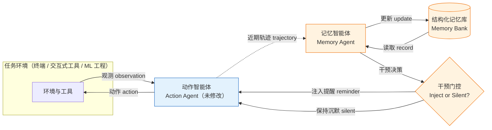

# 该记住时就要记住：面向长时域智能体的主动记忆智能体

> 说明：本分析基于论文摘要与引言节选（约 4000 字符），未提供正文方法细节、实验表格、附录与参考文献列表。凡无法从提供材料中确证的内容，均标注为「待补充」，不作臆测。

## 一、论文基础元数据

| 项目 | 内容 |
| ---- | ---- |
| 原文标题 | Remember When It Matters: Proactive Memory Agent for Long-Horizon Agents |
| 中文译版 | 该记住时就要记住：面向长时域智能体的主动记忆智能体 |
| 发表渠道 | arXiv 预印本（Meta AI 出品，投稿会议/期刊信息待补充；未标注等级） |
| 发表时间 | 2026-07-10（论文正文标注 "Date: July 10, 2026"，与 arXiv ID 2607 一致；用户元数据标注 2025 年，与正文及编号存在出入，此处以论文正文为准） |
| 链接（arXiv/DOI） | arXiv:2607.08716；代码：https://github.com/yifannnwu/proactive-memory-agent |
| 作者及核心机构 | Yifan Wu、Lizhu Zhang、Yuhang Zhou、Mingyi Wang、Bo Peng、Serena Li、Xiangjun Fan、Zhuokai Zhao；机构：Meta AI。通讯作者：Yifan Wu、Zhuokai Zhao（yfwu/zhuokai@meta.com） |
| 研究领域 | 一级领域：人工智能 / 大语言模型智能体；二级子领域：长时域智能体（Long-Horizon Agents）、智能体记忆机制（Agent Memory）、上下文/状态管理 |
| 关联数据集 | ① Terminal-Bench 2.0（终端命令行长程任务评测集，规模待补充）；② τ²-Bench（Tau-squared-Bench，交互式工具使用评测集，规模待补充）；③ SETA（训练用数据集，规模/语言/标注方式待补充）。原文未提供各数据集的规模与标注细节 |

## 二、论文综合评价

### 2.1 量化评分（1-5 分，5 分为最优）

| 评价维度 | 评分 | 备注 |
| -------- | ---- | ---- |
| 📚 理论基础 | ⭐⭐⭐⭐ | 提出"行为状态衰减"问题定义，区分"存储"与"是否该干预"，概念界定清晰 |
| 🎯 问题核心性 | ⭐⭐⭐⭐⭐ | 直击长时域智能体状态维护痛点，为真实工程高频失效模式 |
| 💡 方法创新性 | ⭐⭐⭐⭐ | 记忆作为"主动干预机制"而非被动检索，选择性介入范式较新颖 |
| ⚙️ 技术壁垒 | ⭐⭐⭐ | 核心为独立记忆智能体+门控干预，近似编排层方案，门槛中等 |
| 🧪 实验严谨性 | ⭐⭐⭐ | 双基准提升显著且含多路消融，但提供材料未含实验细节，无法全面核验 |
| 🔧 落地可行性 | ⭐⭐⭐⭐ | 即插即用、兼容前沿动作智能体与现有 harness，改动成本低 |
| 🚀 应用前景 | ⭐⭐⭐⭐ | 适用各类长程工具使用/命令行/交互式智能体，泛化空间大 |
| 📊 综合评分 | 3.9 | 问题切中要害、范式有辨识度，工程易落地；方法与实验细节披露有限，壁垒与严谨性待补强 |

### 2.2 定性综合评价（≤300 字）

> 本文定位为长时域大语言模型智能体的"记忆干预层"研究。核心价值在于识别并提出"行为状态衰减"（behavioral state decay）这一失效模式：决策相关信息（任务要求、环境事实、历史尝试、失败诊断、待办子目标）即便仍在上下文窗口内，也会丧失对下一步行为的可靠约束力。方法上，论文将记忆从"被动检索"重构为"主动干预"，由独立记忆智能体与未修改的动作智能体并行运行，通过结构化记忆库与"注入提醒/保持沉默"的门控决策实现选择性介入。差异化优势在于即插即用、不侵入动作智能体本体，且以"何时干预"而非"存了多少"作为核心命题。关键结论：在 Terminal-Bench 2.0 与 τ²-Bench 上 pass@1 分别提升 +8.3pp 与 +6.8pp；选择性干预优于被动记忆暴露、常开注入、仅顾问式引导和通用检索，并初步验证了开源权重记忆策略的可训练性。

## 三、领域本体论映射

| 核心维度 | 具体内容 |
| -------- | -------- |
| 核心研究对象 | 长时域智能体在扩展轨迹中的决策相关状态维护与激活机制 |
| 核心技术路径 | 独立记忆智能体 + 结构化记忆库 + 选择性干预门控（提醒/沉默），即插即用叠加于动作智能体 |
| 数据/载体形态 | 多轮工具调用与交互轨迹（观测、动作、诊断、子目标）；结构化记忆库记录；文本级提醒注入 |
| 核心功能目标 | 抑制"行为状态衰减"，使记忆在需要影响下一步行动的时刻主动发挥作用 |
| 验证核心指标 | pass@1（Terminal-Bench 2.0、τ²-Bench）；训练侧为验证奖励（validation reward）与向 Terminal-Bench 的迁移效果 |

## 四、核心问题与解决方案

### 4.1 待解决的核心问题

1. **领域级根本问题**：长时域任务中，决策相关状态会随轨迹膨胀而分散、被掩埋甚至被挤出上下文窗口，导致智能体在需要时无法调用这些状态来约束行为——即"行为状态衰减"。
2. **现有方法痛点**：
   - 现有记忆系统（Packer 等 2023；Zhong 等 2024；Park 等 2023；Mem0 Team 2026）侧重"存储、更新、检索"记录，服务于个性化、持久用户状态与跨会话召回，但未解决"记忆何时应影响下一步行动"的时序问题；
   - 单纯加长可访问历史（更长的 transcript 或上下文窗口）不足以解决问题，信息即使在窗口内也可能不再对行为产生可靠控制（Liu 等 2024）；
   - 被动暴露记忆、常开注入、仅顾问式引导、通用检索均非最优（由消融验证）。
3. **工程落地卡点**：
   - 动作智能体本体通常不可/不宜改动，需要非侵入式的外部机制；
   - 注入过多会干扰正常决策（"表面化过少的记忆"使智能体重复错误，注入过多亦存风险，见引言末句截断处）；
   - 需要与现有 agent harness、前沿动作智能体兼容。

### 4.2 核心解决方案

- **理论框架**：将记忆视为"主动干预机制"（active intervention mechanism），区分三个层次——能否存储、能否检索、**何时应干预**；以"行为状态衰减"作为统一问题刻画。
- **核心架构**：并行的双智能体结构——一个**未修改的动作智能体**负责执行与决策，一个**独立记忆智能体**负责从近期轨迹更新结构化记忆库，并判断是"注入基于记忆的提醒"还是"保持沉默"。
- **关键技术**：
  1. 结构化记忆库的在线更新（从近期轨迹提取任务要求、环境事实、历史尝试、诊断、待办子目标等）；
  2. 选择性干预门控（inject reminder vs. remain silent）；
  3. 即插即用集成接口（plug-and-play，兼容前沿动作智能体与现有 agent harness）；
  4. 开源权重记忆策略训练：以 Qwen3.5-27B 在 SETA 上经 SFT + GRPO 训练。
- **创新机制**：把"记忆有效性"从"召回率/覆盖率"问题重构为"干预时机选择"问题；用独立 agent 承载记忆策略，而非改造动作模型本身。

### 4.3 核心优势（量化+定性）

1. **性能优势**：Terminal-Bench 2.0 上 pass@1 **+8.3pp**，τ²-Bench 上 pass@1 **+6.8pp**；对较弱与较强动作智能体均有提升（即对不同能力基线均有增益）。
2. **效率优势**：记忆智能体与动作智能体并行运行，动作智能体本体不改动、无需重训；选择性干预避免"常开注入"带来的信息噪声与额外开销。
3. **工程优势**：模块即插即用、与现有 agent harness 兼容；开源代码与训练路径（SFT+GRPO）为社区复现与二次开发提供起点。

## 五、方法与技术架构

### 5.1 核心架构设计

> 架构文字描述：动作智能体在任务环境中执行动作并接收观测，形成不断增长的执行轨迹；同一轨迹被并行运行的记忆智能体消费，后者据此更新结构化记忆库，并做出门控决策——若判定当前时刻决策相关状态需要被激活，则向动作智能体注入"基于记忆的提醒"（memory-grounded reminder）；否则保持沉默（remain silent），不干扰动作智能体的正常推理。动作智能体本身保持未修改状态，因此整套机制对任意前沿动作智能体与 agent harness 均可叠加。

（说明：上图为依据摘要与引言描述的合理重构，原文未提供正式架构图，细节以正式论文为准。）

### 5.2 关键技术实现细节

| 技术模块 | 实现路径 | 工程注意事项 |
| -------- | -------- | ------------ |
| 记忆智能体（Memory Agent） | 独立运行的 LLM 智能体，消费近期轨迹，更新记忆库并产出干预决策 | 需与动作智能体共享轨迹流；延迟与并发调度需与主循环解耦（具体实现待补充） |
| 结构化记忆库 | 从近期轨迹抽取任务要求、环境事实、历史尝试、失败诊断、中间发现、待办子目标等结构化字段 | 字段设计与更新频率直接影响信噪比；无界增长需压缩/淘汰策略（待补充） |
| 选择性干预门控 | 判断"注入记忆提醒"或"保持沉默" | 过度注入会干扰动作智能体；门控阈值/策略是核心超参（待补充） |
| 动作智能体接口 | 保持动作智能体未修改，仅接受可选提醒注入 | 需兼容不同前沿模型与既有 harness，接口需最小侵入 |
| 记忆策略训练（开源权重） | 以 Qwen3.5-27B 为基座，在 SETA 上做 SFT + GRPO | 训练目标为验证奖励；需关注向 Terminal-Bench 的迁移泛化，目前为"部分迁移" |
| 依赖组件 | 前沿动作智能体、agent harness、SETA 训练数据、GRPO/SFT 训练栈 | 具体版本与依赖清单待补充 |

### 5.3 架构优缺点

- **优点**：
  1. 非侵入——动作智能体零改动，可作为通用中间件叠加；
  2. 职责分离——记忆的"内容维护"与"时机决策"由独立智能体承担，便于单独优化与替换；
  3. 选择性优于全量——消融证明门控机制优于被动暴露与常开注入。
- **缺点**：
  1. 引入额外 LLM 调用与系统复杂度，存在额外 token/时延开销（量化数据待补充）；
  2. 门控误判存在双向风险：该提醒未提醒 → 衰减复现；不该提醒却提醒 → 干扰正常推理；
  3. 记忆库字段与更新策略依赖人工设计，泛化到新任务域需重新校准；
  4. 开源权重记忆策略目前仅"部分迁移"到 Terminal-Bench，泛化能力尚不充分。

## 六、实验设计与结果分析

### 6.1 实验基础设置

| 维度 | 内容 |
| ---- | ---- |
| 数据集 | Terminal-Bench 2.0（终端命令行长程任务）、τ²-Bench（交互式工具使用）；训练数据：SETA。规模、语言、标注方式均待补充 |
| 基线方法 | 摘要层面明确的对照：① 被动记忆库暴露（passive bank exposure）；② 常开注入（always-on injection）；③ 仅顾问式引导（advisor-only guidance）；④ 通用检索（general retrieval）。此外包含"未经该模块的前沿动作智能体"本身（弱与强动作智能体）作为提升基准。具体基线清单与版本待补充 |
| 实验环境 | 待补充（论文正文未在提供材料中给出） |
| 评价指标 | 主指标：pass@1（Terminal-Bench 2.0、τ²-Bench）；训练侧：验证奖励（validation reward）；迁移性：向 Terminal-Bench 的部分迁移效果 |

### 6.2 核心实验结果

| 方法 | 核心指标1（Terminal-Bench 2.0 pass@1） | 核心指标2（τ²-Bench pass@1） | 工程指标（算力/耗时） |
| ---- | --------- | --------- | -------------------- |
| 动作智能体基线（较弱） | 待补充（提供材料仅有相对提升 +8.3pp） | 待补充（相对提升 +6.8pp） | 待补充 |
| 动作智能体基线（较强） | 待补充（同样有提升） | 待补充（同样有提升） | 待补充 |
| 本文方法（+ 主动记忆智能体） | 基线 + **+8.3pp** | 基线 + **+6.8pp** | 待补充 |

> 说明：论文摘要仅报告了相对增益（+8.3pp / +6.8pp），未在提供材料中给出各基线的绝对 pass@1 数值、模型配置与算力/耗时对比，故留空以示严谨，不做数值臆测。

### 6.3 消融实验/鲁棒性分析

| 实验变体 | 指标变化 | 核心结论 |
| -------- | -------- | -------- |
| 选择性干预（完整方法） | 优于所有对照 | 门控式选择性干预是最优方案 |
| 被动记忆库暴露（passive bank exposure） | 低于完整方法 | 仅"可被读取"的记忆不等于有效记忆 |
| 常开注入（always-on injection） | 低于完整方法 | 无条件注入会干扰决策，需择时 |
| 仅顾问式引导（advisor-only guidance） | 低于完整方法 | 单向建议式引导不足以替代记忆干预 |
| 通用检索（general retrieval） | 低于完整方法 | 通用检索无法解决"何时该起作用"的时序问题 |
| Qwen3.5-27B 在 SETA 上 SFT+GRPO | 验证奖励提升，向 Terminal-Bench 部分迁移 | 开源权重记忆策略初步可行，迁移尚不完整 |

> 说明：上表基于摘要所述消融对照方向整理，具体 delta 数值提供材料未给出，标注为定性结论。

### 6.4 实验结论（工程视角）

1. **有效性**：在两类主流长程智能体基准上均取得一致的正向提升，且对弱、强两类动作智能体均有增益，说明该模块不依赖于某个特定能力水平的基座模型。
2. **机制正确性**："不是存得多，而是什么时候用"被消融实验从多个替代方案（被动暴露 / 常开 / 顾问式 / 通用检索）中反向验证。
3. **可训练性**：开源权重记忆策略在 SETA 上通过 SFT+GRPO 可提升验证奖励，并出现向 Terminal-Bench 的部分迁移——表明记忆策略有望从"提示工程式"走向"可训练参数化"，但目前仍是早期阶段。
4. **工程权衡未明**：额外 LLM 调用带来的成本/延迟、门控准确率等尚未在提供材料中量化，是落地前必须实测的关键项。

## 七、领域贡献与创新点

| 贡献层级 | 具体内容 |
| -------- | -------- |
| 理论贡献 | 提出并命名"行为状态衰减"（behavioral state decay）这一长时域智能体失效模式，明确区分"信息是否可存取"与"信息是否仍在约束行为"，并将记忆研究重心从"存取"推向"干预时机" |
| 方法/架构贡献 | 提出"主动记忆智能体"：与未修改动作智能体并行的独立记忆智能体 + 结构化记忆库 + 选择性干预门控；将记忆由被动检索升级为主动干预机制 |
| 数据/工具贡献 | 开源代码仓库（github.com/yifannnwu/proactive-memory-agent）；使用并关联 SETA（训练）与 Terminal-Bench 2.0、τ²-Bench（评测）三个资源 |
| 实验/验证贡献 | 在两个主流长程智能体基准上验证一致性提升（+8.3pp / +6.8pp）；通过多路消融确立"选择性干预"相对被动暴露、常开注入、顾问式引导与通用检索的优越性 |
| 工程落地贡献 | 即插即用、兼容前沿动作智能体与现有 harness；给出基于 Qwen3.5-27B 的 SFT+GRPO 开源权重训练路径，为社区复现提供起点 |

## 八、局限性与风险

| 维度 | 具体描述 | 应对思路 |
| ---- | -------- | -------- |
| 学术局限性 | 论文自述为"迈向开放权重记忆策略的早期一步"（early step）；开源权重记忆策略仅实现向 Terminal-Bench 的"部分迁移"而非完整泛化；提供材料未见对更多任务域、更长轨迹的理论分析 | 扩展任务域与轨迹长度实验；补充对门控策略的形式化分析；在更多基座上验证迁移 |
| 工程落地风险 | 引入额外 LLM 调用，成本/时延增加未量化；门控误判存在双向风险（漏提醒→衰减复现；误提醒→干扰执行）；记忆库字段与更新策略依赖设计，跨域需重新校准；采用较新基座（Qwen3.5-27B），依赖栈稳定性待评估 | 实测成本-收益曲线并设阈值预算；在门控处引入可观测指标与人工可调旋钮；对记忆字段做任务域自适应；锁定稳定模型版本 |
| 伦理/合规风险 | 主动注入式记忆可能放大错误诊断或被污染的历史信息在后续决策链中的影响；长时域智能体若用于自主操作系统，注入错误提醒可能造成实际副作用；记忆库持久化涉及数据留存与隐私 | 引入记忆来源标注与可撤销机制；对注入内容做可信度校验；对持久记忆设定留存/脱敏策略；关键操作保留人类确认（论文未涉及，属推断性风险） |

## 九、未来研究/落地方向

| 方向类型 | 具体内容 | 优先级 |
| -------- | -------- | ------ |
| 科研拓展 | 将开源权重记忆策略从"部分迁移"推向完整泛化；在更多长程任务域（ML 工程、网页操作、多智能体协作）上验证"行为状态衰减"假设；探索门控决策的可解释化 | 高 |
| 工程优化 | 量化额外 LLM 调用的成本与时延，优化记忆智能体调用频率与并行调度；记忆库压缩/淘汰策略；门控阈值自适应调优 | 高 |
| 跨领域适配 | 将该"主动干预"范式迁移到个性化助手（长期用户状态）、跨会话召回、代码仓库级长任务、RPA/运维自动化等场景；与现有记忆系统（如 Mem0 类）做互补组合 | 中 |

## 十、关键词与术语表

| 语言 | 关键词 |
| ---- | ------ |
| 中文 | 长时域智能体；主动记忆；选择性干预；行为状态衰减；结构化记忆库；即插即用；智能体记忆；工具使用智能体；GRPO；监督微调 |
| 英文 | Long-Horizon Agents; Proactive Memory; Selective Intervention; Behavioral State Decay; Structured Memory Bank; Plug-and-Play; Agent Memory; Tool-Use Agents; GRPO; SFT |
| 领域专属术语 | **Behavioral State Decay（行为状态衰减）**：长时域执行中，本应约束未来行动的信息（任务要求、环境事实、先前尝试、失败诊断、中间发现、待办子目标）停止影响智能体下一步决策的失效模式——信息可能仍在 transcript 甚至上下文窗口内，但失去了对行为的可靠控制。 **Proactive Memory Agent（主动记忆智能体）**：与未修改的动作智能体并行运行、负责更新记忆库并决定是否注入记忆提醒的独立智能体。 **Selective Intervention（选择性干预）**：在"注入记忆提醒"与"保持沉默"之间做门控决策的机制，区别于常开注入与被动暴露。 **Memory-Grounded Reminder（基于记忆的提醒）**：由记忆智能体生成、以记忆库内容为依据、注入给动作智能体的提示。 **Action Agent（动作智能体）**：执行任务、与环境交互的主体；在本文方法中保持未修改。 **Agent Harness（智能体运行框架）**：承载动作智能体循环与工具调用的外部脚手架。 **pass@1**：单次尝试通过率，长程智能体常用评测指标。 **SETA**：本文用于训练记忆策略的数据集（SFT+GRPO）；具体构成待补充。 |

## 十一、参考文献与关联资源

- **核心参考文献**（由论文节选引用信息整理）：
  - Yao et al., 2023b；Shinn et al., 2023；Wang et al., 2024（长时域、多轮工具使用智能体）
  - Merrill et al., 2026（自主命令行执行相关）
  - Chan et al., 2024（多步机器学习工程）
  - Yao et al., 2024；Barres et al., 2025（领域规则下的交互式工具使用）
  - Liu et al., 2024（关于上下文内信息不必然控制行为的论证）
  - Packer et al., 2023；Zhong et al., 2024；Park et al., 2023；Mem0 Team, 2026（既有记忆系统：存储/更新/检索范式）
- **补充阅读**：Terminal-Bench 2.0 与 τ²-Bench 的原始基准论文（提供材料未给出引用，待补充）
- **开源代码/工具**：https://github.com/yifannnwu/proactive-memory-agent ；训练基座 Qwen3.5-27B；训练数据集 SETA

## 十二、阅读者批注

1. **科研启发**：
   - "信息可存取"不等于"信息在约束行为"，这一区分具有很强的可迁移性——它把记忆研究从检索质量评估，转向了"干预时机"的时序决策问题，可能催生类似"记忆调度器/记忆控制器"的新研究子方向。
   - 用独立智能体承载记忆策略，等价于在动作策略之外引入一个"认知控制层"，这一分层思想值得在规划、反思、工具选择等环节类比推广。
   - 更值得追问的是：门控本质上是一个"是否行动"的决策问题，是否可形式化为带成本的最优停止/部分可观测决策问题？这将使记忆从启发式走向理论可分析。

2. **工程落地思考**：
   - 若要在生产系统中采用，必须先测三件事：(a) 额外 LLM 调用的 token 成本与 P99 时延；(b) 门控的漏报/误报率及其对任务成功率的敏感性；(c) 记忆库在超长轨迹下的增长与压缩策略。
   - "即插即用 + 不改动作智能体"是非常友好的工程约束，适合作为中间件先接入现有 agent 平台的影子模式（shadow mode）做 A/B 验证，再逐步开启干预。
   - 记忆库的字段设计很可能需要按任务域定制，通用化的结构化 schema 是否可行，是复现的关键不确定点。

3. **待验证/存疑点**：
   - +8.3pp / +6.8pp 的绝对基线数值未在材料中给出，增益的统计显著性与方差未知；
   - 消融实验的具体 delta 数字未见，"选择性干预最优"目前只能在定性层面采信；
   - 向 Terminal-Bench 的"部分迁移"具体指什么（是奖励提升幅度有限，还是任务类型覆盖有限）未明；
   - 门控决策是否由 LLM 直接生成、是否有阈值或训练信号，提供材料未说明；
   - 数据集规模与语言（Terminal-Bench/τ²-Bench/SETA）均未给出，难以评估结论的泛化边界。
   - 元数据年份（2025）与论文正文日期（2026-07-10）及 arXiv 编号（2607）存在出入，需在正式引用时核实。

4. **个人/团队应用场景**：
   - 长程命令行运维/自动化排障智能体：防止"早已识别的约束在后续修复中被违反"。
   - 多步数据/ML 工程流水线智能体：防止重复尝试已失败的实现路径。
   - 交互式工具调用（客服、流程自动化）：维持跨轮次的用户约束与已确认状态。
   - 作为现有 agent 平台的通用记忆中间件，先做影子评估再灰度开启。

## 十三、阅读元信息

| 维度 | 内容 |
| ---- | ---- |
| 阅读日期 | 2026-09-30 22:10 |
| 阅读人 | xPaperReader AI |
|