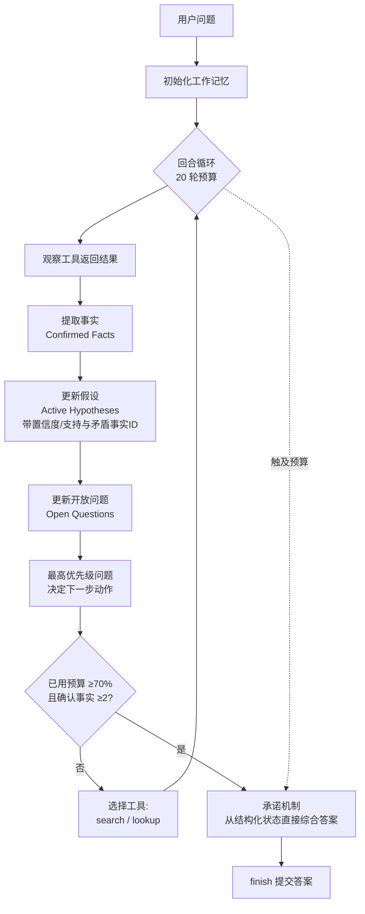

# 追踪、排序、破局：认知工作记忆如何扩展语言智能体的多跳推理

## 一、论文基础元数据
- **原文标题**：Track, Rank, Crack: Epistemic Working Memory Scales Multi-Hop Reasoning in Language Agents
- **中文译版**：追踪、排序、破局：认知工作记忆如何扩展语言智能体的多跳推理
- **发表渠道**：arXiv 预印本（等级：待补充，未标注会议/期刊录用信息）
- **发表时间**：2025 年（具体月份待补充）
- **链接**：arXiv:2607.12267
- **作者及核心机构**：Ning Liu（核心机构待补充）
- **研究领域**：
  - 一级领域：人工智能 / 自然语言处理
  - 二级子领域：语言智能体（Language Agents）、多跳推理（Multi-Hop Reasoning）、测试时计算（Test-Time Computation）
- **关联数据集**：
  - HotpotQA（多跳问答，英文，含 2-hop 分片，规模待补充）
  - 2WikiMultiHopQA（简称 2Wiki，多跳问答，英文，规模待补充）
  - 自构建 2/3/4-hop 分片评测集（规模、语言、标注细节待补充）

## 二、论文综合评价
### 2.1 量化评分（1-5分，5分为最优）

| 评价维度 | 评分 | 备注 |
| -------- | ---- | ---- |
| 📚 理论基础 | ⭐⭐⭐⭐ | 借认知科学工作记忆概念，但理论形式化较浅 |
| 🎯 问题核心性 | ⭐⭐⭐⭐⭐ | 直击多跳推理上下文稀释与证据充分性瓶颈 |
| 💡 方法创新性 | ⭐⭐⭐⭐ | 提示式结构化认知状态，轻量且可解释 |
| ⚙️ 技术壁垒 | ⭐⭐ | 纯 prompting 实现，无算法/架构创新门槛 |
| 🧪 实验严谨性 | ⭐⭐⭐ | 跨模型验证，但消融与误差分析披露有限 |
| 🔧 落地可行性 | ⭐⭐⭐⭐⭐ | 无需训练、即插即用，兼容任意指令模型 |
| 🚀 应用前景 | ⭐⭐⭐⭐ | 可迁移至检索增强、Agent 工具链等场景 |
| 📊 综合评分 | 3.9 | 定位精准、工程价值突出，理论深度与实验披露稍弱 |

### 2.2 定性综合评价（≤300字）
> 论文定位为"测试时推理组织"研究，提出 SLEUTH——一种仅靠提示实现的认知工作记忆协议，通过显式维护**确认事实—排序假设—开放问题**三元结构，解决多跳推理中因上下文稀释与证据充分性瘫痪导致的性能退化。核心价值在于揭示"如何组织推理"比"模型推理能力多强"更关键的缩放规律：4-hop 任务上，弱模型 GLM-5 + 强制结构（48.9%）反超更强 Sonnet + ReAct（42.0%）。差异化优势是零训练、零额外基础设施、纯自然语言可解释，且增益随难度递增（4-hop +11.1 EM）。关键结论：epistemic state management 可作为语言智能体的独立设计维度，与模型规模化、测试时算力互补，并天然衔接最优停止、校准停止等经典决策理论。

## 三、领域本体论映射
| 核心维度 | 具体内容 |
| -------- | -------- |
| 核心研究对象 | 语言智能体在多跳问答中的回合内认知状态组织与提交决策机制 |
| 核心技术路径 | Prompt-only 结构化工作记忆 + 运行时协议强制 + 承诺（commitment）机制 |
| 数据/载体形态 | 自然语言形式的 Epistemic State（事实/假设/问题三元组）+ 工具调用轨迹 |
| 核心功能目标 | 抑制上下文稀释与信息瘫痪，使多跳推理性能随推理深度可扩展 |
| 验证核心指标 | Exact Match（标准化后）、条件准确率、超时率、API token 成本、F1（附录 B） |

## 四、核心问题与解决方案
### 4.1 待解决的核心问题
1. **领域级根本问题**：多跳推理随链长增加急剧退化，即使每步推理简单；智能体的"已知、怀疑、待查"仅隐式存在于不断增长的上下文中，早期发现被后续检索掩埋。
2. **现有方法痛点**：
   - 上下文稀释导致两类失败模式——**信息丢失**（证据被埋没，主要影响 2–3-hop）与**信息瘫痪/确定性陷阱**（找到答案却无法提交，主要影响 4-hop）；
   - 图结构/外部控制器方法信息流保证强但需额外基础设施；
   - 多智能体验证管线需协调开销，Reflexion 类事后反思缺乏回合内结构化状态，长链任务全面弱于 ReAct。
3. **工程落地卡点**：现有方案或依赖训练、或多轨迹搜索、或多智能体协作，部署成本高；同时缺乏对"何时提交答案"的显式控制，导致超时率随难度攀升。

### 4.2 核心解决方案
- **理论框架**：将认知科学中的"工作记忆"概念映射为语言智能体的 **Epistemic Working Memory**，以结构化外部状态替代隐式上下文记忆。
- **核心架构**：SLEUTH（提示式单智能体结构化推理协议），每轮输出完整工作记忆状态：
  - **Confirmed Facts**：有来源的确认事实，单调累积、永不撤回；
  - **Active Hypotheses**：候选答案，按证据排序，带置信度与支持/矛盾事实 ID；
  - **Open Questions**：待解决不确定性，最高优先级问题直接决定下一步工具调用。
- **关键技术**：
  - **更新协议**：每次工具调用后执行"提取事实 → 更新假设 → 更新问题 → 选择动作"；
  - **工具集**：`search`、`lookup`、`finish`；
  - **承诺机制（commitment nudge）**：当消耗 ≥70% 回合预算且确认事实 ≥2 时触发，要求从结构化状态直接综合答案，将"何时提交"与"如何推理"分离；
  - **运行时强制执行**：保证协议遵循，无需符号控制器。
- **创新机制**：把"推理"从单一链式上下文重构为"可追踪、可排序、可承诺"的外部认知状态，使组织方式成为独立于模型能力的缩放变量。

### 4.3 核心优势（量化+定性）
1. **性能优势**：
   - 4-hop 任务 +11.1 EM（37.8 → 48.9），3-hop +4.6，2-hop +5.9；
   - HotpotQA +1.0、2Wiki +1.1；
   - **跨模型复现**：弱模型 GLM-5 + SLEUTH（48.9%）超过更强 Sonnet + ReAct（42.0%）。
2. **效率优势**：
   - 超时率从 2-hop 的 17% / 4-hop 的 35%（无结构）压缩至始终 <12%；
   - token 成本可控：4-hop 为 ReAct 的 1.33×，HotpotQA 为 1.50×，难任务上开销反而更小。
3. **工程优势**：
   - 零训练、零额外 episode、零多轨迹搜索、零多智能体协调；
   - 状态以自然语言表示，可解释、可监督、可调试；
   - 可移植至任意指令遵循模型。

## 五、方法与技术架构
### 5.1 核心架构设计
SLEUTH 在每轮工具调用后，强制模型输出一个完整的三元结构化状态，并据此选择下一动作；当回合预算触及 70% 阈值且已有 ≥2 条确认事实时，触发承诺机制直接综合答案。

### 5.2 关键技术实现细节
| 技术模块 | 实现路径 | 工程注意事项 |
| -------- | -------- | ------------ |
| 工作记忆初始化 | 通过 Prompt 定义三元状态模板 | 需与工具 schema 对齐，避免格式漂移 |
| 事实提取（Track） | 每轮从工具输出抽取出有来源的确认事实 | 单调累积不撤回，需防早期错误固化 |
| 假设排序（Rank） | 依据支持/矛盾事实 ID 与置信度排序候选 | 排序标准需稳定，避免抖动 |
| 问题更新与动作选择 | 最高优先级开放问题映射为下一工具调用 | 问题优先级需显式，否则退化为暴力搜索 |
| 承诺机制（Crack） | 预算 ≥70% 且事实 ≥2 时触发直接综合 | 阈值经基准调参，跨任务迁移需重调 |
| 运行时强制执行 | 系统级校验输出协议遵循度 | 替代符号控制器，需强约束提示模板 |
| 依赖组件 | 指令遵循型 LLM（Claude Sonnet 4.6 / GLM-5）、search/lookup 工具 | 搜索 top-k=3 段落，20 轮预算 |

### 5.3 架构优缺点
- **优点**：
  - 极轻量：单智能体 + 提示，无需训练与额外基础设施；
  - 可解释：自然语言状态外部化认知过程，便于监督与调试；
  - 可扩展：增益随推理深度增加，跨模型家族复现；
  - 关注"何时停止"：承诺机制把提交时机从推理过程中解耦，直接压制超时率。
- **缺点**：
  - 单调事实策略可能固化早期推理错误；
  - 承诺阈值经验性强，任务迁移可能需重新调参；
  - 未处理"证据已正确检索但推理仍错误"的残余问题；
  - 闭域设定，不覆盖矛盾或时间敏感来源；
  - 依赖底层模型的指令遵循能力，弱模型可能协议漂移。

## 六、实验设计与结果分析
### 6.1 实验基础设置
| 维度 | 内容 |
| ---- | ---- |
| 数据集 | HotpotQA（含 2/3/4-hop 分片）、2WikiMultiHopQA（英文多跳问答） |
| 基线方法 | ReAct、Reflexion，以及各数据集上的最佳基线（具体清单待补充） |
| 实验环境 | 主模型 Claude Sonnet 4.6；跨模型 GLM-5；所有智能体 20 轮预算，search top-k=3 段落 |
| 评价指标 | Exact Match（标准化后计算），分解为条件准确率与超时率；F1 见附录 B；API token 成本 |

### 6.2 核心实验结果
| 方法 | 核心指标1（EM，2-hop） | 核心指标2（EM，4-hop） | 工程指标（算力/耗时） |
| ---- | --------- | --------- | -------------------- |
| 最佳基线（GLM-5） | 55.6 | 37.8 | 待补充 |
| ReAct（Sonnet，4-hop 参考） | — | 42.0 | 基准成本 1.0× |
| Reflexion | 低于 ReAct | 低于 ReAct | 待补充 |
| 本文方法 SLEUTH（GLM-5） | **61.5** | **48.9** | 4-hop 为 ReAct API 成本 1.33×；HotpotQA 1.50× |

补充数据（GLM-5 跨模型）：

| 数据集 | 最佳基线 | SLEUTH | 提升 |
|---|---:|---:|---:|
| HotpotQA | 64.6 | 65.6 | +1.0 |
| 2-hop | 55.6 | 61.5 | +5.9 |
| 3-hop | 49.7 | 54.3 | +4.6 |
| 4-hop | 37.8 | 48.9 | +11.1 |
| 2Wiki | 71.2 | 72.3 | +1.1 |

### 6.3 消融实验/鲁棒性分析
| 实验变体 | 指标变化 | 核心结论 |
| -------- | -------- | -------- |
| 无结构化记忆（ReAct，GLM-5） | 超时率 2-hop 17% → 4-hop 35% | 缺乏回合内状态导致超时随难度激增 |
| SLEUTH 启用承诺机制 | 超时率始终 <12% | 承诺机制是压制超时的主要来源 |
| HotpotQA 上的增益 | 仅 +1.0 | ReAct 平均搜索 4.3 次（>Sonnet 3.0），暴力搜索可解决简单问题，结构边际收益低 |
| Reflexion 对比 | 所有多跳分片低于 ReAct | 事后反思 + 无回合内状态不足以支撑长链推理 |
| 预算缩放 | 预算 ≥2.5× 推理深度时收益最大 | 承诺机制需要足够预算才能发挥结构化状态价值 |
| 消融细节、误差分析完整数据 | 待补充 | 论文未完整披露 |

### 6.4 实验结论（工程视角）
1. **增益随难度递增**：4-hop +11.1 EM 显著优于 HotpotQA +1.0，说明 SLEUTH 在长链、高难度任务上边际收益最大，简单任务趋于饱和。
2. **瓶颈转移**：复杂任务中瓶颈由 reasoning capability 转向 reasoning organization，结构化协议可弥补模型能力差距（GLM-5+结构 > Sonnet+ReAct）。
3. **超时控制是关键中介**：SLEUTH 收益与超时率下降强相关，承诺机制是其工程价值的核心来源。
4. **成本可控**：难任务上 token 开销反而更小（1.33× vs 简单任务 1.50×），说明结构化状态抑制了无效搜索。

## 七、领域贡献与创新点
| 贡献层级 | 具体内容 |
| -------- | -------- |
| 理论贡献 | 提出 Epistemic Working Memory 作为语言智能体的独立设计维度，将"如何组织推理"与"推理能力多强"解耦，衔接最优停止与校准停止等经典决策理论 |
| 方法/架构贡献 | 提出 SLEUTH：提示式三元结构化工作记忆 + 更新协议 + 承诺机制 + 运行时强制执行，单智能体即获显著增益 |
| 数据/工具贡献 | 构建/使用 2/3/4-hop 多跳分片评测；暂无明确开源工具或数据集（待补充） |
| 实验/验证贡献 | 跨模型家族（Claude Sonnet 4.6、GLM-5）验证，量化两类失败模式与超时控制机制，揭示增益-难度正相关规律 |
| 工程落地贡献 | 零训练、零额外基础设施、自然语言可解释状态，可直接嵌入现有 RAG / Agent 工具链 |

## 八、局限性与风险
| 维度 | 具体描述 | 应对思路 |
| ---- | -------- | -------- |
| 学术局限性 | 单调事实策略可能固化早期推理错误；残余错误为"证据正确但推理错误"，方法未覆盖；闭域设定，不处理矛盾或时间敏感开放域 | 引入事实撤回/置信衰减机制；结合纠错式推理模块；扩展至开放域与时效性验证 |
| 工程落地风险 | 承诺阈值 70% 经基准调参，迁移到差异大的任务可能需重调；依赖底层模型指令遵循能力；token 开销仍存在 | 引入自适应阈值；对弱模型增加更严格的运行时强制；在大规模场景下做成本-收益权衡 |
| 伦理/合规风险 | 外部化认知状态若含敏感推理过程，可能泄露中间信息；错误事实固化可能放大误导 | 状态审计与脱敏；对"确认事实"增加来源可信度标签；建立人工复核通道 |

## 九、未来研究/落地方向
| 方向类型 | 具体内容 | 优先级 |
| -------- | -------- | ------ |
| 科研拓展 | 将结构化状态特征（事实数、假设置信度、问题解决率）连接最优停止、校准停止规则、学习价值函数或 RL 停止策略 | 高 |
| 工程优化 | 承诺阈值自适应化；降低 token 开销；随模型指令遵循能力提升减少运行时强制 | 高 |
| 跨领域适配 | 从多跳 QA 迁移至代码 Agent、科学发现、法律/医疗等长链检索推理场景；扩展到开放域与矛盾来源处理 | 中 |

## 十、关键词与术语表
| 语言 | 关键词 |
| ---- | ------ |
| 中文 | 多跳推理；语言智能体；认知工作记忆；上下文稀释；证据充分性瘫痪；确定性陷阱；承诺机制；提示式协议 |
| 英文 | Multi-Hop Reasoning; Language Agents; Epistemic Working Memory; Context Dilution; Evidence Sufficiency Paralysis; Certainty Trap; Commitment Mechanism; Prompt-Only Protocol; Test-Time Scaling |
| 领域专属术语 | **SLEUTH**：论文提出的提示式结构化认知工作记忆协议；**Confirmed Facts**：有来源的确认事实，单调累积；**Active Hypotheses**：带置信度与支持/矛盾事实 ID 的排序假设；**Open Questions**：优先级开放问题，决定下一步动作；**Commitment Nudge**：预算 ≥70% 时触发的提交提示；**Epistemic State**：自然语言表示的智能体认知状态；**Context Dilution**：上下文稀释；**Information Paralysis / Certainty Trap**：信息瘫痪 / 确定性陷阱 |

## 十一、参考文献与关联资源
- **核心参考文献**：ReAct（推理-行动范式基线）、Reflexion（事后反思基线）、HotpotQA、2WikiMultiHopQA（具体引文编号与作者信息待补充）
- **补充阅读**：图结构/外部控制器式多跳推理方法、验证导向多智能体管线、最优停止与校准停止理论
- **开源代码/工具**：待补充（论文片段未提及）

## 十二、阅读者批注
1. **科研启发**：
   - "如何组织推理"作为独立缩放维度这一视角具有普适价值，可延伸至任何需要长链状态管理的 Agent 场景；
   - 两类失败模式（信息丢失 vs 证据充分性瘫痪）是清晰的分析框架，可用于诊断其他推理系统；
   - 结构化状态特征→最优停止/校准停止/RUL 停止策略的连接为后续理论工作提供了接口点。
2. **工程落地思考**：
   - SLEUTH 无需训练即可集成，是低风险高收益的 Agent 增强手段，尤其适合长链检索场景；
   - 70% 承诺阈值需按任务重新调参，工程上应先做小规模迁移实验；
   - 超时率从 35% 降至 <12% 意味着更稳定的 SLA，对生产级 Agent 意义重大。
3. **待验证/存疑点**：
   - 实验组的完整消融、误差分析、附录数据本简报未获取，4-hop 增益的统计显著性待核实；
   - 报告中的 "GLM-5"、"Claude Sonnet 4.6" 命名需与论文版本核对；
   - HotpotQA 增益仅 +1.0，需确认是否因 ReAct 已通过暴力搜索达饱和；
   - 单调事实策略在早期错误下的具体恶化幅度未量化。
4. **个人/团队应用场景**：
   - 可直接移植到 RAG 长链问答、Agent 工具编排、深度研究报告生成等需要多步证据累积的任务；
   - 承诺机制可独立抽离，用作通用 Agent 的"停止决策"模块；
   - 结构化状态可作为可观测性埋点，用于 Agent 调试与人工监督。

## 十三、阅读元信息
| 维度 | 内容 |
| ---- | ---- |
| 阅读日期 | 2026-09-30 22:13 |
| 阅读人 | xPaperReader AI |
| 文档编号 | arxiv-2607.12267 |
| 版本迭代 | v1.0 |

---

> **备注**：本简报基于论文概述、方法与结论三部分的分析汇总生成；实验组的原始章节内容本次未完整提供，因此 6.x 节中部分消融细节、完整基线清单、附录 B 的 F1 数据及统计显著性检验均标注为"待补充"。建议在获得完整论文 PDF 后核对这些字段。