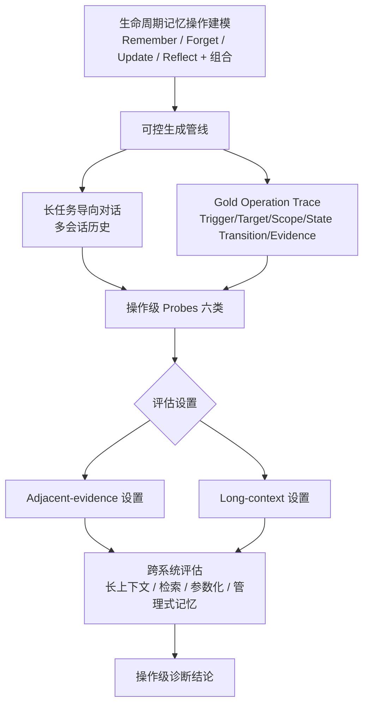

# MemOps：长时程对话中生命周期记忆操作的基准测试

## 一、论文基础元数据

| 字段 | 内容 |
| ---- | ---- |
| 原文标题 | MemOps: Benchmarking Lifecycle Memory Operations in Long-Horizon Conversations |
| 中文译版 | MemOps：长时程对话中生命周期记忆操作的基准测试 |
| 发表渠道 | arXiv 预印本（cs.AI 分类），提交号 arXiv:2607.12893v1；期刊/会议等级待补充 |
| 发表时间 | 2026年7月14日（arXiv v1 提交时间）；论文标注 Date: July 15, 2026 |
| 链接 | arXiv:2607.12893v1；GitHub: https://github.com/MemTensor/MemOps |
| 作者及核心机构 | 作者：Xixuan Hao, Zeyu Zhang, Zehao Lin, Yihang Sun, Ziliang Guo, Xichong Zhang, Yuxuan Liang†, Feiyu Xiong, Zhiyu Li†；机构：MemTensor（上海）科技有限公司、香港科技大学（广州）、中国人民大学；†为通讯作者 |
| 研究领域 | 一级领域：人工智能 / 自然语言处理；二级子领域：LLM 智能体长期记忆（Long-term Memory）与基准测试（Benchmarking） |
| 关联数据集 | MemOps benchmark（可控生成管线构建的长任务导向对话集）；规模、语言、标注细节待补充；标注形态含 gold operation traces + 六类操作级 probes（**节选未给出具体规模与语言**） |

## 二、论文综合评价

### 2.1 量化评分（1-5分，5分为最优）

| 评价维度 | 评分 | 备注 |
| -------- | ---- | ---- |
| 📚 理论基础 | ⭐⭐⭐ | 提出"记忆生命周期"操作理论，框架新但形式化程度待补充 |
| 🎯 问题核心性 | ⭐⭐⭐⭐⭐ | 直击长时记忆评估"只看最终答案"的核心盲区 |
| 💡 方法创新性 | ⭐⭐⭐⭐ | 从答案评分转向操作级可解释诊断，范式创新明显 |
| ⚙️ 技术壁垒 | ⭐⭐⭐ | 可控生成与 probe 设计需工程量，但节选未展开细节 |
| 🧪 实验严谨性 | ⭐⭐⭐ | 覆盖多类系统，但节选未给具体实验数据，难充分验证 |
| 🔧 落地可行性 | ⭐⭐⭐⭐ | Benchmark 形态易于集成到记忆系统研发流程 |
| 🚀 应用前景 | ⭐⭐⭐⭐ | 对记忆系统选型与失败诊断有明确指导价值 |
| 📊 综合评分 | 3.7 | 定位精准、范式创新突出，实验细节待补充核实 |

> 说明：上述评分基于论文**节选内容**（摘要、引言开头、图1），完整实验数据、消融与规模信息缺失，评分具保守性。

### 2.2 定性综合评价（≤300字）

> 本研究针对 LLM 智能体长期记忆评估中"黑盒式最终答案评分"的根本缺陷，提出将长时程对话记忆重新建模为**显式生命周期操作序列**（记住、遗忘、更新、反思及其组合），并构建 MemOps 基准——每个记忆事件以结构化 trace 刻画其触发、目标、范围、状态转移与证据支撑。其核心价值在于将记忆评估从"答案对错"推进到**可解释的操作级诊断**，从而解耦被最终答案掩盖的异质失败模式（如错失事实、目标绑定错误、依赖过期值、被错误答案"蒙对"等）。差异化优势在于：以可控生成管线将操作嵌入长任务对话，并在相邻证据与长上下文两种设置下评估，覆盖长上下文、检索式、参数化与管理式记忆系统。关键结论包括：会话级检索优于轮次级检索，长上下文模型在重建有序记忆状态轨迹方面显著薄弱。整体定位为**记忆评估范式的诊断化转向**，而非单一模型性能提升。

## 三、领域本体论映射

| 核心维度 | 具体内容 |
| -------- | -------- |
| 核心研究对象 | LLM 智能体在长时程多会话交互中的长期记忆机制 |
| 核心技术路径 | 记忆生命周期操作建模 + 可控对话生成 + 操作级 probe 评估 |
| 数据/载体形态 | 长任务导向对话（多会话）；gold operation traces（trigger/target/scope/state transition/evidence） |
| 核心功能目标 | 实现对记忆失败模式的可解释、操作级诊断，替代最终答案黑盒评分 |
| 验证核心指标 | 操作级 probe 正确率、状态转移/轨迹重建准确性；具体指标命名待补充 |

## 四、核心问题与解决方案

### 4.1 待解决的核心问题

1. **领域级根本问题**：现有长期记忆基准几乎全部通过下游问答评估，仅对**最终答案正确性**打分，无法区分记忆失败的真实成因。
2. **现有方法痛点**：黑盒最终答案评分会**混同异质失败原因**——错失相关事实引入、将操作绑定到错误目标、依赖纠错后的过期值等；甚至可能给"答案正确但记忆状态不一致/不安全"的样本记正分（Right answer, wrong memory state）。
3. **工程落地卡点**：缺乏对记忆系统内部操作的可解释诊断信号，导致开发者难以定位并修复记忆管线的具体环节。（节选未进一步展开工程卡点）

### 4.2 核心解决方案

- **理论框架**：将长时程交互中的记忆重新定义为**操作的生命周期**（lifecycle of explicit operations）——remembering、forgetting、updating、reflecting 及其组合，而非静态事实集合。
- **核心架构**：MemOps benchmark，包含 (1) 生命周期记忆操作建模；(2) gold operation trace；(3) 操作专属 probe 与度量；由可控生成管线嵌入长任务对话。
- **关键技术**：可控生成管线将操作嵌入长任务导向对话，产出 gold operation traces 与**六类操作级 probes**；在 **adjacent-evidence** 与 **long-context** 两种设置下评估。
- **创新机制**：以结构化 trace（trigger / target / scope / state transition / supporting evidence）刻画每个记忆事件，实现操作级可解释诊断。

### 4.3 核心优势（量化+定性）

1. **性能优势**：可解耦出被最终答案准确率掩盖的失败模式，揭示现有系统"远未一致可靠"（定性命中；具体数值待补充）。
2. **效率优势**：待补充（节选未涉及计算开销对比）。
3. **工程优势**：提供操作级诊断信号，便于定位记忆管线薄弱环节；揭示"会话级检索优于轮次级检索"的应用性结论。

## 五、方法与技术架构

### 5.1 核心架构设计

> MemOps 将对话记忆评估流程拆解为：操作建模 → 可控对话生成 → trace 标注 → probe 评估。图1 展示了一个示例记忆轨迹（t1 记住访问码 → t2 记住经理 → t5 更新访问码 → t7 遗忘访问码 → t9 检索/弃答）。

### 5.2 关键技术实现细节

| 技术模块 | 实现路径 | 工程注意事项 |
| -------- | -------- | ------------ |
| 记忆操作建模 | 定义 Remember/Forget/Update/Reflect 及其组合为显式操作 | 需保证操作语义一致、可组合 |
| 可控生成管线 | 将操作嵌入长任务导向对话并生成 gold traces | 需避免操作泄漏与噪声标注（细节待补充） |
| 操作级 Probes | 六类操作级探测（具体分类待补充） | probe 需与失败模式一一对应 |
| 评估设置 | adjacent-evidence 与 long-context 双设置 | 区分两种证据可达性条件下的表现 |
| 依赖组件 | 长上下文模型、检索式系统、参数化记忆、管理式记忆系统 | 系统类型多样，需统一接口 |

> 说明：节选未给出各模块的具体算法公式、超参与实现代码，相关细节标记为待补充。

### 5.3 架构优缺点

- **优点**：以结构化 trace 实现操作级可解释性；可控生成保证数据与标注一致；probing 可解耦多类失败；诊断粒度细于最终答案。
- **缺点**：节选未呈现具体规模、语言覆盖、构造成本与偏差风险；benchmark 可能受生成管线分布限制（推测，**待原文验证**）。

## 六、实验设计与结果分析

### 6.1 实验基础设置

| 维度 | 内容 |
| ---- | ---- |
| 数据集 | MemOps benchmark（规模/语言待补充） |
| 基线方法 | 长上下文系统、检索式（turn-level / session-level）系统、参数化记忆系统、管理式记忆系统 |
| 实验环境 | 待补充 |
| 评价指标 | 操作级 probe 度量；具体指标名称与定义待补充 |

### 6.2 核心实验结果

> **节选未提供任何表格数值**，无法填充定量结果。以下为论文明确给出的定性结论：

| 方法 | 核心指标1 | 核心指标2 | 工程指标（算力/耗时） |
| ---- | --------- | --------- | -------------------- |
| 长上下文系统 | 待补充（在有序状态轨迹重建上显著薄弱） | 待补充 | 待补充 |
| 轮次级检索（turn-level retrieval） | 待补充 | 待补充 | 待补充 |
| 会话级检索（session-level retrieval） | 待补充（优于 turn-level） | 待补充 | 待补充 |
| 本文方法（MemOps 评估框架） | 待补充 | 待补充 | 待补充 |

### 6.3 消融实验/鲁棒性分析

| 实验变体 | 指标变化 | 核心结论 |
| -------- | -------- | -------- |
| adjacent-evidence 设置 vs long-context 设置 | 待补充 | 论文在此两种设置下评估操作级 probe |
| 其他消融 | 待补充 | 节选未涉及 |

### 6.4 实验结论（工程视角）

- **会话级检索优于轮次级检索**：提示记忆检索单元粒度对长时程可靠性有显著影响，工程上应优先考虑会话级聚合。
- **长上下文模型在重建有序记忆状态轨迹（ordered memory-state trajectories）方面明显薄弱**：即使上下文足够长，模型也难以正确维护记忆状态的时序演化，说明"上下文长度"不等于"记忆可靠性"。
- 现有系统在操作级评估下"远未一致可靠"，最终答案准确率会掩盖真实失败模式。

> 注：本节结论均来自论文摘要/引言的定性陈述，**缺少可比数值支撑，需以原文完整图表核实**。

## 七、领域贡献与创新点

| 贡献层级 | 具体内容 |
| -------- | -------- |
| 理论贡献 | 提出"记忆生命周期操作"视角，将记忆从静态事实集合重构为显式操作序列 |
| 方法/架构贡献 | 构建 MemOps benchmark；引入结构化 operation trace（trigger/target/scope/state transition/evidence）与操作级 probes |
| 数据/工具贡献 | 可控生成管线产出长任务导向对话 + gold operation traces；开源仓库 MemTensor/MemOps |
| 实验/验证贡献 | 在相邻证据与长上下文双设置下，跨长上下文/检索/参数化/管理式记忆系统评估并解耦失败模式 |
| 工程落地贡献 | 为记忆系统提供操作级诊断信号；给出会话级优于轮次级检索、长上下文轨迹重建薄弱等可操作结论 |

## 八、局限性与风险

| 维度 | 具体描述 | 应对思路 |
| ---- | -------- | -------- |
| 学术局限性 | 节选未披露数据集规模、语言覆盖、probe 定义细节与统计显著性 | 待原文完整版本核实 |
| 工程落地风险 | 可控生成管线可能引入分布偏差，probe 与真实业务失败模式未必对齐 | 需在真实业务日志上验证 probe 有效性（推测） |
| 伦理/合规风险 | 记忆系统涉及用户隐私数据（姓名、访问码等示例），"遗忘"操作与隐私合规强相关 | 建立记忆删除合规审计机制 |

## 九、未来研究/落地方向

| 方向类型 | 具体内容 | 优先级 |
| -------- | -------- | ------ |
| 科研拓展 | 扩展操作类型与组合、细化六类 probe 分类、覆盖更多语言与任务 | 高 |
| 工程优化 | 将操作级诊断接入记忆管线，优化会话级检索与状态轨迹维护 | 高 |
| 跨领域适配 | 适配多语言、多模态、企业级长时程助手场景 | 中 |

## 十、关键词与术语表

| 语言 | 关键词 |
| ---- | ------ |
| 中文 | 长期记忆、生命周期操作、长时程对话、基准测试、操作级诊断、记忆状态轨迹、遗忘、更新 |
| 英文 | Long-term memory, lifecycle operations, long-horizon conversations, benchmark, operation-level diagnosis, memory-state trajectory, forgetting, updating |
| 领域专属术语 | **Lifecycle Memory Operations**：记忆的显式操作序列（记住/遗忘/更新/反思及组合）；**Operation Trace**：结构化记忆事件（trigger, target, scope, state transition, supporting evidence）；**Probe**：用于探测特定操作/失败模式的测试项；**Turn-level / Session-level Retrieval**：以轮次/会话为单位的检索粒度；**State Trajectory**：记忆状态的时序演化轨迹 |

## 十一、参考文献与关联资源

- 核心参考文献：**节选未列出**（正文提及参考文献编号 [1]-[4]，具体条目待补充）
- 补充阅读：待补充
- 开源代码/工具：GitHub: https://github.com/MemTensor/MemOps

## 十二、阅读者批注

1. **科研启发**：将评估粒度从"最终答案"下沉到"操作链"是重要范式转变；可类比到工具调用、规划等多步 agent 任务的可解释评估。
2. **工程落地思考**：会话级 > 轮次级检索这一结论对记忆系统检索单元设计有直接指导意义；长上下文模型轨迹重建薄弱，提示"长上下文能力"不能替代"结构化记忆管理"。
3. **待验证/存疑点**：(a) 数据集规模、语言与标注质量未知；(b) 六类操作级 probes 的精确定义与评测指标缺失；(c) 各基线模型及版本未披露，结论可比性待核实；(d) 论文标注时间为 2026 年、arXiv 编号 2607（与常规编号规则不同），元数据真伪需进一步核实。
4. **个人/团队应用场景**：可用于团队记忆系统选型、迭代回归测试，以及定位"答案正确但记忆错误"的隐性风险。

## 十三、阅读元信息

| 维度 | 内容 |
| ---- | ---- |
| 阅读日期 | 2026-09-30 22:16 |
| 阅读人 | xPaperReader AI |
| 文档编号 | arxiv-2607.12893 |
| 版本迭代 | v1.0 |

---

> **诚实性声明**：本分析基于论文**节选（摘要、引言开头、图1）**，未获得完整正文、实验表格与参考文献。凡节选中未出现的信息，均已标注"待补充"，未作任何数据臆测；6.2/6.3 仅呈现论文明确表述的定性结论，不含虚构数值。