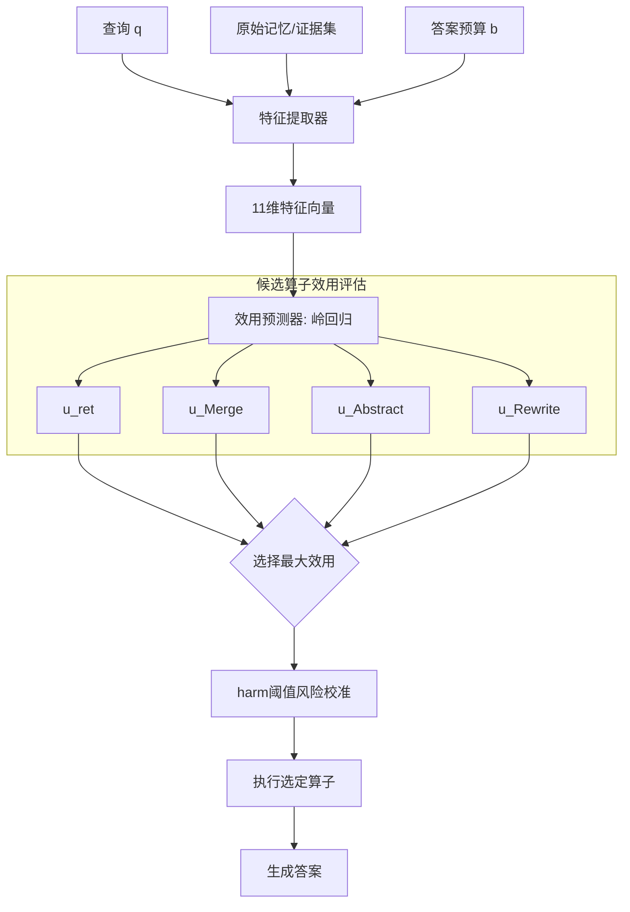

# 保留还是整合？语言智能体记忆的预算依赖型算子选择

## 一、论文基础元数据
- **原文标题**：Retain or Consolidate? Budget-Dependent Operator Selection for Language Agent Memory
- **中文译版**：保留还是整合？语言智能体记忆的预算依赖型算子选择
- **发表渠道**：预印本（arXiv），具体录用会议/期刊待补充
- **发表时间**：2025 年（具体月份待补充）
- **链接**：arXiv:2607.17545（DOI 待补充）
- **作者及核心机构**：Qingcan Kang、Mingyang Liu、Shixiong Kai、Kaichao Liang、Zhentao Tang、Yuqi Cui、Tao Zhong、Mingxuan Yuan（具体机构归属待补充）
- **研究领域**：
  - 一级领域：人工智能 / 大语言模型
  - 二级子领域：语言智能体（Language Agent）、智能体记忆管理、上下文压缩与算子选择
- **关联数据集**：
  - LongMemEval（主基准，长对话记忆评测，英文，含检索与问答标注）
  - LoCoMo（复现基准，长对话记忆评测，英文，含长程会话问答标注）
  - 具体规模（会话数、问题数）、标注体系待补充

## 二、论文综合评价
### 2.1 量化评分（1-5分，5分为最优）

| 评价维度 | 评分 | 备注 |
| -------- | ---- | ---- |
| 📚 理论基础 | ⭐⭐⭐⭐ | 给出覆盖-替换分解与后悔界，形式化清晰 |
| 🎯 问题核心性 | ⭐⭐⭐⭐ | 直击智能体记忆"何时整合"的关键抉择 |
| 💡 方法创新性 | ⭐⭐⭐⭐ | 预算依赖型联合决策框架具差异化视角 |
| ⚙️ 技术壁垒 | ⭐⭐⭐ | 采用岭回归，方法轻量但技术门槛有限 |
| 🧪 实验严谨性 | ⭐⭐⭐⭐ | 双基准验证+跨模型复现+机制分层诊断 |
| 🔧 落地可行性 | ⭐⭐⭐⭐⭐ | 轻量路由可直接嵌入现有记忆管线 |
| 🚀 应用前景 | ⭐⭐⭐⭐ | 对长上下文智能体系统具普适指导意义 |
| 📊 综合评分 | 4.0 | 问题新颖、验证扎实，方法轻量但洞见深刻，落地性强 |

### 2.2 定性综合评价（≤300字）
> 本文将语言智能体的记忆管理重新定义为一个"何时整合 + 选择哪个算子"的预算依赖型联合决策问题，挑战了"存在通用最优记忆算子"的隐含假设。核心价值在于揭示：整合的价值由**覆盖效应**（收纳装不下的证据）与**替换效应**（替换原本已适配的证据）叠加决定，因而策略应随"证据长度相对预算的适配压力"动态切换——紧预算下 Abstract/Merge 显著优于保留（32 tokens 时 +48.0pp），宽松预算下保留反超（256 tokens 时 -8.0pp）。差异化优势在于将决策问题转化为轻量效用回归（OAS），并给出后悔界保证，兼顾理论解释力与工程可落地性。关键结论：不存在普遍最优算子，跨笔记综合在压缩场景优于局部重写。

## 三、领域本体论映射
| 核心维度 | 具体内容 |
| -------- | -------- |
| 核心研究对象 | 语言智能体在有限 token 预算下的记忆算子选择策略 |
| 核心技术路径 | 离线评估动作效用 → 特征化上下文状态 → 岭回归预测 → 选择最大预测效用动作 |
| 数据/载体形态 | 多会话对话历史（原始记忆文本）+ 压缩后的记忆表示（Merge/Abstract/Rewrite 产物） |
| 核心功能目标 | 在答案 token 预算约束下最大化下游问答效用 |
| 验证核心指标 | 答案准确率（Accuracy）、配对增益（Δpp）、动作选择后悔（regret） |

## 四、核心问题与解决方案
### 4.1 待解决的核心问题
1. **领域级根本问题**：语言智能体记忆管理中，"保留原始记忆"与"生成式整合（压缩/抽象/重写）"之间是否存在普遍最优策略？若不存在，应依据何种信号动态选择？
2. **现有方法痛点**：
   - 现有记忆系统多采用固定算子（总是保留或总是压缩），忽略了预算与证据长度的相对关系；
   - 整合可能引入**替换效应**——用摘要替换原本已适配的原始证据，导致效用下降；
   - 缺乏对"何时整合"与"选哪个算子"的联合决策机制。
3. **工程落地卡点**：
   - 生成式整合引入额外 LLM 调用开销，若无收益则浪费算力；
   - 需要轻量、可离线预估的决策器，避免在线反复试错；
   - 跨模型/跨基准的可迁移性尚未被充分验证。

### 4.2 核心解决方案
- **理论框架**：将整合增益分解为 `ΔU = C + R`（覆盖效应 + 替换效应），并证明预测误差 ≤ ε 时决策后悔 ≤ 2ε。
- **核心架构**：OAS（Offline Abstraction-Safety），离线评估动作效用，用预生成特征预测每个动作的效用并选择最大者。
- **关键技术**：11 维特征（归一化预算、token 压力、证据适配比例、会话数、嵌入不一致性、平均相似度、查询类型 one-hot）+ 岭回归分类器。
- **创新机制**：
  - 将记忆管理形式化为"何时-哪个"联合决策；
  - 引入预算特定 harm 阈值进行风险校准，减少有害替换；
  - 揭示交叉点由"相对证据适配压力"决定，而非固定 token 阈值。

### 4.3 核心优势（量化+定性）
1. **性能优势**：① 32 tokens 时 Abstract 相对保留 +48.0pp（CI [+37.3, +58.2]）；② 64 tokens +33.3pp，128 tokens +14.2pp；③ 路由（OAS）在 32 tokens 达 0.545 vs 保留 0.039，增益 +0.507。
2. **效率优势**：岭回归轻量，离线训练；相比在线 LLM 反复调用，路由开销可忽略；Direct OAS 在宽松预算下不劣于保留。
3. **工程优势**：可与现有检索/打包管线解耦，直接从会话状态特征预测，便于嵌入；跨模型（GLM-5.2）复现相同趋势，泛化可靠。

## 五、方法与技术架构
### 5.1 核心架构设计
> 系统在查询时点接受三类输入：查询 q、候选证据集（原始记忆）、当前答案 token 预算 b。首先由特征提取器将上下文状态编码为 11 维向量；随后并行评估四个候选算子 {ret, Merge, Abstract, Rewrite} 的预测效用；最终选择预测效用最大者（或经 harm 阈值校准后的安全动作）产出最终记忆表示并喂入下游 LLM 作答。

### 5.2 关键技术实现细节
| 技术模块 | 实现路径 | 工程注意事项 |
| -------- | -------- | ------------ |
| 特征提取 | 归一化预算、token 压力、证据适配比例、会话数、嵌入不一致性、平均相似度、查询类型 one-hot 共 11 维 | 特征需离线预生成，确保与训练分布一致 |
| 效用预测器 | 岭回归预测每动作效用；MLP 同协议下无可靠提升 | 优先线性模型，避免过拟合小样本 |
| 动作选择 | 取预测效用最大动作（Direct OAS） | 紧预算优先 Abstract，次选 Merge |
| 风险校准 | 加预算特定 harm 阈值，过滤预测有害动作（Calibrated OAS） | 牺牲部分效用换安全性，非总体安全证书 |
| 依赖组件 | 嵌入模型（算相似度/不一致性）、LLM（生成 Merge/Abstract/Rewrite）、岭回归库 | LLM 调用需缓存复用，控制整合成本 |

### 5.3 架构优缺点
- **优点**：
  - 决策信号显式、可解释（基于覆盖/替换分解）；
  - 模型轻量，离线训练、在线零 LLM 试错开销；
  - 提供 regret ≤ 2ε 的理论保证，且支持风险校准。
- **缺点**：
  - 只处理查询时打包决策，不涉及候选发现与重复记忆更新；
  - 仅在相同基准内泛化，跨分布安全性无保证；
  - 特征设计依赖人工先验，Abstract/Merge 全局优劣仍未定论。

## 六、实验设计与结果分析
### 6.1 实验基础设置
| 维度 | 内容 |
| ---- | ---- |
| 数据集 | LongMemEval（主）；LoCoMo（复现） |
| 基线方法 | 保留（retain）、Merge、Abstract、Rewrite、Direct OAS、Calibrated OAS |
| 实验环境 | 主模型与 GLM-5.2 跨模型复现；具体硬件/版本待补充 |
| 评价指标 | 答案准确率、配对增益 Δpp、置信区间、动作选择效用 |

### 6.2 核心实验结果
| 方法 | 核心指标1（紧预算） | 核心指标2（宽松预算） | 工程指标（算力/耗时） |
| ---- | --------- | --------- | -------------------- |
| 保留 (retain) | 32 tokens: 4.0% | 256 tokens: 更优 | 最低（无额外 LLM 调用） |
| Abstract | 32 tokens: 52.0% (+48.0pp) | 256 tokens: -8.0pp | 需 LLM 生成压缩 |
| Merge | 紧预算次优（LoCoMo +34.7pp） | 128 tokens 时优势消失 | 需 LLM 跨笔记合并 |
| Rewrite | 紧预算较弱 | - | 局部重写，成本中等 |
| 本文方法 (Direct OAS) | 32 tokens: 0.545 vs 0.039（+0.507） | 256 tokens 与保留持平 | 轻量回归，近乎零额外开销 |

### 6.3 消融实验/鲁棒性分析
| 实验变体 | 指标变化 | 核心结论 |
| -------- | -------- | -------- |
| MLP vs 岭回归 | 无可靠提升 | 线性模型已足够，复杂度无需增加 |
| Calibrated OAS | 有害选择减少、效用略降 | 安全-效用存在权衡，非总体安全保证 |
| 跨模型 GLM-5.2 | 复现相同趋势 | 结论具跨模型稳健性 |
| 全历史检索压力测试 | 复现相同趋势 | 结论对检索压力具鲁棒性 |
| 证据适配分层 | 不完全适配时有增益，完全适配时受损 | 验证覆盖/替换机制的因果解释 |
| harm 分布 | 集中于知识更新与时序问题 | 两类高风险查询需重点防护 |

### 6.4 实验结论（工程视角）
- 固定算子策略是次优的，**预算相对证据的适配压力**才是决策关键变量；
- 交叉点随基准变化（LongMemEval≈128→256 之间，LoCoMo≈64→128 之间），说明不能用固定 token 阈值启发式；
- 压缩场景下**跨笔记综合（Abstract/Merge）优于局部重写（Rewrite）**；
- 轻量 OAS 在紧预算下可带来数量级提升，在宽松预算下不劣于保留，工程性价比高；
- 但 Abstract 与 Merge 之间差异不显著，可依据成本与实现便利性二选一。

## 七、领域贡献与创新点
| 贡献层级 | 具体内容 |
| -------- | -------- |
| 理论贡献 | 提出覆盖效应 + 替换效应的整合价值分解（ΔU = C + R）；证明预测误差 ≤ ε 时后悔 ≤ 2ε |
| 方法/架构贡献 | 将记忆管理形式化为"何时-哪个"联合决策；提出轻量级 OAS 路由与风险校准机制 |
| 数据/工具贡献 | 在 LongMemEval 与 LoCoMo 上建立预算扫掠协议（待补充是否开源代码） |
| 实验/验证贡献 | 跨基准、跨模型（GLM-5.2）、压力测试三重验证预算依赖交叉；机制分层诊断 |
| 工程落地贡献 | 提供可直接嵌入记忆管线的轻量决策器，避免在线 LLM 反复试错 |

## 八、局限性与风险
| 维度 | 具体描述 | 应对思路 |
| ---- | -------- | -------- |
| 学术局限性 | 仅处理查询时打包决策，不解决候选发现与重复记忆更新；OAS 为同基准泛化 | 联合学习检索、整合、打包；跨分布评估 |
| 工程落地风险 | 特征依赖离线分布；harm 阈值需按场景调参；整合引入 LLM 成本 | 建立特征监控与在线校准；缓存压缩结果 |
| 伦理/合规风险 | 生成式整合可能篡改或丢失原始证据（如时序/知识更新信息） | 保留溯源链接；对高风险查询强制 attach 原始证据 |

## 九、未来研究/落地方向
| 方向类型 | 具体内容 | 优先级 |
| -------- | -------- | ------ |
| 科研拓展 | 联合学习检索、整合、打包；解耦表示学习与检索过程 | 高 |
| 工程优化 | 减少特征人工先验；引入更稳健的效用校准；压缩成本优化 | 中 |
| 跨领域适配 | 迁移至多模态记忆、代码智能体、长程任务规划等场景 | 中 |

## 十、关键词与术语表
| 语言 | 关键词 |
| ---- | ------ |
| 中文 | 语言智能体、记忆管理、预算依赖、算子选择、保留、整合、抽象、覆盖效应、替换效应 |
| 英文 | Language Agent, Memory Management, Budget-Dependent, Operator Selection, Retain, Consolidate, Abstraction, Coverage Effect, Replacement Effect |
| 领域专属术语 | **OAS**（Offline Abstraction-Safety）：离线评估所有动作效用并选择最大预测效用算子的轻量路由；**覆盖效应 (C)**：整合收纳原本装不下证据带来的正向效用；**替换效应 (R)**：整合替换已适配原始证据带来的可能为负的效用；**配对增益 Δ_o(z)**：同条件下整合相对保留的答案效用变化；**相对证据适配压力**：证据长度与可用预算之比的衡量指标 |

## 十一、参考文献与关联资源
- **核心参考文献**：待补充（论文原文的参考文献列表未在分析中提供）
- **补充阅读**：LongMemEval、LoCoMo 相关记忆评测文献；语言智能体记忆压缩相关工作
- **开源代码/工具**：待补充（论文是否开源 OAS 实现未知）

## 十二、阅读者批注
1. **科研启发**：将"是否压缩"升级为"何时压缩 + 选哪个算子"的联合决策，并用覆盖/替换分解给出可解释因果链，这一形式化视角可迁移到 RAG 上下文裁剪、工具调用摘要等场景；后悔界（regret ≤ 2ε）为把决策问题转化为效用回归提供了理论正当性。
2. **工程落地思考**：轻量岭回归路由（11 维特征）成本极低，特别适合作为现有记忆管线的"插件式"决策层；建议团队在集成前先复现 32 tokens 场景下的数量级增益；注意 Abstract/Merge 差异不显著，实现初期可只保留其一以降复杂度；对"知识更新/时序"类查询宜默认关闭有害替换。
3. **待验证/存疑点**：① 交叉点的具体位置是否对任务类型敏感，论文仅给出两个基准的证据；② OAS 特征在不同分布（如中文对话、多模态）下是否需要重训；③ LoCoMo 的完整数值（论文中仅摘要报告了部分）；④ 是否开源代码、是否有推理延迟的端到端测量；⑤ Abstract 与 Merge 的全局优劣为何仍无法确定。
4. **个人/团队应用场景**：可直接应用于长上下文客服智能体、多轮个人助理、代码仓库记忆问答等需要"预算约束下证据打包"的系统；尤其适合预算可配置的多档位产品（如移动端 32 tokens / 云端 256 tokens）。

## 十三、阅读元信息
| 维度 | 内容 |
| ---- | ---- |
| 阅读日期 | 2026-09-30 22:18 |
| 阅读人 | xPaperReader AI |
| 文档编号 | arxiv-2607.17545 |
| 版本迭代 | v1.0 |

---

> **数据完整性声明**：本简报严格基于所提供的章节分析（overview / method / experiment / conclusion）生成。凡分析材料中未明确给出者（如具体发表会议、作者机构、数据集规模、开源链接、完整参考文献、端到端延迟数值等）均已标注为"待补充"，未做任何臆测。