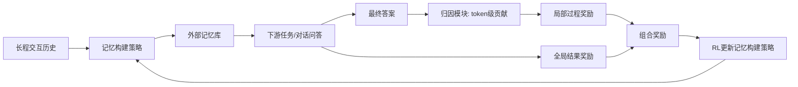

# AttriMem：面向智能体记忆构建的归因引导过程反馈

## 一、论文基础元数据

- **原文标题**：AttriMem: Attribution-Guided Process Feedback for Agent Memory Construction
- **中文译版**：AttriMem：面向智能体记忆构建的归因引导过程反馈
- **发表渠道**：arXiv 预印本（cs.AI）；等级：预印本，节选未显示同行评审信息
- **发表时间**：元数据标注为 2025；节选显示 arXiv v3 为 2026-08-11，存在时间不一致，待核实
- **链接**：arXiv:2607.21106；https://arxiv.org/abs/2607.21106
- **作者及核心机构**：Qinfeng Li†、Yuntai Bao†、Xinyan Yu†、Hongze Chen、Yanming Liu、Huifeng Zhu、Yier Jin、Jintao Chen、Wenqi Zhang、Xuhong Zhang∗；机构包括浙江大学、圣路易斯华盛顿大学、中国科学技术大学；OmniAI Group of ZJU ACES Lab
- **研究领域**：一级领域：人工智能；二级子领域：LLM 智能体记忆构建、强化学习、信用分配、长程对话问答
- **关联数据集**：节选仅提及“long-horizon dialogue question answering”基准；具体数据集名称、规模、语言、标注方式待补充

## 二、论文综合评价

### 2.1 量化评分（1-5分，5分为最优）

| 评价维度 | 评分 | 备注 |
| -------- | ---- | ---- |
| 📚 理论基础 | ⭐⭐⭐⭐ | 结合LLM智能体、RL与信用分配理论 |
| 🎯 问题核心性 | ⭐⭐⭐⭐⭐ | 记忆构建与细粒度信用分配是关键瓶颈 |
| 💡 方法创新性 | ⭐⭐⭐⭐⭐ | 提出token级归因过程反馈，范式组合新颖 |
| ⚙️ 技术壁垒 | ⭐⭐⭐⭐ | token级归因与RL奖励融合工程复杂 |
| 🧪 实验严谨性 | ⭐⭐⭐ | 节选仅给结论，无数据表与消融 |
| 🔧 落地可行性 | ⭐⭐⭐ | 依赖归因与RL，开销和稳定性待验证 |
| 🚀 应用前景 | ⭐⭐⭐⭐ | 长程对话与智能体记忆需求明确 |
| 📊 综合评分 | 4.0 | 问题重要、创新明确，但节选证据有限需核验 |

### 2.2 定性综合评价（≤300字）

> AttriMem 研究 LLM 智能体外部记忆构建策略的学习问题。其核心定位在于：将记忆构建视为强化学习策略，并用归因引导的过程反馈缓解中间记忆决策的细粒度信用分配瓶颈。核心价值在于，把传统结果级或动作级奖励细化为 token 级贡献奖励，从而识别哪些中间记忆内容真正支持最终答案。差异化优势是：表 1 显示 AttriMem 是唯一同时具备任务反馈、过程反馈、附加奖励信号和 token 级反馈的范式。关键结论为：在长程对话问答上优于检索式、启发式和 RL 式基线，并能跨 benchmark、跨 answer model 泛化，同时稳定 RL 优化。但节选未给出量化结果、消融实验和实现细节，结论仍需全文核验。

## 三、领域本体论映射

| 核心维度 | 具体内容 |
| -------- | -------- |
| 核心研究对象 | LLM 智能体的外部记忆构建策略，即记忆学习问题 |
| 核心技术路径 | 归因引导过程反馈 + 强化学习策略优化 |
| 数据/载体形态 | 长程交互历史、对话问答记录、外部记忆库 |
| 核心功能目标 | 决定信息提取、存储、更新、合并、压缩或丢弃，保留下游有用信息并过滤无关上下文 |
| 验证核心指标 | 节选未给出具体指标；声称验证任务性能、跨 benchmark/answer model 泛化性、RL 优化稳定性 |

## 四、核心问题与解决方案

### 4.1 待解决的核心问题

1. **领域级根本问题**：随着 LLM 智能体交互变长，如何学习记忆构建策略，在大量分散且含噪的历史信息中保留对未来任务有用的内容。
2. **现有方法痛点**：
   - 启发式记忆方法依赖人工规则，主观且任务特定，易与下游目标错配，跨任务泛化受限。
   - RL 方法主要使用结果级或动作级奖励，信号粗粒度，只能指示任务成败，无法识别哪些中间记忆内容支持最终答案。
   - 存在细粒度信用分配瓶颈，而中间记忆决策缺乏唯一 ground-truth 目标，合适信用又随不确定推理轨迹变化，难以预先指定。
3. **工程落地卡点**：token 级归因如何可靠计算、如何与 RL 奖励稳定融合、如何控制长期记忆构建中的计算与存储开销，节选未给出工程方案。

### 4.2 核心解决方案

- **理论框架**：AttriMem，一种归因引导的过程反馈框架，用于以 RL 学习记忆构建策略。
- **核心架构**：全局结果奖励 + 由 token 级贡献导出的局部奖励，共同驱动记忆构建策略优化。
- **关键技术**：token 级贡献归因、过程反馈构造、局部奖励与全局奖励融合、RL 策略更新。
- **创新机制**：为记忆构建引入 token 级过程反馈，缓解中间记忆决策无法直接获得唯一监督的问题；表 1 显示其同时具备任务反馈、过程反馈、附加奖励和 token 级反馈。

### 4.3 核心优势（量化+定性）

1. **性能优势**：节选声称在长程对话问答上优于 retrieval-based、heuristic、RL-based 基线，并跨 benchmark 和 answer model 泛化；但无量化数值可核验。
2. **效率优势**：节选未提供算力、耗时或内存效率数据，待补充。
3. **工程优势**：相较启发式规则，有望减少手工规则与任务耦合；相较粗粒度 RL，可提供更细粒度的记忆决策信用信号。

## 五、方法与技术架构

### 5.1 核心架构设计

> 文字描述：智能体在长程交互中不断产生历史信息，记忆构建策略决定提取、存储、更新、合并、压缩或丢弃哪些内容，并写入外部记忆库。下游任务基于记忆库生成最终答案。AttriMem 在全局结果奖励之外，通过归因模块估计记忆内容对最终答案的 token 级贡献，形成局部过程奖励。两类奖励组合后用于 RL 更新记忆构建策略。以下为基于节选的概念架构图。

### 5.2 关键技术实现细节

| 技术模块 | 实现路径 | 工程注意事项 |
| -------- | -------- | ------------ |
| 记忆构建策略 | 增量决定提取、存储、更新、合并、压缩、丢弃 | 动作空间、记忆状态表示、长期依赖管理待补充 |
| 归因过程反馈 | 计算中间记忆内容对最终答案的 token 级贡献，形成局部奖励 | 归因准确性、计算开销、奖励尺度与方差控制 |
| 强化学习优化 | 全局结果奖励与局部归因奖励组合后更新策略 | 奖励融合方式、RL 稳定性、训练效率待补充 |
| 依赖组件 | LLM 智能体、归因方法、RL 优化框架、长程对话 QA 环境 | 具体框架与版本待补充 |

### 5.3 架构优缺点

- **优点**：
  - 将粗粒度结果奖励细化为 token 级过程反馈，缓解中间记忆决策信用分配难题。
  - 减少对人工启发式规则的依赖，具备跨任务迁移潜力。
  - 节选声称可稳定 RL 优化。
- **缺点**：
  - 归因模块可能带来额外计算与实现复杂度。
  - 局部奖励依赖最终答案的 token 级贡献，若下游任务无清晰答案或答案噪声大，可能受限。
  - 中间记忆决策无唯一 ground-truth，归因信号可靠性需验证。
  - 节选未给出完整算法、复杂度与超参数细节。

## 六、实验设计与结果分析

### 6.1 实验基础设置

| 维度 | 内容 |
| ---- | ---- |
| 数据集 | 长程对话问答基准；具体名称、规模、语言、标注待补充 |
| 基线方法 | retrieval-based、heuristic memory、RL-based 基线；具体方法待补充 |
| 实验环境 | 待补充 |
| 评价指标 | 待补充；节选未列出准确率、F1、任务成功率等具体指标 |

### 6.2 核心实验结果

| 方法 | 核心指标1 | 核心指标2 | 