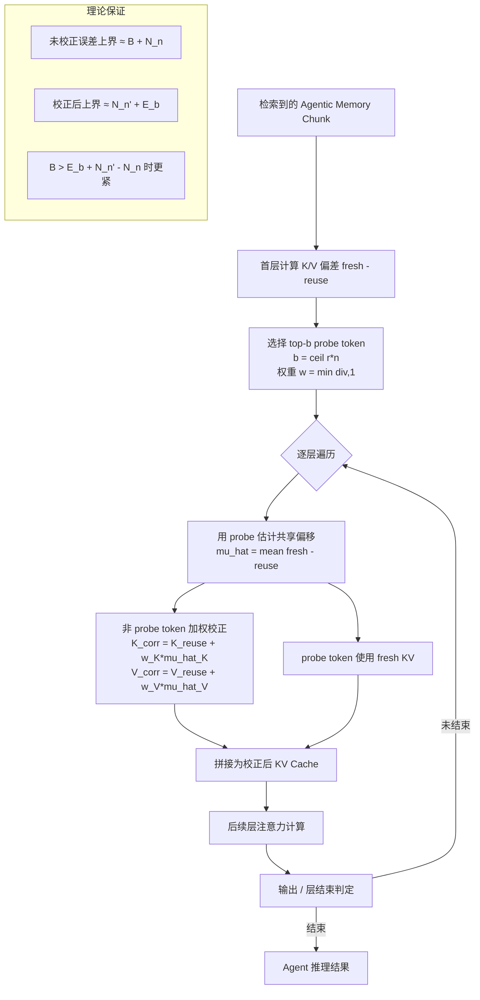

# AgentKVShift：面向智能体记忆系统的高效KV缓存复用

## 一、论文基础元数据
- **原文标题**：AgentKVShift: Efficient KV Cache Reuse for Agentic Memory Systems
- **中文译版**：AgentKVShift：面向智能体记忆系统的高效KV缓存复用
- **发表渠道**：arXiv 预印本（等级：待补充，未见正式会议/期刊标注）
- **发表时间**：2025 年
- **链接**：arXiv:2607.21604（https://arxiv.org/abs/2607.21604）
- **作者及核心机构**：Nilesh Prasad Pandey, Jason Kong, Lanxiang Hu, Quanling Zhao, Yujie Zhao, Onat Gungor, Hao Zhang, Tajana Rosing（核心机构待补充，据作者背景推测涉及 UCSD 等，论文原文未在提供片段中明确标注）
- **研究领域**：
  - 一级领域：人工智能 / 大语言模型系统
  - 二级子领域：LLM Agent 记忆系统、KV Cache 复用与推理加速
- **关联数据集**：
  | 数据集 | 规模 | 语言 | 标注 |
  | ------ | ---- | ---- | ---- |
  | LoCoMo | 长程多会话对话 QA（规模待补充） | 英文 | 对话QA答案（F1/ROUGE/BLEU 评估） |
  | AMA-Bench / AMA-Bench-Recall | 六域（Embodied AI、Game、OpenWorld QA、Software、Text2SQL、Web），规模待补充 | 英文 | GPT-4o 二值 LLM-Judge 标注 |

## 二、论文综合评价

### 2.1 量化评分（1-5分，5分为最优）

| 评价维度 | 评分 | 备注 |
| -------- | ---- | ---- |
| 📚 理论基础 | ⭐⭐⭐⭐ | 残差分解建模+误差上界分析，SVD谱验证支撑 |
| 🎯 问题核心性 | ⭐⭐⭐⭐⭐ | 直击Agent记忆检索KV重编码prefill瓶颈 |
| 💡 方法创新性 | ⭐⭐⭐⭐ | 共享offset假设+探针估计，突破token选择范式 |
| ⚙️ 技术壁垒 | ⭐⭐⭐ | 无需训练、实现简洁，但残差结构洞察有门槛 |
| 🧪 实验严谨性 | ⭐⭐⭐⭐ | 4模型×2记忆系统×2基准，含量化鲁棒性 |
| 🔧 落地可行性 | ⭐⭐⭐⭐⭐ | training-free、正交量化、A100即可2-3.5×加速 |
| 🚀 应用前景 | ⭐⭐⭐⭐⭐ | 长时程Agent推理成本核心痛点，产业价值高 |
| 📊 综合评分 | 4.3 | 面向Agent记忆KV复用的务实创新，理论+工程双落地 |

### 2.2 定性综合评价（≤300字）
> 本文定位为面向 LLM Agent 记忆系统的高效推理基础设施研究。核心洞察在于：Agent 记忆系统检索的是 LLM 生成的元数据丰富表示（摘要、关键词、标签、图节点），其 KV 复用残差由**共享的 chunk 级偏移 μ** 主导，而非现有 token-selection 方法（CacheBlend、ProphetKV）假设的稀疏高偏差 token。现有方法因只重算少数 token、忽略未重算 token 的共同偏移，在 agentic memory 上跨 3B–32B、多模型家族均严重退化（F1 下降 47.5%/63.1%）。AgentKVShift 提出 **training-free、探针引导的残差校正**：用 top-b probe token 估计共享偏移并施加加权向量修正，将刷新预算转化为全 chunk 可用信号。理论上，当共享偏差 B 足够大且 probe 估计误差 E_b 足够小时，校正后误差上界严格更紧。实验在 LoCoMo/AMA-Bench 上以 r=0.1–0.3 重算率接近全量重算（F1 下降仅 1.5–6%），prefill 加速 2–3.5×，且与 KV 量化正交，具备工程落地价值。

## 三、领域本体论映射

| 核心维度 | 具体内容 |
| -------- | -------- |
| 核心研究对象 | Agentic Memory 系统中的检索单元 KV Cache 复用 |
| 核心技术路径 | 探针引导的 chunk 级共享偏移估计 + 加权向量残差校正（training-free） |
| 数据/载体形态 | LLM 生成的元数据记忆单元（摘要/关键词/标签/图节点）；KV 张量（多层 K/V） |
| 核心功能目标 | 在低重算预算下逼近全量重算质量，降低 Agent prefill 成本 |
| 验证核心指标 | F1、ROUGE-1、BLEU-1、LLM-Judge Accuracy、Prefill 加速比 |

## 四、核心问题与解决方案

### 4.1 待解决的核心问题
1. **领域级根本问题**：
   Agentic memory 检索的是 LLM 生成的元数据丰富表示（摘要、关键词、标签、图节点等），与 RAG 原始文本语义结构不同；每次检索仍需重新编码全部 KV，长时程 Agent 推理的 **prefill 成本极高**，成为可扩展性的核心瓶颈。
2. **现有方法痛点**：
   - 面向 RAG 的 training-free KV 复用方法（CacheBlend、ProphetKV）假设 reuse error 稀疏集中在少数 token。
   - 在 agentic memory 上，残差实际由 **chunk 级共享偏移 μ 主导**：未重算 token 仍保留共同偏移，导致缓存整体有偏。
   - 跨 3B–32B、多模型家族、note/graph 记忆系统均显著退化（F1 下降 47.5%/63.1%）。
3. **工程落地卡点**：
   - 如何在低重算率（r=0.1–0.3）下保持接近 full recompute 的质量。
   - 如何与 KV 量化（FP8/KIVI/OTT 2/4-bit）正交共存，避免上下文漂移与量化误差放大。
   - 校正引入的额外算力需可忽略，否则抵消复用收益。

### 4.2 核心解决方案
- **理论框架**：KV 复用残差分解 $r_i = \mu + \xi_i$（共享 chunk-level offset $\mu$ + token 级波动 $\xi$），并给出未校正 / 校正后误差上界对比。
- **核心架构**：按每个检索记忆单元操作；首层定位 top-b probe token（$b=\lceil r\cdot n\rceil$），逐层用 probe 估计 $\hat{\mu} = \mathrm{mean}(\text{fresh}-\text{reuse})$，对非 probe token 施加加权向量加。
- **关键技术**：
  1. 探针选择：首层计算 K/V 偏差，按权重 $w=\min(\mathrm{div},1)$ 选 top-b probe。
  2. 共享偏移估计：逐层 $\hat{\mu}_K, \hat{\mu}_V$。
  3. 残差校正：$K_{corr}=K_{reuse}+w_K\cdot\hat{\mu}_K$；$V$ 同理；probe token 直接使用 fresh KV。
- **创新机制**：将有限的 refresh 预算从"决定重算哪些 token"升级为"修正未重算 token 的整体偏移"，实现**预算→全 chunk 有用信号**的转化。

### 4.3 核心优势（量化+定性）
1. **性能优势**：
   - r=0.1 时 F1 相对下降仅 **1.5–6%**（vs. CacheBlend 47.5%、ProphetKV 63.1%）。
   - AMA-Bench r=0.3：加权 F1 **0.284** vs Full **0.296**，LLM-Judge acc **0.279** vs Full **0.287**，保留 96.0% F1 / 97.2% 准确率。
   - 达到基线质量所需重算率从 r=0.45–0.55 降至 r=0.1（约 **5× 更少重算**）。
2. **效率优势**：
   - 单 A100 上 prefill 加速 **2–3.5×**（r=0.1 时 Qwen2.5-3B 约 3.3×，Qwen3-32B 约 3.6×）。
   - 校正仅引入 memory unit 级向量操作，开销可忽略。
3. **工程优势**：
   - **Training-free**，无需微调。
   - 与 KV 量化正交：KIVI/OTT 2/4-bit、FP8 下保持 **>2× F1** 于基线，2-bit 时 F1≈0.20，超过 CacheBlend 两倍以上、ProphetKV 一个数量级。

## 五、方法与技术架构

### 5.1 核心架构设计

> AgentKVShift 按"检索记忆单元"为处理粒度，流程为：检索 chunk → 首层探针选择 → 逐层共享偏移估计 → 非 probe token 加权校正 → 与 fresh KV 拼接 → 进入后层注意力。核心假设：残差 $r_i = \mu + \xi_i$，其中 $\mu$ 为 chunk 内共享偏移，$\xi_i$ 为 token 级波动。

### 5.2 关键技术实现细节

| 技术模块 | 实现路径 | 工程注意事项 |
| -------- | -------- | ------------ |
| 探针选择（Probe Selection） | 首层计算 K/V 偏差 $\mathrm{fresh}-\mathrm{reuse}$，按权重 $w=\min(\mathrm{div},1)$ 排序选 top-b，$b=\lceil r\cdot n\rceil$ | check layer 固定为 $\ell_c=1$；偏差估计仅在首层做一次，避免逐层重复开销 |
| 共享偏移估计（Offset Estimation） | 逐层用 probe token 的 $\hat{\mu}=\mathrm{mean}(\mathrm{fresh}-\mathrm{reuse})$ 估计 chunk 级共享偏移 | K/V 不对称，K 更符合 sub-Gaussian，V 波动更大；可考虑非对称处理 |
| 残差校正（Residual Correction） | 非 probe token：$K_{corr}=K_{reuse}+w_K\cdot\hat{\mu}_K$；$V$ 同理；probe token 直接用 fresh | 仅 memory unit 级向量加，需在 kernel 层融合以减少访存 |
| 量化兼容层 | 与 FP8、KIVI 2/4-bit、OTT 2/4-bit 组合；probe 估计吸收上下文漂移与平均量化误差 | 高 r（如 r=0.5）时 KIVI 2/4-bit 下新鲜 token 已主导误差预算，基线略优，需按 r 自适应 |
| 依赖组件 | 开源指令微调模型（Qwen2.5-3B、Qwen3-4B、Mistral-7B、Qwen3-32B）、Agentic Memory 系统（A-MEM、LiCoMemory） | Qwen3-32B 在 H200 上运行；其余模型 A100 80GB |

### 5.3 架构优缺点
- **优点**：
  - 无需训练、实现简洁，可与现有 KV 量化方案正交组合。
  - 将刷新预算高效转化为全 chunk 信号，低 r 场景收益显著。
  - 校正操作轻量（memory unit 级向量加），几乎不增加 prefill 开销。
  - 跨模型家族（Qwen/Mistral）、跨规模（3B–32B）、跨记忆系统（note/graph）泛化。
- **缺点**：
  - 理论基础依赖"共享偏移主导"假设，K/V 残差不对称（V 更偏离 sub-Gaussian）时适用性受限。
  - 跨 chunk 推理类能力（Causal Inference、State Updating、State Abstraction）提升有限，仍依赖 Agent 推理 pipeline。
  - probe 估计误差 $E_b$ 随 b 减小增大，极低 r 下需权衡。
  - Software 域出现 F1 超过 100%（可能为修正收益或指标波动），需进一步解释。

## 六、实验设计与结果分析

### 6.1 实验基础设置

| 维度 | 内容 |
| ---- | ---- |
| 数据集 | LoCoMo（长程多会话对话 QA）；AMA-Bench-Recall（六域：Embodied AI、Game、OpenWorld QA、Software、Text2SQL、Web） |
| 基线方法 | CacheBlend、ProphetKV、Full Recompute（上限） |
| 实验环境 | A100 80GB（LoCoMo 及 3B–7B 模型）；Qwen3-32B 使用 H200 |
| 评价指标 | F1、ROUGE-1、BLEU-1；AMA-Bench 额外 GPT-4o 二值 LLM-Judge accuracy |
| 模型 | Qwen2.5-3B-Instruct、Qwen3-4B-Instruct、Mistral-7B-Instruct-v0.3（LoCoMo）；Qwen3-32B（AMA-Bench） |
| 记忆系统 | A-MEM（Zettelkasten 式笔记/摘要/标签）、LiCoMemory（层次图+时间索引） |
| 重算率 | r=0.1（LoCoMo）、r=0.3（AMA-Bench 主实验）；量化实验覆盖 r=0.1/0.2/0.5 |

### 6.2 核心实验结果

**LoCoMo（r=0.1，AMem + Qwen2.5-3B）**

| 方法 | 核心指标1（F1） | 核心指标2（相对下降） | 工程指标（算力/耗时） |
| ---- | --------- | --------- | -------------------- |
| Full Recompute | 0.339 | — | 1.0×（基准） |
| CacheBlend | — | ↓47.5% | 低重算但质量严重退化 |
| ProphetKV | — | ↓63.1% | 低重算但质量严重退化 |
| **AgentKVShift** | **0.319** | **↓5.9%** | prefill 加速约 3.3× |

**AMA-Bench-Recall（Qwen3-32B，r=0.3，AMEM，GPT-4o Judge）**

| 方法 | 加权 F1 | LLM-Judge Accuracy | 工程指标 |
| ---- | ---- | ---- | ---- |
| Full Recompute | 0.296 | 0.287 | 1.0× |
| CacheBlend | 0.270 | 0.240 | — |
| ProphetKV | 0.277 | 0.236 | — |
| **AgentKVShift** | **0.284** | **0.279** | prefill 约 1.5–1.6×，保留 96.0% F1 / 97.2% acc |

**A.2 扩展分析（Qwen3-32B，r=0.3，加权平均）**

| 指标 | Full Rec. | CacheBlend | ProphetKV | AgentKVShift |
| ---- | ---: | ---: | ---: | ---: |
| F1 | 0.302 | 0.231 (76.5%) | 0.259 (85.8%) | **0.263 (87.1%)** |
| Accuracy | 0.257 | 0.165 (64.2%) | 0.183 (71.2%) | **0.213 (82.9%)** |

**按能力关键观察（A.2）**
- Recall：F1 保留 95.9%，Accuracy 保留 97.2%，接近全量重算。
- Causal Inference：F1 保留 88.7%，Accuracy 保留 78.7%。
- State Updating：F1 保留 82.2%，Accuracy 保留 72.2%。
- State Abstraction：F1 保留 75.6%，Accuracy 保留 67.0%；该细分项 PKV 的 F1 更高（AgentKVShift 并非每个细分项均最优）。
- Software 域 F1 达 104.6%、Accuracy 109.9%（超过 full recompute，可能为修正收益或指标波动）。
- Web 域 F1 低于 PKV，但加权平均仍最佳。

**量化鲁棒性（Table 8）**

| 量化配置 | 关键结论 |
| ---- | ---- |
| no quant / FP8 / KIVI 2&4-bit / OTT 2&4-bit | AgentKVShift 几乎全胜 |
| 低 r=0.1/0.2 | 优势最大；KIVI 2-bit、OTT 2-bit 在 r=0.1 时 F1≈0.20，超 CacheBlend 两倍以上、ProphetKV 一个数量级 |
| 高 r=0.5 + KIVI 2/4-bit | 基线略优（新鲜 KV token 已主导误差预算） |

### 6.3 消融实验/鲁棒性分析

| 实验变体 | 指标变化 | 核心结论 |
| -------- | -------- | -------- |
| 重算率 r=0.1 | F1 相对下降 1.5–6% | 低重算预算下仍逼近 full recompute |
| 重算率 r=0.3 | AMA-Bench 保留 96.0% F1 / 97.2% acc | 中等预算下质量保持 |
| 重算率 r=0.5 | 量化基线下基线略优 | 新鲜 token 主导误差时校正收益衰减 |
| KV 量化组合（FP8/KIVI/OTT） | 几乎全胜，2-bit 下 >2× 优势 | 校正与量化正交，probe 估计吸收量化误差 |
| 记忆系统切换（AMem/LiCoMemory） | LiCoMemory 相对差距约 1.5%–3.5% | 跨 note/graph 记忆系统泛化 |
| 模型家族/规模切换（Qwen/Mistral，3B–32B） | 各配置均优于基线 | 跨家族、跨规模一致有效 |
| 上下文长度 / batch size 变化 | prefill 加速随二者增长 | 长上下文、大 batch 下收益更显著 |

（注：论文原文中的结构消融——如 probe 大小 b、check layer $\ell_c$、加权策略 w 的具体消融曲线——在提供的分析片段中未详细展开，标记为待补充。）

### 6.4 实验结论（工程视角）

- **质量可保证**：在 r=0.1（LoCoMo）/ r=0.3（AMA-Bench）的低重算预算下，AgentKVShift 相对 Full Recompute 的 F1 下降仅 1.5–6%，LLM-Judge 准确率差距 3% 以内，可满足大多数 Agentic Memory 应用质量要求。
- **效率可量化**：单卡 A100 上 prefill 加速 2–3.5×，且加速幅度随上下文长度、batch size、模型规模增长；校正开销为 memory unit 级向量操作，可忽略。
- **可组合性强**：与 FP8、KIVI、OTT 等 KV 量化方案正交，2-bit 极端量化下仍保持对基线 >2× F1 优势，适合在资源受限场景叠加使用。
- **边界明确**：高 r（0.5）配合 2-bit 量化时，新鲜 token 已主导误差预算，收益收窄；跨 chunk 推理类任务（State Abstraction 等）仍有明显差距，需 state-aware 机制补足。

## 七、领域贡献与创新点

| 贡献层级 | 具体内容 |
| -------- | -------- |
| 理论贡献 | 提出 KV 复用残差的"共享 chunk 级 offset + token 级波动"分解，并给出未校正/校正后的误差上界与有效性条件（$B > E_b + (N_n'-N_n)$）；SVD 谱分析验证共享偏移主导 |
| 方法/架构贡献 | 提出 AgentKVShift：training-free、探针引导的残差校正，将刷新预算转化为全 chunk 有用信号，突破 token-selection 范式 |
| 数据/工具贡献 | 在 LoCoMo、AMA-Bench-Recall 上系统评测 KV 复用方法；未明确开源代码/工具（待补充） |
| 实验/验证贡献 | 跨 4 模型（Qwen2.5-3B/Qwen3-4B/Mistral-7B/Qwen3-32B）、2 记忆系统（AMem/LiCoMemory）、2 基准（LoCoMo/AMA-Bench）验证；含量化鲁棒性与能力/域细粒度分析 |
| 工程落地贡献 | 单 A100 上 2–3.5× prefill 加速；与 KV 量化正交；实现简洁、可即插即用，直接降低长时程 Agent 推理成本 |

## 八、局限性与风险

| 维度 | 具体描述 | 应对思路 |
| ---- | -------- | -------- |
| 学术局限性 | 跨 chunk 推理能力（Causal Inference、State Updating、State Abstraction）与 Full Recompute 差距更大；K/V 残差不对称，sub-Gaussian 假设更适配 K 而非 V | 探索非对称校正；引入 state-aware KV reuse，按 Agent 推理状态条件化校正 |
| 工程落地风险 | 高 r（0.5）+ 2-bit 量化下基线略优；极低 r 时 probe 估计误差 $E_b$ 增大；校正与量化 kernel 需融合以减少访存 | 按 r 自适应选择是否校正；将校正融合进 KV 量化 kernel；针对不同电路预算调参 b |
| 伦理/合规风险 | 降低长时程 Agent 部署成本属正向社会影响；但可能降低部署门槛带来双用（dual-use）风险 | 论文未详述；建议在实际部署时配合使用政策与滥用监测 |

## 九、未来研究/落地方向

| 方向类型 | 具体内容 | 优先级 |
| -------- | -------- | ------ |
| 科研拓展 | State-aware KV reuse：按 Agent 推理状态条件化校正；非对称 K/V 校正（针对 V 的 sub-Gaussian 偏离） | 高 |
| 工程优化 | 校正与 KV 量化 kernel 融合；自适应 r 调度；probe 大小与 check layer 自动搜索 | 高 |
| 跨领域适配 | 扩展至多模态 Agent 记忆、跨会话长期记忆、图结构记忆的跨 chunk 推理场景 | 中 |
| 基线对比扩展 | 与更新的 KV 复用方法（如基于注意力稀疏/检索分块的方法）系统对比 | 中 |

## 十、关键词与术语表

| 语言 | 关键词 |
| ---- | ------ |
| 中文 | KV缓存复用、智能体记忆系统、探针引导、残差校正、共享偏移、预填充加速、免训练、量化兼容 |
| 英文 | KV Cache Reuse, Agentic Memory, Probe-guided Correction, Residual Correction, Shared Offset, Prefill Acceleration, Training-free, Quantization-compatible |
| 领域专属术语 | **Agentic Memory**（智能体记忆系统，存储 LLM 生成的摘要/关键词/标签/图节点等元数据表示）；**KV Cache Reuse**（复用已编码 KV 而仅重算少量 token 以加速 prefill）；**Chunk-level Offset μ**（检索记忆单元内所有 token 共享的 KV 残差偏移）；**Token-wise Fluctuation ξ**（去除共享偏移后的 token 级残差波动）；**Probe Token**（用于估计共享偏移的高偏差 token，$b=\lceil r\cdot n\rceil$）；**Refresh Ratio r**（重算 token 占比）；**Check Layer $\ell_c$**（计算偏差并选择 probe 的首层，本文取 1）；**Full Recompute**（全量重算上限基线）；**CacheBlend / ProphetKV**（面向 RAG 的 token-selection 式 KV 复用基线） |

## 十一、参考文献与关联资源

- **核心参考文献**：
  - CacheBlend（面向 RAG 的 KV 复用方法，本文主要对比基线之一）
  - ProphetKV（面向 RAG 的 KV 复用方法，本文主要对比基线之一）
  - A-MEM（Zettelkasten 式 Agentic Memory 系统）
  - LiCoMemory（层次图 + 时间索引的 Agentic Memory 系统）
  - LoCoMo、AMA-Bench（评测基准）
  - KIVI、OTT（KV 量化方法）
- **补充阅读**：
  - 待补充（提供片段未列出完整参考文献列表）
- **开源代码/工具**：
  - 待补充（提供片段未明确代码开源地址）
  - 模型来源：HuggingFace Hub（Qwen/Qwen2.5-3B-Instruct、Qwen/Qwen3-4B-Instruct-2507、mistralai/Mistral-7B-Instruct-v0.3、Qwen/Qwen3-32B）

## 十二、阅读者批注

1. **科研启发**：
   - "残差分解为共享偏移 + token 波动"的思路可迁移到其他 cache 复用场景（如多轮对话、RAG、视觉 token 复用）。
   - 误差上界有效性条件 $B > E_b + (N_n'-N_n)$ 给出了校正方法的适用边界，是一种可复用的理论分析范式。
   - K/V 不对称性提示未来可探索非对称建模，可能进一步提升效果。
   - State-aware KV reuse 是自然延伸，将校正与 Agent 推理状态耦合是开放问题。

2. **工程落地思考**：
   - Training-free + 与量化正交是最大工程卖点，可直接在现有 Agent 推理栈上叠加。
   - 需评估在真实 Agent 长时程工作流中的累计收益，而非单次检索的加速比。
   - probe 选择与校正 kernel 的融合实现是关键工程细节，否则额外访存可能抵消收益。
   - 高 r + 极端量化下收益收窄，需设计自适应 r 调度策略。

3. **待验证/存疑点**：
   - 共享偏移主导假设是否在所有记忆系统（如高度异构的图记忆）中成立？
   - Software 域 F1 超过 100%（104.6%）的机制需解释，是否统计波动或真实修正收益。
   - AMA-Bench 加权平均 F1（0.263 vs 0.284，两处不同）的差异需核对；可能与不同子集/统计方式有关。
   - Check layer $\ell_c=1$ 是否为最优？更深层校正是否更有效？
   - Probe 大小 b 与权重的具体消融曲线未在片段中给出。

4. **个人/团队应用场景**：
   - 长时程对话 Agent（客服、个人助理）的记忆检索加速。
   - 多会话 RAG 系统在 KV 复用上的低成本改造。
   - 资源受限环境（2-bit 量化 + 低 r）下的边缘 Agent 部署。
   - 与 vLLM / SGLang 等推理引擎的 KV 管理模块集成。

## 十三、阅读元信息

| 维度 | 内容 |
| ---- | ---- |
| 阅读日期 | 2026-09-30 22:22 |
| 阅读人 | xPaperReader AI |
| 文档编号 | arxiv-2607.21604 |
| 版本迭代 | v1.0 |

---

> **说明**：本简报严格基于所提供的论文分组分析（overview / method / experiment / conclusion）进行整合。论文原文中未在片段中明确的信息（如完整作者机构、正式发表渠道等级、代码开源地址、部分消融细节、完整参考文献列表）均标记为"待补充"，未做臆测。AMA-Bench 加权平均 F1 在 overview（0.284/0.296 vs 0.270/0.277）与 conclusion（0.263/0.302 vs 0.231/0.259）两处给出不同数值，推测为不同实验子集或统计口径差异，已在批注中提示核对。