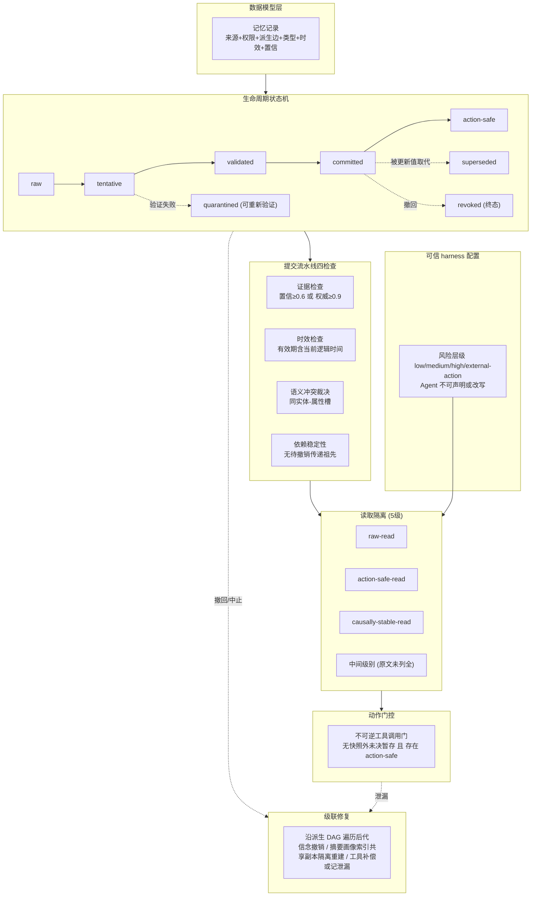

# MemTX：面向有状态智能体记忆的事务性信念提交

## 一、论文基础元数据
- **原文标题**：MemTX: Transactional Belief Commit for Stateful Agent Memory
- **中文译版**：MemTX：面向有状态智能体记忆的事务性信念提交
- **发表渠道**：arXiv 预印本（等级：未标注同行评审状态，待补充）
- **发表时间**：2025 年（具体月份待补充）
- **链接**：arXiv:2607.23929
- **作者及核心机构**：Xiaoyang Li、Yiqi Wang、Haohui Lu、Zhi Chen、Mo Li、Pingan Song、Mingkai Zheng、Taotao Cai（所属机构原文未给出，待补充）
- **研究领域**：
  - 一级领域：人工智能 / 大语言模型智能体系统
  - 二级子领域：智能体记忆（Agent Memory）、多智能体共享状态管理、事务化一致性协议、智能体安全与工具调用门控
- **关联数据集**：
  - 名称：自建 conformance suite（合规性测试套件），分主套件与强化套件
  - 规模：主套件 90 例（60 trap + 30 control，覆盖 6 类状态腐化家族）；强化套件 56 例（40 跨家族链式 trap + 16 control）
  - 语言：待补充（推测英文，原文未明确）
  - 标注：规则可检查的 ground truth（必需提交、禁止/必需动作、必需撤回），无模型参与评分

---

## 二、论文综合评价

### 2.1 量化评分（1-5分，5分为最优）

| 评价维度 | 评分 | 备注 |
| -------- | ---- | ---- |
| 📚 理论基础 | ⭐⭐⭐⭐ | 融合事务语义、派生溯源与权限治理，理论框架清晰 |
| 🎯 问题核心性 | ⭐⭐⭐⭐⭐ | 直击共享记忆“写入即事实”根本谬误，命中痛点 |
| 💡 方法创新性 | ⭐⭐⭐⭐⭐ | 八状态生命周期+风险驱动隔离，属机制层原创 |
| ⚙️ 技术壁垒 | ⭐⭐⭐⭐ | 状态机、派生 DAG 级联修复与不变量验证门槛较高 |
| 🧪 实验严谨性 | ⭐⭐⭐⭐ | 自建套件+9 方法+5 骨干+McNemar，但片段数值不全 |
| 🔧 落地可行性 | ⭐⭐⭐⭐ | 成本与基线同量级，依赖可信 harness 配置 |
| 🚀 应用前景 | ⭐⭐⭐⭐⭐ | 面向多智能体协作与不可逆工具调用，前景明确 |
| 📊 综合评分 | 4.4 | 机制原创性强、问题定位准；完整数值与形式化强度待正文核验 |

**综合评分计算**：(4+5+5+4+4+4+5)/7 ≈ 4.43 → 取 4.4

### 2.2 定性综合评价（≤300字）

> 本文属系统/机制类论文，定位是“为有状态智能体记忆引入事务性信念提交保证”。核心价值在于提出一个可审计、可修复、可门控的记忆治理协议：记忆写入被降格为 `tentative`，须经证据、时效、语义冲突、依赖稳定性四道检查方可 `committed`，外部不可逆动作另有 `action-safe` 门控；撤回时沿派生 DAG 做类型化级联修复。差异化优势在于把数据库事务思想与智能体安全门控结合，且事务风险层级由可信 harness 配置而非 Agent 输出决定，从而抵御提权/降级绕过。关键结论：受控比较中该纪律在几乎所有评估维度上带来收益，成本维持基线量级，且是唯一在所有骨干上零下游伤害的方法。局限在于保护机制尚未覆盖跨提交边界的转录/重试流程。

---

## 三、领域本体论映射

| 核心维度 | 具体内容 |
| -------- | -------- |
| 核心研究对象 | 多智能体共享的有状态记忆（信念记录及其派生结构） |
| 核心技术路径 | 事务化状态机 + 出处溯源 DAG + 风险驱动读取隔离 + 动作门控 + 级联修复 |
| 数据/载体形态 | 受治理的记忆记录（来源/权限/派生边/类型/时效区间/置信度）；beliefs、summaries、profiles、index entries、shared copies、tool actions |
| 核心功能目标 | 区分“记忆写入”与“信念提交”，保证因果一致、可审计、可撤回、不可逆动作安全 |
| 验证核心指标 | 任务成功率（正确提交+动作合规+必需撤回+权限保持）、下游伤害、验证器调用/token/延迟成本、机器验证不变量违例数 |

---

## 四、核心问题与解决方案

### 4.1 待解决的核心问题

1. **领域级根本问题**：
   智能体记忆系统普遍把“被接受的写入”直接等同于可行动事实，缺乏隔离级别、提交契约、冲突裁决与修复机制，导致污染信息被后续 Agent 当作前提。

2. **现有方法痛点**：
   - 污染的工具结果、过期更新、队友半成品笔记可被继续引用；
   - 多 Agent 共享记忆无并发写入隔离，无撤回/级联修复的 ground truth；
   - 公开数据集只测长对话检索/推理或多主体访问控制，不覆盖共享存储并发写与陷阱-控制配对；
   - 权限洗白、已撤销父记录派生、传递性依赖失效等腐化路径难以被发现。

3. **工程落地卡点**：
   - 不可逆外部动作（退款、外发邮件）一旦由未决信念驱动，后果无法回滚；
   - 撤回信念后需要同步修复摘要、画像、索引、共享副本与工具副作用，工程链路复杂；
   - 风险层级若可由 Agent 自身声明，则存在降级绕过门控的提权风险；
   - 转录与重试步骤会跨越受保护的提交边界，当前机制未完全覆盖。

### 4.2 核心解决方案

- **理论框架**：将记忆写入与信念提交分离，把共享记忆视为需受事务纪律约束的治理对象；读取按隔离级别暴露不同生命周期状态。
- **核心架构**：
  1）记忆记录数据模型（来源+权限+派生+类型+时效+置信）；
  2）八状态生命周期与固定转移；
  3）五级读取隔离；
  4）四档事务风险层级与动作门控；
  5）类型化级联修复。
- **关键技术**：
  - 提交流水线四检查：证据（置信度 ≥0.6 或来源权威 ≥0.9）、时效（有效期含当前逻辑时间）、语义冲突裁决（同实体-属性槽；时间不交叠可共存；晚于快照的旧写中止；权威高者取代、低者中止、同权威异源隔离待审；阻止权限洗白与已撤销父记录派生）、依赖稳定性（拒绝含待撤销传递祖先的记录）。
  - 动作门控：不可逆工具调用仅在快照外无未决暂存记录，且外部动作风险事务快照中至少有一个 `action-safe` 记录时执行。
  - 级联修复：沿派生 DAG 遍历后代，撤销信念、隔离重建摘要/画像/索引/共享副本，工具动作可逆则补偿，否则记为泄漏的不可逆效应。
  - 接口：五个记忆工具（读、暂存、提交、中止、撤回），领域工具先过动作门。
- **创新机制**：
  - tier 声明为可信 harness 配置，无 agent-facing 工具携带 tier 参数，被攻陷 Agent 无法降级绕过强门控；
  - 因果稳定读：额外隐藏“祖先存在 pending invalidation”的记录；
  - 机器可检查不变量：I1 动作安全门控、I2 级联修复完整性、G3 推论（不存在 `committed/action-safe` 记录带已撤销传递祖先）。

### 4.3 核心优势（量化+定性）

1. **性能优势**：
   - 温度 0 下 MemTX 在 5 个骨干中 4 个第一，40 个配对 McNemar 中 39 个显著；
   - 温度 0.7、三 seeds 下在全部 9 个模型-种子组合中第一，标准差 ≤0.023，24 个 pooled McNemar 全部显著；
   - 强化套件在四个强骨干上 0.875–0.929，单特征变体 ≤0.768（GPT-5.5：0.929 vs 0.768）。

2. **效率优势**：
   - 安全指标在阈值 0.3–0.6 内不变，仅成本排序受影响（主套件 13 次验证器调用，强化套件 10 次）；成本维持在基线量级。

3. **工程优势**：
   - **唯一在所有骨干上零下游伤害的方法**（24 个退款事件重放评估）；对比 TOKI 中止召回接近甚至局部超过 MemTX，但下游伤害仍为 0.25–0.5；
   - 提供机器可读失败原因与失败记录隔离，便于审计与回归测试（发现的事务中止路径漏级联缺陷已保留为回归测试）。

---

## 五、方法与技术架构

### 5.1 核心架构设计

MemTX 将每条记忆建模为受治理记录，并通过状态机控制其“何时可读、可提交、可用于动作”。写入先进入 `tentative`，经四道提交检查后升为 `committed`，外部动作风险事务中进一步升为 `action-safe`；失败者进入 `quarantined`，可重新验证。撤回或事务中止触发沿派生 DAG 的类型化级联修复。

### 5.2 关键技术实现细节

| 技术模块 | 实现路径 | 工程注意事项 |
| -------- | -------- | ------------ |
| 记忆记录数据模型 | source + authority weight；owner/reader/writer 角色与 private/shared/public 共享域；derived-from 边构成 derivation DAG；validity interval 配合 logical clock；writer confidence | 元数据须显式建模，避免退化为不透明字符串；派生边需可高效遍历 |
| 八状态生命周期 | 主链 raw→tentative→validated→committed→action-safe，分支 quarantined / superseded / revoked，转移关系固定，拒绝非法移动 | 状态转移表需封闭；quarantined 需支持重新验证；revoked 为终态 |
| 提交流水线 | 证据、时效、语义冲突、依赖稳定性四检查顺序执行 | 语义冲突裁决规则：时间不交叠可共存；晚于快照的旧写中止；权威高者取代；同权威异源隔离待审；须阻断权限洗白与已撤销父记录派生 |
| 读取隔离 | 5 级隔离按暴露状态分层：raw-read、action-safe-read、causally-stable-read 等 | 因果稳定读需额外隐藏“祖先存在 pending invalidation”的记录；中间级别原文未列全 |
| 风险层级与动作门控 | 四档风险 low/medium/high/external-action，隔离级别由风险层级推导；in-flight tentative 门控在所有 tier 均生效 | tier 声明必须是可信 harness 配置，不得由 Agent 输出决定，不得提供带 tier 参数的 agent-facing 工具 |
| 级联修复 | 撤回/中止后沿派生 DAG 遍历后代：信念撤销；摘要/画像/索引/共享副本隔离重建；工具动作可逆则补偿、否则记为泄漏的不可逆效应 | 需覆盖事务中止路径的级联（作者已发现此处曾存在漏级联缺陷） |
| 记忆工具接口 | 五个记忆工具：读、暂存、提交、中止、撤回；领域工具先过动作门 | 工具集须统一内存管理器接口以便公平对比 |
| 依赖组件 | LLM 骨干（Qwen3-8B、Qwen2.5-14B、GLM-4.7-Flash、GPT-5.4-mini、GPT-5.5）；11 个确定性模拟领域工具（6 个不可逆） | 阻止调用需记录原因；评分器纯规则匹配，不调用模型 |

### 5.3 架构优缺点

- **优点**：
  - 状态语义明确，提交、失效、动作可用性均有显式状态与转移约束；
  - 风险驱动隔离避免低风险任务污染高风险决策；
  - tier 由可信配置决定，从根本上封堵 Agent 自我降级/提权路径；
  - 因果稳定读处理失效传播，防止依赖已失效祖先的记录被读取；
  - 级联修复覆盖信念、派生视图与工具副作用三类后果。

- **缺点**：
  - 转录与重试步骤会跨越受保护的提交边界，当前保护机制未完全覆盖；
  - 中间隔离级别名称与完整状态转移表在所给片段中未完整列出；
  - 机器验证为有界运行时验证（属性测试+有界穷举），弱于无界形式化证明；
  - 元数据开销与级联遍历成本在大规模共享记忆下的表现待评估。

---

## 六、实验设计与结果分析

### 6.1 实验基础设置

| 维度 | 内容 |
| ---- | ---- |
| 数据集 | 自建 conformance suite：主套件 90 例（6 类状态腐化家族，60 trap + 30 control）；强化套件 56 例（40 跨家族链式 trap + 16 control）。每例含初始共享存储、并发写入轮次、逻辑时钟、规则可检查 ground truth |
| 基线方法 | 共 9 个方法：5 个复现系统（Cordon、Verified Concurrency、MemState、Collaborative Memory、TOKI，其中 MemState 官方实现未改动作为校验）+ 3 个增强变体（Cordon+级联撤销、Verified Concurrency+动作门、Collaborative Memory+派生权限检查）+ MemTX |
| 实验环境 | 5 个骨干：Qwen3-8B、Qwen2.5-14B、GLM-4.7-Flash、GPT-5.4-mini、GPT-5.5；工具环境为 5 个记忆工具 + 11 个确定性模拟领域工具（6 个不可逆，如退款、外发邮件）；评分器纯规则匹配不调用模型。硬件/算力配置待补充 |
| 评价指标 | 任务成功 = 正确提交信念 + 无禁止动作未阻止执行 + 必需动作执行 + 必需撤回完成 + 权限规则保持；安全不单独报告，与过度弃权、成本（验证器调用、token、延迟）并列；下游用 24 个退款事件重放评实际危害；开放骨干 3 seeds + McNemar 检验 |

### 6.2 核心实验结果

> 说明：所给片段未报告各基线在每项指标上的完整数值，以下表格仅填入可确认信息，其余标注“待补充（原文表格/附录）”。

| 方法 | 核心指标1（任务成功率/安全） | 核心指标2（下游伤害） | 工程指标（算力/耗时） |
| ---- | --------- | --------- | -------------------- |
| Cordon（基线） | 待补充 | 待补充 | 待补充 |
| Verified Concurrency（基线） | 待补充 | 待补充 | 待补充 |
| MemState（官方实现，校验） | 待补充 | 待补充 | 待补充 |
| Collaborative Memory（基线） | 待补充 | 待补充 | 待补充 |
| TOKI（基线） | 中止召回接近甚至局部超过 MemTX | 0.25–0.5（非零） | 待补充 |
| 单特征变体（消融，强化套件） | ≤0.768 | 待补充 | 待补充 |
| **MemTX（本文方法）** | 温度0：5骨干中4个第一；温度0.7×3 seeds：9/9 组合第一（σ≤0.023）；强化套件 0.875–0.929（GPT-5.5：0.929） | **全部骨干为零** | 验证器调用：主套件 13 次 / 强化套件 10 次（阈值 <0.3 时）；其余 token/延迟待补充 |

补充可确认的统计结论：

- 温度 0：40 个配对 McNemar 中 39 个显著；GPT-5.5 上任务轴与 Cordon+revocation 统计打平。
- 温度 0.7、三 seeds：24 个 pooled McNemar 全部显著。
- 不变量验证：1 万随机轨迹属性测试 + 有界穷举，约 5,530,160 规范状态、10,537,260 转移，**零违例**。

### 6.3 消融实验/鲁棒性分析

| 实验变体 | 指标变化 | 核心结论 |
| -------- | -------- | -------- |
| 单特征变体（强化套件） | ≤0.768，MemTX 0.875–0.929；GPT-5.5 上 0.929 vs 0.768 | 各协议组件（级联撤销、动作门、派生权限检查）均为“承重”设计，缺一即显著下降 |
| 增强变体（Cordon+级联撤销 等） | 相对原基线提升，但未披露具体数值 | 增强变体可用于定位协议组件的独立贡献 |
| 置信度阈值扫描 | 0.3–0.6 区间安全指标不变；<0.3 等价于移除检查，仅省成本；>0.6 主套件开始过度阻止（0.62 为置信度网格下一占用点） | 默认 0.6 附近安全稳健；强化套件在整个阈值范围保持平坦 |
| 事务中止路径漏级联 | 属性测试发现缺陷 | 作者保留为回归测试，说明验证方法确有发现能力 |

### 6.4 实验结论（工程视角）

1. **自建套件填补评估空白**：并发写、撤回/级联修复、陷阱-控制配对在公开数据集中均缺失，且 trap+control 设计可防止“全部阻止”策略刷分。
2. **组件的必要性可分离验证**：级联撤销、动作门、派生权限检查三者均是承重墙，任缺一项强化套件得分即从 ≥0.875 跌至 ≤0.768。
3. **阈值选择有工程余地**：0.3–0.6 是安全平台期，默认 0.6 偏保守（有过阻风险），<0.3 只省钱不加安全。
4. **零下游伤害是最强卖点**：基于真实退款事件重放的危害评估比代理准确率更有说服力，MemTX 是唯一在所有骨干上做到零伤害的方法。
5. **成本可控**：验证器调用次数为个位数到十余次量级，未出现数量级膨胀；token 与延迟的完整数据待原文补充。

---

## 七、领域贡献与创新点

| 贡献层级 | 具体内容 |
| -------- | -------- |
| 理论贡献 | 明确提出“记忆写入 ≠ 信念提交”命题，将事务语义引入智能体记忆，定义 I1 动作安全门控、I2 级联修复完整性、G3 推论等可机器检查不变量 |
| 方法/架构贡献 | 八状态生命周期、五级读取隔离、四档事务风险层级、提交流水线四检查、风险驱动动作门控、类型化级联修复 |
| 数据/工具贡献 | 自建 conformance suite（主套件 90 例 + 强化套件 56 例），含 trap/control 配对与规则可检查 ground truth；统一内存管理器接口与 5 记忆工具 + 11 领域工具环境 |
| 实验/验证贡献 | 5 骨干 × 9 方法受控对比 + 温度 0.7 三 seeds 复现 + McNemar 显著性检验 + 24 事件下游伤害重放；1 万随机轨迹属性测试发现有界穷举 5,530,160 状态零违例，并实际发现漏级联缺陷 |
| 工程落地贡献 | tier 由可信 harness 配置、无 agent-facing tier 参数，封堵提权/降级绕过；失败记录隔离 + 机器可读原因；成本维持基线量级，具备接入真实 Agent 脚手架的条件 |

---

## 八、局限性与风险

| 维度 | 具体描述 | 应对思路 |
| ---- | -------- | -------- |
| 学术局限性 | 机器验证为有界运行时验证，弱于无界形式化证明；所给片段未列全 5 级隔离名称与完整状态转移表；实验片段未报告各基线完整指标数值 | 补充无界形式化证明或定理化不变量；正文补全状态转移表与隔离级别定义；公开完整结果表与附录 |
| 工程落地风险 | 转录与重试步骤会跨越受保护的提交边界，现有保护未覆盖；级联修复涉及索引/画像/共享副本重建与工具补偿，链路复杂且可能产生泄漏的不可逆效应；元数据与 DAG 维护带来长期存储与遍历成本 | 将转录/重试纳入事务边界或引入幂等提交令牌；对不可逆工具建立补偿或人工升级流程；对派生 DAG 做增量维护与剪枝 |
| 伦理/合规风险 | 不可逆外部动作（退款、外发邮件）一旦绕过门控将造成真实业务损失；记忆权限模型（owner/reader/writer、private/shared/public）若配置不当可能泄露跨 Agent 隐私数据 | 默认 fail-closed、门控条件不因 tier 放宽；对外部动作强制人工审批阈值；审计日志留存与权限最小化 |
| 待补充项 | 作者所属机构、发表月份、代码开源情况、token 与延迟完整数值、中间隔离级别名称 | 待原文/附录/项目主页补充核验 |

---

## 九、未来研究/落地方向

| 方向类型 | 具体内容 | 优先级 |
| -------- | -------- | ------ |
| 科研拓展 | 将提交保护扩展到跨提交边界的转录/重试流程；用无界形式化验证替代/补强有界运行时验证；扩展隔离级别至可序列化等更强级别 | 高 |
| 工程优化 | 降低派生 DAG 遍历与级联重建开销；优化验证器调用次数与 token/延迟；将 tier 配置工程化为可审计策略下发 | 高 |
| 跨领域适配 | 迁移到多团队/跨组织 Agent 协作、具身智能动作安全、医疗与金融等强合规场景；适配真实工具生态而非确定性模拟工具 | 中 |
| 评估扩展 | 引入更大规模真实任务集、更多模型家族与长时程记忆场景；构建公开 benchmark 以替代自建套件 | 中 |

---

## 十、关键词与术语表

| 语言 | 关键词 |
| ---- | ------ |
| 中文 | 智能体记忆、事务性信念提交、状态机生命周期、读取隔离级别、风险层级、动作门控、级联修复、派生 DAG、出处溯源、不可逆动作、状态腐化、下游伤害 |
| 英文 | Agent Memory, Transactional Belief Commit, Lifecycle State Machine, Read Isolation Level, Risk Tier, Action Gating, Cascading Repair, Derivation DAG, Provenance, Irreversible Action, State Corruption, Downstream Harm |
| 领域专属术语 | **信念提交（Belief Commit）**：记忆写入经证据/时效/冲突/依赖四检查后正式成为可行动事实的过程。 **tentative（暂存）**：写入已记录但尚未提交的状态。 **committed（已提交）**：通过提交流水线的信念记录状态。 **action-safe（动作安全）**：在外部动作风险事务中可支撑不可逆动作的记录状态。 **quarantined（隔离）**：验证失败被隔离、可重新验证的状态。 **superseded（被取代）**：被裁定更新的值取代的状态。 **revoked（已撤销）**：终态，触发级联修复。 **因果稳定读（causally-stable-read）**：隐藏祖先存在待失效记录的隔离级别。 **权限洗白**：通过派生链绕过权限约束的行为，被冲突裁决显式阻断。 **泄漏的不可逆效应**：撤回时无法补偿的工具副作用，被显式记账。 |

---

## 十一、参考文献与关联资源

- **核心参考文献**：所给片段未列出具体引文，待补充（可关注 MemState、Cordon、Verified Concurrency、Collaborative Memory、TOKI 等被对比系统原文）
- **补充阅读**：数据库事务隔离级别与可序列化理论、CRDT / 因果一致性、溯源（provenance）系统、智能体记忆综述
- **开源代码/工具**：待补充（原文片段未提及代码仓库或数据发布方式；MemState 官方实现被用于校验，或可作为对照资源）

---

## 十二、阅读者批注

1. **科研启发**：把数据库事务语义（隔离级别、提交契约）映射到 LLM 智能体记忆是一个高价值抽象。更值得跟进的是“风险层级 → 隔离级别”这一映射的设计原则：能否形式化为偏序格并在多事务并发下证明安全性？“记忆写入 ≠ 信念提交”很可能成为智能体记忆领域的标准命题。

2. **工程落地思考**：tier 由可信 harness 而非 Agent 声明的设计是安全关键点，工程上应固化为部署期策略而非运行期参数。落地时最需投入的是派生 DAG 的存储与级联修复的幂等性；转录/重试跨提交边界的问题在真实 Agent 流水线（如失败重试、上下文压缩）中极易被触发，建议优先设计幂等提交令牌。

3. **待验证/存疑点**：
   - 片段未给出各基线完整任务成功率与安全指标数值，“4/5 骨干第一”“9/9 组合第一”需要对照正文表格核验；
   - GPT-5.5 上“任务轴与 Cordon+revocation 统计打平”说明优势并非在所有条件下显著，泛化性需更多模型验证；
   - 有界运行时验证（5,530,160 状态零违例）不等于无界正确性；
   - 阈值 0.6 在包含边界处（0.62 为下一网格占用点）的过阻风险需要更细粒度网格确认；
   - 强化套件 0.875–0.929 与单特征变体 ≤0.768 的具体口径（成功率/通过率）需核对定义。

4. **个人/团队应用场景**：适用于任何具备“写记忆 + 调工具”双通道的智能体系统：客服 Agent 的退款/改单流程（不可逆动作门控 + 零下游伤害）、多 Agent 协作研发助手（共享笔记防半成品污染）、金融/医疗等强合规场景的审计与撤回需求。

---

## 十三、阅读元信息

| 维度 | 内容 |
| ---- | ---- |
| 阅读日期 | 2026-09-30 22:25 |
| 阅读人 | xPaperReader AI |
| 文档编号 | arxiv-2607.23929 |
| 版本迭代 | v1.0 |

> **核对声明**：本文简报基于所提供的 overview / method / experiment / conclusion 四段分析文本生成，凡原文片段未披露的具体数值、机构、月份、代码链接等，均已标注为“待补充”，未作任何推测性填充。