# 动态记忆中的隐式关联盲区：智能体记忆基准评测

## 一、论文基础元数据

- **原文标题**：Keep It InMind: Benchmarking the Implicit-Association Blind Spot in Agent Memory
- **中文译版**：动态记忆中的隐式关联盲区：智能体记忆基准评测
- **发表渠道**：arXiv 预印本（cs.CL），标注等级待补充（未见同行评审信息）
- **发表时间**：论文节选标注为 arXiv:2607.24368v1 [cs.CL] 27 Jul 2026；论文元数据标注年份为 2025，两者存在冲突，以原文标注为准（待核实）
- **链接**：arXiv:2607.24368（DOI 待补充）；Project Website、GitHub Repository（具体 URL 节选未给出）
- **作者及核心机构**：
  - Ruizhe Li¹（共同一作），中国科学技术大学
  - Mingxuan Du¹（共同一作），中国科学技术大学
  - Benfeng Xu²，Metastone Technology
  - Zhendong Mao¹（通讯作者），中国科学技术大学
- **研究领域**：一级领域——人工智能/自然语言处理；二级子领域——LLM 智能体长期记忆、检索增强生成（RAG）、记忆系统评测基准
- **关联数据集**：
  - **InMind**（本文自建基准）：125 个任务，覆盖 10 个生活领域，其中 113 个任务基于可引用的公开来源（citable public sources）构建；专家人工验证；包含配对控制（paired controls）以区分三类失败原因；语言推测为英文（待确认）；标注形式为专家验证的任务级事实-查询对。

## 二、论文综合评价

### 2.1 量化评分（1-5分，5分为最优）

| 评价维度 | 评分 | 备注 |
| -------- | ---- | ---- |
| 📚 理论基础 | ⭐⭐⭐⭐ | 形式化“检索假设”，提出隐式关联盲区概念 |
| 🎯 问题核心性 | ⭐⭐⭐⭐⭐ | 直击记忆系统“存储≠使用”的结构性缺陷 |
| 💡 方法创新性 | ⭐⭐⭐⭐ | 配对控制设计可分离三种混淆解释 |
| ⚙️ 技术壁垒 | ⭐⭐⭐ | 基准构建依赖专家验证，算法突破有限 |
| 🧪 实验严谨性 | ⭐⭐⭐⭐ | 六系统对比+维度消融+诊断探针闭环验证 |
| 🔧 落地可行性 | ⭐⭐⭐ | 路由问题未解决，仅指出方向未给方案 |
| 🚀 应用前景 | ⭐⭐⭐⭐ | 对持久化助手记忆架构设计具强指导性 |
| 📊 综合评分 | 3.9 | 概念贡献突出，工程方案仍待补全，评测设计严谨 |

### 2.2 定性综合评价（≤300字）

> 本文聚焦 LLM 智能体长期记忆系统的一个结构性盲区：检索式记忆默认“被需要的记忆必然与查询相似”，但当相关性由两段文本均不含的世界知识（如“杏仁粉=树坚果过敏原”）桥接时，直接回忆正常而按需应用失效。作者提出 InMind 基准（125 任务、10 领域、113 任务有可引用来源），通过配对控制分离“未存储/缺桥接知识/已存储未浮现”三种解释，判定失败根因在查询条件化接口本身。实验显示：记忆置于上下文时主干模型可答 84.0% 间接查询，而六种向量/图/智能体记忆系统检索场景最高仅 14.4%，尽管其直接召回率可达 100%；8 倍嵌入维度提升无法弥合差距；一个“查询到达前保持记忆可见”的诊断探针可恢复大部分差距。核心价值在于重新定义问题：记忆路由（决定哪些事实需常驻可见）成为开放难题。

## 三、领域本体论映射

| 核心维度 | 具体内容 |
| -------- | -------- |
| 核心研究对象 | 记忆增强型 LLM 智能体的长期记忆“使用”环节（非存储与召回环节） |
| 核心技术路径 | 检索式记忆（write-retrieve-paste）+ 配对控制基准 + 诊断探针归因 |
| 数据/载体形态 | 125 个专家验证任务（文本事实-查询对）、10 个生活领域、113 个引用来源支撑 |
| 核心功能目标 | 诊断并量化“隐式关联盲区”，定位失败层级，指引记忆路由研究 |
| 验证核心指标 | 间接查询答案正确率（in-context 84.0% vs. retrieval ≤14.4%）、直接召回率（≤100%）、答案盲目标召回率 |

## 四、核心问题与解决方案

### 4.1 待解决的核心问题

1. **领域级根本问题**：检索式记忆系统所依赖的“检索假设”——被需要的记忆会与需要它的查询相似——在面对由外部世界知识建立关联的场景（如过敏事实与杏仁粉食谱）时失效，即“隐式关联盲区”。
2. **现有方法痛点**：
   - 向量检索、图记忆、智能体记忆系统等在直接提问上召回率可达 100%，但在间接查询中最高仅 14.4%。
   - 提高嵌入维度（8 倍）无法缩小差距，说明问题不在表征容量。
   - 现有评测将“未存储”“缺乏桥接知识”“存储未浮现”三种失败混为一谈，无法归因。
3. **工程落地卡点**：智能体无法在每个时刻都判断哪条记忆“应当被带入”，即缺少路由机制决定哪些事实需常驻可见；诊断探针验证了“提前可见”有效，但尚未给出可规模化的路由方案。

### 4.2 核心解决方案

- **理论框架**：形式化“检索假设”（retrieval hypothesis），并定义“隐式关联盲区”为查询条件化接口的结构性失败模式。
- **核心架构**：InMind 基准（125 任务 × 10 领域）＋ 配对控制设计 ＋ 诊断探针。
- **关键技术**：
  - 配对控制：通过对照条件区分三类失败解释（未存储／缺桥接知识／存储未浮现）。
  - 诊断探针：在查询到达前保持记忆可见，用于验证失败是否定位于查询条件化接口。
  - 引用来源支撑：113 个任务基于可引用公开来源，保证世界知识桥接的事实正确性。
- **创新机制**：将“记忆是否被使用”从“记忆是否被召回”中解耦，用配对控制把评测从黑箱分数变成可归因判决。

### 4.3 核心优势（量化+定性）

1. **性能优势**：清晰量化差距——上下文直答 84.0% vs. 检索系统 ≤14.4%；直接召回可达 100%，形成鲜明反差，说明失败是接口性的而非知识性/存储性的。
2. **效率优势**：诊断探针“最小化”设计（仅保持记忆可见）即可恢复大部分差距，说明工程改动成本可能低于重建检索架构。
3. **工程优势**：将开放问题明确收敛为“路由”（routing），为后续系统设计提供明确靶点，而非泛泛的“提升记忆能力”。

## 五、方法与技术架构

### 5.1 核心架构设计

> 文字描述 + 架构图

InMind 的评测逻辑分三层：**任务层**（125 个跨 10 领域的事实-查询对）→ **控制层**（配对控制分离三种失败解释）→ **诊断层**（探针验证失败定位）。系统对比时，六种向量/图/智能体记忆系统分别走标准 write-retrieve-paste 流程，与“记忆常驻上下文”的上界条件对比。

```mermaid
graph TB
    subgraph "InMind Benchmark"
        A[125 Expert-Verified Tasks] --> B[10 Life Domains]
        A --> C[113 Tasks with Citable Sources]
        A --> D[Paired Controls]
        D --> D1[Fact Never Stored]
        D --> D2[Lacks Bridging Knowledge]
        D --> D3[Stored but Never Surfaced]
    end

    subgraph "Evaluation Setup"
        E[User Fact: 树坚果过敏] --> F[Memory Writer]
        F --> G[(External Memory Store)]
        H[Indirect Query: 马卡龙食谱] --> I[Retriever]
        G --> I
        I --> J[Retrieved Records Pasted to Prompt]
        J --> K[Backbone LLM]
    end

    subgraph "Comparison Conditions"
        L[In-Context Upper Bound] --> M[84.0% indirect correct]
        N[Retrieval Systems x6] --> O[≤14.4% indirect correct]
        P[Direct Recall Test] --> Q[Up to 100%]
    end

    subgraph "Diagnostic Probe"
        R[Keep Memory Visible Before Query] --> S[Recovers Most of Gap]
        S --> T[Failure located in query-conditioned interface]
        T --> U[Open problem: ROUTING]
    end
```

### 5.2 关键技术实现细节

| 技术模块 | 实现路径 | 工程注意事项 |
| -------- | -------- | ------------ |
| 任务构建 | 覆盖 10 个生活领域，113/125 任务锚定可引用公开来源 | 需专家验证，确保世界知识桥接事实正确 |
| 配对控制 | 设计对照条件分别对应三种失败解释 | 需严格控制变量，避免解释混淆 |
| 记忆系统对比 | 选取六种向量、图、智能体记忆系统 | 需统一写入/检索接口，保证公平 |
| 嵌入维度消融 | 将嵌入维度提升 8 倍 | 验证非表征容量瓶颈 |
| 诊断探针 | 查询到达前保持记忆可见 | 最小化干预，避免引入额外信息 |
| 依赖组件 | 主干 LLM、向量检索器、图记忆、智能体记忆框架 | 具体版本节选未给出，待补充 |

### 5.3 架构优缺点

- **优点**：
  - 配对控制使失败可归因，避免“测出低分但不知为何”的黑箱评测。
  - 诊断探针将开放问题精确定位到查询条件化接口，收敛研究方向。
  - 引用来源支撑提升基准可信度与可复现性。
- **缺点**：
  - 未给出可规模化的路由方案，仅指出方向（“routing as the open problem”）。
  - 节选未披露任务构建成本、标注一致性指标与具体基线版本，工程细节不足。
  - 10 个领域覆盖面对真实长期助手的多样性可能仍有限。

## 六、实验设计与结果分析

### 6.1 实验基础设置

| 维度 | 内容 |
| ---- | ---- |
| 数据集 | InMind（125 任务、10 领域、113 任务有可引用来源） |
| 基线方法 | 六种记忆系统（向量、图、智能体类），具体名称节选未列出（待补充） |
| 实验环境 | 待补充（节选未给出硬件/框架/主干模型版本） |
| 评价指标 | 间接查询答案正确率、直接召回率、答案盲目标召回率 |

### 6.2 核心实验结果

| 方法 | 间接查询正确率 | 直接召回率 | 工程指标（算力/耗时） |
| ---- | --------- | --------- | -------------------- |
| 记忆常驻上下文（上界） | 84.0% | — | 待补充 |
| 六种记忆系统（最佳） | ≤14.4% | 最高 100% | 待补充 |
| 8× 嵌入维度版本 | 目标召回提升但差距基本不变 | — | 待补充 |
| 诊断探针（记忆提前可见） | 恢复大部分差距 | — | 待补充 |

> 注：节选仅给出汇总数字，未提供逐系统明细表格，故无法列出各基线单独数值。

### 6.3 消融实验/鲁棒性分析

| 实验变体 | 指标变化 | 核心结论 |
| -------- | -------- | -------- |
| 嵌入维度 ×8 | 答案盲目标召回对所有系统均有提升，但差距“essentially intact” | 失败非表征容量瓶颈 |
| 配对控制（未存储/缺知识/未浮现） | 判定为第三类：已存储但从未浮现 | 失败定位于查询条件化接口 |
| 诊断探针（查询前保持可见） | 恢复大部分差距 | 验证接口层因果性 |

### 6.4 实验结论（工程视角）

从工程角度看，本文最重要的结论是：**当前主流记忆系统的瓶颈不在存储、不在召回、也不在嵌入表征容量，而在“何时、把哪条记忆带入”的决策接口**。这意味着继续堆砌检索精度或嵌入维度收益有限；工程投入应转向“路由/常驻可见性调度”。诊断探针的有效性也提供了一个低成本的临时缓解方案（关键事实常驻），可用于生产环境快速止损。

## 七、领域贡献与创新点

| 贡献层级 | 具体内容 |
| -------- | -------- |
| 理论贡献 | 形式化“检索假设”，提出并定义“隐式关联盲区”失败模式 |
| 方法/架构贡献 | 首次将“存储/桥接知识/浮现”三种失败通过配对控制分离的评测架构 |
| 数据/工具贡献 | InMind 基准：125 任务、10 领域、113 个可引用来源、专家验证 |
| 实验/验证贡献 | 六系统对比、8× 维度消融、诊断探针三重验证，量化 84.0% vs ≤14.4% 差距 |
| 工程落地贡献 | 明确将开放问题收敛为“路由”，并给出可低成本缓解的诊断探针模式 |

## 八、局限性与风险

| 维度 | 具体描述 | 应对思路 |
| ---- | -------- | -------- |
| 学术局限性 | 未提出可规模化的路由算法；节选未披露任务构建细节与标注一致性 | 以问题定义与基准为主要贡献，后续工作补算法 |
| 工程落地风险 | 仅“查询前常驻可见”探针可能在大规模记忆下不可行（上下文预算） | 需研究选择性常驻的路由策略 |
| 伦理/合规风险 | 使用可引用公开来源构建任务，若引用来源本身有偏差可能传导；涉及用户过敏等敏感信息场景 | 需关注任务中的隐私与来源多样性 |

## 九、未来研究/落地方向

| 方向类型 | 具体内容 | 优先级 |
| -------- | -------- | ------ |
| 科研拓展 | 研究记忆路由（routing）算法：决定哪些事实必须保持可见 | 高 |
| 工程优化 | 基于诊断探针设计低成本常驻可见性调度器 | 中 |
| 跨领域适配 | 将 InMind 的 10 领域扩展到更多垂直场景（医疗、法律等） | 中 |

## 十、关键词与术语表

| 语言 | 关键词 |
| ---- | ------ |
| 中文 | 智能体记忆、隐式关联盲区、检索假设、记忆路由、基准评测、长期记忆、查询条件化接口 |
| 英文 | Agent Memory, Implicit-Association Blind Spot, Retrieval Hypothesis, Memory Routing, Benchmark, Long-term Memory, Query-Conditioned Interface |
| 领域专属术语 | **Implicit-Association Blind Spot**（隐式关联盲区）：记忆与查询之间需外部世界知识桥接、二者无表面线索相连时的检索失败模式；**Retrieval Hypothesis**（检索假设）：被需要的记忆会与需要它的查询相似的默认前提；**Paired Controls**（配对控制）：用于分离三种失败解释的对照设计；**Diagnostic Probe**（诊断探针）：查询到达前保持记忆可见的最小干预验证手段 |

## 十一、参考文献与关联资源

- **核心参考文献**：Lewis et al., 2020（RAG）；Karpukhin et al., 2020（DPR）；Borgeaud et al., 2022（RETRO）；Asai et al., 2023（Self-RAG）；Zhang et al., 2024；Packer et al., 2023；Pan et al., 2025；King Arthur Baking Company, n.d.；U.S. FDA, n.d.
- **补充阅读**：附录 D（记录被评测记忆系统的复现失败案例）
- **开源代码/工具**：GitHub Repository（项目页与仓库 URL 见原文 Project Website，节选未给出具体链接，待补充）

## 十二、阅读者批注

1. **科研启发**：本文把“记忆使用”从“记忆召回”中解耦，这一视角可能迁移到工具调用、上下文工程（context engineering）等方向——即“何时把什么带入”比“能不能找到”更关键。
2. **工程落地思考**：诊断探针“查询前保持可见”是低成本止损方案，但大记忆库下不可直接常驻；可考虑按风险等级（如过敏、安全类事实）分层常驻。
3. **待验证/存疑点**：
   - 节选未给出六种基线的具体名称与逐项结果，无法复核“≤14.4%”的统计口径。
   - 结论“8× 维度无法弥合差距”仅给汇总描述，未见具体数值表。
   - 论文日期标注（2026 vs 2025）存在冲突，需核实版本。
4. **个人/团队应用场景**：任何构建持久化 AI 助手的团队，都应将“记忆路由”纳入架构设计；可在自建评测中加入类似配对控制以避免归因混淆。

## 十三、阅读元信息

| 维度 | 内容 |
| ---- | ---- |
| 阅读日期 | 2026-09-30 22:27 |
| 阅读人 | xPaperReader AI |
| 文档编号 | arxiv-2607.24368 |
| 版本迭代 | v1.0 |