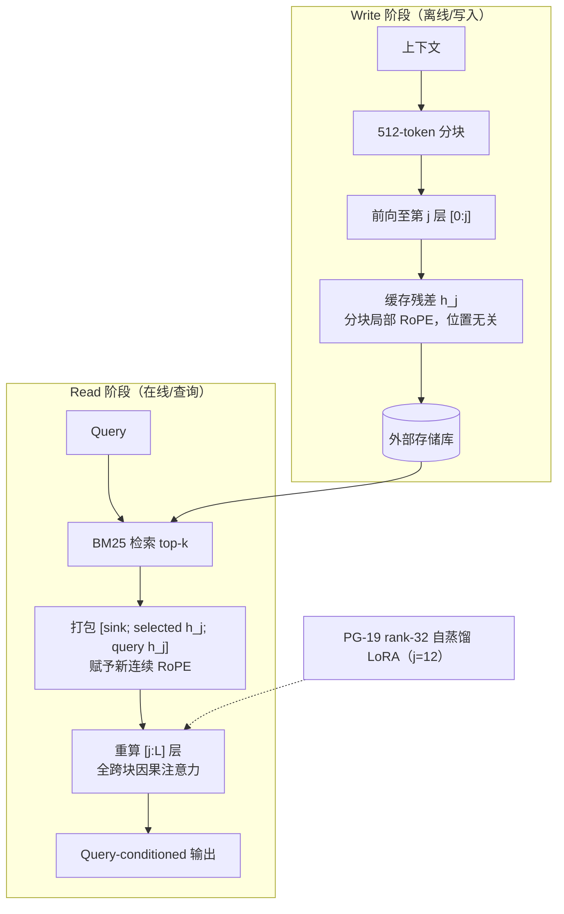

# 理解在早期完成：大语言模型中的深度分工及其在无界上下文记忆中的应用

## 一、论文基础元数据
- **原文标题**：Understanding Is Done Early: A Depth Division of Labor in Large Language Models and Its Use for Unbounded-Context Memory
- **中文译版**：理解在早期完成：大语言模型中的深度分工及其在无界上下文记忆中的应用
- **发表渠道**：arXiv 预印本（等级：待补充，尚未标注会议/期刊录用信息）
- **发表时间**：2025 年（具体月份待补充）
- **链接**：arXiv:2607.28263（DOI 待补充）
- **作者及核心机构**：Hanzuo Liu, Xuan Qi, Chunyu Liu, Haotian Zhong, Yulong Wang, Rayying, Alex Lamb, Mingyu Gao（具体机构待补充）
- **研究领域**：
  - 一级领域：人工智能 / 自然语言处理
  - 二级子领域：大语言模型长上下文建模、KV 缓存优化、上下文记忆机制
- **关联数据集**：
  | 数据集 | 规模/语言 | 标注形式 |
  | ------ | --------- | -------- |
  | RULER | 每任务–长度单元 100 例，英文 | 单针/多键/变量跟踪，`string_match_all` |
  | LongBench | 英文多任务 | macro F1 |
  | LongEval | 英文长程检索 | lines-retrieval 协议 |
  | BABILong | 英文，qa1/qa2/qa5 子任务 | `compare_answers`（非 `re.search`） |
  | LoCoMo | 10 个对话簇，英文 | GPT-4o 语义 Judge 为主，类别 1–4 由 GPT-4o 评分，类别 5 官方本地弃权规则；词法诊断含 token F1 与 substring accuracy |
  | PG-19 | 英文长文档 | 自蒸馏用（无检索/任务监督） |

## 二、论文综合评价

### 2.1 量化评分

| 评价维度 | 评分 | 备注 |
| -------- | ---- | ---- |
| 📚 理论基础 | ⭐⭐⭐⭐ | 深度分工假设可测，0.45L 语义深度有实证，但机制解释尚浅 |
| 🎯 问题核心性 | ⭐⭐⭐⭐⭐ | 直击长上下文记忆的质量–计算–内存三角权衡 |
| 💡 方法创新性 | ⭐⭐⭐⭐⭐ | 从 token 轴压缩转向层轴复用，思路新颖 |
| ⚙️ 技术壁垒 | ⭐⭐⭐ | 需中间层残差访问与定制推理，但 LoRA 极轻 |
| 🧪 实验严谨性 | ⭐⭐⭐⭐ | 多基准+审计稳健，但 LongBench 偏低、单查询 harness |
| 🔧 落地可行性 | ⭐⭐⭐⭐ | 显存 18.26GB vs 89.36GB，MoE 128k 可运行，工程潜force大 |
| 🚀 应用前景 | ⭐⭐⭐⭐ | 无界读+有界内存，适合长对话/知识库场景，但非精度 SOTA |
| 📊 综合评分 | 4.1 | 深度轴复用的开创性方案，权衡可控，但精度与验证范围仍需拓展 |

### 2.2 定性综合评价（≤300字）

> 本文提出 CoMem，将长上下文记忆从“沿 token 轴压缩/检索”转向“沿层轴复用”。核心观察是：LLM 中低层已完成语义理解（语义内容深度约 0.45L），上层主要做查询条件化预测。据此，Write 阶段仅前向至第 j 层并缓存残差，Read 阶段用 BM25 检索相关块、赋予新连续 RoPE 后仅重算 [j:L] 层，从而在固定 k、chunk 与 query 长度下实现**与存储上下文长度无关的有界读**。旗舰配置 j=12/36、冻结 backbone，仅训练 PG-19 rank-32 自蒸馏 LoRA 即可修复读出保真度（LoCoMo +13.75 点）。RULER 97.05、LoCoMo 38.27（优于 KV-Direct 34.59）；128k 下显存 18.26GB vs 89.36GB、prefill 加速 7.83×。核心价值在**质量–记忆–计算可调权衡**而非单纯精度提升，LongBench 与 BABILong qa2 暴露“压缩税”。

## 三、领域本体论映射

| 核心维度 | 具体内容 |
| -------- | -------- |
| 核心研究对象 | 大语言模型长上下文记忆的表示与复用机制（深度分工假设） |
| 核心技术路径 | 中层残差缓存 + BM25 检索 + 上层重算 + 轻量自蒸馏 LoRA 接口适配 |
| 数据/载体形态 | 分块（512 token）中间层残差张量 h_j；外部可检索存储库；文本上下文 |
| 核心功能目标 | 实现上下文长度无关的有界读，降低 KV 缓存与在线计算开销 |
| 验证核心指标 | RULER/LoCoMo/LongBench/LongEval/BABILong 得分；显存占用、prefill/decode 加速比、缓存每 token 大小、读长 |

## 四、核心问题与解决方案

### 4.1 待解决的核心问题

1. **领域级根本问题**：长上下文记忆如何在不随上下文长度增长的在线计算与内存下，保持有竞争力的质量？现有范式陷入质量、内存、计算三者不可兼得的三角。
2. **现有方法痛点**：
   - 沿 token 轴压缩/检索（KV 压缩、RAG、滑窗）要么丢失信息，要么仍随长度增长 KV 工作内存；
   - 长程瓶颈主要是**选择**而非缓存保真（Oracle/BM25 在 RULER 单针保持 100，recency/reader attention 随长度崩溃）；
   - 更宽检索不一定更好，会引入干扰（Hop-4 在 16k 后反而更差）。
3. **工程落地卡点**：128k 场景 Dense KV 缓存显存爆炸（89.36GB）、prefill 耗时；稀疏 MoE backbone 在长上下文下 OOM；缺乏对中间层残差复用的工程范式。

### 4.2 核心解决方案

- **理论框架**：深度分工假设——LLM 中低层完成语义理解（语义内容深度约 0.45L，近尺度不变），上层主要做查询条件化预测；因此理解状态可缓存、可复用，上层可按需重算。
- **核心架构**：CoMem 双阶段设计：
  - **Write**：上下文按 512 token 分块，每块只前向至第 j 层，缓存每 token 残差张量 h_j 存外部库；分块局部 RoPE，位置无关。
  - **Read**：BM25 检索 top-k 相关块，打包为 `[sink; selected h_j; query h_j]`，赋予新连续 RoPE，只重算 [j:L] 层，并做全跨块因果注意力。
- **关键技术**：BOS sink、iter_bm25 检索、全跨块因果注意力、PG-19 rank-32 自蒸馏 LoRA（作用于 j=12）。
- **创新机制**：**j 作为质量–成本旋钮**（j=0 等价全前向；j 越深读越便宜但 query-blind 读出越差）；固定 k/chunk/query 长度时在线读计算与 KV 工作内存不随存储上下文长度增长（有界读）。

### 4.3 核心优势（量化+定性）

1. **性能优势**：RULER 97.05；LoCoMo 38.27 vs KV-Direct 34.59（增益经对话簇 bootstrap 与 DeepSeek-V3 独立审计稳健）；LongEval 69.0 vs 65.2；j=0 全深度重算在 LoCoMo 达 41.59，证明检索选择本身有效。
2. **效率优势**：128k adapter-free 控制中显存 18.26GB vs 89.36GB（约 4.9× 降低），full-write-inclusive prefill 加速 7.83×；decode 接近 Dense（128k 略快 1.07×）；缓存为 full bf16 KV 每 token 的 1/18（8KB vs 144KB）；j=12 时 128k Read 从 1.01s 降至 0.72s。
3. **工程优势**：Qwen3-30B-A3B 在 128k 可运行（63GB，Dense OOM）；Hunyuan Hy3 80 层稀疏 MoE 在 256k 下读长约 4.3–4.6k，单/多针召回 100/98，无 OOM；LoRA 训练无需更新 backbone。

## 五、方法与技术架构

### 5.1 核心架构设计

> CoMem 将上下文记忆沿层轴组织。**Write 阶段**对每个 512-token 分块仅执行 [0, j] 层前向，缓存中层残差张量 h_j（分块局部 RoPE，位置无关）至外部存储。**Read 阶段**对查询与所有分块 h_j 执行 BM25 检索取 top-k，打包装配 `[sink; selected h_j; query h_j]`，重新赋予连续 RoPE 后仅重算 [j:L] 层，全程跨块因果注意力；最终由上层输出 query-conditioned 预测。j 是质量–成本旋钮，旗舰配置 j=12/36 配合 PG-19 rank-32 自蒸馏 LoRA 修复读出保真度。

### 5.2 关键技术实现细节

| 技术模块 | 实现路径 | 工程注意事项 |
| -------- | -------- | ------------ |
| 中层残差缓存（Write） | 512-token 分块，只前向至第 j 层，缓存每 token 残差 h_j；分块局部 RoPE | 存储库需支持按块检索；位置无关便于重赋位置编码 |
| BM25 检索（Read） | iter_bm25，top-12；评估协议含 hop width=4、rounds=0，自动三轮检索 | 实际读取约 6.5k tokens；检索预算是双刃剑，过宽引入干扰 |
| 上层重算与跨块注意力 | 打包 `[sink; selected h_j; query h_j]`，重赋连续 RoPE，仅重算 [j:L]，全跨块因果注意力 | 全跨块注意力对多事实消歧关键（多键召回 96/94→60/32） |
| 自蒸馏 LoRA 接口适配 | PG-19 上 rank-32 LoRA，作用于 j=12，backbone 冻结，无 SFT/RL | PG19 无检索或任务监督，属接口适配而非基准特定训练 |
| 统一评估协议 | 禁用 chat template，纯文本 prompting；top-12、hop width=4、三轮检索 | 原生窗口 40,960 tokens；131,072 为未激活 YaRN 外推上限 |
| 依赖组件 | Qwen3-8B Base LM（36 层）、Qwen3 0.6B–32B、Qwen3-30B-A3B、Hunyuan Hy3（80 层稀疏 MoE） | 稀疏 MoE 需注意显存与路由开销 |

### 5.3 架构优缺点

- **优点**：
  - 有界读：固定 k/chunk/query 长度时，在线读计算与 KV 工作内存不随存储上下文长度增长；
  - j 提供显式质量–成本旋钮，可按场景调节；
  - 仅训 LoRA 即可修复读出保真度，backbone 冻结，训练成本低；
  - 泛化到 Qwen3 多规模与两种稀疏 MoE backbone。
- **缺点**：
  - 非全任务精度 SOTA，窗口内全上下文仍强；
  - LongBench macro F1 12.15 vs KV-Direct 12.17 基本持平；BABILong 50.43 vs 63.00，qa2 仅 27.0，暴露“压缩税”；
  - 更深分割牺牲 frozen readout fidelity（j=6/9/12 LoCoMo 32.78/29.15/24.52）；
  - 单短查询可能无法摊销 Write 成本，多跳检索延迟未测。

## 六、实验设计与结果分析

### 6.1 实验基础设置

| 维度 | 内容 |
| ---- | ---- |
| 数据集 | RULER、LongBench、LongEval、BABILong、LoCoMo、PG-19（自蒸馏） |
| 基线方法 | KV-Direct（full-context KV 缓存）、Dense；同 pack 下 j=0 全深度重算；Oracle 检索、recency/reader-attention 选择器 |
| 实验环境 | Qwen3-8B Base LM（36 层，backbone 冻结）；Qwen3 0.6B–32B；Qwen3-30B-A3B；Hunyuan Hy3（80 层稀疏 MoE） |
| 评价指标 | RULER 用 `string_match_all`；BABILong 用 `compare_answers`（不用 `re.search`）；LongBench、LoCoMo 用 `run_scoring`；LongEval 遵循 LongChat lines-retrieval 协议；LoCoMo 以 GPT-4o 语义 Judge 为主指标；工程指标含显存、prefill/decode 加速比、缓存每 token 大小、读长 |

### 6.2 核心实验结果

| 方法 | RULER / LoCoMo | LongBench / LongEval / BABILong | 工程指标（算力/耗时） |
| ---- | -------------- | ------------------------------- | -------------------- |
| KV-Direct（full-context） | RULER 待补充 / LoCoMo 34.59 | LongBench 12.17 / LongEval 65.2 / BABILong 63.00 | 128k 显存 89.36 GB；prefill 基线 |
| j=0 全深度重算 | LoCoMo 41.59 | — | 全深度重算，成本高 |
| j=6/9/12（冷冻，无 LoRA） | LoCoMo 32.78/29.15/24.52 | — | 128k Read 1.01s→0.72s |
| **CoMem（本文，j=12 + LoRA）** | **RULER 97.05 / LoCoMo 38.27** | **LongBench 12.15 / LongEval 69.0 / BABILong 55.6 / qa2 27.0 / qa5 68.7** | **128k 显存 18.26 GB；prefill 加速 7.83×；缓存 8 KB/token（1/18）；128k decode 1.07×** |

### 6.3 消融实验/鲁棒性分析

| 实验变体 | 指标变化 | 核心结论 |
| -------- | -------- | -------- |
| 深度分割 j 扫描（同 pack） | LoCoMo j=0/6/9/12 = 41.59/32.78/29.15/24.52；128k Read 1.01s→0.72s | j 是质量–成本旋钮，深分割省查询成本但损读出保真度 |
| 自蒸馏 LoRA（PG19, j=12） | LoCoMo +13.75；BABILong qa1/qa2/qa5 +22.2/9.0/8.4；RULER 单针 35/5/17→100/100/100，多键 4/2/1→91/95/92（8k/16k/32k） | 仅接口适配即可大幅恢复读出保真度，非基准特定训练 |
| 检索预算（top-12 vs Hop-4） | top-12 在 8k/16k/32k/64k/128k = 96.6/97.6/98.8/99.0/95.8；Hop-4 = 99.0/95.6/89.8/89.8/87.4 | 更宽检索不一定更好，16k 后引入干扰变量链（注：两者配置不同，非等预算因果比较） |
| 全跨块注意力 vs 块对角重用 | RULER 多键召回 96/94→60/32（损失 36/62）；BABILong qa2 36/20→17/13（损失 19/7）；单针几乎不受影响 | 跨块交互对多事实消歧至关重要，单点检索只需很少交互 |
| 选择器鲁棒性 | Oracle 保持 needle 单元 100；recency/reader-attention 随长度退化 | 长程瓶颈主要是选择而非缓存保真度 |
| 完整性检查 | RULER 完整网格通过八分片完整性检查，无空预测，与磁盘重算分数一致 | 实验可复现性较好 |

### 6.4 实验结论（工程视角）

1. **深度重用是成本-质量旋钮而非精度增益**：j 越大成本越低、读出越差；LoRA 可显著回补但非免费。
2. **有界选择 + 可调深度分裂 + 全跨块重算 + 轻量接口适配**四组件均为独立有效组件。
3. **跨块重算与多事实消歧强相关**，单针任务可省略；检索预算需精心设计。
4. **工程可行性已被 MoE 验证**：128k Dense OOM 场景下 Qwen3-30B-A3B 可运行，Hunyuan Hy3 在 256k 无 OOM 且召回 100/98。
5. **代价**：LongBench 与 BABILong qa2 显示“压缩税”，全任务精度并非 SOTA。

## 七、领域贡献与创新点

| 贡献层级 | 具体内容 |
| -------- | -------- |
| 理论贡献 | 提出并实证“深度分工”假设：理解在早期（语义内容深度约 0.45L，近尺度不变），上层做查询条件化预测；零样本可读边界随模型规模加深，小模型适应空间更大，32B 附近消失 |
| 方法/架构贡献 | 提出 CoMem：中层残差缓存 + BM25 检索 + 上层重算 + 全跨块因果注意力，实现上下文长度无关的有界读；j 作为显式质量–成本旋钮 |
| 数据/工具贡献 | 引入 PG-19 rank-32 自蒸馏 LoRA 接口适配方案；统一 chat-template-free 评估协议；八分片 RULER 完整性检查流程 |
| 实验/验证贡献 | 在 RULER/LongBench/LongEval/BABILong/LoCoMo 五基准上系统评估；LoCoMo 增益经对话簇 bootstrap 与 DeepSeek-V3 独立审计；j 扫描、检索预算、跨块注意力等多组消融 |
| 工程落地贡献 | 128k 显存 18.26GB vs 89.36GB、prefill 加速 7.83×、缓存 1/18；在 Qwen3-30B-A3B 与 Hunyuan Hy3 80 层 MoE 上验证长上下文可运行性 |

## 八、局限性与风险

| 维度 | 具体描述 | 应对思路 |
| ---- | -------- | -------- |
| 学术局限性 | 非全任务精度 SOTA；未做 YaRN 位置扩展，>40,960 token 仅作未扩展压力参考；仅英文、检索式 QA 为主；LoCoMo 仅 10 个对话簇；单查询 harness；单短查询可能无法摊销 Write；多跳检索延迟未测；LongBench 偏低暴露压缩税 | 扩展多语言与多任务；引入位置扩展；多查询/多跳基准；更细的 Write/Read 成本建模 |
| 工程落地风险 | 需访问中间层残差并定制推理链路；存储库与检索延迟未充分量化；稀疏 MoE 的路由开销与显存；单短查询下 Write 成本难摊销 | 建立端到端服务化基准；设计 Write 摊销策略与缓存淘汰；MoE 感知的调度优化 |
| 伦理/合规风险 | 不增加安全机制，继承幻觉、偏见与敏感信息泄露风险；中层残差缓存可能以非常规形式泄露原始内容 | 部署需访问控制、删改（right-to-be-forgotten）机制与监控审计 |

## 九、未来研究/落地方向

| 方向类型 | 具体内容 | 优先级 |
| -------- | -------- | ------ |
| 科研拓展 | 深化深度分工机制的机理解释；将层轴复用与 token 轴压缩正交结合；多语言/多模态扩展；多跳检索与多查询 harness | 高 |
| 工程优化 | Write 成本摊销策略；检索延迟与存储一致性优化；MoE 感知调度；YaRN 位置扩展集成；端到端服务化基准 | 高 |
| 跨领域适配 | 长对话/知识库/RAG 场景适配；代码/法律/医疗等长文档领域；边缘设备上的有界读部署 | 中 |

## 十、关键词与术语表

| 语言 | 关键词 |
| ---- | ------ |
| 中文 | 深度分工、无界上下文记忆、中层残差缓存、有界读、质量–成本旋钮、自蒸馏 LoRA、全跨块注意力、压缩税 |
| 英文 | Depth Division of Labor, Unbounded-Context Memory, CoMem, Bounded Read, Mid-layer Residual Cache, Self-distillation LoRA, Cross-chunk Attention, Compression Tax |
| 领域专属术语 | **CoMem**：本文提出的无界上下文记忆方案，缓存中层 chunk 状态并在查询时重算上层；**深度分工（Depth Division of Labor）**：LLM 中低层完成语义理解、上层做查询条件化预测的分工现象；**有界读（Bounded Read）**：固定 k/chunk/query 长度时在线读计算与 KV 工作内存不随存储上下文长度增长；**j**：Write 阶段停止前向的层号，作为质量–成本旋钮；**压缩税（Compression Tax）**：因压缩/选择性读入导致特定任务（如 BABILong qa2）精度下降的现象；**BOS sink**：Read 打包时的序列起始汇聚 token；**iter_bm25**：迭代式 BM25 检索机制 |

## 十一、参考文献与关联资源

- **核心参考文献**：待补充（原文参考文献列表未在分析材料中提供）
- **补充阅读**：Qwen3 系列技术报告、RULER/LongBench/LongEval/BABILong/LoCoMo 基准论文、BM25 检索、KV 缓存压缩相关文献（原文引用，待补充具体条目）
- **开源代码/工具**：待补充（原文未在分析材料中明确标注代码仓库）

## 十二、阅读者批注

1. **科研启发**：把“层”作为与 token 轴正交的记忆组织维度，思路新颖；“深度分工”假设可进一步与表示相似度/探测方法结合验证；建议关注语义深度约 0.45L 这一常数的普适性。
2. **工程落地思考**：Write 阶段的残差缓存形态与现有 KV 缓存体系差异大，落地需重写推理链路；单短查询场景下 Write 成本摊销是关键工程问题；MoE 上的成功验证（Qwen3-30B-A3B、Hunyuan Hy3）增强了工程信心。
3. **待验证/存疑点**：LongBench macro F1 12.15 vs 12.17 基本持平，是否说明方法在通用长任务上无净收益？BABILong qa2 仅 27.0 的“压缩税”是否可修复？LoCoMo 仅 10 个对话簇的统计效力；>40,960 token 未做 YaRN 扩展时的性能衰减曲线；Write 成本与多跳检索延迟未量化。
4. **个人/团队应用场景**：长对话客服记忆、企业知识库检索式 QA、超长文档摘要与审计、边缘/端侧长上下文应用（有界读+小缓存）。

## 十三、阅读元信息

| 维度 | 内容 |
| ---- | ---- |
| 阅读日期 | 2026-09-30 22:29 |
| 阅读人 | xPaperReader AI |
| 文档编号 | arxiv-2607.28263 |
| 版本迭代 | v1.0 |