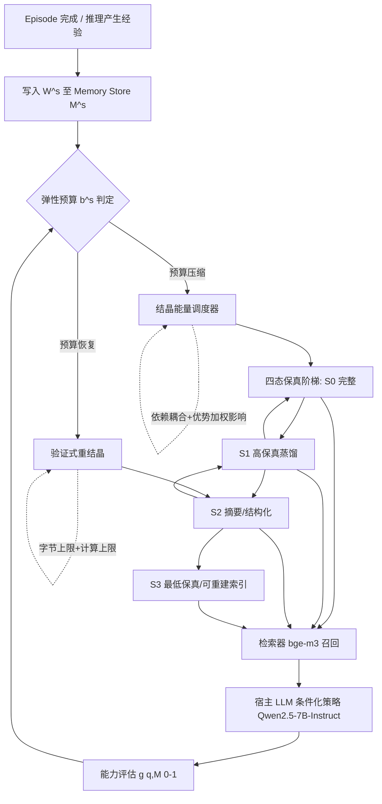

# CrystalMem：面向自演化 LLM Agent 的弹性记忆——基于知识结晶的实现

## 一、论文基础元数据
- 原文标题：CrystalMem: Elastic Memory for Self-Evolving LLM Agents via Knowledge Crystallization
- 中文译版：CrystalMem：面向自演化 LLM Agent 的弹性记忆——基于知识结晶的实现
- 发表渠道：arXiv 预印本（未见同行评审信息，等级待补充）
- 发表时间：2025 年（具体月份待补充）
- 链接：arXiv:2608.00303
- 作者及核心机构：Beining Wu, Jun Huang（所属机构待补充）
- 研究领域：一级领域——人工智能 / 大语言模型系统；二级子领域——LLM Agent 记忆管理、云服务资源调度、Agent 自演化
- 关联数据集：
  - MemoryAgentBench（SF、TTL 轨道，规模/语言/标注待补充）
  - LoCoMo（长上下文对话，规模待补充）
  - LongMemEval（LME，规模待补充）
  - ALFWorld（智能体控制）
  - WebArena（智能体控制）
  - SynDrift（合成漂移协议，流中淘汰事实）

## 二、论文综合评价

### 2.1 量化评分（1-5分，5分为最优）

| 评价维度 | 评分 | 备注 |
| -------- | ---- | ---- |
| 📚 理论基础 | ⭐⭐⭐⭐ | 形式化弹性预算模型，含残余缺陷下限证明 |
| 🎯 问题核心性 | ⭐⭐⭐⭐⭐ | 记忆滞后是云 Agent 存储计费的真实痛点 |
| 💡 方法创新性 | ⭐⭐⭐⭐ | 四态保真阶梯+结晶能量调度，突破二值范式 |
| ⚙️ 技术壁垒 | ⭐⭐⭐⭐ | 依赖耦合+验证式重结晶，工程复杂度较高 |
| 🧪 实验严谨性 | ⭐⭐⭐⭐ | 7环境×17方法×6骨干，协议完备但数据待补 |
| 🔧 落地可行性 | ⭐⭐⭐⭐ | 基于vLLM/A100/H100，宿主模型可直接替换 |
| 🚀 应用前景 | ⭐⭐⭐⭐ | 多租户云 Agent 与边缘-云场景均有价值 |
| 📊 综合评分 | 4.1 | 问题真实、理论扎实、方案自洽，但原始数值证据未在可见章节充分呈现 |

### 2.2 定性综合评价（≤300字）
> 本研究定位为自演化 LLM Agent 的外部记忆治理问题，聚焦云环境下字节预算动态压缩-恢复导致的“记忆滞后”现象。核心价值在于将传统“保留/丢弃”的二值记忆管理范式升级为可调度、可验证的多保真状态迁移，并给出残余缺陷下限的理论刻画，从信息论角度解释了不可逆遗忘的必然性。差异化优势体现在三重机制：四态保真度阶梯提供可逆降级路径、结晶能量调度按优势加权影响与依赖耦合排序降级、验证式重结晶在算力+字节双约束下恢复能力。关键结论表明该方法在 7 环境中恢复能力最优，残余缺陷比二元基线低一个数量级，并以一半字节匹配最强基线全量配置，四租户场景服务级违规亦低一个数量级。需注意：可见章节未呈现完整数值表格，结论多以定性形式给出。

## 三、领域本体论映射

| 核心维度 | 具体内容 |
| -------- | -------- |
| 核心研究对象 | 自演化 LLM Agent 的外部记忆存储（memory store / memory plane） |
| 核心技术路径 | 知识结晶：四态保真度迁移 + 结晶能量调度 + 验证式重结晶 |
| 数据/载体形态 | Agent 经验条目（轨迹、蒸馏技能、环境事实）及其多保真压缩表示 |
| 核心功能目标 | 在弹性字节预算路径上最大化平均能力，抑制记忆滞后与残余赤字 |
| 验证核心指标 | 恢复能力 C_m^S、滞后面积 Ĥ_m、残余赤字 D_m、再结晶比率、调度器时间占比 |

## 四、核心问题与解决方案

### 4.1 待解决的核心问题
1. **领域级根本问题**：
   在按量计费的云环境部署下，自演化 LLM Agent 的记忆存储预算会随成本控制、租户负载、定价事件动态波动（elastic budget）。当预算先压缩（squeeze）再恢复（recovery）后，Agent 能力无法回到压缩前水平，形成“记忆滞后”（memory hysteresis）与不可逆的残余能力赤字。
2. **现有方法痛点**：
   - **二值保留类 Π_b**（LRU、expiry、learned value governance 等）：条目要么原样保留要么丢弃，被丢弃信息仅当输入流再次提供才能重入 store。
   - **不可逆阶梯类**：允许有损变换替换条目，但状态转移单向——一旦降级永不重建。
   - 二者共同缺陷：squeeze step 本质是投影操作，预算收缩造成的遗忘不可逆，预算恢复后能力难以同步恢复；论文进一步证明任何仅“保留/丢弃”的策略都存在残余缺陷下限。
3. **工程落地卡点**：
   - 现有弹性服务栈（vLLM KV cache、sleep-time compute、governed shared memory）主要回收服务侧内存，未处理 Agent 经验存储的保真度双向调度。
   - 现有评估协议（MemoryAgentBench、Reclaim Eval、Neuromem）多在固定供给或单一退化点测量，无法观测预算恢复后能力是否回归。
   - 多租户场景下，公平切分二元存储会放大服务级违规。

### 4.2 核心解决方案
- **理论框架**：将记忆策略 π 形式化为 (M^s, W^s) → M^{s+1} 的映射，在每阶段字节预算 μ(M^s) ≤ b^s·B_0 约束下最大化路径平均能力；定义 elastic cycle b=(1,0.75,0.5,0.25,0.5,0.75,1)、S=7、squeeze phase (s∈{1..4})、recovery phase (s∈{4..7})、budget span Δ_b=0.75，并以 iso-budget 对齐所有策略。
- **核心架构**：结晶式记忆（crystallized memory），条目在四种保真状态间迁移，由“结晶能量”驱动调度，具备可逆性。
- **关键技术**：
  1. 可逆四态保真度阶梯；
  2. 结晶能量调度（降级排序依据：优势加权影响 + 依赖耦合）；
  3. 验证式重结晶（在明确计算上限与字节上限下恢复能力）。
- **创新机制**：以“计算换存储”——通过调度再结晶算力换取存储字节的弹性，使预算恢复期能力可回升，突破二元策略的残余缺陷下限。

### 4.3 核心优势（量化+定性）
1. **性能优势**：7 个环境中恢复能力 C_m^S 最高；残余能力缺陷 D_m 比所有二元基线低一个数量级；仅用一半字节预算即可匹配最强预算基线在全量配置下的表现（据结论章节陈述）。
2. **效率优势**：以“计算换存储”，每恢复 1 点能力的能耗约为重新经历底层体验的 1/5（物理边缘-云测试床）；再结晶比率（promotion tokens / stream inference tokens）与调度器墙钟占比被显式计量。
3. **工程优势**：与现有弹性服务栈（vLLM KV cache 等）为组合而非替代关系，可叠加部署；四租户运营点服务级违规比公平切分二元存储少一个数量级。

## 五、方法与技术架构

### 5.1 核心架构设计
> 文字描述：系统维持在 memory plane 上的 memory store M^s。每个阶段接收查询分布 D_m 并追加新写入 W^s；策略 π 需在字节预算 b^s·B_0 内决定条目的保真状态。当预算压缩时，调度器按“优势加权影响 + 依赖耦合”排序，将条目沿四态阶梯向下迁移；预算恢复时，验证式重结晶在算力/字节约束下将条目沿阶梯推送回高保真态，从而避免单向不可逆遗忘。

### 5.2 关键技术实现细节

| 技术模块 | 实现路径 | 工程注意事项 |
| -------- | -------- | ------------ |
| 四态保真度阶梯 | 条目在四种保真状态间可逆迁移 | 各状态编码/解码协议需统一，四态具体定义待补充 |
| 结晶能量调度 | 按“优势加权影响 + 依赖耦合”排序确定降级顺序 | 依赖图需增量维护，避免 O(N²) 更新开销 |
| 验证式重结晶 | 在明确计算上限与字节上限下推送条目回升 | 需预算重结晶 token 占比（promotion/stream tokens） |
| 弹性预算控制器 | 按 elastic cycle b=(1,0.75,0.5,0.25,0.5,0.75,1) 逐阶段下发预算 | 需严格 iso-budget 记账以保证可比性 |
| 检索与宿主推理 | bge-m3 检索 + vLLM 服务 Qwen2.5-7B-Instruct | temperature=0 保证可复现；A100/H100 资源配比 |
| 依赖组件 | vLLM 服务框架、A100/H100 GPU、bge-m3、Qwen2.5-7B-Instruct | 多骨干评估需 6 个 backbone 规模（Sec. V-D） |

### 5.3 架构优缺点
- **优点**：
  1. 可逆性设计直接针对“记忆滞后”根因，理论上可突破二元策略的残余缺陷下限；
  2. 与既有弹性服务栈解耦，作为记忆面治理层可组合部署；
  3. 显式计量再结晶比率与调度器时间占比，具备服务可观测性。
- **缺点**：
  1. 以算力换存储，重结晶期间的推理/调度开销上升，需权衡成本曲线；
  2. 依赖耦合图与四态编解码增加系统复杂度；
  3. 四态具体定义、重结晶触发条件与能量公式在可见内容中未展开（待补充）。

## 六、实验设计与结果分析

### 6.1 实验基础设置

| 维度 | 内容 |
| ---- | ---- |
| 数据集 | MemoryAgentBench（SF/TTL 轨道）、LoCoMo、LongMemEval、ALFWorld、WebArena、SynDrift，共 7 环境、4 类工作负载 |
| 基线方法 | 共 15 个，4 组：① keep-all、LRU、expiry、random drop；② Mem0、MemGPT、MaRS；③ A-MEM、MemoryOS、Human-Inspired irreversible ladder、R3Mem；④ CURATOR、A-MAC、RecMem、AgeMem |
| 实验环境 | vLLM 服务框架；A100、H100 GPU；宿主模型 Qwen2.5-7B-Instruct（temperature=0）；检索器 bge-m3；另在 Sec. V-D 评估额外 5 个 backbone 规模 |
| 评价指标 | 恢复能力 C_m^S、滞后面积 Ĥ_m、残差赤字 D_m（0-100 分，赤字以 pp 计）；再结晶比率=promotion tokens/stream tokens；调度器占阶段墙钟比例 |
| 统计种子 | 默认 5 个种子；成本前沿、最大 backbone 规模、多租户、部署研究用 3 个种子 |

### 6.2 核心实验结果

> 说明：可见章节仅给出定性结论，未报告具体数值；下表核心指标列按结论章节的定性表述填写，数值待补充。

| 方法 | 核心指标1（恢复能力 C_m^S） | 核心指标2（残余赤字 D_m） | 工程指标（算力/耗时） |
| ---- | --------- | --------- | -------------------- |
| 二元保留类基线（LRU/expiry/random drop 等） | 存在明显滞后 | 显著高于本文方法 | 待补充 |
| 单层摘要基线（Mem0/MemGPT/MaRS） | 待补充 | 高于本文方法 | 待补充 |
| 分层/阶梯基线（A-MEM/MemoryOS/R3Mem 等） | 待补充 | 高于本文方法 | 待补充 |
| 价值治理基线（CURATOR/A-MAC/RecMem/AgeMem） | 待补充 | 高于本文方法 | 待补充 |
| **CrystalMem（full / lite）** | **7 环境中最高** | **比所有二元基线低一个数量级** | 半字节预算匹配最强基线全量；每恢复 1 点能力能耗约 1/5 |

### 6.3 消融实验/鲁棒性分析

| 实验变体 | 指标变化 | 核心结论 |
| -------- | -------- | -------- |
| CrystalMem full（依赖耦合开启） vs lite（耦合关闭） | 待补充（数值未给出） | 通过 two configurations 对比检验依赖耦合的贡献 |
| 不同 backbone 规模（6 个，含 Sec. V-D 中 5 个） | 待补充 | 评估方法对骨干模型规模的泛化性 |
| 多租户（四租户运营点） | 服务级违规低一个数量级 | 弹性记忆对多租户公平性更鲁棒 |
| 边缘-云物理测试床 | 每恢复 1 点能力能耗约为重历体验的 1/5 | 计算换存储路径的能量效率优势 |
| 成本前沿（cost frontier） | 待补充 | 3 个种子下的成本-能力曲线评估 |

### 6.4 实验结论（工程视角）
从工程视角看，CrystalMem 通过四态保真调度在字节预算弹性波动下维持 Agent 能力，其结论体现出三点工程价值：①相同字节预算下能力衰减更小、恢复更快；②一半字节即可逼近最强基线全量配置，意味着同等能力下存储成本可大幅压缩；③在多租户与边缘-云拓扑下均报告了更优的服务级合规指标与能效比。需注意：可见内容未提供原始数值表格与统计显著性检验，具体性能提升幅度仍待原文图表校验。

## 七、领域贡献与创新点

| 贡献层级 | 具体内容 |
| -------- | -------- |
| 理论贡献 | 形式化弹性预算下的 Agent 记忆问题；证明任何仅“保留/丢弃”策略存在残余缺陷下限，从理论上论证不可逆遗忘的必然性 |
| 方法/架构贡献 | 提出知识结晶式记忆：四态保真度阶梯 + 结晶能量调度（优势加权影响 + 依赖耦合）+ 验证式重结晶，将二值决策升级为可调度、可验证、多保真状态迁移 |
| 数据/工具贡献 | 引入 SynDrift 合成漂移协议（流中淘汰事实）作为弹性预算评估场景；提出恢复能力 C_m^S、滞后面积 Ĥ_m、残余赤字 D_m 三循环指标与 iso-budget 协议 |
| 实验/验证贡献 | 在 7 环境、17 方法、6 骨干规模下开展对比，覆盖流式检索、长对话、智能体控制与合成漂移四类负载 |
| 工程落地贡献 | 与 vLLM/A100/H100 弹性服务栈组合；多租户与边缘-云测试床验证，量化再结晶比率与调度器时间占比等运维指标 |

## 八、局限性与风险

| 维度 | 具体描述 | 应对思路 |
| ---- | -------- | -------- |
| 学术局限性 | 可见章节未报告具体数值结果、统计显著性与完整消融数据；四态定义、能量公式等机制细节未在提供内容中展开 | 结合原文实验表格与附录核验；复现时明确定义状态转移与能量函数 |
| 工程落地风险 | “计算换存储”路径在预算频繁波动或算力紧张时，重结晶可能挤占推理资源；依赖耦合图维护成本随条目数增长 | 设置重结晶预算上限与优先级队列；增量维护依赖图，分片调度 |
| 伦理/合规风险 | Agent 经验可能包含用户隐私数据，四态压缩/重结晶过程需保证合规删除能力；“不可逆遗忘”与隐私删除义务需区分处理 | 引入合规删除通道作为第五态（彻底清除），并记录数据血缘 |
| 可复现性风险 | 依赖 bge-m3、Qwen2.5-7B-Instruct 等特定模型版本，temperature=0 但未见随机种子细节公开 | 待补充开源代码/配置以支撑复现 |

## 九、未来研究/落地方向

| 方向类型 | 具体内容 | 优先级 |
| -------- | -------- | ------ |
| 科研拓展 | 四态扩展至连续保真谱；结晶能量函数的最优性分析；残余缺陷下限的紧致性刻画 | 高 |
| 工程优化 | 重结晶调度与 vLLM 推理调度的联合优化；多租户配额与结晶优先级的协同策略；跨 region 记忆迁移 | 高 |
| 跨领域适配 | 将该弹性记忆机制迁移至边缘设备 Agent、车载/机器人长程任务、联邦多 Agent 场景 | 中 |
| 生态集成 | 与 KV cache 复用、sleep-time compute、governed shared memory 的端到端协同 | 中 |

## 十、关键词与术语表

| 语言 | 关键词 |
| ---- | ------ |
| 中文 | 弹性记忆、知识结晶、记忆滞后、四态保真度阶梯、结晶能量调度、验证式重结晶、残余赤字、弹性预算 |
| 英文 | Elastic Memory, Knowledge Crystallization, Memory Hysteresis, Four-state Fidelity Ladder, Crystallization Energy Scheduling, Verified Recrystallization, Residual Deficit, Elastic Budget |
| 领域专属术语 | **Memory Hysteresis（记忆滞后）**：预算压缩后恢复时能力不回归原水平的现象；**Elastic Cycle（弹性循环）**：b=(1,0.75,0.5,0.25,0.5,0.75,1)，S=7 的预算路径；**Iso-budget**：所有策略在同一预算路径与字节记账下比较；**Residual Deficit D_m（残余赤字）**：预算恢复后仍存在的能力缺口；**Hysteresis Area Ĥ_m（滞后面积）**：能力-预算回线的面积；**Memory Plane（记忆面）**：Agent 存储侧；**Squeeze/Recovery Phase**：s∈{1..4} 压缩段与 s∈{4..7} 恢复段；**Crystallization Ratio（再结晶比率）**：promotion tokens / stream inference tokens |

## 十一、参考文献与关联资源
- 核心参考文献：
  - MemoryAgentBench（检索、累积与选择性遗忘评测）
  - Reclaim Eval（损失性保留可能使 Agent 比无记忆更差）
  - Neuromem（流式生命周期分阶段分解）
  - Mem0、MemGPT、MaRS、A-MEM、MemoryOS、R3Mem、CURATOR、A-MAC、RecMem、AgeMem 等 15 个基线系统
- 补充阅读：vLLM KV cache 弹性管理、sleep-time compute、governed shared memory 相关弹性服务栈工作
- 开源代码/工具：待补充（论文未在提供内容中给出仓库链接）

## 十二、阅读者批注
1. **科研启发**：
   “记忆滞后”这一现象被形式化为能力-预算回线（hysteresis area）与残余赤字，并把记忆管理问题从工程启发式提升到可证明下限的层次，这一研究范式值得借鉴——即先证明现有方法类的理论极限，再给出突破该极限的机制。四态阶梯加能量调度的设计思路对缓存淘汰、数据湖分层存储等系统问题亦有迁移价值。
2. **工程落地思考**：
   落地时最关键的权衡是“重结晶触发的时延与算力占用”与“存储字节节省”的边际收益比。原文报告四租户下服务级违规低一个数量级，意味着该方案在多租户共享集群中可能具备实际商业价值。建议先在灰度租户上验证再结晶比率与调度器墙钟占比两项运维指标。
3. **待验证/存疑点**：
   - 可见章节未提供原始数值表格与统计显著性，结论均为定性表述；
   - “低一个数量级”与“一半字节匹配最强基线”的具体对比对象需核对原文图表；
   - 四态的具体表示与能量函数定义、重结晶的触发/终止条件均未在提供内容中给出；
   - 与 KV cache 层的协同机制仅说明为“组合关系”，细节待补充。
4. **个人/团队应用场景**：
   适用于按量计费的多租户 Agent 平台、边缘-云协同的长程任务 Agent（如巡检机器人）、需要跨 epilogue 累积技能的具身/桌面 Agent。

## 十三、阅读元信息

| 维度 | 内容 |
| ---- | ---- |
| 阅读日期 | 2026-09-30 22:33 |
| 阅读人 | xPaperReader AI |
| 文档编号 | arxiv-2608.00303 |
| 版本迭代 | v1.0 |