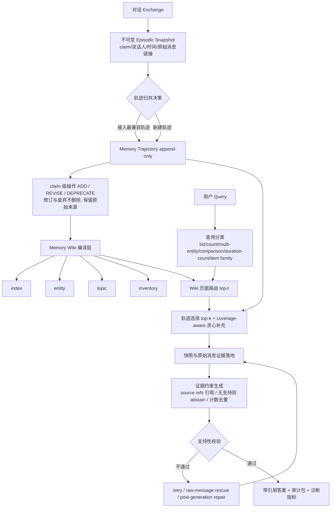

# TrajWiki：面向长时程对话智能体的来源锚定记忆轨迹

## 一、论文基础元数据
- **原文标题**：TrajWiki: Source-Grounded Memory Trajectories for Long-Horizon Dialogue Agents
- **中文译版**：TrajWiki：面向长时程对话智能体的来源锚定记忆轨迹
- **发表渠道**：arXiv 预印本（同行评审状态与会议/期刊等级：待补充）
- **发表时间**：2025 年（具体月份：待补充）
- **链接**：arXiv:2608.00967（DOI：待补充）
- **作者及核心机构**：Jingyu Sun, Yuyang Xue, Mingyang Li, Zhengtao Yao, Jiachen Li, Yang Cui, Wenhao Cai, Haozhe Liu, Fangying Wang, Magdalene Katharina Montgomery, Syed Murtuza Baker, Hongpeng Zhou（机构归属：待补充）
- **研究领域**：一级领域——人工智能/自然语言处理；二级子领域——LLM 智能体长期记忆（Long-Horizon Agent Memory）、检索增强生成（RAG）、对话系统
- **关联数据集**：
  | 数据集 | 规模 | 语言 | 标注 |
  | ------ | ---- | ---- | ---- |
  | LoCoMo | 待补充（超长开放域对话，含单跳/多跳/时序推理/开放域世界知识；排除 adversarial 类别以对齐 Mem0） | 待补充 | 问答对 + 金标参考（gold reference） |
  | MedMT-Bench | 待补充（医学长多轮对话，选取 LCMU、RCI、IC 三个子集） | 待补充 | rubric test-point（评分点） |

## 二、论文综合评价

### 2.1 量化评分（1-5分，5分为最优）

| 评价维度 | 评分 | 备注 |
| -------- | ---- | ---- |
| 📚 理论基础 | ⭐⭐⭐⭐ | 记忆演化与溯源理论扎实，范式整合性强 |
| 🎯 问题核心性 | ⭐⭐⭐⭐⭐ | 命中长期记忆"不可追溯、不可审计"真痛点 |
| 💡 方法创新性 | ⭐⭐⭐⭐ | 轨迹+Wiki 双层组织与分层路由组合新颖 |
| ⚙️ 技术壁垒 | ⭐⭐⭐ | 工程编排复杂，但原理可复现，无硬壁垒 |
| 🧪 实验严谨性 | ⭐⭐⭐ | 双基准双骨干，但缺精确数值表，代理指标偏多 |
| 🔧 落地可行性 | ⭐⭐⭐ | 强依赖结构化输出，构建期成本偏高 |
| 🚀 应用前景 | ⭐⭐⭐⭐ | 长程客服、医疗、合规审计场景明确 |
| 📊 综合评分 | 3.7 | 定位清晰、方向前沿；证据粒度与成本控制待补强 |

### 2.2 定性综合评价（≤300字）

> 本文定位为长时程对话智能体的**可追溯、可更新、可审计**记忆框架。核心价值在于把记忆从"静态可检索条目池"重新建模为"来源锚定的演化轨迹"，并将记忆演化（trajectory）与持久组织（Memory Wiki）显式解耦。差异化优势有三：其一，claim 级 ADD/REVISE/DEPRECATE 操作不删除历史，保留原始话语链接，使信念形成过程可检查；其二，Wiki 作为组织层而非证据层，禁止摘要替代源证据；其三，分层检索（query→wiki→trajectory→snapshot）配合 coverage-aware 贪心选择，将查询时候选轨迹从约 130.4 降至约 55.6。实验在 LoCoMo 与 MedMT-Bench 上、GPT-4o-mini/Qwen3-8B/Qwen3-32B 三类骨干下相对强记忆基线（含 Mem0）呈一致优势趋势，多跳与冲突检测子集提升最明显。关键结论：失败多发生在证据检索之后的答案合成与 grounding 阶段，而非检索本身。

## 三、领域本体论映射

| 核心维度 | 具体内容 |
| -------- | -------- |
| 核心研究对象 | 长时程（跨会话）对话智能体的长期记忆表示与调用 |
| 核心技术路径 | 来源可追溯记忆轨迹 + Memory Wiki 语义组织 + 分层检索与证据落地生成 |
| 数据/载体形态 | 不可变 episodic snapshot（claim/说话人/时间/原始消息链接）、append-only 轨迹、结构化 Wiki 页面（index/entity/topic/inventory）、源证据引用 |
| 核心功能目标 | 支持跨会话多跳聚合、时序推理、冲突检测与记忆修订，并提供可审计的诊断可见性 |
| 验证核心指标 | F1（canonical slot-value 语义匹配）、BLEU-1（clipped unigram precision，无 brevity penalty）、LLM-as-a-Judge、MedMT-Bench rubric test-point pass accuracy；诊断指标含 Gold Ref Coverage、Unsup Risk、冲突暴露率、废弃泄漏代理 |

## 四、核心问题与解决方案

### 4.1 待解决的核心问题

1. **领域级根本问题**：LLM 长期记忆普遍采用"写入/读取"范式，天然只回答"存什么、怎么取"，而无法回答"某个信念如何形成、哪些 claim 被修订或废弃、依据哪条原始话语"——即记忆的**演化过程与来源证据丢失**。
2. **现有方法痛点**：
   - 只保留当前记忆状态，缺乏来源可追溯的更新历史；
   - 记忆条目细粒度化后，扁平 RAG 式检索陷入碎片化，难以处理时间敏感、多跳、更新敏感查询；
   - 摘要式记忆虽压缩了上下文，但摘要不能充当答案证据（消融显示 Wiki Summaries Only 的 Gold Ref Coverage 为 0.000）。
3. **工程落地卡点**：
   - 强依赖结构化 LLM 输出，弱模型下回退与修复开销大（记录约 2,562 次额外调用、26.93M 额外 token、23.90M ms 延迟）；
   - 摘要抽象引发**显著性漂移（salience drift）**：来源中存在的关键事实（如案例中的"pottery"）在 snapshot/trajectory/wiki 抽象后不再突出，最终未被答案支持；
   - "provenance-aware"不等于"provenance-perfect"，诊断指标多为代理指标，缺乏人类校验的审计准确率。

### 4.2 核心解决方案

- **理论框架**：将长期记忆视为**演化的、源证据扎根的结构**，而非扁平检索池；显式分离"记忆演化"与"持久组织"两条职责。
- **核心架构**：三层结构——① 来源可追溯记忆轨迹；② Memory Wiki 组织层；③ 分层检索与证据落地生成。
- **关键技术**：
  - exchange→不可变 episodic snapshot，append-only 轨迹，新快照接入最兼容轨迹或新建轨迹；
  - claim 级 `ADD` / `REVISE` / `DEPRECATE` 操作，废弃与修订不删除、保留原始来源；
  - Wiki 页面编译（index / entity / topic / inventory，含 overview、key facts、items/counts、linked trajectories、conflicts/uncertainty）；
  - 查询分类路由（list、count、multi-entity、comparison、duration-count、item family）；
  - 检索评分融合 dense + sparse + RRF + LLM rerank，并以 coverage-aware 贪心补足互补轨迹；
  - 生成期强约束：答案引用必须来自检索上下文可见 source refs，无有效支持则 abstain，计数答案过滤重复、未来/计划与不确定事件。
- **创新机制**：Wiki 只做组织不做证据（防止摘要替代源证据）；retry + raw-message rescue + post-generation repair 的生成后修复闭环；审计包构建。

### 4.3 核心优势（量化+定性）

1. **性能优势**：在 LoCoMo（多跳、时序推理）与 MedMT-Bench（尤其 Information Contradiction 子集）上，对 GPT-4o-mini、Qwen3-8B、Qwen3-32B 三类骨干相对多数强记忆基线（含 Mem0）呈一致优势趋势（注：分析片段未提供具体 F1/BLEU 数值表，仅能确认相对趋势）。
2. **效率优势**：32K 预算下候选集由 130.4 降至 55.6（约 2.35× 缩减），上下文由 25.6K 降至 2.7K；审计包平均源数由 594.7 降至 195.1，token 由 20.33K 降至 11.34K。
3. **工程优势**：废弃 claim 抑制率达 1.000、冲突暴露率 0.535，记忆修订与冲突可显式诊断；失败可分类定位（unsupported overgeneration 47.2%、answer synthesis error 27.0%、trajectory selection miss 9.9%、page routing miss 4.3%、correct 11.3%），便于工程侧定向优化。

## 五、方法与技术架构

### 5.1 核心架构设计

> 整体流程：对话流经快照化与轨迹归并形成 append-only 记忆轨迹；轨迹被编译为互链的 Memory Wiki 页面；查询先分类，再经 wiki 路由→轨迹选择→快照/原始消息扩展完成证据落地；生成阶段施加 source ref 引用约束、拒答与计数过滤，并在失败时触发修复闭环，最终产出带引用的答案与审计包。

### 5.2 关键技术实现细节

| 技术模块 | 实现路径 | 工程注意事项 |
| -------- | -------- | ------------ |
| 快照化与轨迹归并 | 每次 exchange 抽取 claim，附带说话人、时间、原始消息链接，生成不可变快照；按兼容性接入既有轨迹或新建轨迹 | 依赖结构化 LLM 抽取，弱模型需回退策略；轨迹长度上限 m 需调参（m=10 后边际收益递减，m=15 覆盖长尾） |
| claim 级记忆操作 | `ADD` / `REVISE` / `DEPRECATE` 三操作，历史保留不物理删除 | 废弃 claim 需在下游检索中可靠抑制（实测抑制率 1.000，泄漏代理 0.128） |
| Memory Wiki 编译 | 生成 index/entity/topic/inventory 页面，含 overview、key facts、items/counts、linked trajectories、conflicts/uncertainty | Wiki 仅为组织层，严禁作为答案证据（Wikis-only 的 Gold Ref Cov 为 0.000） |
| 分层检索路由 | 查询分类 → wiki 页面路由（top-t）→ 轨迹选择（top-k）→ 快照/源消息扩展；评分融合 dense+sparse+RRF+LLM rerank | t=15 为实用折中，t=20 覆盖更高但候选集膨胀；k 增大提升金标轨迹覆盖率同时引入噪声 |
| 互补轨迹补齐 | coverage-aware 贪心选择 | 需权衡上下文预算与覆盖率，32K 预算下实测 Ctx 仅 2.7K |
| 证据约束生成 | 仅用检索证据作答；引用必须为上下文可见 source refs；无支持则 `can_answer=false` 并 abstain；保留源术语；时间需锚定；仅计 distinct completed events；输出结构化 JSON | 计数需过滤重复、未来/计划、不确定事件；输出为结构化 JSON，解析失败需修复通道 |
| 修复与审计 | retry、raw-message rescue、post-generation repair；生成审计包 | 修复开销显著（约 2,562 次额外调用、26.93M token、23.90M ms 延迟） |
| 依赖组件 | 骨干：GPT-4o-mini / Qwen3-8B / Qwen3-32B；Embedding：Qwen3-Embedding-8B；稠密+稀疏检索、RRF、LLM reranker | 多组件串联，端到端延迟与 token 成本需按查询量摊销评估 |

### 5.3 架构优缺点

- **优点**：
  1. 来源可追溯与不可变快照使记忆演化可检查、可审计，claim 级修订语义清晰；
  2. Wiki 组织层显著压缩检索搜索空间（候选 130.4→55.6），同时明确禁止摘要充当证据，避免"摘要幻觉"；
  3. 生成期 source ref 约束 + abstain 机制提升答案可核查性；
  4. 诊断指标丰富（冲突暴露、废弃抑制/泄漏、支持性代理），失败可归因到具体阶段。
- **缺点**：
  1. 记忆构建期成本集中在证据组织而非生成（GPT-4o-mini/LoCoMo 上 43.28M deployment tokens，其中构建 23.71M、检索 10.84M、生成 6.92M）；
  2. 强依赖结构化 LLM 输出，弱骨干下回退/修复开销大；
  3. 摘要抽象可能造成显著性漂移，导致来源中存在的事实最终未被答案支持；
  4. 诊断指标多为代理指标，未给出人类验证的审计准确率；端到端精确性能数值在分析片段中缺失。

## 六、实验设计与结果分析

### 6.1 实验基础设置

| 维度 | 内容 |
| ---- | ---- |
| 数据集 | LoCoMo（长期对话记忆 QA：单跳、多跳、时序推理、开放域/世界知识；排除 adversarial 类别以对齐 Mem0）；MedMT-Bench（医学长多轮对话，选取 LCMU、RCI、IC 子集） |
| 基线方法 | Full Context、Naive RAG（session 级 / turn 级）、LangMem、A-MEM、Mem0（最强记忆基线） |
| 实验环境 | 骨干：GPT-4o-mini、Qwen3-8B、Qwen3-32B；Embedding：Qwen3-Embedding-8B（硬件与训练/推理环境：待补充） |
| 评价指标 | F1（canonical slot-value 语义匹配，允许词形/标点/冠词/良性修饰/别名软匹配，数字/颜色/人名/对比性修饰严格）；BLEU-1（canonical 文本 clipped unigram precision，无 brevity penalty）；严格 LLM-as-a-Judge；MedMT-Bench rubric test-point pass accuracy；诊断类代理指标（Gold Ref Cov、Unsup Risk 等） |

### 6.2 核心实验结果

| 方法 | 核心指标1 | 核心指标2 | 工程指标（算力/耗时） |
| ---- | --------- | --------- | -------------------- |
| Full Context | 待补充（相对较弱） | 待补充 | 上下文开销大，未给出具体数值 |
| Naive RAG（session/turn） | 待补充 | 待补充 | 待补充 |
| LangMem / A-MEM | 待补充 | 待补充 | 待补充 |
| Mem0（最强基线） | 待补充（被 TrajWiki 超越） | 待补充 | 待补充 |
| **TrajWiki（本文）** | 在 LoCoMo 与 MedMT-Bench 上对多数基线呈一致优势；多跳与 Information Contradiction 子集提升最明显 | 时序推理亦有优势但幅度较小；MedMT-Bench 整体优势更大 | GPT-4o-mini/LoCoMo：43.28M deployment tokens（构建 23.71M + 检索 10.84M + 生成 6.92M）；候选轨迹 130.4→55.6 |

> 说明：实验分析片段未提供精确的 F1/BLEU 数值表，故上表仅呈现可确认的相对趋势与已披露的工程指标，不臆造具体分数。

### 6.3 消融实验/鲁棒性分析

| 实验变体 | 指标变化 | 核心结论 |
| -------- | -------- | -------- |
| Full TrajWiki（32K 预算） | 候选 55.6；Gold Ref Cov 0.610；Gold Traj R@15 0.610；Ctx 2.7K；Unsup Risk 0.645 | 作为完整方案基线，覆盖与风险取得最优平衡 |
| Direct Trajectory Retrieval（跳过 Wiki 路由） | 候选升至 130.4；Gold Ref Cov 降至 0.356；Ctx 升至 25.6K；Unsup Risk 升至 0.872 | 缺少 Wiki 路由导致候选膨胀、上下文浪费、不可支持风险上升 |
| Wiki Summaries Only | Gold Ref Cov 0.000 | Wiki 摘要不能充当答案证据，印证"组织层≠证据层"的设计约束 |
| Flat Raw-Memory Retrieval | 候选 594.7；Gold Ref Cov 0.237；Unsup Risk 0.918 | 扁平原始记忆检索碎片化严重，证据落地最差 |
| 超参 t（路由 Wiki 页数） | t=15 为实用折中；t=20 覆盖更高但候选集更大 | 路由广度与候选成本存在权衡 |
| 超参 k（选择轨迹数） | k 增大提升 gold trajectory 覆盖率，同时引入更多噪声 | 证据深度需与噪声控制平衡 |
| 超参 m（最大轨迹长度） | m=10 后边际收益递减，m=15 覆盖长尾 | 多数查询只需浅层轨迹，长尾需求驱动更长轨迹 |
| 语义漂移分析 | 多数非单例轨迹保持中高首尾相似度；长轨迹首尾相似度较低但相邻更新稳定 | 轨迹表征渐进式记忆演化，而非任意聚合；漂移可测量、可审计 |
| 审计包效率 | 平均源数 594.7→195.1；token 20.33K→11.34K | 来源锚定组织可显著压缩审计证据体积 |

### 6.4 实验结论（工程视角）

1. **收益来源可归因**：性能提升主要来自两条机制——轨迹级记忆保留 claim 演化（避免状态覆盖），Wiki 路由降低检索碎片化（候选缩减约 2.35×）。
2. **成本结构前置**：开销集中在记忆构建与证据组织（23.71M/43.28M tokens），而非最终生成（6.92M）；在长期、多查询智能体场景中可通过后续查询摊销，但短会话/一次性问答场景性价比需谨慎评估。
3. **瓶颈在生成而非检索**：检索到金标参考覆盖 0.615，但答案支持金标覆盖仅 0.332；失败分布中 unsupported overgeneration（47.2%）与 answer synthesis error（27.0%）合计占主导，检索侧问题（trajectory selection miss 9.9% + page routing miss 4.3%）占比有限——优化重心应放在答案合成与支持性约束，而非继续堆叠检索。
4. **可审计性是显性交付物**：冲突暴露率 0.535、废弃 claim 抑制率 1.000、废弃泄漏代理 0.128，说明修订历史可被可靠追踪与抑制；但需注意这些为代理指标，尚未经人类验证。
5. **鲁棒性边界**：结构化输出依赖与修复通道在弱骨干下成本陡增（约 2,562 次额外调用），生产部署需设置调用预算上限与降级策略。

## 七、领域贡献与创新点

| 贡献层级 | 具体内容 |
| -------- | -------- |
| 理论贡献 | 将长期对话记忆从"静态可检索条目"重构为"来源锚定、可演化、可审计的过程"，并明确区分"记忆演化"与"持久组织"两类职责 |
| 方法/架构贡献 | TrajWiki 三层框架：不可变 episodic snapshot + append-only 记忆轨迹 + Memory Wiki 组织层；claim 级 ADD/REVISE/DEPRECATE 且不删除历史；分层检索（query→wiki→trajectory→snapshot）与 coverage-aware 贪心补齐 |
| 数据/工具贡献 | 暂无公开数据集或工具发布的明确信息（待补充）；构建了基于 LoCoMo 与 MedMT-Bench 的记忆评测与诊断流程 |
| 实验/验证贡献 | 在两大基准、三类骨干（GPT-4o-mini/Qwen3-8B/Qwen3-32B）与五类基线（Full Context、Naive RAG、LangMem、A-MEM、Mem0）上系统验证；提供语义漂移分析、超参扫描与成本量化 |
| 工程落地贡献 | 提供 source ref 引用约束、abstain 拒答、计数过滤（重复/未来/计划/不确定）与生成后修复闭环；审计包将源数压缩至 195.1、token 压缩至 11.34K；给出可归因的失败分类体系 |

## 八、局限性与风险

| 维度 | 具体描述 | 应对思路 |
| ---- | -------- | -------- |
| 学术局限性 | 摘要抽象导致显著性漂移（案例中"pottery"事实存在于来源却未被答案支持）；诊断指标为代理指标，非人类验证的审计准确率；分析片段未给出完整精确数值表，跨基准可比性受限 | 引入来源显著性保真约束；补充人工审计标注与误差分析；公开完整指标表与显著性检验 |
| 工程落地风险 | 强依赖结构化 LLM 输出，弱模型下回退/修复开销大（约 2,562 次额外调用、26.93M token、23.90M ms 延迟）；构建期 token 成本高（23.71M/43.28M）；多组件串联增加延迟与故障面 | 采用强骨干做构建、弱骨干做查询的非对称配置；设置调用/延迟预算与降级路径；对构建做离线批处理与缓存复用 |
| 伦理/合规风险 | 长期记忆涉及个人隐私与敏感对话（尤其 MedMT-Bench 医疗场景）；不可变快照与完整来源保留可能加剧数据留存与"被遗忘权"冲突；记忆修订/废弃若被滥用可能造成叙事操控；引用约束失效时可能输出无依据结论（unsupported-answer risk 0.610） | 建立可验证的删除/脱敏流程与访问审计；对医疗等高风险域保留人工复核；强制 abstain 与引用校验作为合规红线 |

## 九、未来研究/落地方向

| 方向类型 | 具体内容 | 优先级 |
| -------- | -------- | ------ |
| 科研拓展 | 提升摘要与轨迹抽象的显著性保真度，抑制 salience drift；开发人类验证的溯源审计指标替代代理指标；研究答案合成阶段的支持性判定与 grounded decoding | 高 |
| 工程优化 | 降低记忆构建 token 与调用成本（增量编译、页面增量更新、缓存）；压缩修复闭环开销；主干/查询侧异构骨干配置；优化 t/k/m 自适应调度 | 高 |
| 跨领域适配 | 向医疗（MedMT-Bench 已验证迁移性）、法律合规、长周期客服/个人助理等强约束多会话场景扩展；扩展至多模态会话记忆与多智能体共享记忆 | 中 |

## 十、关键词与术语表

| 语言 | 关键词 |
| ---- | ------ |
| 中文 | 长期记忆、记忆轨迹、来源锚定、可追溯性、可审计性、记忆演化、分层检索、证据落地、冲突检测、显著性漂移 |
| 英文 | Long-Horizon Dialogue Agents, Long-Term Memory, Memory Trajectory, Source-Grounded, Provenance, Auditability, Memory Wiki, Hierarchical Retrieval, Evidence Grounding, Abstention |
| 领域专属术语 | **Episodic Snapshot（情节快照）**：由单次对话 exchange 抽取的不可变记忆单元，含 claim、说话人、时间与原始消息链接。 **Memory Trajectory（记忆轨迹）**：append-only 的快照序列，表征某一记忆线索随时间的演化。 **Memory Wiki**：轨迹编译成的结构化互链页面层（index/entity/topic/inventory），仅作组织，不作证据。 **ADD / REVISE / DEPRECATE**：claim 级记忆操作，修订与废弃保留历史、不物理删除。 **Coverage-aware Greedy Selection（覆盖感知贪心选择）**：在预算内优先补齐互补证据轨迹的选择策略。 **RRF（Reciprocal Rank Fusion）**：多路检索结果融合排序方法。 **Salience Drift（显著性漂移）**：摘要/抽象后，来源中原本存在的关键事实在表示层不再突出，导致未被答案支持。 **Unsup Risk / Unsupported-Answer Risk**：生成的答案缺乏检索上下文支持的风险代理指标。 **Abstain**：证据不足时主动拒答，输出 `can_answer=false`。 |

## 十一、参考文献与关联资源

- **核心参考文献**：待补充（分析片段未列出具体引用；文中明确对标与对比的工作包括 Mem0、A-MEM、LangMem、Naive RAG、Full Context）
- **补充阅读**：LoCoMo 基准、MedMT-Bench 基准原始论文；长期对话记忆与 RAG 相关综述（具体条目待补充）
- **开源代码/工具**：待补充（分析片段未披露代码仓库或工具链接）

## 十二、阅读者批注

1. **科研启发**：把"记忆的更新历史"作为一等公民而非副产物，是本文最值得迁移的思想。"组织层不得充当证据层"这一约束（Wikis-only Gold Ref Cov = 0.000）对任何采用摘要压缩的 RAG/记忆系统都构成通用警示：压缩与证据必须解耦。
2. **工程落地思考**：成本结构显示瓶颈在**构建期**而非推理期，因此落地前必须做"查询量摊销测算"——低查询频次场景可能不划算。另一方面，失败分布显示 74.2% 的问题出在答案合成与支持约束，意味着在检索侧继续投入的边际收益有限，应优先建设 grounded decoding 与引用校验。异构骨干（强模型构建、轻模型查询）是现实可行的降本路径。
3. **待验证/存疑点**：① 所有性能对比仅有"一致优于多数基线"的趋势性表述，缺少 F1/BLEU 精确数值与显著性检验，无法判断提升幅度与稳定性；② 冲突暴露率 0.535、废弃抑制率 1.000、支持性 0.390 等均为**代理指标**，其与人类判定的相关性未验证；③ "provenance-aware ≠ provenance-perfect" 的自述提示溯源链可能仍有断点；④ 超参 t/k/m 的最优组合是否随领域（开放域 vs 医疗）变化，未见跨域敏感性分析；⑤ 摊销优势依赖长期多查询场景，其临界查询频次未量化。
4. **个人/团队应用场景**：适合需要"结论可回溯到原始发言"的场景——如医疗多轮问诊记录（冲突检测与用药史修订）、企业长周期客户档案、合规与审计型对话助手。不建议用于一次性 QA 或超低查询频次的轻量场景（构建成本难以摊销）。

## 十三、阅读元信息

| 维度 | 内容 |
| ---- | ---- |
| 阅读日期 | 2026-09-30 22:35 |
| 阅读人 | xPaperReader AI |
| 文档编号 | arxiv-2608.00967 |
| 版本迭代 | v1.0 |