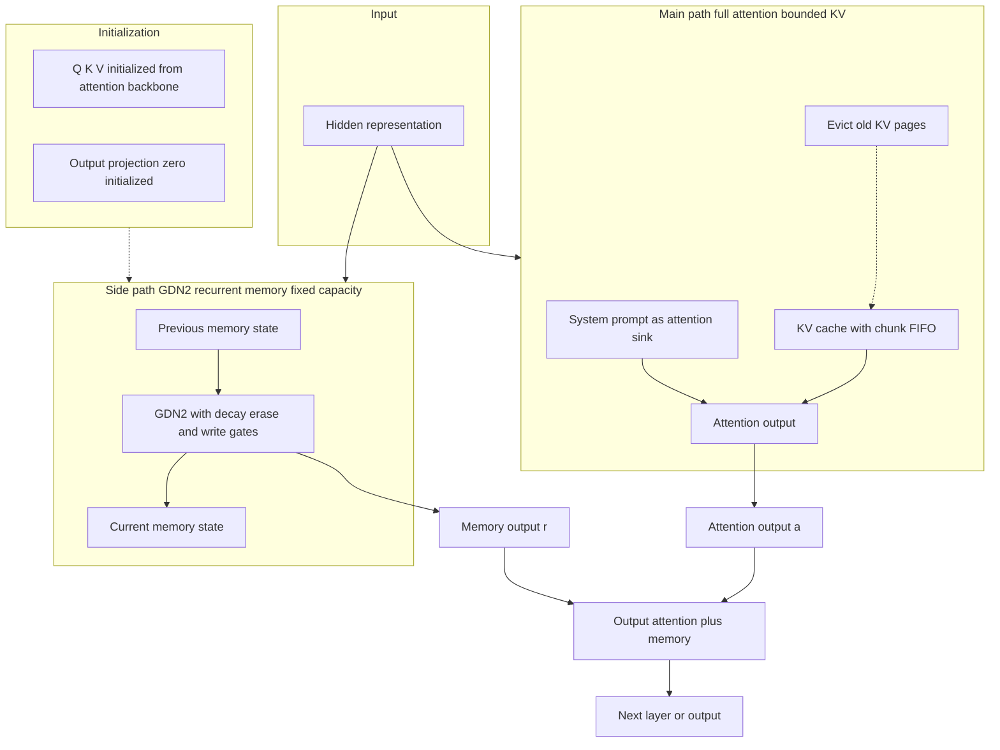

# LiveMem：在长时运行 LLM 推理中维持记忆状态连续性

> **说明**：本简报基于所提供的分组分析材料（overview / method / conclusion）撰写。原文的完整实验数值表、实验环境配置、机构信息等未在材料中披露，相关字段一律标注为「待补充」，不做推测性填充。

## 一、论文基础元数据

| 字段 | 内容 |
| ---- | ---- |
| **原文标题** | LiveMem: Maintaining Memory State Continuity in Long-Running LLM Inference |
| **中文译版** | LiveMem：在长时运行 LLM 推理中维持记忆状态连续性 |
| **发表渠道** | arXiv 预印本（会议/期刊等级待补充，材料中未标注投稿或录用信息） |
| **发表时间** | 2025 年（具体月份待补充） |
| **链接** | arXiv ID: 2608.02515（DOI 待补充） |
| **作者** | Zhichen Liu, Ruihan Sun, Hengjie Yang, Zipeng Wu, Zhaohan Chen, Xiaofan Zhang, Yang Xu |
| **核心机构** | 待补充（材料中未提供作者单位信息） |
| **研究领域** | 一级：人工智能 / 自然语言处理；二级：大语言模型长上下文建模与推理记忆机制 |
| **关联数据集** | 见下表 1-1 |

**表 1-1 关联数据集明细**

| 数据集 | 任务类型 | 规模 | 语言 | 标注形式 |
| ------ | -------- | ---- | ---- | -------- |
| 2WikiMultiHopQA | 多跳问答 | 待补充 | 英文 | 待补充 |
| LoCoMo | 长对话问答 | 待补充 | 英文 | 待补充 |
| LongMemEval | 长期记忆评测 | 待补充 | 英文 | 待补充 |
| Banking77 | 意图分类 | 待补充 | 英文 | 类别标签 |
| ∞Bench (∞Bench-QA) | 长上下文基准 | 待补充 | 英文（含子集） | 待补充 |
| NarrativeQA | 长文档叙事问答 | 待补充 | 英文 | 待补充 |
| TREC-F (TREC Fine-grained) | 问题分类 | 待补充 | 英文 | 类别标签 |
| EventQA | 事件问答 | 待补充 | 英文 | 待补充 |
| TTL / Conversation QA / Long QA | 长时任务族 | 待补充 | 英文 | 待补充 |

> 注：作者自建/复用的训练数据课程（长文本 QA 冷启动集 + 重平衡混合集）规模与构造细节材料中未披露，标注为待补充。

---

## 二、论文综合评价

### 2.1 量化评分（1-5 分，5 分为最优）

| 评价维度 | 评分 | 备注 |
| -------- | ---- | ---- |
| 📚 理论基础 | 4 | 形式化 state continuity，理论框架清晰但非全新范式 |
| 🎯 问题核心性 | 5 | 直击长时 Agent/对话的记忆断层核心痛点 |
| 💡 方法创新性 | 4 | 并行 GDN2 记忆侧路 + 记忆导向后训练，组合创新突出 |
| ⚙️ 技术壁垒 | 4 | 侧路全参训练、RL 后训练与状态感知服务三重工程门槛 |
| 🧪 实验严谨性 | 4 | 多数据集+消融+负结果披露，但数值细节材料缺失 |
| 🔧 落地可行性 | 4 | 冻结 backbone 后训练，paged KV 兼容，落地路径明确 |
| 🚀 应用前景 | 4 | 长时对话/Agent 场景明确，需与 RAG 协同 |
| 📊 **综合评分** | **4.1** | 问题定位准、工程完整度高，但受限于有损压缩与精确召回短板 |

> 综合评分 = 前 7 项数值均值 (4+5+4+4+4+4+4)/7 ≈ 4.1。

### 2.2 定性综合评价（≤300 字）

> LiveMem 将长时 LLM 推理的缺失能力精确定义为 **context turnover 下的 state continuity**——即当旧 KV 被逐出活动上下文后，模型仍能通过一个固定容量的内在记忆状态持续承载并利用历史信息。其核心方案是在预训练全注意力 LLM 的每一层并行挂载 GDN2 循环记忆侧路，输出加回注意力结果，并以零初始化输出投影保证初始等价原模型；训练上采用「长文本 QA 冷启动 + 重平衡数据」的课程式 SFT 与 GRPO/DAPO 强化学习后训练，服务侧配套 paged KV 与独立循环状态槽位。
>
> 差异化优势在于：与 RAG/外部记忆系统相比，它是**内在、潜在、查询无关**的状态；与 KV 驱逐相比，它承载的是信息而非 token；与 IndexMem 相比，它面向**未来查询未知**的生命周期连续性。关键结论是：证据被完全移出上下文后，LiveMem 在 LongMemEval 上可高于无历史方法 10 个百分点以上，但 NIAH 实验表明其本质是**有损状态压缩**而非精确档案库。

---

## 三、领域本体论映射

| 核心维度 | 具体内容 |
| -------- | -------- |
| **核心研究对象** | 长时运行 LLM 在上下文轮换（context turnover）后的内在记忆状态 \(M_t\) 及其连续性 |
| **核心技术路径** | 全注意力主干 + 每层并行 GDN2 循环记忆侧路；记忆导向 SFT/RL 后训练；状态感知推理服务 |
| **数据/载体形态** | 有界 KV 缓存（chunk FIFO 逐出，保留系统指令作为 attention sink）+ 固定容量循环状态 \(S_t^\ell\)（分页槽位存储） |
| **核心功能目标** | 在源 token 离开注意力窗口后，记忆状态仍随输入在线更新、跨上下文切换持续、并能实际影响后续预测 |
| **验证核心指标** | 2Wiki-MQ、LoCoMo、LME-S、Banking、TREC-F、∞Bench-QA、EventQA；辅以 LongMemEval 证据距离/移出比例分析、NIAH 负结果 |

---

## 四、核心问题与解决方案

### 4.1 待解决的核心问题

1. **领域级根本问题**
   长时运行 LLM 的累计 token 消耗远超有限上下文窗口。当工作上下文发生轮换（context turnover）时，注意力状态 \(C_t\) 随窗口滑出而丢失，模型只能依赖检索或摘要**重建**历史，而无法维持一个跨生命周期连续的推理状态。论文将这一缺失能力形式化为 **state continuity under context turnover**。

2. **现有方法痛点**
   - **KV 保留/驱逐类方法**（StreamingLLM、H2O、SnapKV、InfLLM 等）：只解决"保留哪些 token 的 KV"，旧 KV 一旦离开注意力即彻底不可见，不提供承载其信息的持续状态。
   - **检索/外部记忆类方法**（RAG、MemoryBank、MemGPT、Mem0、A-Mem、MemOS 等）：本质是**访问选定历史**，是显式文本/向量存取，无法在上下文切换后提供持续、固定、查询无关的内在状态；且读取与"读取后如何保持连贯"是两件事，前者被充分研究，后者被忽视。
   - **IndexMem**：query-aware 的 KV 保留，在 NIAH 类任务上有天然优势，但无法应对"未来查询未知"的长期生命周期场景。
   - **δ-Mem 等基线**：评估路径仍会截断超出预算的历史，不能保证被逐出信息在新查询下仍具行为效用。

3. **工程落地卡点**
   - 记忆状态与请求绑定：若循环状态跨请求泄漏，将造成状态污染，需要独立的生命周期管理。
   - 训练-推理一致性：训练时的 chunk turnover 与动态 attention mask 必须与在线服务行为严格对齐，否则记忆分支学到的是分布外行为。
   - 侧路训练对参数化方式敏感：LoRA 因 Attention 与 GDN2 分布差距大而效果不佳，意味着推理侧需要承担全参数侧路的显存与调度开销。

### 4.2 核心解决方案

- **理论框架**
  将长时推理中的状态演化形式化为记忆状态转移：
  \[
  M_{t+1}=U_\phi(M_t, X_{t+1}),\qquad y_t \sim p_{\theta,\phi}(y_t \mid C_t, M_t)
  \]
  并给出 "Living memory state" 三条件：(1) 随输入在线更新；(2) 上下文切换后仍持续；(3) 关键信息能影响后续行为，即使证据已完全移出上下文。

- **核心架构**
  - **主路径**：全注意力，保留有界 KV 窗口，按 chunk 做 FIFO 逐出，仅保留系统指令作为 attention sink 与当前上下文 \(C_t\)。
  - **侧路径**：每层 decoder layer 附加一个 GDN2 循环记忆分支，读取同一隐藏表示，输出直接加回注意力输出：
    \[
    a_t^\ell=\mathrm{Attn}_\ell(h_{\le t}^\ell;C_t),\quad
    (r_t^\ell,S_t^\ell)=\mathrm{GDN2}_\ell(h_t^\ell,S_{t-1}^\ell),\quad
    o_t^\ell=a_t^\ell+r_t^\ell
    \]
  - 侧路 q/k/v 从注意力 backbone 初始化，输出投影**零初始化**，使模型初始行为严格等价于原始预训练模型，随后逐步学习"开启"侧路。

- **关键技术**
  1. **GDN2 门控循环记忆**：状态含 decay、erase、write gate，按 token 实时读写与遗忘，实现固定容量的信息写入。
  2. **记忆导向后训练**：冻结 backbone，训练记忆分支（也探索 LoRA 与主路径 LoRA 作对照）。
  3. **SFT**：答案 token 交叉熵；先以长文档 QA 激活侧路，再混合 QA/分类/多查询任务。
  4. **RL**：GRPO + DAPO 技巧，8 响应一组、动态采样，奖励 = 准确率 + 全对 bonus − 格式惩罚，并引入 LM judge 辅助判定。
  5. **状态感知服务**：paged KV 管理、旧 KV 页释放；循环状态使用独立分页槽位，请求结束即释放，防止跨请求状态泄漏。

- **创新机制**
  **训练-推理一致性范式**：训练与服务均使用 chunk turnover 与动态 attention mask，使"信息被逐出"这一事件在训练期就被反复暴露给循环容量，从而让记忆状态真正承担生命周期记忆负担，而非退化为普通的位置编码补充。

### 4.3 核心优势（量化+定性）

1. **性能优势**
   - LiveMem-RL 在报告数据集上**全部提升**；LiveMem-SFT 除 LongMemEval 外多数提升。
   - LongMemEval 关键证据移出分析中，当证据完全或部分离开活动上下文时，LiveMem 可**高于无历史方法 10 个百分点以上**。
   - 证据距离增大时准确率虽略降但整体稳定，说明记忆状态可**跨多个 turnover** 保留可用信息。

2. **效率优势**
   - 记忆状态为**固定容量**，不随历史长度线性增长，推理内存上界可控。
   - 旧 KV 页可主动释放，配合 paged KV 管理降低长时服务的缓存压力（具体吞吐/显存降幅数值待补充）。

3. **工程优势**
   - 冻结 backbone 只训练侧路，**不破坏预训练模型既有能力**，零初始化保证初始等价性，回滚与灰度成本低。
   - 训练与服务共享 chunk turnover 与 attention mask 语义，**训练-推理行为对齐**，减少上线后的性能回退。
   - 循环状态独立分页与请求级释放，天然规避**跨请求状态泄漏**这一类隐蔽的线上事故。

---

## 五、方法与技术架构

### 5.1 核心架构设计

LiveMem 的架构本质是**双路径并行**：预训练全注意力主干提供精确的局部/当前上下文推理能力，每层并行挂载的 GDN2 循环侧路提供跨上下文的固定容量记忆。主路径的 KV 按 chunk FIFO 逐出；被逐出的 token 虽不再可见于注意力，但其信息已在逐出前被写入循环状态 \(S^\ell_t\)，并随每个新 token 在线更新。所有侧路输出通过零初始化的输出投影加回主干，实现"从恒等映射出发、渐进启用记忆"的训练稳定性设计。

**状态流转要点**：
- 每个 token 到来时，主路径与侧路径**同步消费同一隐藏表示**；
- 主路径受窗口约束，侧路径不受窗口约束（仅受状态容量约束）；
- 侧路径状态 \(S^\ell_t\) 的生命周期**独立于当前活动上下文 \(C_t\)**，这正是 "state continuity" 的架构落点。

### 5.2 关键技术实现细节

| 技术模块 | 实现路径 | 工程注意事项 |
| -------- | -------- | ------------ |
| **GDN2 记忆侧路** | 每层附加 GDN2 分支，q/k/v 由注意力 backbone 初始化，输出投影零初始化；输出加回注意力输出 | 零初始化是训练稳定的关键；需保证侧路与主干在同一精度/并行策略下协同 |
| **有界 KV + chunk FIFO 逐出** | 按 chunk 粒度逐出旧 KV，仅保留系统指令（attention sink）与当前上下文 | 逐出粒度需与训练期 turnover 语义严格一致；chunk 边界影响记忆状态写入时机 |
| **记忆导向 SFT** | 冻结 backbone，仅训练记忆分支；答案 token 交叉熵损失 | 建议全参数训练侧路；LoRA 因 Attention 与 GDN2 分布差异大而欠佳 |
| **数据课程** | 阶段一：长文本 QA 冷启动激活侧路；阶段二：重平衡数据（移除大部分长文本 QA）训练记忆维护 | 直接混合全量数据效果差（长文本 QA 占比高、recall 要求低，缺乏维持记忆状态的激励）；重平衡虽提升 recall 但 Long QA 下降，因数据量不足难以充分激活侧路 |
| **RL 后训练** | GRPO + DAPO 技巧；8 响应一组；动态采样；奖励 = 准确率 + 全对 bonus − 格式惩罚；LM judge 辅助 | 需注意奖励塑形对格式的抑制强度；LM judge 引入额外推理开销与判定偏差 |
| **状态感知服务** | paged KV 管理，旧 KV 页释放；循环状态使用独立分页槽位，请求结束释放 | 必须防止跨请求状态泄漏；状态槽位需与请求会话绑定并显式回收 |
| **训练-推理一致性** | 训练与服务均采用 chunk turnover + 动态 attention mask | 任何一方的 turnover 语义偏移都会导致侧路分布外行为，需版本化对齐 |
| **依赖组件** | 预训练全注意力 backbone（实验采用 Qwen3-4B，RoPE 最大位置 262144）、GDN2 / Gated DeltaNet 系列实现、GRPO/DAPO 训练框架、分页 KV 服务框架 | Qwen3 backbone 位置编码上限限制了实验最长 256K；NoPE / Kimi Linear / KDA 被列为未来扩展方向 |

### 5.3 架构优缺点

**优点**
1. **渐进启用、风险可控**：零初始化输出投影使模型初始严格等价于原预训练模型，侧路能力是"叠加"而非"替换"。
2. **容量有界**：记忆状态固定容量，长期运行的内存上界可控，避免了 KV 无限增长的经典问题。
3. **主路径能力无损**：全注意力主干保留，局部精确推理能力不被循环结构稀释（对比纯 recurrent-attention hybrid 需从头预训练）。
4. **训练-推理解耦友好**：backbone 冻结，侧路可独立迭代，适配工程上的灰度发布与回滚。

**缺点**
1. **有损压缩本质**：记忆状态是任务相关的潜在压缩，无法可靠恢复任意 token-level 细节；NIAH 实验证实其不能替代精确检索。
2. **侧路训练对参数化敏感**：LoRA 方案失效意味着必须承担全参数侧路的训练与显存成本，降低了对低成本微调场景的适配性。
3. **数据课程依赖强**：效果高度依赖"长文本 QA 冷启动 → 重平衡数据"的两阶段课程，课程设计不当会同时损失 recall 与 Long QA 能力。
4. **位置编码天花板**：受 Qwen3 backbone RoPE 最大位置（262144）约束，实验最长 256K，超长外推能力未被验证。
5. **长文本 warmup 数据量要求高**：重平衡数据量不足时侧路难以被充分激活，构成数据侧隐性门槛。

---

## 六、实验设计与结果分析

### 6.1 实验基础设置

| 维度 | 内容 |
| ---- | ---- |
| **数据集** | 2WikiMultiHopQA、LoCoMo、LongMemEval、Banking77、∞Bench、NarrativeQA、TREC-F、EventQA（涵盖 Long QA、Conversation QA、TTL、Wiki QA 四类任务族） |
| **基线方法** | Qwen3-4B（backbone 基线）、δ-Mem、Context2LoRA、RAG、Recurrent / MemAgent；本文方法含 LiveMem-SFT、LiveMem-RL |
| **实验环境** | 待补充（材料未提供 GPU 型号、训练步数、batch size、学习率等配置；已知 backbone 为 Qwen3-4B，RoPE 最大位置 262144） |
| **评价指标** | 2Wiki-MQ、LoCoMo、LME-S、Banking、TREC-F、∞Bench-QA、EventQA；辅助分析：LongMemEval 证据移出比例/距离 vs 准确率、NIAH（256K 全上下文 vs 32K 有界上下文） |

### 6.2 核心实验结果

> **证据完整性声明**：所提供的分析材料中**未包含具体数值表格**，仅有定性结论。下表如实标注，不进行数值编造。

| 方法 | 核心指标 1（有历史记忆组） | 核心指标 2（LongMemEval 证据移出分析） | 工程指标（算力/耗时） |
| ---- | -------------------------- | -------------------------------------- | --------------------- |
| Qwen3-4B（无历史/截断） | 基准 | 基准 | 待补充 |
| δ-Mem | 待补充（材料未给数值） | 待补充（材料未给数值） | 待补充 |
| Context2LoRA | 待补充（材料未给数值） | 待补充（材料未给数值） | 待补充 |
| RAG | 待补充（材料未给数值） | 待补充（材料未给数值） | 待补充 |
| Recurrent / MemAgent | 待补充（材料未给数值） | 待补充（材料未给数值） | 待补充 |
| LiveMem-SFT | 多数任务提升（除 LongMemEval 外） | 待补充（材料未给数值） | 待补充 |
| LiveMem-RL | 报告数据集上全部提升 | 可高于无历史方法 10 个百分点以上 | 待补充 |

### 6.3 核心结果定性分析

1. **整体性能**
   - LiveMem-RL 在报告数据集上**全部提升**；LiveMem-SFT 除 LongMemEval 外多数提升。
   - 表明记忆导向后训练（尤其 RL 阶段）能有效激活循环侧路对长时信息的承载与利用能力。

2. **证据移出鲁棒性**
   - LongMemEval 关键证据移出分析中，当证据完全或部分离开活动上下文时，LiveMem 可**高于无历史方法 10 个百分点以上**。
   - 证据距离增大时准确率虽略降但整体稳定，