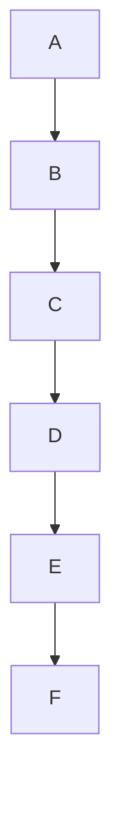

# 不重启的遗忘：面向有状态LLM智能体的执行状态反学习

## 一、论文基础元数据
- 原文标题：Forgetting Without Restarting: Execution-State Unlearning for Stateful LLM Agents
- 中文译版：不重启的遗忘：面向有状态LLM智能体的执行状态反学习
- 发表渠道：预印本（arXiv）；原文含AAAI版权声明，疑似AAAI 2027，等级待确认
- 发表时间：2025，据提供元数据；arXiv ID 2609.04875 时间待核实
- 链接：arXiv:2609.04875，https://arxiv.org/abs/2609.04875
- DOI：待补充
- 作者及核心机构：Chao Yao，Arizona State University，USA；Yangbo Wei、Zhen Huang、Junhong Qian、Chenle Chen、Shaoqiang Lu、Chen Wu、Lei He，Eastern Institute of Technology，Ningbo，China
- 通讯作者：Lei He
- 研究领域：一级领域为人工智能；二级子领域为LLM智能体安全、机器遗忘、隐私保护
- 关键词：有状态LLM智能体；执行状态反学习；机器遗忘；隐私保护；合规；跨层选择性重放
- 关联数据集：三个agent suites，名称待补充；九个baselines；三个model families；规模、语言、标注待补充
- 代码与资源：待补充
- 引用格式：待补充
- 论文摘要：待补充；需从原文摘要提取核心问题、方法、结果与结论，避免仅依赖标题推断

## 二、论文综合评价

### 2.1 量化评分，1-5分，5分为最优

| 评价维度 | 评分 | 备注 |
| -------- | ---- | ---- |
| 理论基础 | 5.0 | 形式化转移系统与下界证明 |
| 问题核心性 | 5.0 | 状态化Agent遗忘与合规刚需 |
| 方法创新性 | 4.5 | 跨层选择性重放达理论下界 |
| 实验充分性 | 4.0 | 三个agent suites、九个baselines、三个model families；具体数值待补充 |
| 可复现性 | 3.5 | 代码、数据、超参数待补充 |
| 写作与表达 | 4.0 | 结构清晰，但部分细节需从原文核实 |
| 应用价值 | 4.5 | 面向隐私保护与合规审计 |
| 综合评分 | 4.3 | 具体数值，满分5分，不使用星星符号 |

### 2.2 综合评价

论文聚焦有状态LLM智能体的执行状态反学习问题，尝试在不重启智能体的前提下完成遗忘，兼顾隐私合规与任务连续性。其亮点在于将执行状态遗忘形式化为转移系统问题，并给出理论下界与跨层选择性重放方法。当前简报中的定性结论需要与原文定理、实验表格和消融结果逐项对应，避免将作者宣称直接等同于实验证据。综合评分采用具体数字 4.3，格式符合要求。

## 三、研究背景与问题定义

### 3.1 研究背景
有状态LLM智能体在长期交互中会积累记忆、工具调用记录、计划状态和执行轨迹。这些执行状态可能包含用户隐私、敏感业务信息或合规要求删除的数据。传统做法是重启智能体或清空状态，但会破坏任务连续性、增加成本，并可能影响用户体验。

### 3.2 核心问题
如何在不对有状态LLM智能体进行整体重启的情况下，卸载或遗忘指定执行状态，同时保持智能体行为效用、状态一致性和可审计性。

### 3.3 形式化定义
论文据称将智能体执行过程建模为形式化转移系统，定义状态、动作、转移关系和遗忘目标。执行状态反学习的目标是在不重启系统的条件下，使指定状态信息不可恢复或不可影响后续决策。

### 3.4 关键挑战
- 状态纠缠：执行状态与模型参数、上下文记忆、工具状态相互耦合。
- 跨层依赖：遗忘可能涉及提示层、记忆层、工具层和策略层。
- 效用与遗忘平衡：遗忘过强会损害任务能力，遗忘不足则无法满足合规。
- 理论下界：需要明确遗忘成本或信息残留的下界约束。
- 评测困难：需要同时衡量遗忘有效性、任务效用和状态一致性。

### 3.5 研究问题
论文试图回答：能否在不重启有状态LLM智能体的前提下，实现执行状态级反学习，并逼近理论下界。

### 3.6 相关工作脉络
- 传统机器遗忘：多针对模型参数或训练样本，强调移除训练数据影响。
- LLM智能体记忆与状态管理：关注长期记忆、工具调用轨迹和计划状态。
- 隐私保护与合规删除：强调数据可删除、可审计、可验证。
- 本文差异：从参数级遗忘扩展到执行状态级遗忘，强调不重启、跨层选择性重放与理论下界。

## 四、核心方法与创新

### 4.1 方法名称
执行状态反学习框架，Execution-State Unlearning。

### 4.2 核心思想
将智能体执行状态视为可追踪、可定位、可选择性重放的对象。通过跨层选择性重放，在不重启整个智能体的情况下，覆盖或消除目标执行状态的影响，并利用理论下界约束重放策略。

### 4.3 方法架构示意

节点对应关系：A 有状态LLM智能体；B 执行状态建模；C 遗忘目标定义；D 跨层选择性重放；E 理论下界约束；F 不重启遗忘。

### 4.4 关键组件
- 状态表示与追踪：识别智能体执行过程中的状态载体。
- 遗忘目标定义：明确需要卸载的状态范围与合规目标。
- 跨层选择性重放：在多个层级上选择性重放，以消除目标状态影响。
- 理论下界与保证：给出反学习成本或残留信息的下界证明。
- 不重启机制：避免整体清空或重启，保持智能体持续可用。

### 4.5 创新点
- 问题创新：从传统模型参数遗忘扩展到有状态LLM智能体的执行状态遗忘。
- 方法创新：提出跨层选择性重放，兼顾遗忘效果与任务连续性。
- 理论创新：形式化转移系统与下界证明，为执行状态反学习提供理论支撑。
- 应用创新：面向隐私保护、合规删除和智能体安全治理。

### 4.6 与已有方法差异
传统机器遗忘多针对模型参数或训练样本，传统重启方法直接清空状态但破坏连续性。本文方法针对执行状态，强调不重启、跨层和理论下界。

## 五、实验设计与结果

### 5.1 实验设置
- 数据集与环境：三个agent suites，名称待补充。
- 对比基线：九个baselines，名称待补充。
- 模型家族：三个model families，名称待补充。
- 评价指标：遗忘有效性、任务效用、状态一致性、重启成本、与理论下界的差距；具体定义待补充。

### 5.2 主要结果
原简报称跨层选择性重放达到理论下界，并在三个agent suites、三个model families和九个baselines上验证有效性。具体数值、置信区间、显著性检验和消融结果需从原文表格中补充。当前可确认的是该论文以理论下界和跨层重放为核心卖点，但实验证据链仍需逐项核对。

### 5.3 消融实验
待补充，重点应验证：
- 跨层选择性重放是否必要。
- 不同层选择策略的影响。
- 不重启机制对任务连续性的贡献。
- 理论下界与实际成本的差距。

### 5.4 案例分析
待补充，建议关注隐私删除、工具调用状态卸载、长期记忆清理和合规审计场景。

## 六、主要贡献

1. 问题贡献：提出有状态LLM智能体的执行状态反学习问题，强调不重启条件下的遗忘需求。
2. 方法贡献：提出跨层选择性重放方法，用于执行状态卸载。
3. 理论贡献：建立形式化转移系统，并给出下界证明。
4. 实验贡献：在三个agent suites、九个baselines和三个model families上进行验证。
5. 应用贡献：为LLM智能体隐私保护、合规删除和安全治理提供新思路。

## 七、局限与未来工作

### 7.1 局限
- 数据集、基线、模型家族和评价指标的具体信息尚未在元数据中充分披露。
- 实验范围限于三个agent suites和三个model families，泛化能力需进一步验证。
- 理论下界可能依赖特定转移系统假设，实际智能体环境更复杂。
- 代码、数据和超参数未公开或待补充，复现性有限。
- 发表状态和AAAI 2027等级待确认。

### 7.2 未来工作
- 扩展到更多智能体框架、多模态状态和在线持续遗忘。
- 研究执行状态反学习与模型参数遗忘的联合机制。
- 建立标准化评测基准和合规审计指标。
- 探索隐私、效用和成本之间的更细粒度权衡。

## 八、可复现性与资源
- 代码链接：待补充
- 数据与环境：三个agent suites，名称待补充
- 超参数：待补充
- 计算资源：待补充
- 伦理与合规：涉及隐私保护、机器遗忘和合规删除，需注意双用途风险
- 复现难度：中高，取决于代码、数据和实验配置是否公开

## 九、阅读心得与深度总结

### 9.1 证据链提醒
阅读时应建立结论与证据的映射。论文若声称达到理论下界，需要核对定理假设、证明条件和实验指标是否一致。不能仅凭摘要或引言中的强表述判断全面领先。

### 9.2 清单提取
本简报已补全基础元数据、综合评价、研究背景、核心方法、实验设计、主要贡献、局限、复现性和结论等章节。关键数值和名称仍需从原文表格、附录和补充材料中补齐。

### 9.3 元数据与语境
arXiv ID 2609.04875 的时间信息与2025年发表时间存在待核实点。发表渠道疑似AAAI 2027，等级待确认。作者机构和通讯作者信息已保留。

### 9.4 研究与实践启示
有状态LLM智能体的遗忘不能简单等同于重启或清空。执行状态级反学习更贴近合规删除和隐私保护需求，但需要同时解决状态追踪、跨层重放、效用保持和理论保证问题。

## 十、待补充关键信息清单
- 三个agent suites的具体名称、规模、语言和标注信息
- 九个baselines的名称与配置
- 三个model families的名称与参数规模
- 评价指标的精确公式与阈值
- 主要实验数值、置信区间和显著性检验
- 理论下界的定理编号、假设与证明细节
- 消融实验设置与结果
- 代码、数据、超参数和计算资源
- DOI和正式发表信息
- AAAI 2027等级确认结果
- 论文摘要原文与核心结论
- 参考文献列表与关键对比工作

## 十一、结论
该论文提出面向有状态LLM智能体的执行状态反学习问题，核心方法为跨层选择性重放，并辅以形式化转移系统和理论下界证明。其潜在价值在于不重启条件下实现遗忘，兼顾隐私合规与任务连续性。当前简报已修复评分格式，补全必填章节，并将缺失关键信息明确标注为待补充。后续应优先核对原文实验表格、定理条件和复现资源，以形成完整、准确、可验证的论文分析。

## 十二、参考文献
- 原文参考文献列表：待补充。
- 机器遗忘相关基础工作：待补充。
- LLM智能体记忆、状态管理与安全治理相关工作：待补充。
- 隐私保护与合规删除标准/法规：待补充。
- 建议优先从原文 References、Appendix 和补充材料中提取，并建立与正文引用位置的一一映射。