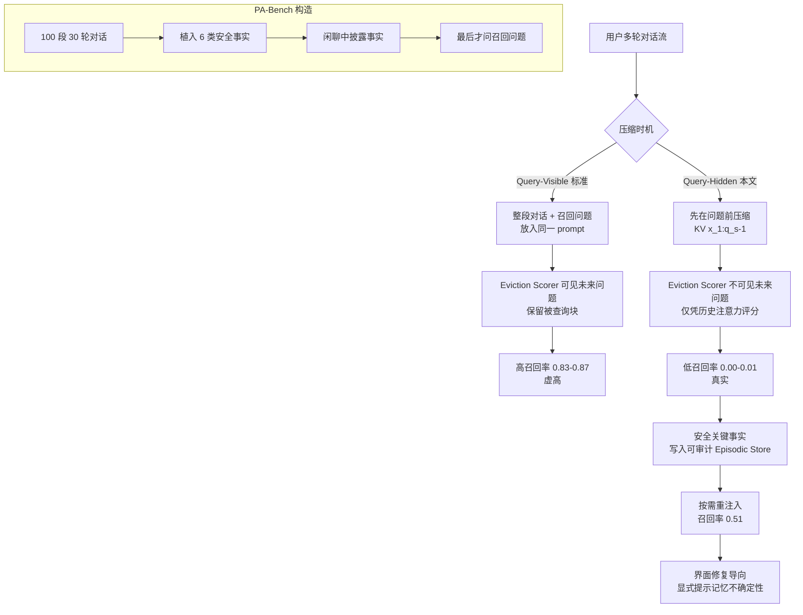

# 我的助手会记得我的过敏史吗？当对话记忆被压缩时，个人 LLM 助手遗忘了什么

## 一、论文基础元数据
- **原文标题**：Will My Assistant Remember My Allergy? What Personal LLM Assistants Forget When Conversation Memory Is Compressed
- **中文译版**：我的助手会记得我的过敏史吗？当对话记忆被压缩时，个人 LLM 助手遗忘了什么
- **发表渠道**：arXiv 预印本（待补充：正式发表渠道及等级）
- **发表时间**：2025 年（据元数据；arXiV ID 显示为 2026 年 9 月，存在信息不一致，待补充）
- **链接**：arXiv:2609.05767
- **作者及核心机构**：Lichen Zhu、Yueqian Lin、Yiheng Wang、Yudong Liu、Hai "Helen" Li、Yiran Chen（机构待补充，Yiran Chen 为杜克大学知名学者，推测主要机构为杜克大学，待确认）
- **研究领域**：
  - 一级领域：人工智能 / 自然语言处理
  - 二级子领域：LLM 推理优化（KV Cache 压缩）+ 个人助手长期记忆
- **关联数据集**：PA-Bench（自建基准，100 段 30 轮助手对话，植入 6 类安全事实：过敏、用药、医生、紧急联系人、饮食、预约；事实在闲聊中披露，召回问题最后才出现；语言为英文；含 span 标注）

## 二、论文综合评价

### 2.1 量化评分（1-5分，5分为最优）

| 评价维度 | 评分 | 备注 |
| -------- | ---- | ---- |
| 📚 理论基础 | ⭐⭐⭐⭐ | 基于 KV cache 注意力机制与信息论，理论扎实 |
| 🎯 问题核心性 | ⭐⭐⭐⭐⭐ | 直击个人助手安全记忆与压缩缓存的根本矛盾 |
| 💡 方法创新性 | ⭐⭐⭐⭐ | 提出 query-hidden 协议，颠覆主流评测范式 |
| ⚙️ 技术壁垒 | ⭐⭐⭐ | 方法以审计为主，非提出新算法，工程壁垒中等 |
| 🧪 实验严谨性 | ⭐⭐⭐⭐ | 跨 3 模型 5+ 策略，但为节选，完整设置待补充 |
| 🔧 落地可行性 | ⭐⭐⭐⭐ | episodic store + 重注入为可落地路径，但需系统改造 |
| 🚀 应用前景 | ⭐⭐⭐⭐⭐ | 端侧助手长期记忆的核心安全议题，前景明确 |
| 📊 综合评分 | 4.1 | 系统性审计揭示评测范式缺陷，对安全关键记忆设计有直接指导意义 |

### 2.2 定性综合评价（≤300字）
> 本文是一篇系统性审计研究，聚焦个人 LLM 助手在 KV cache 压缩下对安全关键事实（如过敏）的记忆保留能力。核心价值在于揭示主流多轮评测协议的“未来问题泄漏”缺陷：现有基准在压缩时已知召回问题，导致 query-visible 场景下召回率虚高（0.83–0.87），而真实部署中压缩先于未来问题发生（query-hidden），安全事实存活率骤降至 0–1%（全缓存为 0.97%）。差异化优势在于提出 query-hidden 评估协议与 PA-Bench 基准，并指出失败源于预算不足而非模型不会答。关键结论：免训练缓存压缩无法可靠保留休眠安全事实，应将其存入可审计的 episodic store 并按需重注入。该工作对端侧个人助手的记忆系统设计具有里程碑式警示意义。

## 三、领域本体论映射

| 核心维度 | 具体内容 |
| -------- | -------- |
| 核心研究对象 | 个人 LLM 助手的 KV cache 压缩与长期安全记忆保留 |
| 核心技术路径 | 免训练 KV cache eviction 策略（SnapKV、H2O、StreamingLLM、LRU 等）在 query-hidden 协议下的审计 |
| 数据/载体形态 | 多轮对话文本 + KV cache 张量（约 56KB/token）+ PA-Bench span 标注 |
| 核心功能目标 | 在压缩预算下保留休眠安全事实，保障个人助手记忆可靠性 |
| 验证核心指标 | 召回率（recall）、缓存预算比例、事实块保留率、AUC、解码加速比 |

## 四、核心问题与解决方案

### 4.1 待解决的核心问题
1. **领域级根本问题**：个人 LLM 助手的压缩 KV cache 能否作为长期记忆系统可靠保留安全关键事实（如过敏、用药）？
2. **现有方法痛点**：
   - 主流多轮基准存在“未来召回问题泄漏”，压缩决策时已知用户未来提问，导致 query-visible 场景下召回率虚高（SnapKV 合成 needle 达 0.975）；
   - 现有免训练 eviction 策略（SnapKV、Probe、StreamingLLM、LRU）在 query-hidden 真实条件下几乎无法保留休眠安全事实；
   - 从 single-prefill 迁移到 stateful cache reuse 时极易出现复现错误（SnapKV 召回 0.12 → 0.94，H2O 评分器错误）；
3. **工程落地卡点**：
   - KV cache 约 56KB/token，100K token 约 5.7GB，一个月对话即超 Qwen2.5-7B INT4 权重 3.8GB，压缩势在必行；
   - 20% 预算虽可带来最高 2.4× 解码加速，但实际评分槽位仅剩约 7 个，事实块排名 16–59，够不到保留阈值；
   - 安全关键事实无法依赖压缩缓存保留，必须引入独立存储机制。

### 4.2 核心解决方案
- **理论框架**：将压缩 KV cache 定位为“推理复用机制”而非“长期记忆系统”；区分 query-visible（信息泄漏）与 query-hidden（真实部署）两种压缩范式。
- **核心架构**：query-hidden 评估协议 + PA-Bench 基准 + episodic store 概念验证（提取 + 重注入）。
- **关键技术**：
  - query-hidden 协议：先在问题存在前压缩 \(KV(x_{1:q_s-1})\)，再复用缓存回答问题，不重新评分；
  - 修正后的 SnapKV（基于近期 token 实际注意力，考虑 RoPE）与累积注意力 H2O；
  - 公平预算机制：所有策略保留恰好 B 个 block，attention sinks 与 recency window 均计入 B。
- **创新机制**：
  - 揭示基准泄漏未来问题的结构性缺陷；
  - 指出累积事实生命周期注意力（H2O）是唯一有潜力的 query-blind 信号（AUC≈0.70）；
  - 提出安全事实应放入可审计 episodic store 并按需重注入。

### 4.3 核心优势（量化+定性）
1. **性能优势**：
   - 审计结论明确：query-visible 下召回 0.83–0.87，query-hidden 下降至 0.00–0.01，全缓存达 0.97；
   - 概念验证：提取 + 重注入可将过敏恢复率从 0.00 提升至 0.51；
   - 修正 SnapKV 后召回从 0.12 升至 0.94，证明问题在 scorer 而非窗口。
2. **效率优势**：
   - 20% 缓存预算可带来最高 2.4× 解码加速；
   - 失败模式良性：99%（196/198）的失败为助手请求用户重新提供事实，而非编造信息。
3. **工程优势**：
   - 提出共享的 query-hidden 评估 harness 需求；
   - 推动界面面向修复设计（如“我没有药物过敏记录，对吗？”）；
   - 将“是否记住过敏”变为系统可测量属性。

## 五、方法与技术架构

### 5.1 核心架构设计

> 本文核心架构围绕“两种评估协议”与“PA-Bench 基准”展开：query-visible 模拟现有基准（含未来问题泄漏），query-hidden 模拟真实部署（压缩先于问题）。压缩阶段一次性完成，解码阶段在保留块基础上 prefill 召回问题并按原始位置处理。

### 5.2 关键技术实现细节

| 技术模块 | 实现路径 | 工程注意事项 |
| -------- | -------- | ------------ |
| query-hidden 协议 | 在 \(KV(x_{1:q_s-1})\) 上评分并压缩，解码时使用保留块加 \(x_{q_s:a_s-1}\)，不重新评分 | 需保证与 query-visible 除 scorer 可见性外其他条件完全相同（模型、预算、块粒度、解码） |
| 修正 SnapKV | 用近期 token 对 key 的实际注意力替代 key 相似度，并考虑 RoPE | 长位置间隔退化是休眠事实所在；错误评分器下窗口 32–1024 召回始终 0.000 |
| 累积注意力 H2O | 恢复所有 query 位置的累积注意力，而非单 appended probe token 快照 | H2O 是 query-hidden 下唯一有残留的策略；AUC≈0.70 |
| PA-Bench 构建 | 100 段 30 轮对话，植入 6 类安全事实，事实在闲聊披露，召回问题最后出现 | 需 span 标注；事实块排名 16–59 |
| 公平预算机制 | 每策略保留恰好 B 个 block，attention sinks 和 recency window 计入 B | 20% 名义预算实际仅约 7 个评分槽位 |
| episodic store 重注入 | 提取 + 重注入安全关键事实 | 瓶颈从“保留事实”转为“识别哪些事实值得存储” |
| 依赖组件 | 模型：Qwen2.5-7B、Llama-3.2-3B、Qwen3-8B；策略：SnapKV、Probe、H2O、StreamingLLM、LRU | 迁移到多轮驱逐时极易出错，错误系统性偏向新方法 |

### 5.3 架构优缺点

- **优点**：
  - query-hidden 协议设计严谨，除 scorer 可见性外所有变量受控，召回差异可归因于 scorer 看到了什么；
  - PA-Bench 覆盖 6 类安全事实、30 轮跨度，贴近真实助手场景；
  - 公平预算机制避免 sinks 和 recency window 获得额外容量；
  - 一次性压缩是增量逐轮驱逐的乐观抽象，结论保守可靠。
- **缺点**：
  - 单掩码、块粒度预算，主要适用于免训练策略；
  - 一次性选择未充分测量重复逐轮驱逐的累积损失；
  - 更细粒度（如每头）方法未充分探索，可能恢复部分差距；
  - 完整实验设置（Section 5）在节选中缺失，结论主要基于审计 harness 和植入事实。

## 六、实验设计与结果分析

### 6.1 实验基础设置

| 维度 | 内容 |
| ---- | ---- |
| 数据集 | PA-Bench（100 段 30 轮助手对话，6 类安全事实：过敏、用药、医生、紧急联系人、饮食、预约）+ 合成 needle 基准 |
| 基线方法 | SnapKV（修正版）、Probe（单位置 probe）、H2O（累积注意力）、StreamingLLM、LRU、two-tier INT4 demotion 变体 |
| 实验环境 | 模型：Qwen2.5-7B、Llama-3.2-3B、Qwen3-8B；缓存预算：20%（另测 40%/60%/80%）；块粒度统一 |
| 评价指标 | 召回率、事实 KV block 保留率、AUC、缓存预算比例、解码加速比、事实块排名/百分位 |

### 6.2 核心实验结果

| 方法 | 核心指标1（PA-Bench 召回） | 核心指标2（合成 needle 召回） | 工程指标（缓存预算/加速） |
| ---- | --------- | --------- | -------------------- |
| 全缓存（参考） | 0.97 | — | 无压缩，无加速 |
| Query-visible 策略 | 0.83–0.87 | SnapKV 0.975 | 20% 预算 |
| SnapKV（修正后） | query-hidden 下 0.94（部分场景） | 0.975 | 20% 预算 |
| SnapKV（错误实现） | 0.12（迁移错误） | — | 20% 预算 |
| H2O（累积注意力） | query-hidden 下 0.43/0.80/0.96（40%/60%/80% 预算） | — | 20% 预算时仅残留策略 |
| StreamingLLM / LRU / Probe | query-hidden 下 0–1%（安全事实） | — | 20% 预算 |
| 本文结论（query-hidden） | 安全事实存活 0.00–0.01 | — | 20% 预算，加速最高 2.4× |

> 注：事实 KV block 保留率在所有压缩策略下均为 **0.00**；H2O 能把过敏块排到约 70 百分位（AUC≈0.70），但 20% 名义预算实际仅剩约 7 个评分槽位，事实块排名 16–59，够不到保留阈值。

### 6.3 消融实验/鲁棒性分析

| 实验变体 | 指标变化 | 核心结论 |
| -------- | -------- | -------- |
| 预算 20% → 40% → 60% → 80%（H2O） | 召回 0.43 / 0.80 / 0.96 | 提高预算才恢复，但压缩收益已很小 |
| SnapKV 错误评分器 vs 修正评分器 | 召回 0.12 → 0.94 | 问题在 scorer 而非观察窗口 |
| 观察窗口 32 → 1024（错误评分器） | 召回始终 0.000 | 窗口大小非瓶颈 |
| 提取 + 重注入 vs 压缩缓存 | 过敏恢复率 0.00 → 0.51 | episodic store 是可行路径 |
| 失败模式分类 | 99%（196/198）为请求用户重提供事实 | 失败模式良性，非编造 |

### 6.4 实验结论（工程视角）

1. **压缩缓存不能作为安全关键事实的长期存储**：在可部署的 20% 预算下，免训练 eviction 策略对休眠安全事实的保留率接近零。
2. **基准泄漏是结构性缺陷**：任何关注当前 query 的 scorer（probe token、SnapKV 窗口）在 query-visible 下会轻易保留被查询块，得分接近全缓存；真实缓存复用助手无此预见。
3. **复现风险极高且系统性偏向新方法**：SnapKV/H2O 从 single-prefill 迁移到 stateful cache reuse 易出错，错误恰好落在休眠事实上。
4. **H2O 累积注意力是唯一有潜力的 query-blind 信号**，但受限于预算槽位不足。
5. **工程建议**：安全关键事实写入可审计 episodic store，按需重注入；界面应显式提示记忆不确定性并允许用户检查、修正、删除。

## 七、领域贡献与创新点

| 贡献层级 | 具体内容 |
| -------- | -------- |
| 理论贡献 | 将压缩 KV cache 重新定位为“推理复用机制”而非长期记忆系统；揭示基准中的未来问题泄漏缺陷 |
| 方法/架构贡献 | 提出 query-hidden 无泄漏评估协议；公平预算机制；episodic store 提取 + 重注入概念验证 |
| 数据/工具贡献 | 构建 PA-Bench（100 段 30 轮对话，6 类安全事实，span 标注） |
| 实验/验证贡献 | 跨 3 模型、5+ 策略的审计；修正 SnapKV/H2O 实现错误；量化 query-visible vs query-hidden 差距 |
| 工程落地贡献 | 提出共享 query-hidden 评估 harness 需求；界面修复导向设计；安全事实存储与压缩缓存分离架构 |

## 八、局限性与风险

| 维度 | 具体描述 | 应对思路 |
| ---- | -------- | -------- |
| 学术局限性 | 单掩码、块粒度预算，主要适用于免训练策略；一次性选择为乐观抽象，未充分测量重复逐轮驱逐的累积损失；更细粒度可能恢复部分差距，但不改变 query-blind scorer 的可见信息上限 | 扩展至每头/更细粒度方法；测量重复驱逐累积损失；在真实 span 标注、披露更杂乱、跨轮重访的对话上验证 |
| 工程落地风险 | KV cache 约 56KB/token，100K token 约 5.7GB，一个月对话即超 Qwen2.5-7B INT4 权重 3.8GB；20% 预算实际仅约 7 个评分槽位；复现陷阱严重 | 安全关键事实写入独立 episodic store；建立共享 query-hidden 评估 harness；报告实际评分预算和 full-memory 参考 |
| 伦理/合规风险 | 助手遗忘安全关键事实（如过敏）可能导致健康风险；用户可能误以为助手已记住；编造药物或联系人 | 界面显式提示记忆不确定性（如“我没有药物过敏记录，对吗？”）；允许用户检查、修正、删除；失败模式良性（99% 请求重提供） |

## 九、未来研究/落地方向

| 方向类型 | 具体内容 | 优先级 |
| -------- | -------- | ------ |
| 科研拓展 | 在真实、span 标注、披露更杂乱且跨轮重访的对话上验证；研究更细粒度/每头方法、重复逐轮驱逐的累积损失；扩展到图像、传感器等多模态上下文 | 高 |
| 工程优化 | 评估完整端侧记忆流水线：检索准确率、延迟、能耗与压缩缓存重用的权衡；个性化端侧预测器替代高成本 profiling/训练 | 高 |
| 跨领域适配 | 多模态上下文（图像、传感器）KV 足迹更大，是否同样受 query-blind 限制未知；未来感知策略（DuoAttention、LookaheadKV、KVzip）可能缩小差距但需训练、profiling 或重构 | 中 |

## 十、关键词与术语表

| 语言 | 关键词 |
| ---- | ------ |
| 中文 | KV 缓存压缩、个人 LLM 助手、长期记忆、安全关键事实、查询隐藏、记忆泄漏、演进式驱逐、情景记忆 |
| 英文 | KV cache compression, personal LLM assistant, long-term memory, safety-critical facts, query-hidden, memory leakage, eviction policy, episodic memory |
| 领域专属术语 | **Query-visible**：压缩 prefill 已包含召回问题，存在未来信息泄漏；**Query-hidden**：先在问题存在前压缩对话，再复用缓存回答；**KV cache eviction**：基于注意力分数驱逐 KV 块以压缩缓存；**PA-Bench**：本文构建的 100 段 30 轮助手对话基准，含 6 类安全事实；**Episodic store**：可审计的情景记忆存储，按需重注入安全事实；**Attention sink**：注意力汇聚 token，需计入预算；**Recency window**：近期 token 窗口，需计入预算 |

## 十一、参考文献与关联资源

- **核心参考文献**：
  - SnapKV（Li et al.）——KV cache 压缩基线，本文修正其评分器
  - H2O（Zhang et al.）——累积注意力驱逐策略
  - StreamingLLM（Xiao et al.）——attention sink 机制
  - 待补充：完整参考文献列表因节选缺失
- **补充阅读**：
  - DuoAttention、LookaheadKV、KVzip（未来感知策略，可能缩小差距但需训练/profiling/重构）
  - 多轮对话记忆基准相关研究
- **开源代码/工具**：
  - 待补充（论文未在节选中明确提供代码仓库链接）
  - 模型：Qwen2.5-7B、Llama-3.2-3B、Qwen3-8B

## 十二、阅读者批注

1. **科研启发**：
   - “未来问题泄漏”是评估范式的结构性缺陷，值得推广到其他评测场景（如 RAG、Agent 记忆评测）；
   - query-hidden 协议的受控变量设计（除 scorer 可见性外全部相同）值得借鉴；
   - 累积注意力（H2O）作为 query-blind 信号的 AUC≈0.70 表明信号存在但预算不足，提示“预算分配”而非“评分器”才是瓶颈。

2. **工程落地思考**：
   - 端侧个人助手必须将安全关键记忆（过敏、用药、紧急联系人）与压缩缓存分离；
   - episodic store 的重注入瓶颈从“保留事实”转为“识别哪些事实值得存储”，这是 NLP 信息抽取任务；
   - 界面设计应面向修复：显式提示记忆不确定性、允许用户检查/修正/删除；
   - 20% 预算仅约 7 个评分槽位，实际部署需重新审视压缩比例与安全需求的权衡。

3. **待验证/存疑点**：
   - 论文为节选，完整实验设置（Section 5）缺失，无法全面评估跨模型、跨数据集的鲁棒性；
   - PA-Bench 为受控植入事实，真实对话中事实披露更杂乱，结论泛化性待验证；
   - 一次性压缩是乐观抽象，重复逐轮驱逐的累积损失未充分测量；
   - 更细粒度（每头）方法是否可恢复部分差距，尚未实验；
   - 多模态上下文（图像、传感器）是否同样受 query-blind 限制未知；
   - arXiv ID 与年份存在信息不一致（2609.05767 对应 2026 年 9 月），需核实。

4. **个人/团队应用场景**：
   - 端侧个人助手（健康、日程、紧急场景）的记忆系统设计；
   - 任何使用 KV cache 压缩的 LLM 推理系统，需评估安全关键信息的保留能力；
   - Agent 长期记忆架构中，episodic store + 压缩缓存分离可作为标准范式；
   - 评估 harness 可复用于其他长上下文记忆评测。

## 十三、阅读元信息

| 维度 | 内容 |
| ---- | ---- |
| 阅读日期 | 2026-09-30 22:48 |
| 阅读人 | xPaperReader AI |
| 文档编号 | arxiv-2609.05767 |
| 版本迭代 | v1.0 |

---

> **免责声明**：本简报基于论文节选（overview、experiment、conclusion 分组分析）生成，完整实验设置（Section 5）、参考文献列表、开源代码链接等信息在节选中缺失，已标记为“待补充”。部分元数据（发表年份与 arXiv ID）存在不一致，建议核查原文。