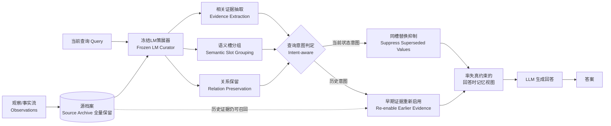

# 智能体应遗忘什么？分离存储内容与使用内容

## 一、论文基础元数据

| 字段 | 内容 |
| ---- | ---- |
| 原文标题 | What Should an Agent Forget? Separating What Is Stored from What Is Used |
| 中文译版 | 智能体应遗忘什么？分离存储内容与使用内容 |
| 发表渠道 | 预印本（arXiv，CCF 等级/会议录用情况：待补充） |
| 发表时间 | 2025 年（具体月份：待补充） |
| 链接 | arXiv:2609.10263（DOI：待补充） |
| 作者及核心机构 | Yuhang Li（北京航空航天大学，杭州）；Yuchen Li（华东师范大学，上海）；两位作者标注为同等贡献 |
| 研究领域 | 一级领域：人工智能 / 自然语言处理；二级子领域：LLM 智能体持久记忆管理与选择性遗忘 |
| 关联数据集 | 待补充（摘要仅提及实验覆盖对话记忆、知识更新、事实巩固、长上下文推理、个性化五类场景，未在节选中列出具体数据集名称、规模、语言与标注方式） |

> 说明：本次提供的论文内容仅为摘要与引言节选（约 4000 字符），正文实验章节、表格、参考文献均未包含在输入中。凡涉及具体数据集、基线、数值结果的字段，均标注"待补充"，不做推测性填充。

## 二、论文综合评价

### 2.1 量化评分（1-5分，5分为最优）

| 评价维度 | 评分 | 备注 |
| -------- | ---- | ---- |
| 📚 理论基础 | ⭐⭐⭐⭐ | 将"存储"与"使用"解耦，并以率失真理论约束视图构建，框架清晰 |
| 🎯 问题核心性 | ⭐⭐⭐⭐⭐ | 直击持久记忆智能体"过时事实误导当前回答"这一根本矛盾 |
| 💡 方法创新性 | ⭐⭐⭐⭐ | 免训练 + 查询条件化记忆视图 + 同槽替换抑制，组合新颖 |
| ⚙️ 技术壁垒 | ⭐⭐⭐ | 依赖冻结 LM 作策展器与槽位关系抽取，实现复杂度中等 |
| 🧪 实验严谨性 | ⭐⭐⭐ | 节选未见数值、基线与消融表，仅能从摘要获知结论方向，无法核验 |
| 🔧 落地可行性 | ⭐⭐⭐⭐ | 免训练框架，可挂载于现有智能体记忆层，接入门槛较低 |
| 🚀 应用前景 | ⭐⭐⭐⭐ | 对话助手、知识更新、个性化代理等场景需求明确 |
| 📊 综合评分 | 3.9 | 问题选得准、思路自洽，但实验证据在节选中缺失，评分保留不确定性 |

> 综合评分 = 前 7 项星级的算术平均：(4+5+4+3+3+4+4)/7 ≈ 3.86，取 3.9。

### 2.2 定性综合评价（≤300字）

> 该文定位于**持久记忆语言智能体的记忆使用控制问题**。核心主张是：智能体的"存储"与"使用"应当解耦——被更新取代的旧事实在存储中仍需保留（以回答历史查询），但在当前状态问答中必须被抑制。作者提出免训练的 RD-Forget 框架，用冻结 LM 作策展器，抽取相关证据、归入语义槽、保留多跳关系，并借助同槽替换链接与意图感知检索实现"按需启用/屏蔽"，再以率失真公式在记忆预算下构建回答时视图。差异化优势在于明确反对"用新近度决定遗忘"的简化做法，强调遗忘必须同时尊重更新范围与证据链。关键结论（据摘要）：缺少遗忘或查询条件化的配置得分损失最大；槽分组、历史访问与关系保持各自贡献互补功能。真实性能幅度尚无数据支撑。

## 三、领域本体论映射

| 核心维度 | 具体内容 |
| -------- | -------- |
| 核心研究对象 | 持久语言智能体（persistent language agents）的长期记忆及其在回答时的选择性使用 |
| 核心技术路径 | 免训练框架：源档案（存储）＋ 查询条件化记忆视图（使用）＋ 冻结 LM 策展器 ＋ 率失真约束的视图构建 |
| 数据/载体形态 | 跨时间的观察记录（observations）、事实（facts）、语义槽（semantic slots）、关系（relations）；存储侧为源档案，使用侧为查询相关证据视图 |
| 核心功能目标 | 在保留历史的前提下，使当前状态回答不被过时事实误导，同时让历史查询仍可召回早期证据 |
| 验证核心指标 | 待补充（摘要未给出指标名称与数值；仅以"score deficits"定性描述配置差异） |

## 四、核心问题与解决方案

### 4.1 待解决的核心问题

1. **领域级根本问题**：持久智能体的记忆同时承担两个冲突职能——"跨时间可用"与"适应当前问题"。世界变化时，"应保留什么"与"应使用什么"出现分歧：早期雇佣记录对"当前雇主"提问构成误导，却对"上一份工作"提问必不可少。

2. **现有方法痛点**：
   - **仅按新近度遗忘**：无法区分"竞争性取值"（同一关系下被取代的旧值）与"互补性关系"（推导答案所需的中间证据链）。
   - **通用压缩式记忆**：可能省略只有在问题到来时其价值才显现的关系。
   - **固定记忆内容干预**：现有记忆系统（Generative Agents、MemGPT、A-MEM、ACE、ReasoningBank 等）侧重积累与复用，未显式区分存储层与使用层。

3. **工程落地卡点**：遗忘若写成对存储的删除，历史查询将永久失效；若不做任何控制，过时事实持续污染当前回答。二者之间的可控开关在现有系统中缺乏明确机制。

### 4.2 核心解决方案

- **理论框架**：将记忆问题形式化为"保留（retention）"与"回答时访问（answer-time access）"的分离；用**率失真（rate-distortion）** 公式在记忆预算约束下指导回答时视图的构建。

- **核心架构**：RD-Forget 双组件结构——①**源档案（source archive）** 保存观察，不做破坏性删除；②**查询条件化记忆视图（query-conditioned memory view）** 决定这些观察对当前回答的影响权重。

- **关键技术**：
  - 冻结语言模型策展器（frozen LM curator）：抽取相关证据、按语义槽分组事实、保留多跳推理所需关系。
  - 同槽替换链接（same-slot replacement links）：在同一关系槽内抑制被取代的取值。
  - 意图感知检索（intent-aware retrieval）：当查询指向历史意图时，使早期证据重新变为可用。

- **创新机制**：把"遗忘"从存储操作改写为**使用侧的动态门控**——"同槽抑制"处理当前状态问答，"意图感知召回"处理历史查询，二者由查询意图切换。

### 4.3 核心优势（量化+定性）

1. **性能优势**：摘要声称"无遗忘"或"无查询条件化"的配置出现最大的分数损失（largest score deficits），即两类机制均为必要；槽分组、历史访问、关系保持提供互补作用。**具体数值待补充**。

2. **效率优势**：全程免训练（training-free），复用冻结 LM 作为策展器，无需为遗忘/记忆策略单独训练模型。**算力与耗时数据待补充**。

3. **工程优势**：不破坏存储即实现使用侧控制，语义上"可逆"——历史证据能在历史意图下重新启用，适配世界状态持续变化的在线代理场景。

## 五、方法与技术架构

### 5.1 核心架构设计

> 按照节选描述，RD-Forget 把一次回答拆为"档案留存"与"视图构建"两条通路：观察全部进入源档案；当查询到来时，冻结策展器对档案做查询条件化的证据筛选、槽位归组与关系补全，再经由同槽替换与意图判定生成回答时视图。

### 5.2 关键技术实现细节

| 技术模块 | 实现路径 | 工程注意事项 |
| -------- | -------- | ------------ |
| 源档案（Source Archive） | 全量保留观察记录，不做破坏性删除 | 需设计长期存储与索引策略；规模增长下的检索延迟待评估 |
| 冻结 LM 策展器 | 使用冻结语言模型抽取相关事实、归入语义槽、保留多跳关系 | 策展器质量直接决定槽位与关系的准确率；节选未说明所用模型与提示策略 |
| 同槽替换链接 | 在同一关系槽内识别被取代取值并建立替换链接，当前状态问询时抑制旧值 | 需正确判定"同一关系"边界，避免误抑制互补关系的中间证据 |
| 意图感知检索 | 依据查询意图，使早期证据在历史型问题下重新可召回 | 意图判定错误将导致"该抑制未抑制"或"该召回未召回" |
| 率失真视图构建 | 以率失真公式在记忆预算下权衡证据覆盖与视图规模 | 失真度量与预算参数的具体设定，节选未说明 |
| 依赖组件 | 冻结 LLM、向量/关系检索、槽位与关系抽取组件 | 整体免训练，但推理链路较长，端到端延迟需实测 |

### 5.3 架构优缺点

- **优点**：
  1. 存储与使用解耦，避免"遗忘即删除"造成的历史信息永久丢失；
  2. 免训练，易于挂载到既有智能体记忆层；
  3. 以率失真显式建模记忆预算，便于在成本与答案质量之间调节。

- **缺点**：
  1. 推理链路较长（策展 → 槽位 → 关系 → 意图 → 视图），单次回答延迟与成本可能上升；
  2. 强依赖冻结 LM 的抽取质量，槽边界与关系判定的错误会级联传播；
  3. 节选未说明超参（预算、失真度量、同槽判定阈值）的敏感性，鲁棒性证据缺失。

## 六、实验设计与结果分析

### 6.1 实验基础设置

| 维度 | 内容 |
| ---- | ---- |
| 数据集 | 待补充。摘要仅说明实验"横跨对话记忆、知识更新、事实巩固、长上下文推理与个性化"五类任务，并"共享同一回答流水线"（shared answering pipeline），未在节选中给出数据集名称与规模 |
| 基线方法 | 待补充。摘要提及的两类关键对照配置为：①无遗忘（without forgetting）；②无查询条件化（without query conditioning） |
| 实验环境 | 待补充 |
| 评价指标 | 待补充（摘要仅以"score deficits"定性表述配置间差异，未给出指标名称与数值） |

### 6.2 核心实验结果

| 方法 | 核心指标1 | 核心指标2 | 工程指标（算力/耗时） |
| ---- | --------- | --------- | -------------------- |
| 无遗忘配置 | 待补充 | 待补充 | 待补充 |
| 无查询条件化配置 | 待补充 | 待补充 | 待补充 |
| RD-Forget（完整） | 待补充 | 待补充 | 待补充 |

> **诚实性说明**：输入内容不含任何结果表格（已确认"表格数据：前 0 个"）。摘要只给出方向性结论——"缺少遗忘或查询条件化的配置分数损失最大"——但未提供任何具体数值、置信区间或显著性检验。此处不做数字推测。

### 6.3 消融实验/鲁棒性分析

| 实验变体 | 指标变化 | 核心结论 |
| -------- | -------- | -------- |
| 移除遗忘机制 | 摘要称出现"最大分数损失"之一（数值待补充） | 遗忘控制是回答准确性的关键组成 |
| 移除查询条件化 | 摘要称出现"最大分数损失"之一（数值待补充） | 查询条件化不可省略 |
| 移除槽分组 | 待补充 | 槽分组提供互补功能 |
| 移除历史访问 | 待补充 | 历史访问提供互补功能 |
| 移除关系保留 | 待补充 | 关系保留提供互补功能 |

### 6.4 实验结论（工程视角）

- **可提取的确定结论**：遗忘控制与查询条件化二者都是性能的"关键支撑项"，缺失任一项都会带来最显著的得分下滑；槽分组、历史访问、关系保留属于互补功能项，而非可有可无的装饰。
- **无法确认的部分**：具体提升幅度、与各基线（MemGPT、A-MEM、Generative Agents 等）的对比优势、以及在五类任务上的分别表现，均需查阅正文与附录后补充。
- **工程启示**：若在实际系统中只能实现部分能力，应优先保证"遗忘控制"与"查询条件化"两项，二者的边际收益据摘要判断最高。

## 七、领域贡献与创新点

| 贡献层级 | 具体内容 |
| -------- | -------- |
| 理论贡献 | 明确提出"存储（retention）"与"使用（answer-time access）"的分离原则；引入率失真公式刻画记忆预算下回答时视图的构建 |
| 方法/架构贡献 | 提出免训练框架 RD-Forget，含源档案、查询条件化记忆视图、冻结 LM 策展器、同槽替换链接与意图感知检索 |
| 数据/工具贡献 | 待补充（节选未提及新数据集或开源工具） |
| 实验/验证贡献 | 在对话记忆、知识更新、事实巩固、长上下文推理、个性化五类任务上以共享回答流水线进行统一验证（具体设置待补充） |
| 工程落地贡献 | 提供不破坏存储的使用侧控制机制，使历史证据在历史意图下可逆地重新启用，适配持续变化的世界状态 |

## 八、局限性与风险

| 维度 | 具体描述 | 应对思路 |
| ---- | -------- | -------- |
| 学术局限性 | 节选缺少定量结果、基线对比与统计显著性；"最大分数损失"等表述为定性描述，不足以支撑严格的性能主张 | 查阅正文与附录的完整结果表；核实五类任务上的分项指标 |
| 工程落地风险 | 推理链路长（策展→槽位→关系→意图→视图），延迟与成本可能高于直接检索；冻结 LM 抽取错误会级联 | 引入缓存与异步策展；对策展输出做轻量校验；评估端到端延迟预算 |
| 伦理/合规风险 | 系统刻意保留历史个人事实（如过往雇佣记录），涉及隐私留存与"被遗忘权"的张力 | 在合规场景下引入用户可控的硬删除通道，与"软抑制"分离；明确数据保留策略 |

## 九、未来研究/落地方向

| 方向类型 | 具体内容 | 优先级 |
| -------- | -------- | ------ |
| 科研拓展 | 验证率失真公式中失真度量与预算参数的设定对答案质量的影响；检验槽边界自动判定的准确率上限 | 高 |
| 工程优化 | 降低策展-视图链路的端到端延迟；设计存储层的长期索引与压缩策略 | 高 |
| 跨领域适配 | 从个人助手拓展至知识库更新、客服工单、多智能体协作记忆等场景 | 中 |

## 十、关键词与术语表

| 语言 | 关键词 |
| ---- | ------ |
| 中文 | 语言智能体、持久记忆、选择性遗忘、查询条件化检索 |
| 英文 | Language agents, persistent memory, selective forgetting, query-conditioned retrieval |
| 领域专属术语 | **RD-Forget**：本文提出的免训练记忆分离框架，名称中的 RD 对应率失真（rate-distortion）。 **Source Archive（源档案）**：全量保留观察记录的存储层，不做破坏性删除。 **Query-conditioned Memory View（查询条件化记忆视图）**：决定存储内容对当前回答影响力的使用层。 **Semantic Slot（语义槽）**：策展器将事实归入的语义分组单元，同一槽内取值可互为替代。 **Same-slot Replacement Links（同槽替换链接）**：在同一语义槽内标示被取代取值的链接，用于在当前状态问询时抑制旧值。 **Intent-aware Retrieval（意图感知检索）**：根据查询意图判定是否重新启用早期证据的检索机制。 **Rate-distortion Formulation（率失真形式化）**：在记忆预算约束下权衡证据覆盖度与视图规模的理论工具。 |

## 十一、参考文献与关联资源

- **核心参考文献**（据节选引用）：
  - [7] Generative Agents（观察与反思的累积）
  - [6] MemGPT（跨记忆层级的信息管理）
  - [11] A-MEM（随新观察演化的链接笔记）
  - [5] ACE（任务经验的积累与复用）
  - [12] ReasoningBank（任务经验的积累与复用）
- **补充阅读**：待补充（节选未提供完整参考文献列表）
- **开源代码/工具**：待补充（节选未提及代码仓库或工具链接）

## 十二、阅读者批注

1. **科研启发**：把"遗忘"重新定义为**访问控制问题**而非**存储删除问题**，是一个概念上干净的重构。率失真公式的引入提示了一个可延展方向——记忆预算与答案质量之间存在可刻画的最优折衷点，值得用信息论工具进一步展开。

2. **工程落地思考**：该框架最实用的地方在于"非破坏性"——存储不动，只在回答时构造视图。这意味着系统可以在不丢失审计线索的前提下改变行为，对需要合规留痕的场景（如金融、医疗助手）尤其有价值。但代价是推理链路变长，需实测端到端延迟是否可接受。

3. **待验证/存疑点**：
   - 摘要声称"缺失遗忘或查询条件化的配置得分损失最大"，但**输入中没有任何数值**。需核查正文表格以确认提升幅度与统计显著性。
   - "同槽"的边界如何自动判定？若判定过宽，可能把互补关系的中间证据误抑制；过窄则漏抑制。节选未给出判定机制与错误率。
   - 五类任务共享同一"回答流水线"，其泛化能力的具体代价（各任务是否都达到各自最优）尚不清楚。

4. **个人/团队应用场景**：适合用于**长期个人助理**与**企业知识库问答**——前者需要在用户职业、住址等状态变化后正确回答"现在/过去"两类问题；后者需要在制度版本迭代后既遵守现行条款，又能追溯历史版本。

## 十三、阅读元信息

| 维度 | 内容 |
| ---- | ---- |
| 阅读日期 | 2026-09-30 22:49 |
| 阅读人 | xPaperReader AI |
| 文档编号 | arxiv-2609.10263 |
| 版本迭代 | v1.0 |
| 内容覆盖度 | 仅覆盖摘要与引言节选（约 4000 字符），实验、结果、附录与参考文献均缺失 |

---

**⚠️ 分析可信度声明**：本次分析的输入仅为论文摘要与引言节选，**未包含任何实验数据表格**（已确认表格数量为 0）。因此第六节（实验设计与结果分析）中的绝大多数单元格标注为"待补充"，未做任何数值推测。摘要中出现的"最大分数损失（largest score deficits）"等表述属于作者的定性主张，尚未经原文数据核验，读者应以正文表格为准。