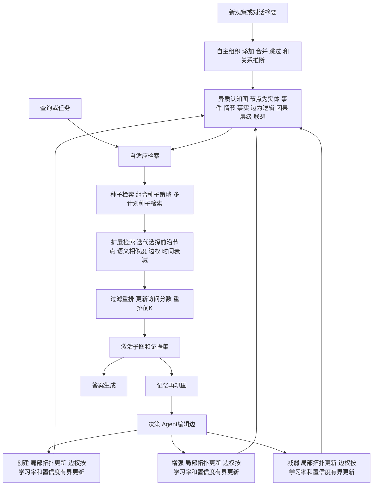

# 面向长期 LLM 智能体的检索驱动记忆再巩固

## 一、论文基础元数据

- **原文标题**：Retrieval-Driven Memory Reconsolidation for Long-Term LLM Agents
- **中文译版**：面向长期 LLM 智能体的检索驱动记忆再巩固
- **发表渠道**：预印本（arXiv，未标注会议/期刊录用信息，等级待补充）
- **发表时间**：2025 年（具体月份待补充）
- **链接**：[arXiv:2609.16053](https://arxiv.org/abs/2609.16053)
- **作者及核心机构**：Yuanyi Song、Yukai Wang、Xinbei Ma、Zhihui Fu、Jianghao Lin、Weiwen Liu、Jun Wang、Huarong Deng、Yong Yu、Weinan Zhang（核心机构待补充，从作者列表判断主要依托上海交通大学等团队）
- **研究领域**：
  - 一级领域：人工智能 / 大语言模型
  - 二级子领域：LLM Agent 长期记忆管理、记忆增强推理、认知图结构建模
- **关联数据集**：
  - **LoCoMo**：长对话记忆基准，含长对话与多问题样例，语言待补充
  - **LongMemEval_S**：长期记忆评估基准，单样本单原问题，含 oracle session
  - 规模、标注细节待补充

## 二、论文综合评价

### 2.1 量化评分（1-5分，5分为最优）

| 评价维度 | 评分（1-5分） | 备注 |
| -------- | ------------- | ---- |
| 理论基础 | 4.0 | 认知神经科学“记忆再巩固”迁移，跨学科理论支撑扎实 |
| 问题核心性 | 5.0 | 长期记忆是 LLM Agent 落地公认的核心瓶颈 |
| 方法创新性 | 4.0 | 把检索从被动终点变为记忆进化信号，视角新颖 |
| 技术壁垒 | 3.0 | 图记忆+检索+再巩固架构复杂度中等，依赖 LLM 决策 |
| 实验严谨性 | 4.0 | 统一协议且做顺序鲁棒性检验，但部分结果复用第三方 |
| 落地可行性 | 3.0 | 再巩固成本、稳定性与长记忆类别短板尚未充分讨论 |
| 应用前景 | 4.0 | 面向自进化智能体记忆基础，方向价值明确 |

> **综合评分：3.9 / 5.0** —— 理论新颖与问题核心性突出，工程稳定性与部分类别性能仍存短板。

### 2.2 定性综合评价（≤300字）

> 本文面向长期 LLM Agent 记忆管理这一核心瓶颈，提出范式转变：将长期记忆从“静态存储 + 固定检索”重构为“使用中演化”的闭环生命周期。受认知神经科学“记忆再巩固”启发，作者提出 REALM 框架，在异质认知图上统一实现自主组织、自适应检索与检索后再巩固三大组件，使检索反馈主动驱动记忆拓扑重组。差异化优势在于把“检索”从记忆使用的终点变为记忆进化的信号源，并基于“共利用模式”实现局部拓扑更新。在 LoCoMo 与 LongMemEval_S 上，REALM 分别取得 75.97 与 65.11 的平均分，较最强基线提升 +7.17 与 +1.31；消融显示再巩固贡献 2.01 / 2.13 分增益。关键发现是再巩固主要提升**证据利用质量**而非大幅增加证据召回。综合来看，本文在范式层面具有启发价值，但自适应检索收益有限、部分长记忆类别仍显不足，工程成本与稳定性有待进一步验证。

## 三、领域本体论映射

| 核心维度 | 具体内容 |
| -------- | -------- |
| 核心研究对象 | 长期 LLM Agent 的长期记忆结构及其演化机制 |
| 核心技术路径 | 异质认知图建模 + 策略原子组合检索 + 检索反馈驱动的局部拓扑再巩固 |
| 数据/载体形态 | 记忆图 G=(V,E)，节点为 entity/event/episode/fact，边为 logical/causal/hierarchical/associative |
| 核心功能目标 | 使记忆在使用中主动重组，形成紧凑证据聚类与结构化子图，支持集体回忆 |
| 验证核心指标 | LLM-as-a-Judge 准确率（LoCoMo / LongMemEval_S 平均分）、证据发现率、正确回答提升率、检索效率、关系使用分布 |

## 四、核心问题与解决方案

### 4.1 待解决的核心问题

1. **领域级根本问题**：
   现有长期记忆系统普遍采取“前向演化”范式——记忆更新仅由新输入触发，检索只是记忆使用的终点，导致长期记忆结构刚性、无法自适应使用体验。记忆是 Agent 长期智能的关键瓶颈，却缺乏自我进化的机制。

2. **现有方法痛点**：
   - 扁平/时序检索（Mem0、Zep）：结构静态，检索与更新解耦；
   - 多组件/Agent 自适应记忆（MIRIX、A-Mem、Nemori）：更新被动，无法由使用反馈驱动；
   - 策略引导图架构（MAGMA）：虽有图结构但缺乏系统性的“使用—再巩固”闭环；
   - 共同痛点：预定义记忆架构刚性化，检索反馈无法回流影响记忆拓扑。

3. **工程落地卡点**：
   - 再巩固依赖 LLM 决策与反馈质量，成本与稳定性未充分讨论；
   - 自适应检索策略收益有限（43.36% vs 43.09%/39.84%），策略选择错误可能削弱优势；
   - 部分长记忆类别（如 LoCoMo/LongMemEval 中的 single-session preference，仅 36.66）显著低于部分基线。

### 4.2 核心解决方案

- **理论框架**：以认知神经科学“记忆再巩固”（Reconsolidation）理论为类比基础，将记忆视为可被检索激活并随反馈持续重构的动态生命周期系统。
- **核心架构**：REALM（Reconsolidation-Evolution Agentic Long-term Memory），由**自主组织**、**自适应检索**、**记忆再巩固**三组件构成闭环：
  \[
  G_t \xrightarrow{\text{Retrieve}} (G_q, f) \xrightarrow{\text{Reconsolidate}} G_{t+1}
  \]
- **关键技术**：
  1. 异质认知图表示：四类节点 + 四类边，新观察统一为 add/merge/skip 并自动推断关系；
  2. 检索原子动作组合：seeding → expanding → filtering，Agent 动态组合策略 π = π_seed ⊕ π_expand ⊕ π_filter；
  3. 反馈驱动拓扑演化：基于置信度 c 与学习率 η 对边进行有界权重更新（create/strengthen/weaken），避免拓扑震荡。
- **创新机制**：**共利用模式驱动**——哪些记忆被一起调用会影响记忆结构，使系统形成紧凑证据聚类与结构化子图，支持“集体回忆”。

### 4.3 核心优势（量化+定性）

1. **性能优势**：LoCoMo 平均分 75.97（vs 最强基线 MAGMA 68.80，+7.17）；LongMemEval 65.11（vs Zep 63.80，+1.31）。类别增益显著：Multi-Hop +4.97、Open-Domain +5.21、Single-session Preference +6.66、Knowledge Update +4.17。
2. **效率优势**：LoCoMo 84.87% 的证据可直接从种子节点找到（LongMemEval 40.52%）；再巩固仅提升正确回答 +20.83%/+19.23%，而证据发现仅 +3.70%/+5.41%，说明其提升集中在证据利用质量而非盲目扩大召回。
3. **工程优势**：模块化设计（组织/检索/再巩固三阶段解耦），可替换底层存储器与检索组件；通过有界边权更新与置信度约束抑制拓扑震荡，具备一定工程鲁棒性。

## 五、方法与技术架构

### 5.1 核心架构设计

> REALM 以异质认知图为记忆载体，通过“组织—检索—再巩固”三阶段闭环实现记忆的持续演化。每次任务完成后，对本次检索激活的子图 G_q 执行局部拓扑更新，使记忆结构随使用模式自适应调整。

### 5.2 关键技术实现细节

| 技术模块 | 实现路径 | 工程注意事项 |
| -------- | -------- | ------------ |
| 认知图记忆组织（Alg.1） | 输入观察、对话摘要、近期更新与记忆图；抽取记忆单元，检索相似/近期节点，预测并执行 add/merge/skip，推断关系后更新图 | 需控制图规模与合并阈值，避免节点爆炸或过度归并 |
| 策略原子组合检索（Alg.2） | 查询 → 组合种子策略 → 多计划种子检索 → 迭代选择前沿节点并扩展 → 更新访问分数 → 重排取 TopK → 诱导激活子图 | 扩展阶段需平衡语义相似度、边权与时间衰减；策略组合错误可能反噬效果 |
| 反馈驱动拓扑演化（Alg.3） | 根据问题、检索子图与反馈推断主题结构，识别关键/噪声组，Agent 编辑边；支持 create/strengthen/weaken，按学习率 η 和置信度 c 更新边权 | 需设置边权上下界防震荡；Agent 编辑可靠性直接影响再巩固质量 |
| 依赖组件 | GPT-4o-mini 作为 backbone 与 LLM judge；相同 judge prompts | 统一模型与判分协议以保证公平对比 |

### 5.3 架构优缺点

- **优点**：
  1. 三阶段解耦，模块可独立替换与升级；
  2. 检索反馈回流形成闭环，记忆结构可自适应使用模式；
  3. 有界边权更新 + 置信度约束，抑制拓扑震荡；
  4. 支持“集体回忆”，形成紧凑证据聚类与结构化子图。

- **缺点**：
  1. 再巩固依赖 LLM 决策与反馈质量，稳定性与成本未充分讨论；
  2. 自适应检索相对固定策略提升有限（43.36% vs 43.09%），增益不显著；
  3. 长记忆类别（如 single-session preference 36.66）存在明显短板；
  4. 评估协议中 LongMemEval 额外问题由 LLM 生成，可能引入偏差。

## 六、实验设计与结果分析

### 6.1 实验基础设置

| 维度 | 内容 |
| ---- | ---- |
| 数据集 | LoCoMo、LongMemEval_S |
| 基线方法 | 扁平/时序检索：Mem0、Zep；多组件/Agent 自适应：MIRIX、A-Mem、Nemori；策略引导图：MAGMA |
| 实验环境 | GPT-4o-mini 作为 backbone 与 LLM judge；统一 judge prompts 与模型 |
| 评价指标 | LLM-as-a-Judge 准确率（排除不可回答问题）；证据发现率、正确回答率、检索效率、关系使用分布 |

### 6.2 主要结果

- LoCoMo 平均分 75.97，较最强基线 MAGMA 68.80 提升 +7.17。
- LongMemEval_S 平均分 65.11，较 Zep 63.80 提升 +1.31。
- 类别增益：Multi-Hop +4.97、Open-Domain +5.21、Single-session Preference +6.66、Knowledge Update +4.17。
- 证据发现：LoCoMo 84.87% 可从种子节点直接找到，LongMemEval_S 为 40.52%。

### 6.3 消融与机制分析

- 再巩固贡献：2.01 / 2.13 分增益。
- 再巩固提升正确回答 +20.83%/+19.23%，证据发现仅 +3.70%/+5.41%，说明主要提升证据利用质量，而非盲目扩大证据召回。
- 自适应检索策略收益有限（43.36% vs 43.09%/39.84%），策略选择错误可能削弱优势。

### 6.4 实验局限

- 长记忆类别如 single-session preference 仅 36.66，低于部分基线。
- LongMemEval 额外问题由 LLM 生成，可能引入偏差。
- 再巩固成本、稳定性与工程可扩展性尚未充分讨论。
- 评估协议虽统一模型与 judge prompts，但部分结果复用第三方，需谨慎解读跨实验对比。