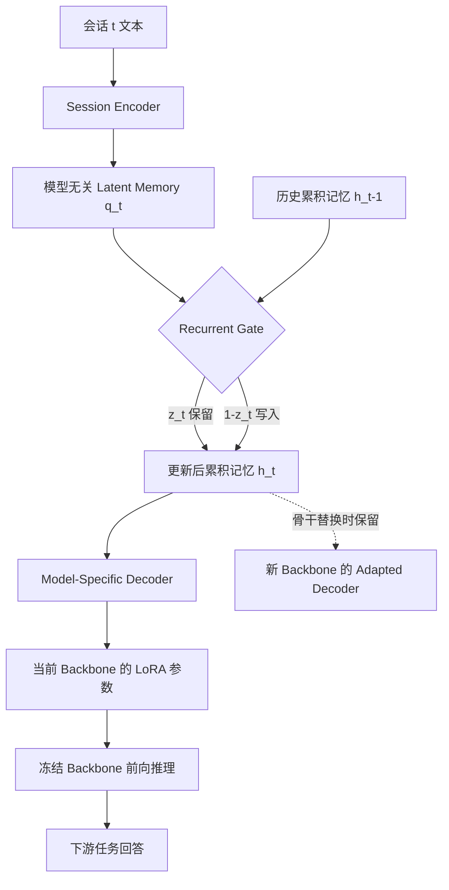

# RPMem：为LLM智能体学习跨会话的长期循环参数记忆

## 一、论文基础元数据

| 元数据项 | 内容 |
| -------- | ---- |
| 原文标题 | RPMem: Learning Long-Term Recurrent Parametric Memory Across Sessions for LLM Agents |
| 中文译版 | RPMem：为LLM智能体学习跨会话的长期循环参数记忆 |
| 发表渠道 | 预印本（arXiv，未经同行评审；会议/期刊等级：待补充） |
| 发表时间 | 2025年（具体月份：待补充） |
| 链接 | arXiv:2609.23466（https://arxiv.org/abs/2609.23466） |
| 作者 | Fanyu Zhao, Ruike Cao, Liang Dong, Fugen Yao, Jian Xu, Guanjun Jiang, Han Zhang, Yifei Zhao, Yinsheng Li |
| 核心机构 | 待补充（论文元数据未提供） |
| 研究领域 | 一级领域：人工智能 / 自然语言处理；二级子领域：LLM Agent 长期记忆、参数高效微调（LoRA）、跨会话持续学习 |
| 关联数据集 | PERMA（10-fold leave-one-user-out，规模/语言/标注待补充）；PersonaMem-v2（官方 split，规模/语言/标注待补充）；PrefEval（10/70/300 turns 评测协议，规模/语言/标注待补充） |

> 说明：arXiv ID 标注为 2609.23466 与元数据给出年份 2025 存在编号体系上的不一致，此处以元数据为准，链接信息按给定 ID 记录，未做推测性修正。

## 二、论文综合评价

### 2.1 量化评分（1-5分，5分为最优）

| 评价维度 | 评分 | 备注 |
| -------- | ---- | ---- |
| 📚 理论基础 | ⭐⭐⭐⭐ | 分布匹配编译+循环门控，理论自洽清晰 |
| 🎯 问题核心性 | ⭐⭐⭐⭐⭐ | 直击Agent跨会话长期记忆核心痛点 |
| 💡 方法创新性 | ⭐⭐⭐⭐ | 模型无关latent+可迁移解码，组合有新意 |
| ⚙️ 技术壁垒 | ⭐⭐⭐⭐ | 需训练门控与编译器对齐，复现门槛中等 |
| 🧪 实验严谨性 | ⭐⭐⭐⭐⭐ | 三基准五骨干，消融与跨模型验证充分 |
| 🔧 落地可行性 | ⭐⭐⭐⭐⭐ | 更新0.04s、记忆恒定、可换骨干复用 |
| 🚀 应用前景 | ⭐⭐⭐⭐⭐ | 长期个性化Agent记忆属刚需场景 |
| 📊 综合评分 | 4.6 | 工程化记忆架构扎实，泛化边界与隐私风险待补 |

### 2.2 定性综合评价（≤300字）

> RPMem 定位为 LLM Agent 的跨会话长期参数记忆框架，核心价值在于把"会话经验"压缩为固定形状、与模型无关的 latent memory，再解码为当前骨干模型的 LoRA 参数，从而同时规避文本记忆的检索依赖与参数记忆的骨干耦合。其差异化优势有三：一是以 Fixed FKL 分布匹配替代硬标签监督，编译质量显著更高；二是用坐标级循环门控在固定容量内学习"保留什么、更新什么"，提升稳定；三是骨干替换时仅切换解码器，历史记忆可跨模型复用。关键结论显示，PERMA+Qwen3-8B 达85.52%，跨骨干迁移平均由75.97%升至89.64%，64会话更新仅0.043秒、记忆近恒定，通用能力退化有限。总体是一篇工程导向强、验证较完整的记忆架构工作，但其 consolidation 策略的场景泛化边界、隐私合规与真实开放域鲁棒性仍需进一步检验。

## 三、领域本体论映射

| 核心维度 | 具体内容 |
| -------- | -------- |
| 核心研究对象 | LLM Agent 的跨会话长期记忆（长期用户状态/偏好/领域知识的累积与复用） |
| 核心技术路径 | 单会话 latent 记忆编译 → backbone-specific LoRA 解码 → 跨会话循环门控整合 → 模型特定解码与迁移 |
| 数据/载体形态 | 会话文本序列（segment 级，4096 tokens）→ 固定形状 latent memory → LoRA 参数（约36.56 MiB/用户，近恒定） |
| 核心功能目标 | 在不重放历史文本、不膨胀上下文的前提下，实现经验的跨会话累积、选择性修订与跨骨干迁移 |
| 验证核心指标 | PERMA Core Avg、七变体平均、PersonaMem-v2 Overall、PrefEval 多轮准确率、跨骨干迁移增益、更新/查询耗时、记忆体积、MMLU/GSM8K/IFEval 通用能力保留 |

## 四、核心问题与解决方案

### 4.1 待解决的核心问题

1. **领域级根本问题**：LLM Agent 缺少一种可随交互历史增长而持续演化、且在服务骨干模型更替后仍可复用的长期记忆机制；现有方案难以兼顾"长程稳定"与"模型无关可迁移"。
2. **现有方法痛点**：
   - 文本记忆：每次查询都需检索、压缩、重建历史，长程性能依赖检索质量与上下文推理能力，随历史增长易衰减、成本上升。
   - 参数记忆：难以跨会话持续演化，且通常与特定 backbone 强耦合，换模型后记忆不可复用。
3. **工程落地卡点**：历史重放导致上下文与算力成本随会话数线性增长；记忆体积膨胀；跨模型迁移需重新训练；更新延迟难以满足在线服务。

### 4.2 核心解决方案

- **理论框架**：以分布匹配（而非硬标签）作为会话编译目标，将"会话经验"表达为可解码的 latent 表征；以循环门控作为跨会话整合算子，在固定容量内实现选择性保留与写入。
- **核心架构**：两阶段架构——① 单会话记忆编译（session encoder → latent memory → decoder → backbone-specific LoRA）；② 跨会话记忆整合（recurrent gate 融合历史 h_{t-1} 与新会话 q_t），最后经模型特定解码器落地为当前 backbone 的 LoRA。
- **关键技术**：Fixed FKL 编译目标、坐标级循环门控（z_t=σ([h_{t-1};q_t]W_g+b_g)，h_t=z_t⊙h_{t-1}+(1-z_t)⊙q_t）、门控参数约 2d²+d 且跨层/模块/rank 共享、backbone 替换时仅切换 adapted decoder。
- **创新机制**：模型无关 latent memory 使记忆资产与 backbone 解耦；部署时全参数冻结，后续会话仅做前向更新，无需重放历史。

### 4.3 核心优势（量化+定性）

1. **性能优势**：PERMA+Qwen3-8B 达 85.52%，超最强参数基线 5.32 pp、超最强文本基线 12.98 pp、超 SFT 25.17 pp；与 Metis 同骨干对比（Qwen3.5-9B）Core Avg 94.55% vs 80.20%，高 14.35 pp，七变体平均高 14.62 pp。
2. **效率优势**：64 个累计会话时更新仅 0.043 秒，比 rank concatenation 快约 22 倍、比 Mem0 快约 292 倍；查询无历史 token，前向时间 0.055 秒，而 Full Context 为 4.287 秒；每用户记忆约 36.56 MiB 且近恒定。
3. **工程优势**：冻结 Qwen3-8B encoder 后可迁移到 4 个 backbone、28 个 backbone-setting 组合，平均由 75.97% 提升至 89.64%；通用能力退化有限（MMLU 70.13 vs 71.96；GSM8K 73.78 vs 75.21；IFEval 77.89 vs 81.70），且优于 Latest Session 对照。

## 五、方法与技术架构

### 5.1 核心架构设计

> RPMem 采用"编译—整合—解码"三段式流水线。每个会话先被编码为与模型无关的固定形状 latent memory；跨会话整合模块以循环门控 h_t=z_t⊙h_{t-1}+(1-z_t)⊙q_t 将新会话选择性地写入累积记忆；整合后的记忆 h_T 经模型特定解码器映射为当前 backbone 的 LoRA 参数，注入模型后用于下游查询。骨干替换时，latent memory、session encoder 与 gate 全部保留，仅切换新 backbone 及其 adapted decoder。部署阶段所有组件冻结，新会话只做一次前向更新。

### 5.2 关键技术实现细节

| 技术模块 | 实现路径 | 工程注意事项 |
| -------- | -------- | ------------ |
| Session Encoder | 将单个 session 编码为固定形状、与模型无关的 latent memory | segment 长度 4096 tokens，相邻段重叠一个 event，避免事件截断 |
| 记忆编译器 | 将 latent 解码为 backbone-specific LoRA，目标采用 Fixed FKL 分布匹配 | 需匹配完整上下文条件分布，避免退化为硬标签监督 |
| 循环整合门控 | z_t=σ([h_{t-1};q_t]W_g+b_g)，h_t=z_t⊙h_{t-1}+(1-z_t)⊙q_t | 门控参数约 2d²+d，跨层/模块/rank 共享，仅训练 gate（可训练参数 524,800） |
| 模型特定解码与迁移 | 整合后 h_T 经 decoder 映射为当前骨干 LoRA；换骨干仅切换 decoder | 保留 latent、encoder、gate，冻结部署，后续会话仅前向更新 |
| 依赖组件 | Qwen3-8B/4B、Ministral-3-8B、Qwen3.5-9B/35B-A3B 等骨干；LoRA；AdamW | 主实验用非 thinking 模式；seed 42，5 epochs，batch size 1 |

### 5.3 架构优缺点

- **优点**：记忆资产与 backbone 解耦，支持跨模型复用；固定容量+门控整合使更新与记忆成本近恒定；查询不携带历史 token，推理延迟低；编译目标与整合规则均有消融支撑。
- **缺点**：整合策略（consolidation）针对特定应用场景学习，向记忆需求差异显著的场景泛化能力未知；依赖会话编译质量与 decoder 适配；门控行为可解释但缺乏理论收敛保证（论文未展开）；未报告真实开放域长程噪声场景。

## 六、实验设计与结果分析

### 6.1 实验基础设置

| 维度 | 内容 |
| ---- | ---- |
| 数据集 | PERMA（10-fold leave-one-user-out）、PersonaMem-v2（官方 split）、PrefEval（10/70/300 turns） |
| 基线方法 | No Context、Gold State、Full Context、RAG、Rolling Summary、Mem0、LightMem、SFT、Metis-9B 等 |
| 实验环境 | 主实验 Qwen3-8B（非 thinking）；segment 4096 tokens、相邻段重叠一个 event；AdamW，lr 1e-3，5 epochs，batch size 1，seed 42；预测取 A–H 最大 next-token logit；门控可训练参数 524,800 |
| 评价指标 | 各基准 Overall/Core Avg 及变体平均；PrefEval 多轮准确率；跨骨干迁移增益；更新/查询耗时、记忆体积；MMLU/GSM8K/IFEval 通用能力 |

### 6.2 核心实验结果

| 方法 | 核心指标1（PERMA Core Avg） | 核心指标2（其他基准） | 工程指标（算力/耗时） |
| ---- | --------- | --------- | -------------------- |
| No Context | 低于本文方法（具体值待补充） | 待补充 | 无记忆更新开销 |
| Full Context | 约 72.54%（由 85.52−12.98 推算） | PersonaMem-v2 Self/Current 低于 RPMem 10.89/13.31 pp | 查询前向 4.287 秒 |
| Metis-9B | 80.20%（Qwen3.5-9B 同骨干对比） | 待补充 | 待补充 |
| SFT | 约 60.35%（由 85.52−25.17 推算） | PersonaMem-v2 Overall 低于 RPMem 8.58 pp | 待补充 |
| LightMem | 低于本文方法 | PrefEval 300-turn 73.52%（由 81.30 下降） | 待补充 |
| **RPMem（本文）** | **85.52%** | **七变体平均 86.53%；风格/长度变化 Avg 87.89%；PersonaMem-v2 Overall 40.22%；PrefEval 10/70/300 turns 为 69.81/72.41/74.81%；跨 5 骨干相对更强参考提升 5.95–20.41 pp** | **64 会话更新 0.043 秒；记忆 36.56 MiB；查询前向 0.055 秒** |

> 注：表中"约/推算"数值系依据论文披露的差值反推，仅作对照参考；No Context、Gold State 等未披露具体数值者标为待补充，未做臆测。

### 6.3 消融实验/鲁棒性分析

| 实验变体 | 指标变化 | 核心结论 |
| -------- | -------- | -------- |
| 编译目标 Fixed FKL | 85.52% | 优于 Top-K CE（77.66%）与 Compiler SFT（61.21%） |
| 编译目标 Top-K CE | 77.66% | 硬标签式监督弱于分布匹配 |
| 编译目标 Compiler SFT | 61.21% | 直接 SFT 编译损失显著 |
| 整合规则 Learned gate | 85.52% | 远优于 factor averaging（54.21%） |
| 整合规则 Factor averaging | 54.21% | 无学习选择性的融合效果有限 |
| 整合规则 Latent averaging | 45.52% | 简单平均无法区分重要信息 |
| 整合规则 Rank concatenation | 13.84% | 拼接式整合几乎失效，且更新耗时高 |
| 数据效率（1 用户适配） | 79.84% | 单用户即可达到可用水平 |
| 数据效率（5 用户） | 89.98% | 5 用户接近饱和 |
| 数据效率（5–9 用户） | 89.98%–91.47% | 稳定区间，边际收益递减 |
| 跨骨干迁移（冻结 encoder） | 75.97% → 89.64% | 4 骨干、28 组合平均显著提升 |
| PrefEval 轮次增长 | 69.81→74.81% | 随轮次上升；LightMem 由 81.30 降至 73.52 |
| 通用能力（MMLU/GSM8K/IFEval） | 70.13/73.78/77.89 vs 71.96/75.21/81.70 | 相对 Base 退化有限，优于 Latest Session |

### 6.4 实验结论（工程视角）

从工程视角看，RPMem 的核心收益不是单点精度，而是"固定成本 + 可迁移资产"的组合：更新耗时与记忆体积近似恒定，查询不携带历史 token，骨干替换只需切换解码器，这使得它在长生命周期 Agent 服务中具备明显的运维优势。消融进一步说明，性能主要来自"分布匹配编译 + 学习式门控整合"两项设计，简单的平均/拼接式整合会急剧退化。需注意的是，PersonaMem-v2 Overall 40.22% 的绝对值仍不高，说明开放个性化记忆任务本身难度大；同时论文未披露 No Context、Gold State 等完整数值，横向对比存在信息缺口。

## 七、领域贡献与创新点

| 贡献层级 | 具体内容 |
| -------- | -------- |
| 理论贡献 | 提出以分布匹配（Fixed FKL）为会话编译目标、以循环门控为跨会话整合算子的参数记忆框架，并展示门控学习出坐标级遗忘/写入策略 |
| 方法/架构贡献 | 两阶段"模型无关会话编译 + 跨会话循环整合 + backbone 特定解码"架构，实现记忆与骨干解耦 |
| 数据/工具贡献 | 待补充（未披露开源代码或新建数据集；使用 PERMA、PersonaMem-v2、PrefEval 作为评测基准） |
| 实验/验证贡献 | 在三基准、五骨干、28 个骨干-设置组合上系统验证，并给出编译目标、整合规则、数据效率、门控行为、通用能力保持等消融 |
| 工程落地贡献 | 提出冻结部署、仅前向更新的在线更新范式，量化更新 0.043 秒、记忆 36.56 MiB、查询 0.055 秒等工程指标 |

## 八、局限性与风险

| 维度 | 具体描述 | 应对思路 |
| ---- | -------- | -------- |
| 学术局限性 | consolidation 策略针对特定应用场景学习，向记忆需求显著不同的场景泛化仍需研究；门控行为的理论性质（收敛性、容量上限）未充分展开 | 推进跨场景学习，在共享整合能力与场景特定适配之间取得平衡；补充门控理论分析 |
| 工程落地风险 | 依赖编译器与 decoder 的适配质量；跨骨干迁移虽有效但仍需为每个新骨干准备 adapted decoder；真实开放域长程噪声与对抗性输入未验证 | 建立 decoder 快速适配流程；加入噪声/对抗鲁棒性测试；监控记忆漂移 |
| 伦理/合规风险 | 长期记忆本质是对用户状态与偏好的持久化存储，存在隐私泄露、记忆被恶意注入/污染、用户难以删除记忆等风险 | 引入记忆可删除/可审计机制、访问控制与差分隐私；明确用户授权与遗忘权（论文未展开，属外部推断） |

## 九、未来研究/落地方向

| 方向类型 | 具体内容 | 优先级 |
| -------- | -------- | ------ |
| 科研拓展 | 跨场景 consolidation 学习，平衡共享整合能力与场景特定适配；门控机制的理论分析；开放域长程鲁棒性 | 高 |
| 工程优化 | 新骨干 decoder 的快速适配与自动化；记忆压缩与加密存储；在线服务中的记忆版本管理与回滚 | 高 |
| 跨领域适配 | 从个性化对话/推荐扩展到多模态 Agent、企业知识助手、教育/医疗等长周期用户建模场景（论文仅给出方向性提示） | 中 |

## 十、关键词与术语表

| 语言 | 关键词 |
| ---- | ------ |
| 中文 | 跨会话记忆、参数化记忆、循环门控、LLM 智能体、LoRA、分布匹配、长期记忆整合 |
| 英文 | Cross-session memory, Parametric memory, Recurrent gate, LLM agents, LoRA, Fixed FKL, Memory consolidation |
| 领域专属术语 | **Parametric Memory（参数记忆）**：将记忆编码进模型参数而非外部文本库；**Latent Memory（潜在记忆）**：与模型无关的固定形状向量表征，可解码为 LoRA；**Fixed FKL**：固定前向 KL 分布匹配目标，用于会话编译；**Consolidation（巩固）**：通过循环门控在固定容量内选择性保留/写入历史记忆；**Backbone 迁移**：替换服务骨干时保留记忆资产、仅切换解码器；**PERMA/PersonaMem-v2/PrefEval**：三个长期记忆评测基准 |

## 十一、参考文献与关联资源

- 核心参考文献：待补充（论文正文引用列表未在提供的分析中完整给出）
- 补充阅读：Mem0、LightMem、Metis（循环记忆/参数记忆基线）；PERMA、PersonaMem-v2、PrefEval（评测基准）
- 开源代码/工具：待补充（未披露代码仓库）

## 十二、阅读者批注

1. **科研启发**：把"记忆"从文本检索问题重构为"latent 编译 + 门控整合 + 参数解码"问题，是一条值得借鉴的解耦思路；Fixed FKL 优于硬标签的结论对任何"经验→参数"的蒸馏任务都有迁移价值。
2. **工程落地思考**：0.043 秒更新、36.56 MiB 恒定记忆、查询无历史 token，这三项指标决定了它适合在线长生命周期 Agent；但 per-backbone decoder 的适配成本与记忆删除能力是实际部署前必须补齐的工程件。
3. **待验证/存疑点**：① consolidation 策略向记忆需求差异大的场景泛化能力未知；② 论文披露的跨模型对比中 Full Context 表现不稳定，需核对原始表格确认；③ PersonaMem-v2 Overall 40.22% 虽领先但绝对值有限，任务本身是否已接近上限存疑；④ No Context/Gold State 等关键基线数值未见，横向对比完整性受限；⑤ 记忆持久化带来的隐私与遗忘权问题论文未讨论。
4. **个人/团队应用场景**：可优先尝试于长期陪伴型助手、跨会话个性化推荐、企业客户长期偏好记忆等场景，并以"记忆可删除 + 可审计"作为前置合规要求。

## 十三、阅读元信息

| 维度 | 内容 |
| ---- | ---- |
| 阅读日期 | 2026-09-30 22:58 |
| 阅读人 | xPaperReader AI |
| 文档编号 | arxiv-2609.23466 |
| 版本迭代 | v1.0 |