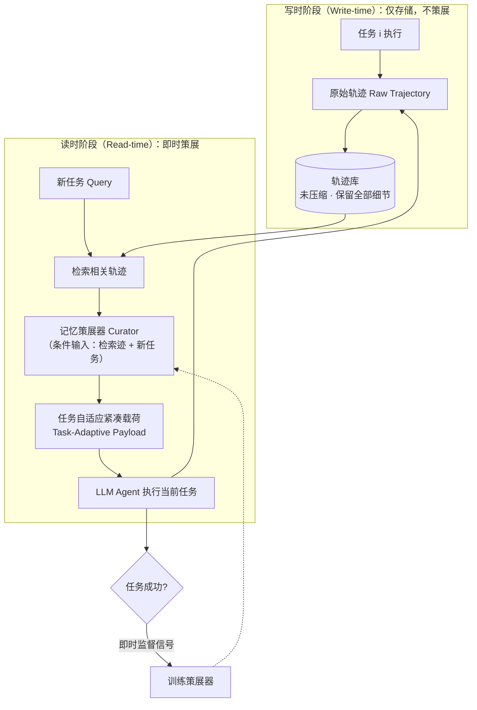
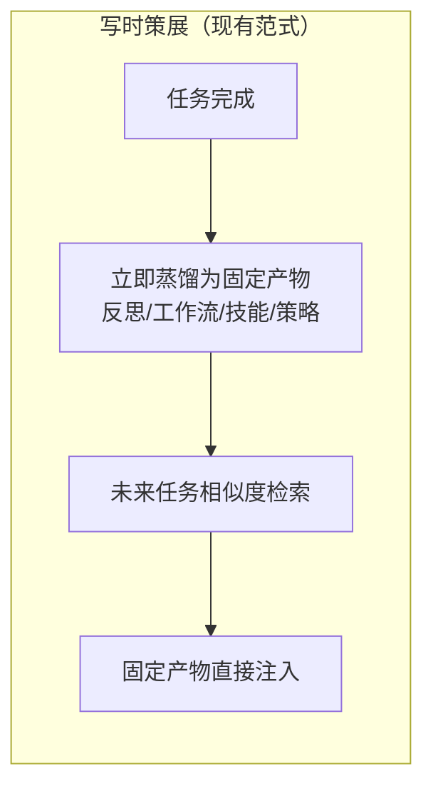

# 即时记忆：为 LLM 智能体学习策展任务自适应记忆

> **说明**：本次分析仅基于论文节选（标题、作者、摘要、引言前半部分，约 4000 字符），未包含方法细节章节、实验表格、消融数据与参考文献列表。凡节选中未出现的信息，一律标注"待补充"，不做推测性补全；对必要的架构推演，均明确标注为"基于摘要的推断"。

---

## 一、论文基础元数据

| 维度 | 内容 |
| ---- | ---- |
| 原文标题 | Just-in-Time Memory: Learning to Curate Task-Adaptive Memory for LLM Agents |
| 中文译版 | 即时记忆：为 LLM 智能体学习策展任务自适应记忆 |
| 发表渠道 | Preprint（预印本，隶属 Salesforce AI Research 技术报告序列）；期刊/会议等级待补充 |
| 发表时间 | 元数据标注为 2025 年；**注意：arXiv ID 为 2609.27334，按 arXiv 编号规则应对应 2026 年 9 月，二者存在不一致，待核实** |
| 链接 | arXiv:2609.27334（DOI 待补充） |
| 作者及核心机构 | Yefan Zhou\*、Yang Li\*、Zeyu Leo Liu、Semih Yavuz、Shafiq Joty（\* 表示共同一作）；机构：Salesforce AI Research |
| 研究领域 | 一级领域：人工智能 / 大语言模型；二级子领域：LLM Agent 记忆机制、Agent 经验复用与上下文工程（Context Engineering） |
| 关联数据集 | ALFWorld（文本化家务/具身交互环境）、WebShop（网页购物环境）、τ²-bench（tau-squared-bench，多轮工具调用/对话式 Agent 基准）；三者的规模、语言、标注形式在节选中未给出，**待补充** |

---

## 二、论文综合评价

### 2.1 量化评分

| 评价维度 | 评分 | 备注 |
| -------- | ---- | ---- |
| 📚 理论基础 | ⭐⭐⭐⭐ | 写时/读时策展二分法清晰，信用分配分析到位 |
| 🎯 问题核心性 | ⭐⭐⭐⭐ | 直击"何时固化记忆"这一记忆系统根本问题 |
| 💡 方法创新性 | ⭐⭐⭐⭐ | 延后策展至读时，载荷任务自适应且可同任务监督 |
| ⚙️ 技术壁垒 | ⭐⭐⭐ | 框架易于理解，壁垒主要在策展器训练与检索工程 |
| 🧪 实验严谨性 | ⭐⭐⭐ | 三基准提升明显，但节选未给表格与消融数据 |
| 🔧 落地可行性 | ⭐⭐⭐⭐ | 无需人工分组任务，可挂载于现有 Agent 管线 |
| 🚀 应用前景 | ⭐⭐⭐⭐ | 面向长时程 Agent 经验复用，通用性强 |
| 📊 综合评分 | 3.7 | 选题与范式切中要害，但节选信息不足以核验全部结论 |

> 评分依据说明：综合评分为前 7 项星级评分的算术平均（4+4+4+3+3+4+4）/7 ≈ 3.71 → 3.7。因缺少完整实验表格，`实验严谨性` 与 `技术壁垒` 按当前可见证据保守给分，若后续附录/消融充分可上调。

### 2.2 定性综合评价（≤300 字）

> 本文定位在 LLM Agent 的"记忆生命周期设计"这一元问题层面，提出以"策展时机"而非"策展形式"为切入点的 Just-in-Time Memory（JITMEM）。其核心价值在于指出主流写时（write-time）记忆存在两笔本质代价：一是信息丢弃过早且不可逆，二是单一固定产物须同时服务多种未知未来查询；并进一步指出写时策展器面临长时程信用分配难题——某条存储决策的价值可能要到很久之后才显现。差异化优势是把策展推迟到读时（read-time），在已知当前任务的前提下，由策展器从原始轨迹中即时合成紧凑、任务自适应的载荷；由于载荷当场被消费，策展器可直接以即时任务成功率作为监督信号，规避延迟效用与人为任务分组。关键结论：在 ALFWorld、WebShop、τ²-bench 上分别较最强基线提升 16.2、16.3、3.9 个绝对成功率点；且未训练的策展器已可比肩甚至超越基线，说明"读时任务自适应策展"本身即主要增益来源，训练则进一步叠加收益。

---

## 三、领域本体论映射

| 核心维度 | 具体内容 |
| -------- | -------- |
| 核心研究对象 | LLM Agent 跨任务经验复用中的**记忆策展时机**问题（write-time vs. read-time） |
| 核心技术路径 | 保留原始轨迹 → 读时检索相关轨迹 → 策展器合成任务自适应紧凑载荷 → 注入当前任务上下文 → 以即时任务成功信号训练策展器 |
| 数据/载体形态 | Agent 交互轨迹（原始、未压缩）；记忆产物为读时生成的"任务自适应载荷"（compact, task-adaptive payload，预期为自然语言文本，具体形式待补充） |
| 核心功能目标 | 在任何一条轨迹真正被复用之前不丢失信息，并让记忆表示随当前查询自适应，从而最大化未来任务效用 |
| 验证核心指标 | 任务绝对成功率（absolute success rate）及其相对最强基线的绝对提升幅度；ALFWorld / WebShop / τ²-bench 三环境 |

---

## 四、核心问题与解决方案

### 4.1 待解决的核心问题

1. **领域级根本问题**：Agent 记忆"只在其提升未来任务表现时才有用"，那么在 Agent 生命周期的**哪个阶段**塑造记忆，才能最好地服务这一目标？现有文献几乎默认在写时完成，这一默认从未被系统审视。
2. **现有方法痛点**：
   - **不可逆的过早信息丢失**：轨迹一旦被蒸馏为反思、工作流、技能或推理策略等固定产物，被丢弃的细节对后续依赖它的任务无法恢复。
   - **查询无关的单一产物**：同一段轨迹对不同未来任务的价值维度不同（文中以"家庭交互"为例，但举例句在节选中被截断，具体论述待补充），却必须由一个固定摘要承载。
   - **长时程信用分配困难**：某项存储决策的效用可能要等到很久之后的相关查询到来时才显现，导致写时策展器难以训练，并被迫引入人为的"相关任务分组"假设。
3. **工程落地卡点**：写时方案需要预先决定"什么值得记"，等于把未来任务分布的先验硬编码进系统；一旦先验失配，代价是永久性的，且难以在部署后修正。

### 4.2 核心解决方案

- **理论框架**：以"未来效用"为唯一目标函数，将记忆策展重新参数化为一个**时机选择问题**；论证读时策展把"延迟且稀疏的效用信号"转化为"同任务即时的、稠密的成功信号"。
- **核心架构**：JITMEM（Just-in-Time Memory）——原始轨迹**全量保留**（不做写时蒸馏），在推理时按当前任务检索相关轨迹，由**记忆策展器（memory curator）**合成一份紧凑、任务自适应的载荷并注入当前上下文。
- **关键技术**：① 读时检索（机制细节待补充，摘要中提及写时方案的检索通常为相似度搜索）；② 策展器对"检索到的轨迹 + 新任务"进行条件化压缩与改写；③ 策展器训练——直接以当前任务成功为监督信号（具体算法为 SFT、RL 或拒绝采样等，节选未说明，**待补充**）。
- **创新机制**：**取消"写时决策"这一不可逆动作**。因为策展产物在生成它的同一个任务上即被消费，策展器的训练无需等待未来查询、无需人工构造任务簇，天然绕开延迟信用分配。

### 4.3 核心优势（量化+定性）

1. **性能优势**：相较最强基线，ALFWorld +16.2、WebShop +16.3、τ²-bench +3.9 绝对成功率点（数值来自摘要，具体基线名称与逐项对比表在节选中缺失，**待补充**）。
2. **效率优势**：记忆产物为"紧凑（compact）载荷"，相较把原始轨迹全部塞入上下文可显著压降上下文开销；同时免去了写时蒸馏的推理开销与任务分组的人工成本。具体 token/耗时数据**待补充**。
3. **工程优势**：
   - 无需人为假设"哪些任务彼此相关"，降低了对任务分布先验的依赖；
   - 原始轨迹保留使信息在原则上可完全恢复，系统具备事后可修正性；
   - **消融性发现**：未训练的策展器已可与基线持平或超越，说明增益主要来自"读时任务自适应策展"这一机制本身，而非训练技巧，便于低成本试部署。

---

## 五、方法与技术架构

### 5.1 核心架构设计

> **注意**：以下流程依据摘要与引言推断，节选中尚未给出正式方法章节与系统图，细节（检索器类型、策展器基座、训练目标、载荷格式）均待补充。

**与写时范式的对照（基于摘要）**

### 5.2 关键技术实现细节

| 技术模块 | 实现路径 | 工程注意事项 |
| -------- | -------- | ------------ |
| 轨迹存储（Write） | 任务完成后保留原始轨迹，不做蒸馏或丢弃 | 存储成本随时长线性增长，需考虑压缩/归档策略（原文未述，待补充） |
| 轨迹检索（Read） | 依据当前任务检索相关轨迹；写时范式常采用相似度搜索，JITMEM 的检索器具体形式待补充 | 检索召回质量直接决定策展载荷上限；需防噪声轨迹污染上下文 |
| 记忆策展器 Curator | 输入"检索到的轨迹 + 新任务"，输出紧凑、任务自适应载荷 | 需保证载荷紧凑可控（token 预算），并避免幻觉改写轨迹事实 |
| 策展器训练 | 以当前任务的即时应答/成功信号作为监督（算法细节待补充） | 避免退化为"直接复述轨迹"；需构造稳定的成功信号 |
| 依赖组件 | LLM 基座（策展器与 Agent）、检索/嵌入组件、三个评测环境（ALFWorld、WebShop、τ²-bench） | 基座与超参未在节选中披露，复现需等待正文/附录 |

### 5.3 架构优缺点

- **优点**：
  - 消除写时决策的不可逆信息损失，记忆保真度原则上最高；
  - 载荷随查询自适应，一份轨迹可以按不同任务被"重新解读"；
  - 训练信号即时可得，绕开长时程信用分配与人为任务分组；
  - 机制增益与训练增益解耦（未训练策展器已具竞争力），便于渐进式落地。
- **缺点 / 待验证**：
  - 读时策展引入**每任务一次额外的 LLM 调用**，推理延迟与成本上升；摘要未给出延迟/成本数据（**待补充**）；
  - 原始轨迹长期累积带来存储与检索召回压力，可扩展性未在节选中讨论；
  - 策展器质量成为新的单点依赖，其失效模式（幻觉、过度压缩、遗漏关键细节）未在节选中分析。

---

## 六、实验设计与结果分析

### 6.1 实验基础设置

| 维度 | 内容 |
| ---- | ---- |
| 数据集 | ALFWorld、WebShop、τ²-bench（三者规模、任务数、划分方式在节选中未给出，**待补充**） |
| 基线方法 | 摘要明确提及三类对照：① no-memory agents（无记忆智能体）；② heuristic write-time memory methods（启发式写时记忆）；③ learned write-time memory methods（可学习的写时记忆）。具体方法名（如 Reflexion / ExpeL / 工作流或技能类方法）节选未指明，**待补充** |
| 实验环境 | 三个基准对应的交互环境；模型基座、算力配置、运行轮次**待补充** |
| 评价指标 | 绝对成功率（absolute success rate）及其相对最强基线的绝对提升（points） |

### 6.2 核心实验结果

> 节选仅提供摘要中的概括性数字，未给出逐方法结果表，故下表仅能填写本文方法相对最强基线的**提升幅度**；基线与方法的具体数值**待补充**。

| 方法 | ALFWorld（成功率） | WebShop（成功率） | τ²-bench（成功率） | 工程指标（算力/耗时） |
| ---- | --------- | --------- | --------- | -------------------- |
| 无记忆智能体 | 待补充（低于本文方法） | 待补充 | 待补充 | 待补充 |
| 启发式写时记忆基线 | 待补充 | 待补充 | 待补充 | 待补充 |
| 可学习写时记忆基线（最强基线） | 基准值 | 基准值 | 基准值 | 待补充 |
| **本文方法 JITMEM** | **+16.2 点（绝对）** | **+16.3 点（绝对）** | **+3.9 点（绝对）** | 待补充 |

### 6.3 消融实验/鲁棒性分析

| 实验变体 | 指标变化 | 核心结论 |
| -------- | -------- | -------- |
| 未经训练的策展器（untrained curator） | 摘要称"已可与这些基线持平或超越" | 增益主要来源是**读时任务自适应策展机制本身**，而非训练 |
| 训练后的策展器 | 在未训练版本基础上进一步提升 | 训练产生**叠加式（compounds）**收益 |
| 其他消融（载荷长度、检索质量、不同基座等） | 节选未提及 | **待补充** |

### 6.4 实验结论（工程视角）

1. 读时策展对**环境类型具有普适性**：在具身交互类（ALFWorld）、网页操作类（WebShop）、多轮工具调用类（τ²-bench）三类差异较大的任务形态上均取得正向提升。
2. 提升幅度存在**明显环境差异**：ALFWorld/WebShop 上的 +16 点级别提升远大于 τ²-bench 的 +3.9 点。这提示：任务结构越"可迁移、可复用"、历史经验越有用，读时策展收益越大；而对强依赖即时观察与工具状态的任务，记忆的边际价值相对有限。**该解读为基于数字的推断，原文是否给出机理解释待核实。**
3. **机制红利先于训练红利**：未训练即可用的特性意味着可以低风险先接入、后调优，工程落地路径平滑。
4. 需要注意：由于缺少延迟、token 消耗与存储开销数据，目前**无法判断**"每任务一次策展调用"的成本是否被性能增益合理覆盖。

---

## 七、领域贡献与创新点

| 贡献层级 | 具体内容 |
| -------- | -------- |
| 理论贡献 | 将 Agent 记忆研究的关键变量从"如何策展"转向"何时策展"，系统论证写时策展的两笔成本（不可逆信息丢失、查询无关的单一产物）与由此衍生的长时程信用分配难题 |
| 方法/架构贡献 | 提出 JITMEM：写时只保留原始轨迹，读时基于当前任务生成紧凑任务自适应载荷；并利用"载荷当场被消费"这一特性，使策展器可直接从即时任务成功中学习 |
| 数据/工具贡献 | 节选未提及数据集或开源工具发布；**待补充**（如有代码/轨迹库发布需在正文确认） |
| 实验/验证贡献 | 在 ALFWorld、WebShop、τ²-bench 三个异构基准上，相较无记忆、启发式写时记忆与可学习写时记忆方法均取得一致的绝对成功率提升（16.2 / 16.3 / 3.9 点） |
| 工程落地贡献 | 免去人工任务分组假设、保留可恢复的原始信息、且存在"零训练即可用"的退路，为 Agent 记忆系统提供了成本更可控的替代设计 |

---

## 八、局限性与风险

| 维度 | 具体描述 | 应对思路 |
| ---- | -------- | -------- |
| 学术局限性 | ① 节选未提供消融细节，无法核验各组件（检索、载荷压缩、训练目标）的独立贡献；② 仅在三个文本/工具型基准上验证，未覆盖超长时程、多模态或真实生产环境；③ 写时与读时并非完全对立，混合策略的可能性未在节选中讨论 | 补充组件消融与混合时机策略研究；在更长时程任务流上验证记忆的复利效应 |
| 工程落地风险 | ① 每任务额外一次策展 LLM 调用，带来延迟与成本上升，节选无相关指标；② 原始轨迹库随任务数线性膨胀，检索召回与存储成本可能成为瓶颈；③ 策展器改写可能引入幻觉或丢失关键细节，形成新的单点故障 | 引入 token 预算与压缩/归档策略；对载荷做事实一致性校验；缓存高频任务的策展结果 |
| 伦理/合规风险 | 长期保留原始轨迹意味着**用户交互与操作细节被完整持久化**，隐私与数据留存合规风险高于写时蒸馏方案（蒸馏本身具备一定脱敏副作用） | 落库前做 PII 过滤与脱敏；设置轨迹 TTL 与访问审计；提供可遗忘（right-to-be-forgotten）接口 |

---

## 九、未来研究/落地方向

| 方向类型 | 具体内容 | 优先级 |
| -------- | -------- | ------ |
| 科研拓展 | 探索写时与读时策展的混合最优时机策略；研究策展器的长时程复利效应与"记忆污染"抑制；拓展到多模态 Agent 与超长任务流 | 高 |
| 工程优化 | 降低读时策展的延迟与成本（小模型策展器、缓存、批处理）；设计轨迹库的分层索引与生命周期管理；量化"载荷长度 vs. 成功率"的帕累托曲线 | 高 |
| 跨领域适配 | 迁移到代码 Agent、科研 Agent、企业流程自动化等需要跨任务经验沉淀的场景；验证在领域漂移下的鲁棒性 | 中 |

---

## 十、关键词与术语表

| 语言 | 关键词 |
| ---- | ------ |
| 中文 | 即时记忆；读时策展；写时策展；任务自适应载荷；LLM 智能体；经验复用；信用分配；上下文工程 |
| 英文 | Just-in-Time Memory (JITMEM); read-time curation; write-time curation; task-adaptive payload; LLM agents; memory curator; long-horizon credit assignment; agentic memory |
| 领域专属术语 | **Write-time memory（写时记忆）**：任务完成后立即将轨迹蒸馏为固定产物（反思/工作流/技能/推理策略）以备未来检索。 **Read-time curation（读时策展）**：不在写时蒸馏，而在当前任务已知时，从原始轨迹实时合成记忆载荷。 **Memory curator（记忆策展器）**：给定"检索到的历史轨迹 + 新任务"，输出紧凑任务自适应载荷的组件。 **Task-adaptive payload（任务自适应载荷）**：为当前任务定制、在本次任务中即被消费的紧凑记忆产物。 **Long-horizon credit assignment（长时程信用分配）**：存储决策的收益要等到很久之后才可观测，导致写时策展器难以训练的问题。 |

---

## 十一、参考文献与关联资源

- **核心参考文献**（均来自节选正文引用，按引用编号整理；节选未附完整参考文献列表，作者—标题的严格对应关系**待核实**）：
  - Shinn et al., 2023 — 代表性写时记忆（反思类）方法
  - Zhao et al., 2024 — 自然语言洞察式记忆
  - Wang et al., 2023 — 可执行技能式记忆
  - Wang et al., 2024a — LLM Agent 长时程任务序列相关
  - Wang et al., 2024b — 可复用工作流式记忆
  - Ouyang et al., 2026a / 2026b — 技能与可迁移推理策略式记忆
  - Fang et al., 2026 — 推理策略迁移相关
  - Luo et al., 2026 — 长时程任务序列相关
- **补充阅读**：Agentic memory 综述类文献（节选未列，**待补充**）；三大评测基准自身论文：ALFWorld、WebShop、τ²-bench（**待补充具体出处**）
- **开源代码/工具**：节选未提及代码或数据发布信息，**待补充**（建议查阅 arXiv 摘要页的 "Code" / "Project Page" 链接）

---

## 十二、阅读者批注

1. **科研启发**：本文最大的方法论价值在于"把默认设定当成研究对象"。记忆文献长期默认"写时决定记什么"，本文只挪动了一个时间点（write → read），就同时解开了信息损失与信用分配两道难题。这提示了一条通用研究套路：**当一个领域所有方法共享同一个未言明的时间/顺序假设时，重新审视该假设往往比在既有框架内做增量改进更有价值。** 另外，"未训练策展器已具竞争力"这一发现值得注意——它暗示该方法的收益可能主要来自**条件化（conditioning）本身**，而非学习，这为后续做更精细的归因分析留出空间。

2. **工程落地思考**：落地路径相对友好。可以先做"零训练版本"接入现有 Agent 管线，验证收益后再决定是否投入策展器训练。但必须提前解决两件事：一是**成本核算**——每任务一次额外 LLM 调用在读多写少的场景可能不划算，而在写多读少或记忆复用率高的场景收益显著；二是**轨迹库治理**——原始轨迹永久保留对存储、隐私合规与检索质量都是压力，需要 TTL、分层索引与脱敏前置。

3. **待验证/存疑点**：
   - **数值可核验性**：16.2 / 16.3 / 3.9 三个提升幅度仅见于摘要，节选未提供结果表；"最强基线"具体指向哪个方法亦未明确，无法独立判断是否存在选择性对比。
   - **τ²-bench 提升明显偏小（+3.9）**：论文是否解释了这一差异？是记忆价值本身受限，还是策展器在该域失效？原文解释待查。
   - **"未训练策展器"的具体定义**：是纯提示词驱动的 LLM（zero-shot prompt）还是某种无梯度规则系统？这直接决定该结论的解释力。
   - **元数据不一致**：arXiv ID 2609.27334 与标注年份 2025 冲突（2609 对应 2026 年 9 月），需以官方页面为准。
   - **方法细节缺失**：检索器、载荷格式、训练算法（SFT/RL/拒绝采样）、基座模型均未在节选中披露。

4. **个人/团队应用场景**：适用于**跨任务经验可沉淀**的 Agent 产品线，例如自动化测试与研发 Agent（同一代码库反复操作）、客服/运营 Agent（重复业务流程）、多轮工具调用型助手。建议先在"任务族密集、历史经验复用率高"的闭环场景做 A/B 验证，并同步埋点采集"策展 token 成本 vs. 成功率增益"曲线，用数据决定是否推广至读多写少的开放场景。

---

## 十三、阅读元信息

| 维度 | 内容 |
| ---- | ---- |
| 阅读日期 | 2026-09-30 23:01 |
| 阅读人 | xPaperReader AI |
| 文档编号 | arxiv-2609.27334 |
| 版本迭代 | v1.0 |
| 本次阅读材料范围 | 标题、作者、摘要、引言前半部分（约 4000 字符），**未含方法、实验表格、消融、参考文献** |
| 信息完整度声明 | 本报告中标注"待补充"的字段，均为节选材料中确实缺失的信息，未做任何推测性填充；标注"推断"的内容已显式说明依据 |