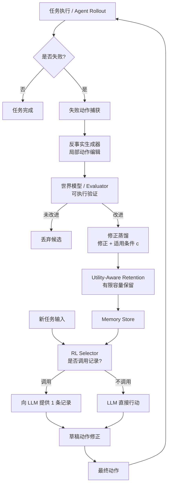

# 世界模型验证的语言智能体反事实记忆

## 一、论文基础元数据
- **原文标题**：COUNTERMEM: World-Model Verified Counter-Factual Memory for Language Agents
- **中文译版**：世界模型验证的语言智能体反事实记忆
- **发表渠道**：arXiv 预印本（等级：待补充，未标注会议/期刊）
- **发表时间**：2025 年（具体月份待补充）
- **链接**：arXiv:2609.31874（DOI 待补充）
- **作者及核心机构**：Hongji Pu、Ruixiang Tang、Yongfeng Zhang（核心机构待补充，推测涉及信息检索/智能体研究团队）
- **研究领域**：
  - 一级领域：人工智能 / 自然语言处理
  - 二级子领域：LLM 智能体记忆与经验学习、智能体决策优化
- **关联数据集**：
  - 覆盖 **12 个 benchmark、6 个领域**（具体数据集名称待补充）
  - 语言：英文（推断）
  - 标注：任务级成功/失败信号 + 可执行验证环境（verifier）

## 二、论文综合评价
### 2.1 量化评分（1-5分，5分为最优）

| 评价维度 | 评分 | 备注 |
| -------- | ---- | ---- |
| 📚 理论基础 | ⭐⭐⭐⭐ | 融合反事实推理、世界模型与记忆学习 |
| 🎯 问题核心性 | ⭐⭐⭐⭐⭐ | 直击智能体记忆负迁移与误用瓶颈 |
| 💡 方法创新性 | ⭐⭐⭐⭐ | 反事实修正+验证+RL选择器组合新颖 |
| ⚙️ 技术壁垒 | ⭐⭐⭐⭐ | 需可执行验证环境与状态重置机制 |
| 🧪 实验严谨性 | ⭐⭐⭐⭐ | 严格held-out跨域验证，消融充分 |
| 🔧 落地可行性 | ⭐⭐⭐ | 依赖验证器，部署门槛较高 |
| 🚀 应用前景 | ⭐⭐⭐⭐ | 智能体经验学习方向应用空间广阔 |
| 📊 综合评分 | 4.0 | 闭环设计扎实、实验严格，但安全部署与成本证据待补 |

### 2.2 定性综合评价（≤300字）
> 本文定位为语言智能体的“经验复用”基础设施，核心价值在于提出**经世界模型验证的反事实记忆**机制：从失败动作中构造局部反事实替代并验证其有效性，将有效修正蒸馏为带适用条件 c 的记录，通过 utility-aware retention 与 RL 选择器实现条件化复用。差异化优势在于——不再盲目积累全部经验，而是只保留“已验证有效的修正”，并通过选择器判断“何时复用”，从机理上抑制负迁移。关键结论：在 12 个 benchmark、6 个领域上，CounterMem 相对无记忆提升 8.2–20.4pp（gpt-oss-120b 平均 +12.6 分），任务 token 消耗下降 7.7%–42.0%，且保留规则效用排序（utility 65.3 > similarity 59.8 > recency 54.2 > random 51.7）验证了效用感知保留的有效性。但作者亦坦承：局部验证不等于普遍正确，记忆过时与单记录选择器容量是核心边界。

## 三、领域本体论映射
| 核心维度 | 具体内容 |
| -------- | -------- |
| 核心研究对象 | 语言智能体（LLM Agent）的跨任务经验记忆与复用机制 |
| 核心技术路径 | 反事实动作生成 → 世界模型/评估器验证 → 修正蒸馏 → 效用保留 → RL 选择性复用 |
| 数据/载体形态 | 失败轨迹（状态-动作对）、反事实修正记录（含适用条件 c）、任务执行环境与验证器 |
| 核心功能目标 | 让历史失败经验以“条件化修正”形式安全迁移到新任务，提升成功率并降低 token 消耗 |
| 验证核心指标 | held-out 任务分数（四域均值）、任务运行 token、保留规则效用排序、跨域领先计数（11/16） |

## 四、核心问题与解决方案
### 4.1 待解决的核心问题
1. **领域级根本问题**：语言智能体能否从历史失败中学习“可迁移的修正”，而非单纯积累经验？如何避免经验复用带来的负迁移？
2. **现有方法痛点**：
   - 直接存储全部经验（如 Reflexion）会导致记忆膨胀与噪声累积；
   - 相似度检索无法判断“记录是否真正适用”；
   - 无验证的经验可能导致错误修正被复用，反而降低性能；
   - ReasoningBank 等随源任务增加出现“先升后降”的记忆退化。
3. **工程落地卡点**：
   - 需要可执行验证器与状态重置/复制能力；
   - 记忆过时（工具、schema、需求变化）导致负迁移；
   - 选择器仅见压缩特征且最多选一条记录，无法组合多修正；
   - 端到端训练成本、运行时成本与安全部署证据不足。

### 4.2 核心解决方案
- **理论框架**：反事实推理 + 世界模型验证 + 条件化经验复用，构成“生成-验证-保留-复用”闭环。
- **核心架构**：
  - **反事实生成器**：对失败动作做局部编辑，产生替代动作；
  - **世界模型/评估器**：在执行环境中验证替代动作是否带来改进；
  - **修正蒸馏器**：将有效修正编码为记录 (修正内容, 适用条件 c)；
  - **效用感知保留**：在有限容量下按效用而非相似度/新近度保留；
  - **RL 选择器**：依据当前任务状态决定是否调用某条记录修正草稿动作。
- **关键技术**：局部反事实编辑、可执行验证、适用条件建模、utility-aware retention、RL-based selector。
- **创新机制**：将“记忆的价值”定义为“被验证的修正增益”，并用选择器决定“是否使用”而非“是否检索”。

### 4.3 核心优势（量化+定性）
1. **性能优势**：四组 agent–LLM 中提升 8.2–20.4pp；gpt-oss-120b + ReAct 四域均值 39.0 → 57.5；即使在 Reflexion 之上仍可提升（+8.2pp / +20.4pp）；四域均值全部最高，11/16 领域比较领先。
2. **效率优势**：任务运行 token 相对无记忆下降 7.7–42.0%；相比 Best-of-N（8.2–10.0M token），CounterMem 仅 2.9–4.8M token 且平均分数更高。
3. **工程优势**：效用感知保留在相同容量下优于相似度/新近度/随机（65.3 vs 59.8/54.2/51.7），说明收益来自保留规则设计而非容量堆叠；随源任务增多，held-out 分数持续上升，早期任务性能损失更小。

## 五、方法与技术架构
### 5.1 核心架构设计
> CounterMem 的整体流水线：智能体执行任务 → 失败动作被捕获 → 反事实生成器构造局部替代 → 世界模型/评估器验证是否改进 → 有效修正被蒸馏为带适用条件 c 的记录 → utility-aware retention 决定保留/淘汰 → RL 选择器在后续任务中决定是否调用记录修正草稿动作 → 输出最终动作。

### 5.2 关键技术实现细节
| 技术模块 | 实现路径 | 工程注意事项 |
| -------- | -------- | ------------ |
| 反事实生成器 | 对失败动作做局部编辑，生成替代动作 | 局部编辑可能漏掉需要完全不同计划的失败 |
| 世界模型/评估器 | 在执行环境中运行替代动作，检查是否改进 | 需在测试前重置/复制状态；验证套件可能遗漏边界情况 |
| 修正蒸馏 | 将有效修正编码为（修正内容，适用条件 c） | 参考检查可能仅覆盖单一输入，泛化性需谨慎 |
| Utility-Aware Retention | 按效用排序保留高价值记录 | 容量有限时需平衡效用与多样性 |
| RL Selector | 基于任务特征决定是否调用某条记录 | 仅见压缩特征，最多选一条，无法组合多记录 |
| 依赖组件 | 可执行验证环境、状态管理、检索与上下文模块 | 工具/schema 变化会使记录过时 |

### 5.3 架构优缺点
- **优点**：
  - 以“验证”作为记忆准入门槛，从源头抑制不可靠经验；
  - 适用条件 c 显式建模“何时有效”，比纯相似度检索更精准；
  - RL 选择器实现“用不用”的决策，而非“检索到就用”；
  - 效用保留在有限容量下最大化经验价值密度。
- **缺点**：
  - 强依赖可执行验证器与状态重置能力，非所有任务可满足；
  - 选择器容量受限（最多一条记录），无法组合多修正；
  - 记忆过时检测与退役机制缺失；
  - 未隔离 DQN selector 相对固定 selector 的增量收益；
  - 端到端训练/运行时/财务成本未完整报告。

## 六、实验设计与结果分析
### 6.1 实验基础设置
| 维度 | 内容 |
| ---- | ---- |
| 数据集 | 12 个 benchmark、6 个领域；构建/训练任务与评估任务严格不相交（具体数据集名待补充） |
| 基线方法 | 无记忆（No Memory）、Reflexion、ReasoningBank、Best-of-N 等 |
| 实验环境 | 两个 backbone（gpt-oss-120b 与 Gemini 3.1 Flash-Lite）；四组 agent–LLM 组合 |
| 评价指标 | held-out 任务分数、四域均值、任务运行 token、保留规则效用得分、跨域领先计数 |

### 6.2 核心实验结果
| 方法 | 核心指标1（四域均值/gpt-oss-120b+ReAct） | 核心指标2（相对提升） | 工程指标（token） |
| ---- | --------- | --------- | -------------------- |
| 无记忆 | 39.0 | — | 基线 |
| 本文方法（CounterMem） | 57.5 | +18.5pp | 下降 7.7–42.0% |
| Reflexion 之上 | — | +8.2pp（gpt-oss-120b）/ +20.4pp（Gemini） | — |
| Best-of-N | 平均分数更低 | — | 8.2–10.0M token（CounterMem 仅 2.9–4.8M） |

### 6.3 消融实验/鲁棒性分析
| 实验变体 | 指标变化 | 核心结论 |
| -------- | -------- | -------- |
| 保留规则：utility | 65.3 | 最优，效用感知保留有效 |
| 保留规则：similarity | 59.8 | 次优，但差距明显 |
| 保留规则：recency | 54.2 | 新近度并非有效代理 |
| 保留规则：random | 51.7 | 随机底线 |
| 源任务数量增加 | CounterMem 持续上升；ReasoningBank 先升后降 | CounterMem 记忆质量更稳健 |
| 检索/上下文成本 | 两者均上升 | 成本随规模增长是共同挑战 |
| 早期任务性能保持 | CounterMem 损失更小 | 但不能完全保持旧性能 |

### 6.4 实验结论（工程视角）
- 反事实记忆的收益需同时满足两个条件：**验证过的修正** + **适当的复用**；任一环节错配都会抹去收益甚至造成伤害。
- 效用感知保留优于相似度/新近度，说明“选什么存”比“存多少”更关键。
- Best-of-N 虽消耗更多 token 但平均分数更低，表明 CounterMem 的“经验复用”路径在成本-效果上优于暴力采样。
- 严格 held-out 与冻结记忆/策略的评估协议，使结论更具可信度。
- 端到端训练成本、运行时成本与安全部署证据仍不充分。

## 七、领域贡献与创新点
| 贡献层级 | 具体内容 |
| -------- | -------- |
| 理论贡献 | 提出“经验证的反事实修正 + 条件化复用”闭环，将记忆价值锚定于可验证增益 |
| 方法/架构贡献 | 反事实生成器、世界模型验证、修正蒸馏、效用保留、RL 选择器五模块协同架构 |
| 数据/工具贡献 | 构建跨 12 benchmark/6 领域的严格 held-out 评估协议（工具/代码开源状态待补充） |
| 实验/验证贡献 | 多 backbone、多基线对比，揭示效用保留排序与源任务规模效应 |
| 工程落地贡献 | 为智能体记忆系统提供可操作设计范式：验证准入 + 条件复用 + 效用保留 |

## 八、局限性与风险
| 维度 | 具体描述 | 应对思路 |
| ---- | -------- | -------- |
| 学术局限性 | 验证套件可能遗漏案例；参考检查可能仅覆盖单一输入；局部验证不等于普遍正确；小编辑可能漏掉需不同计划的失败 | 扩展验证覆盖面；引入多种输入验证；对失败类型分类处理 |
| 工程落地风险 | 工具/schema/需求变化使记录过时；源任务有效修正可能损害不同任务；selector 仅选一条，无法组合多修正；端到端成本未完整报告 | 过时记录检测与退役；多记录组合；报告完整训练/运行时成本 |
| 伦理/合规风险 | 记忆复用可能放大偏见或错误模式；安全部署证据不足 | 建立记忆审计与回滚机制；引入安全评估环节 |

## 九、未来研究/落地方向
| 方向类型 | 具体内容 | 优先级 |
| -------- | -------- | ------ |
| 科研拓展 | 组合多个已验证记录以形成单一修正；过时记录检测与退役机制 | 高 |
| 工程优化 | 报告端到端训练与运行时成本；保留任务运行交互指标；隔离 DQN selector 相对固定 selector 的增益 | 高 |
| 跨领域适配 | 将验证-复用闭环推广至更多工具类、Web、软件工程等可执行环境 | 中 |

## 十、关键词与术语表
| 语言 | 关键词 |
| ---- | ------ |
| 中文 | 反事实记忆、世界模型、语言智能体、经验复用、负迁移、效用感知保留、条件化修正 |
| 英文 | CounterFactual Memory, World Model, Language Agent, Experience Reuse, Negative Transfer, Utility-Aware Retention, Conditional Correction |
| 领域专属术语 | **CounterMem**（本文方法名）；**适用条件 c**（记录生效的任务/状态条件）；**held-out 评估**（构建/训练与评估任务不相交）；**utility-aware retention**（按效用保留）；**RL Selector**（决定是否调用记录的强化学习选择器）；**Reflexion**（基于自我反思的经验积累基线）；**ReasoningBank**（经验库基线） |

## 十一、参考文献与关联资源
- **核心参考文献**：Reflexion、ReasoningBank、Best-of-N 等智能体记忆与经验学习方法（具体引用待补充）
- **补充阅读**：反事实推理、世界模型、LLM Agent 记忆综述（待补充）
- **开源代码/工具**：待补充

## 十二、阅读者批注
1. **科研启发**：“验证准入 + 条件复用”两段式设计可迁移到其他经验学习场景；将记忆价值定义为可验证增益，为记忆评估提供新指标。
2. **工程落地思考**：可执行验证器是最大依赖，适合工具调用、代码执行、Web 任务等有明确成功信号的环境；在无验证器的开放域任务中需替代方案。
3. **待验证/存疑点**：
   - DQN selector 相对固定 selector 的增量收益未隔离；
   - 端到端训练/运行时/财务成本未完整报告；
   - 记忆过时与负迁移的检测机制缺失；
   - 12 个 benchmark 的具体名称与领域分布待补充。
4. **个人/团队应用场景**：可用于构建企业级智能体经验中台——在工具调用/工作流自动化场景中沉淀“已验证修正”，降低重复试错成本。

## 十三、阅读元信息
| 维度 | 内容 |
| ---- | ---- |
| 阅读日期 | 2026-09-30 23:04 |
| 阅读人 | xPaperReader AI |
| 文档编号 | arxiv-2609.31874 |
| 版本迭代 | v1.0 |