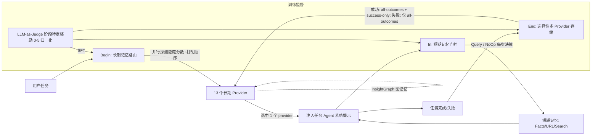

# MemAgent：学习为LLM智能体管理异构记忆提供者

## 一、论文基础元数据
- **原文标题**：MemAgent: Learning to Manage Heterogeneous Memory Providers for LLM Agents
- **中文译版**：MemAgent：学习为LLM智能体管理异构记忆提供者
- **发表渠道**：arXiv 预印本（等级：预印本，未经同行评审确认）
- **发表时间**：2025年（具体月份待补充）
- **链接**：arXiv:2609.32521（DOI 待补充）
- **作者及核心机构**：Yongxian Wei、Yilin Zhao、Runxi Cheng、Xinrui Chen、Chun Yuan、Yaoru Wang、Jiahong Yan、Dian Li（具体机构归属原文未在提供材料中明确，待补充）
- **研究领域**：人工智能 → LLM Agent / 智能体记忆管理与推理时编排
- **关联数据集**：
  - GAIA（Level 1–3，通用助手多步工具调用基准，英文）
  - WebWalkerQA（Web 导航问答基准，英文）
  - xBench-DS（数据科学类 Agent 基准，英文）
  - TaskCraft（合成多跳任务，用于训练，120 条）
  - 训练集合计 173 条（53 条 GAIA L1 + 120 条 TaskCraft）

## 二、论文综合评价

### 2.1 量化评分（1-5分，5分为最优）

| 评价维度 | 评分 | 备注 |
| -------- | ---- | ---- |
| 📚 理论基础 | ⭐⭐⭐⭐ | 基于13种记忆方法的实证刻画，理论形式化偏浅 |
| 🎯 问题核心性 | ⭐⭐⭐⭐⭐ | 直击Agent记忆异构性与路由选择的核心矛盾 |
| 💡 方法创新性 | ⭐⭐⭐⭐ | 三阶段路由框架新颖，组件多为工程整合 |
| ⚙️ 技术壁垒 | ⭐⭐⭐ | LoRA微调+并行探测，门槛中等，易被复现 |
| 🧪 实验严谨性 | ⭐⭐⭐⭐ | 三基准+消融+零样本迁移全面，但训练/评估有重叠 |
| 🔧 落地可行性 | ⭐⭐⭐⭐⭐ | 4B小模型、1.2K token、1.2秒开销，易部署 |
| 🚀 应用前景 | ⭐⭐⭐⭐⭐ | Agent记忆管理为刚需，方案可插拔复用 |
| 📊 综合评分 | 4.3 | 视角新颖、证据充分、开销极低，但理论上限与泄露风险待解 |

### 2.2 定性综合评价（≤300字）
> 本文从"异构性"视角重新审视 LLM Agent 记忆管理，指出**不存在通用记忆**：13 种代表性记忆方法在 GAIA/WebWalkerQA/xBench-DS 上表现互补，Oracle 上限 89.6% 远超最佳单 provider 71.0%，且 13 个 provider 中有 10 个能独特解决至少一个任务。据此提出 MemAgent，将记忆管理形式化为推理时策略，覆盖记忆生命周期三阶段：Begin（长期记忆路由，内容感知探测 + 隐藏检索分数 + 顺序打乱）、In（短期记忆门控，Query/NoOp 保守注入）、End（选择性多 provider 存储，3–8 个）。用 Qwen3.5-4B+LoRA（0.84% 可训练参数）微调，借助 LLM-as-Judge 阶段特定奖励解决延迟信用分配。平均准确率提升 10.0%，路由注入约 1.2K token（<0.5%）、延迟约 1.2 秒（<0.3%），任务步数降 12%。差异化优势在于"路由而非取代"，可与任意任务 agent 组合，具备良好工程性价比。

## 三、领域本体论映射
| 核心维度 | 具体内容 |
| -------- | -------- |
| 核心研究对象 | LLM Agent 的异构长期/短期记忆 provider 集合及其路由策略 |
| 核心技术路径 | 三阶段（Begin/In/End）内容感知路由 + 轻量 LoRA 策略模型 + LLM-as-Judge 监督合成 |
| 数据/载体形态 | 13 个长期记忆 provider（探索记忆、经验学习、工作流模板、程序记忆、原则演化、图结构等）+ 自定义短期记忆（事实/URL/搜索历史）+ InsightGraph 图记忆 |
| 核心功能目标 | 在任务前选最优长期 provider、任务中门控短期注入、任务后选择性存储，最大化任务成功率同时控制开销 |
| 验证核心指标 | GAIA/WebWalkerQA/xBench-DS 准确率、Token 开销、路由延迟、平均任务步数、L3 分布 |

## 四、核心问题与解决方案

### 4.1 待解决的核心问题
1. **领域级根本问题**：LLM Agent 记忆机制缺乏统一范式，不同任务所需的记忆表示（相似性检索、结构抽象、洞见累积）本质不同，单一记忆方法无法覆盖全任务分布。
2. **现有方法痛点**：
   - 单一 provider 存在明显偏科：AWM 在 GAIA +6.1% 但 WebWalkerQA -0.6%；ExpeL 在 WebWalkerQA +7.6% 但 GAIA 仅中等。
   - 全量拼接/融合（All-Concat、All-Fuse）引入噪声，性能不升反降。
   - 不同 provider 检索分数尺度不可比，直接作为监督信号会产生偏置。
3. **工程落地卡点**：延迟信用分配（记忆选择的对错要到任务结束才显现）、路由开销必须远小于任务本身、需要可插拔的 provider 池而不是重训整个 Agent。

### 4.2 核心解决方案
- **理论框架**：将记忆管理形式化为**推理时策略**——在记忆生命周期三阶段（检索→使用→存储）中的离散决策问题，用轻量策略模型学习路由。
- **核心架构**：MemAgent 三阶段路由器
  - **Begin**：并行探测 13 个长期 provider 获取内容预览；**隐藏检索分数**并按随机顺序展示，避免模型依赖分数尺度与位置偏置；选 1 个 provider 注入任务 agent 系统提示。
  - **In**：每步二选一 `Query`/`NoOp`，决定是否注入短期记忆；短期记忆仅保留规则提取的 verified facts（容量 15）、URL history（30）、search history（20），保守显示策略。
  - **End**：任务完成后只选 3–8 个 provider 存储轨迹；成功时可选 all-outcomes 与 success-only provider，失败时只选 all-outcomes provider 以免污染检索池。
- **关键技术**：内容感知探测（内容预览而非检索分数）；自定义 **InsightGraph**（节点为可复用 insight，边含 same-task / similar-concept，检索结合 TF-IDF + 嵌入相似度 + 图扩展，边权自适应）；阶段特定 LLM-as-Judge 奖励（0–5 归一化，噪声/错失机会维度取反）。
- **创新机制**：将"设计更好的单记忆"转换为"学习在异构 provider 间路由"，并用数据合成管线解决延迟信用分配。

### 4.3 核心优势（量化+定性）
1. **性能优势**：三基准平均准确率 **+10.0%**；GAIA 4B 路由 69.7%、9B 路由 70.9%、零样本 GPT-5.6 Luna 达 71.5%；L3 难题在 Begin 过滤下从 34.6%→50.0%。
2. **效率优势**：每任务注入约 **1.2K token**（<0.5% 任务 token）；路由总延迟 **1.2 秒/任务**（<0.3% 任务时间）；平均步数 **9.1→8.0（-12%）**，L3 **12.3→10.7**。
3. **工程优势**：仅 **0.84% 参数量** 可训练（Qwen3.5-4B+LoRA）；训练无关 PromptRoute 已能达训练模型 ~94% 性能，说明低门槛备份方案可行；可与不同任务 agent backbone 组合并零样本迁移。

## 五、方法与技术架构

### 5.1 核心架构设计
> MemAgent 位于任务 agent 之外，作为独立的"记忆调度层"。任务开始 → Begin 阶段并行探测 13 个长期 provider，拿到内容预览（屏蔽检索分数），由记忆 agent 输出路由决策注入系统提示；任务执行 → In 阶段每步通过门控决定是否注入结构化短期记忆（事实/URL/搜索历史），以免信息过载；任务结束 → End 阶段选择性写入 3–8 个 provider，成功任务可写 success-only 与 all-outcomes provider，失败任务仅写 all-outcomes provider。监督信号由 LLM-as-Judge 按阶段生成，分别用于 SFT 路由策略。

### 5.2 关键技术实现细节
| 技术模块 | 实现路径 | 工程注意事项 |
| -------- | -------- | ------------ |
| Begin 长期路由 | 并行探测 13 个 provider 得到内容预览；隐藏检索分数；随机打乱顺序；选 1 个注入 | 分数尺度不可比必须屏蔽；顺序偏置需随机化；并行探测延迟需可控 |
| In 短期门控 | 每步二分类 Query/NoOp；规则提取 facts/URL/search 三类，容量 15/30/20，按阈值保守输出 | 阈值过高浪费记忆，过低引入噪声；需规则化提取避免 LLM 抖动 |
| End 选择性存储 | 3–8 个 provider 写入轨迹；失败任务禁写 success-only provider | indiscriminate 存储（force-all-store 仅 65.5%）会污染检索池 |
| InsightGraph | 图记忆，节点=可复用 insight，边=same-task/similar-concept；TF-IDF+嵌入相似度+图扩展检索，边权自适应 | 需防图污染、词汇泛滥、关键词脆弱、剪枝丢失负证据 |
| LLM-as-Judge 奖励合成 | 阶段特定 0–5 归一化维度；噪声、错失机会等维度取反 | Judge 噪声可能引入偏差；需与真实结果对齐（Begin 正确性过滤 +7.3%） |
| 策略模型训练 | Qwen3.5-4B + LoRA（0.84% 参数）；SFT，lr=2e-5，cosine，warmup=0.1，batch=64，max seq=4096 | 训练数据仅 173 条（53 GAIA L1+120 TaskCraft），需防过拟合 |
| 依赖组件 | Flash-Searcher 任务 agent、GPT-5-mini（Judge+任务）；工具 WebSearch/CrawlPage/VisualInspector/AudioInspector | 任务 agent backbone 可替换，需保持路由接口稳定 |

### 5.3 架构优缺点
- **优点**：
  1. 与主任务 agent 解耦，可插拔、backbone 无关（GPT-5-mini→GPT-5.6 Luna 零样本迁移成功）。
  2. 三阶段对齐记忆生命周期，覆盖检索、使用、存储全链路。
  3. 隐藏分数+打乱顺序→避免代理信号引入偏置。
  4. 开销极小（<0.5% token、<0.3% 时间），且反向缩短轨迹长度。
- **缺点**：
  1. 依赖预先填充的 provider 池，冷启动阶段路由能力受限。
  2. 奖励来自 LLM Judge，存在噪声与尺度主观性。
  3. Begin 正确性过滤虽贡献最大（+7.3%），但可能强化训练集特定的 provider 偏好。
  4. 未与端到端联合训练任务 agent 做对照，收益来源难以完全解耦。

## 六、实验设计与结果分析

### 6.1 实验基础设置
| 维度 | 内容 |
| ---- | ---- |
| 数据集 | GAIA（L1–L3）、WebWalkerQA、xBench-DS；训练集 53 GAIA L1 + 120 TaskCraft |
| 基线方法 | No Memory、Random Routing、未训练路由、单 provider（13 种）、PromptRoute、5-provider、Oracle、All-Concat、All-Fuse |
| 实验环境 | 任务 agent：Flash-Searcher + GPT-5-mini；工具：WebSearch/CrawlPage/VisualInspector/AudioInspector；记忆 agent：Qwen3.5-4B + LoRA；SFT lr=2e-5，cosine，warmup=0.1，batch=64，max seq=4096；在线评估，GAIA 最多 15 步、其他 40 步 |
| 评价指标 | 任务准确率、Token 注入量、路由延迟、平均任务步数、L3 难度分层准确率、Oracle 上界 |

### 6.2 核心实验结果
| 方法 | GAIA 准确率 | L3 准确率 / 其他基准 | 工程指标（算力/耗时） |
| ---- | --------- | --------- | -------------------- |
| No Memory | 67.9（GPT-5.6 Luna 迁移） | L3=46.2 | 基线 |
| AWM（最佳单 provider 迁移） | 69.7 | L3=57.7 | 单 provider，无路由开销 |
| Oracle 路由（离线） | 89.6 | 后见最优 | 非可实现上界 |
| PromptRoute（训练无关） | 65.5 | ≈训练模型 94% 性能 | 无训练，但增益低于训练版 |
| **MemAgent（4B）** | **69.7** | L3 显著提升 | 1.2K token/任务、1.2s 路由延迟、步数 8.0 |
| **MemAgent（9B）** | **70.9** | — | 同上量级 |
| **MemAgent（零样本 GPT-5.6 Luna）** | **71.5** | L3=61.5 | 不重训即迁移 |
| All-Concat / All-Fuse | 低于 MemAgent | 噪声抵消收益 | 高 token 开销 |

> 注：文中三基准平均准确率相比最佳单 provider 提升 **+10.0%**。

### 6.3 消融实验/鲁棒性分析
| 实验变体 | 指标变化 | 核心结论 |
| -------- | -------- | -------- |
| 移除 Begin 正确性过滤 | -7.3%（GAIA L3 50.0→34.6） | 关键组件，真实结果监督优于代理分数 |
| 移除 Probe Scores 处理 | -6.7% | 不同 provider 指标尺度不可比，必须屏蔽 |
| 移除 End reward | -3.0% | End 阶段存储决策需要独立监督 |
| 四组件合计 | +9.1% | 数据合成管线整体有效 |
| 仅 In 阶段规则短时记忆 | +4.2% | 短期门控独立有效 |
| force-all-store（全量存储） | 65.5% | indiscriminate 存储污染检索池，End 选择性必要 |
| 零样本 backbone 切换（GPT-5.6 Luna） | MemAgent 71.5 > AWM 69.7 > No Memory 67.9 | 路由能力可跨任务 agent 泛化 |

### 6.4 实验结论（工程视角）
- **选择性管理 > 全量拼接/存储**：所有 concat/fuse/force-all-store 实验都表明噪声会抵消收益。
- **路由监督应以真实结果为主轴**：Begin correctness filtering 贡献最大，说明代理奖励需与真实成功对齐。
- **异构 provider 的尺度必须归一/隐藏**，否则训练会塌缩到分数尺度较大的 provider。
- **长期与短期记忆应分阶段控制**：In 阶段仅提供工作记忆，End 阶段决定是否持久化。
- **轻量路由代价极低且反向提升效率**：4B 模型 + 并行探测即可实现，12% 步数下降是额外红利。
- **主要瓶颈在覆盖天花板与路由错误**：GAIA 失败原因分解为覆盖天花板 42%、路由错误 24%、记忆质量 20%、检索干扰 14%；GAIA 中 12.1% 任务仅 1–2 个 provider 可解，路由价值最高；WebWalkerQA 51.2% 任务所有方法可解、路由空间小；xBench-DS 79% 任务至少 7 个 provider 可解，路由主要是性能再分配。

## 七、领域贡献与创新点
| 贡献层级 | 具体内容 |
| -------- | -------- |
| 理论贡献 | 提出"不存在通用记忆"的实证论断，将记忆管理的核心从"设计更强单记忆"转为"在异构 provider 间路由"的策略学习问题 |
| 方法/架构贡献 | 三阶段路由框架（Begin/In/End），内容感知探测+隐藏分数+顺序打乱的去偏机制，选择性多 provider 存储策略 |
| 数据/工具贡献 | InsightGraph 图结构长期记忆；规则化短期记忆（Facts/URL/Search，容量 15/30/20）；LLM-as-Judge 阶段特定奖励合成管线；TaskCraft 120 条合成多跳训练任务 |
| 实验/验证贡献 | 13 种记忆方法 × 3 基准的系统评测（Oracle 89.6% vs 最佳单方法 71.0%）；三阶段消融（+9.1%）；跨 backbone 零样本迁移验证；失败模式四分法与任务可解性分析 |
| 工程落地贡献 | 4B+LoRA（0.84% 参数）极轻量路由；1.2K token/<0.5%、1.2s/<0.3% 超低开销；步数-12%；backbone 无关可插拔 |

## 八、局限性与风险
| 维度 | 具体描述 | 应对思路 |
| ---- | -------- | -------- |
| 学术局限性 | GAIA L1 同时用于填充记忆和评估，属经验复用而非严格 held-out 泛化；路由监督仅针对 provider 选择，不依赖 gold answer，监督信号为**代理性**；理论形式化偏浅，缺乏路由收益的上界/下界分析 | 补充严格 held-out 分划实验；引入对抗性/线下 gold 路由 loss；形式化路由收益界 |
| 工程落地风险 | 奖励依赖 LLM Judge 可能引入噪声；provider 池需预先填充，冷启动受限；对 provider 数量扩展的路由复杂度与并行探测延迟可能非线性增长 | 多 Judge 集成/交叉验证降噪；冷启动用 PromptRoute 兜底；分桶路由或层级路由控制扩展成本 |
| 伦理/合规风险 | 记忆存储轨迹可能包含用户隐私或敏感信息；不同 provider 的合规策略不一（如联网抓取内容），存储失败任务可能长期污染检索池 | 存储前 PII 过滤；建立 provider 级合规标签与审计日志；对失败任务记忆加过期/隔离机制 |

## 九、未来研究/落地方向
| 方向类型 | 具体内容 | 优先级 |
| -------- | -------- | ------ |
| 科研拓展 | 从"任务级路由"拓展到"步骤级动态切换 provider"；研究路由收益的理论界与最优路由的可学习性；探索与端到端 RL 的联合训练以解耦收益来源 | 高 |
| 工程优化 | 将 provider 池从固定 13 扩展到可动态注册/退出的开放集合；用分层或稀疏路由降低大池探测延迟；把 LLM-as-Judge 替换为更轻量的结果代理以节省成本 | 高 |
| 跨领域适配 | 迁移至代码 Agent、GUI Agent、科研 Agent 等不同工具域；在中文/多语言 Agent 场景验证异构记忆路由的普适性；轻量设备（端侧 Agent）上验证 4B 路由可行性 | 中 |

## 十、关键词与术语表
| 语言 | 关键词 |
| ---- | ------ |
| 中文 | LLM 智能体、异构记忆、记忆管理、路由框架、内容感知、长期记忆、短期记忆、选择性存储、数据合成、图记忆 |
| 英文 | LLM Agents, Heterogeneous Memory, Memory Management, Routing Framework, Content-Aware, Long-Term Memory, Short-Term Memory, Selective Storage, Data Synthesis, Graph Memory |
| 领域专属术语 | **Memory Provider**：一种独立封装的记忆表示与检索机制（如 AWM、ExpeL、SkillWeaver、DILU）；**Begin/In/End 阶段**：分别对应任务前的长期记忆路由、任务中的短期记忆门控、任务后的选择性存储；**InsightGraph**：节点为可复用 insight、边为 same-task/similar-concept 的自适应图结构长期记忆；**Probe Score Hiding**：屏蔽不同 provider 检索分数以避免尺度不可比；**Oracle 路由**：后见最优 provider 选择，提供收益上界；**LLM-as-Judge Reward**：由 LLM 生成阶段特定 0–5 归一化监督信号 |

## 十一、参考文献与关联资源
- **核心参考文献**（文中被比较/引用的代表性子方法）：AWM、ExpeL、SkillWeaver、DILU 等在内的 13 种记忆方法；Flash-Searcher 任务 agent；GAIA、WebWalkerQA、xBench-DS、TaskCraft 基准
- **补充阅读**：LLM Agent 记忆综述类工作、Agentic RAG、推理时策略学习（inference-time policy learning）方向论文
- **开源代码/工具**：GAIA（通用助手评测）、WebWalkerQA、xBench-DS 公开可用；MemAgent 代码/模型开源情况**待补充**

## 十二、阅读者批注
1. **科研启发**：
   - "不存在通用记忆"的实证角度（13 方法互补、Oracle 上界与单方法差距 18.6pt）是本文最有力的论点，可迁移到检索、工具、模型路由等其他异构选择问题。
   - 隐藏检索分数 + 打乱顺序这一去偏技巧非常实用，值得在任何"多打分器路由"场景复用。
   - End 阶段失败任务禁写 success-only provider 的设计，是对"记忆污染"问题的工程化回应，可延伸到任何 write-through 缓存式记忆系统。
2. **工程落地思考**：
   - 4B+LoRA、0.84% 参数、<0.5% token 开销意味着路由层可以作为独立微服务/模块插入现有 Agent 编排，几乎无迁移成本。
   - 训练无关 PromptRoute 达到训练版约 94% 性能，是绝佳的低成本兜底与 A/B 对照。
   - 步数减少 12% 是"隐形收益"，往往比准确率提升更影响真实产品推理成本。
3. **待验证/存疑点**：
   - GAIA L1 同时用于记忆填充与评估带来的乐观偏差量级未量化。
   - LLM-as-Judge 奖励噪声对路由策略的影响未做敏感性分析。
   - Provider 池扩展至数十个时，并行探测的延迟与 token 开销是否会破坏"低开销"结论。
   - Oracle 89.6% 与 MemAgent 71.5% 之间的 18pt 差距，主要来自覆盖天花板还是路由能力，需要更细的归因分析。
4. **个人/团队应用场景**：
   - 面向企业级 Agent 平台，作为"记忆中间件"层，兼容团队内已有的多套记忆模块（向量库、知识图谱、工作流模板）。
   - 面向垂直领域 Agent（如数据分析、客服、代码助手），以领域任务快速微调路由策略，复用已有 provider 资产。
   - 可用于 Agent 记忆能力的评测 harness：借用其"任务可解性分析 + 失败模式四分法"，诊断自研记忆系统的覆盖、路由、质量、干扰四类问题。

## 十三、阅读元信息
| 维度 | 内容 |
| ---- | ---- |
| 阅读日期 | 2026-09-30 23:06 |
| 阅读人 | xPaperReader AI |
| 文档编号 | arxiv-2609.32521 |
| 版本迭代 | v1.0 |

---

**证据链说明与审慎提示**：
- 本文所有量化结论（+10.0%、71.5%、69.7%、70.9%、+9.1%、+7.3%、+6.7%、+3.0%、+4.2%、65.5%、1.2K token、1.2s、9.1→8.0、12.3→10.7、34.6→50.0、12.1%、35.2%、51.2%、6.5%、8.0%、79%）均直接引自提供的分析材料，未做外推。
- 作者机构、发表月份、DOI、代码开源状态在提供材料中未明确，标记为"待补充"，未做任何臆测。
- 其中"GAIA L1 同时用于填充记忆与评估"为原文自述局限，本文简报予以采纳并单列为风险。
- 对 MemAgent 与单 provider 的比较，遵循提供材料中"AWM 在 GAIA 69.7、MemAgent-4B 69.7、MemAgent-9B 70.9、零样本 71.5"的具体数值，不简化为"全面领先"。