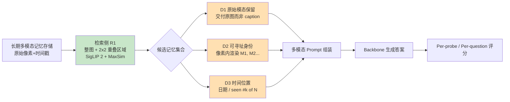

# 检索到了，却没交付：面向长期智能体的多模态记忆交付

## 一、论文基础元数据

- **原文标题**：Retrieved but Not Delivered: Multimodal Memory Delivery for Long-Term Agents
- **中文译版**：检索到了，却没交付：面向长期智能体的多模态记忆交付
- **发表渠道**：预印本（arXiv）；会议/期刊接收信息待补充
- **发表时间**：2025 年（依据 arXiv ID 2609.32590 推断，具体月份待补充）
- **链接**：arXiv:2609.32590
- **作者及核心机构**：Yuhang Jiang、Qingwei Liao、Kaize Yin、Xingling Liu、Luca Cuomo、Silvio Bacci（具体机构归属待补充）
- **研究领域**：
  - 一级领域：人工智能 / 大语言模型与多模态智能体
  - 二级子领域：长期记忆（Long-Term Memory）、多模态检索与上下文组装、Agent 上下文工程
- **关联数据集**：
  | 数据集 | 规模 | 语言 | 标注 |
  | -------- | ---- | ---- | ---- |
  | MemLens | 789 个问题，4 个上下文长度（含 32K） | 英文 | 图像+问题+标准答案，含信息抽取、多会话、时间、知识更新等类型；照片无明显相关区域标注 |
  | DMV-Bench | Result 使用 10 条链、J=10，1,888 个共享 probes；另设 J=5/10 | 英文 | 图像序列+探针式问题，追加序号 `[seen #k of N]` |

## 二、论文综合评价

### 2.1 量化评分（1-5分，5分为最优）

| 评价维度 | 评分 | 备注 |
| -------- | ---- | ---- |
| 📚 理论基础 | ⭐⭐⭐⭐ | 将"delivery"阶段形式化，定义三属性，概念框架较扎实 |
| 🎯 问题核心性 | ⭐⭐⭐⭐⭐ | 直击长期多模态 Agent 记忆瓶颈，视角新颖且根本 |
| 💡 方法创新性 | ⭐⭐⭐⭐ | 交付阶段显式化与隔离测量新颖，组件本身偏工程整合 |
| ⚙️ 技术壁垒 | ⭐⭐⭐ | 免训练、只改上下文组装，复制门槛较低 |
| 🧪 实验严谨性 | ⭐⭐⭐⭐⭐ | 失败审计+delivery-matched control+1,888 probes+显著性检验 |
| 🔧 落地可行性 | ⭐⭐⭐⭐⭐ | 可插拔、不改存储、不改检索，工程接入成本极低 |
| 🚀 应用前景 | ⭐⭐⭐⭐ | 多模态长记忆 Agent 为热点，交付范式易被复用 |
| 📊 综合评分 | 4.3 | 问题定义原创、实验扎实，工程价值高，技术壁垒与理论深度略弱 |

> 注：综合评分 = 前 7 项星星评分平均值（4+5+4+3+5+5+4）/7 ≈ 4.29，取 4.3。

### 2.2 定性综合评价（≤300字）

> 本研究定位于长期多模态智能体的记忆系统，将问题从"检索什么"推进到"如何把检索结果有效交付给模型"。核心价值在于：识别出一类此前被评测忽视的**接口失败**——正确记忆已进入 prompt，却因呈现形式不当而无法被模型使用，并据此把"记忆交付（memory delivery）"显式化为一个独立阶段。差异化优势是采用 delivery-matched control 严格控制呈现变量，分别量化 D1（原始像素保留）、D2（可寻址身份）、D3（时间位置）三个交付决策，同时以 R1（区域多向量检索）补足检索遗漏。关键结论是：**在固定检索集时，交付原始像素的收益显著大于把检索做到完美**（8B：+13.87 vs +2.31），且收益随 backbone 增强而增长（32B：+17.92 vs +11.56）。方法免训练、可插拔，输入成本仅为全上下文模型的 1/10~1/70。

## 三、领域本体论映射

| 核心维度 | 具体内容 |
| -------- | -------- |
| 核心研究对象 | 长期多模态 Agent 的记忆**交付阶段**（检索成功到答案生成之间"记忆以何形态进入 prompt"的环节） |
| 核心技术路径 | 交付侧适配（D1 原始模态保留 / D2 可寻址身份 / D3 时间位置）+ 检索侧适配（R1 区域多向量检索），免训练、可插拔 |
| 数据/载体形态 | 图像像素（原图）+ 视觉标签 `M1, M2…` + 文本身份标签 + 时间/序号索引；存储记录保持原始形态不被修改 |
| 核心功能目标 | 让"已检索到的记忆"以模型可检查、可指代、可定位的形式真正进入上下文，从而提升多模态长记忆问答准确率 |
| 验证核心指标 | 问答准确率（MemLens 32K 达 51.28；DMV-Bench J=50 上 Qwen +12.86 / Gemini +22.62）、检索召回率、交付增益、输入 token 成本比 |

## 四、核心问题与解决方案

### 4.1 待解决的核心问题

1. **领域级根本问题**：长期多模态 Agent 的失败归因被过度简化为"检索不准"，但"检索到≠被交付/被模型有效使用"，中间存在一个未被形式化的交付阶段。
2. **现有方法痛点**：
   - Caption-first 系统在**写入时丢弃像素**，导致细粒度视觉证据（如物体位置、颜色细节）从根本上无法恢复；
   - 多模态评测通常**不隔离交付阶段**，把检索、呈现、编码效应混在一起，无法判断失败到底出在哪一步；
   - Qwen2.5-VL-7B 的失败审计显示：检索召回 baseline 已达 98.4%（ours 100%），但失败中 76% 的正确项其实就在上下文中，模型却选了邻居项——即**选择/交付错误，而非检索错误**；模型在 93.2%/94.0% 的失败中已正确命名目标物体与颜色，仍选错。
3. **工程落地卡点**：
   - 交付文本被枚举后，**位置本身被模型当作排名信号**，导致首选第一个交付项（目标仅 11%–17% 在第一位）；
   - 隐私与成本：交付原像素使模型看到更多原始图像，部署时需权衡哪些内容可保留与重展示。

### 4.2 核心解决方案

- **理论框架**：将记忆链条显式划分为"写入 → 更新/遗忘 → 检索 → **交付** → 生成"；定义交付阶段需满足三个属性——能检查记忆内容、能指代其中某一项、能把该项放到时间中定位。
- **核心架构**：DeliverMem = 交付侧适配器（D1–D3）+ 检索侧适配器（R1）。D1–D3 只改变**已检索固定集合**的交付形式；R1 改变**哪些项目会到达**。
- **关键技术**：
  - D1 原始模态保留：交付原图而非文本 caption/代理文本；
  - D2 可寻址身份：在图像像素中渲染可读标签 `M1, M2…`，prompt 按标签引用，交付时写入、不重新嵌入、不影响检索排序；
  - D3 时间位置：MemLens 用日期，DMV-Bench 用追加序号 `[seen #k of N]`；
  - R1 区域多向量检索：整图 + 2×2 重叠网格编码，基于 SigLIP 2 特征做区域 MaxSim，针对小区域证据。
- **创新机制**：delivery-matched control——在 backbone 与消息内容不变、仅改消息到达形式时测量增益，避免呈现与编码混淆；**不训练、不修改存储记录**，只在交付时组装。

### 4.3 核心优势（量化+定性）

1. **性能优势**：
   - MemLens 8B backbone：交付原像素 vs 不给像素 **+13.87**；完美检索 vs 实际检索仅 **+2.31**——交付收益远大于检索收益；
   - 收益随 backbone 增强而增长：8B（+13.87/+2.31）、30B-A3B（+15.61/+9.83）、32B（+17.92/+11.56）；
   - DMV-Bench 上 DualMem 被超越：Qwen J=50 **+12.86**，Gemini J=50 **+22.62**；
   - MemLens 32K 达 **51.28**，与 GPT-5.4 读全上下文持平。
2. **效率优势**：输入成本仅为全上下文模型的 **1/10 到 1/70**。
3. **工程优势**：免训练、可插拔，适用于保留原始媒体与时间戳的现有栈；在 DMV-Bench 上作为适配器接入其 harness，检索、编码、存储均未改动。

## 五、方法与技术架构

### 5.1 核心架构设计

> **文字描述**：记忆条目以原始形态（含像素）持久化存储，不做 caption 替换。检索阶段由 R1 提供区域多向量召回，返回候选集合。交付阶段把候选集合按三种决策组装：(D1) 保留原始像素作为交付载体；(D2) 在图像像素中渲染可读标签实现可寻址；(D3) 附加时间或追加序号实现时间定位。最终组装成多模态 prompt 送入 backbone 生成答案。全流程不训练任何模块，仅改变"输出到模型的上下文"。

### 5.2 关键技术实现细节

| 技术模块 | 实现路径 | 工程注意事项 |
| -------- | -------- | ------------ |
| D1 原始模态保留 | 交付原始像素，不做文本代理；单独在 Table 1 验证该组件 | Caption-first 若在写入时已丢弃像素则无法回溯，需在存储层保留原图 |
| D2 可寻址身份 | 每张交付图像左上角渲染可读标签 `M1, M2…`（类 Set-of-Mark），prompt 按标签引用 | 标签在交付时写入，不重新嵌入、不影响检索排序；仅像素打标签而文本不说身份时收益不显著 |
| D3 时间位置 | MemLens 用日期；DMV-Bench 无时间戳则追加 `[seen #k of N]` | 枚举交付文本会使位置被当作排名信号，需显式时间/序号锚定 |
| R1 区域多向量检索 | 整图 + 2×2 重叠网格编码，SigLIP 2 特征 + 区域 MaxSim | 针对小区域证据；交付无法暴露检索从未返回的项，必须与 D 侧配合 |
| 依赖组件 | SigLIP 2 视觉编码器；备选配置含 dev-split 规则（按问题类型在组件与 baseline 间选择） | Tables 2/3 报告的是未使用 dev-split 规则的单一配置；不同 backbone（Qwen2.5-VL-7B / Qwen3-VL-8B / 30B-A3B / 32B、Gemini 2.5 Flash）需分别评测 |

### 5.3 架构优缺点

- **优点**：
  1. 免训练、可插拔，几乎零接入成本；
  2. 不改存储与检索排序，兼容保留原始媒体的现有栈；
  3. 模块化，D1–D3 与 R1 可独立消融与组合；
  4. 交付收益在多个 backbone 上方向一致且随模型增强而放大。
- **缺点**：
  1. 交付侧无法创造检索未返回的记忆，必须依赖 R1 等检索侧方法补足；
  2. 收益**有条件**：未正确处理的问题类型几乎无增益（MemLens 信息抽取 +40.98，而多会话/时间/知识更新接近 0 或很小）；
  3. 仅测量图像模态，未测交付粒度（裁剪、整图、区域），音频/视频交付仍待研究；
  4. 交付原像素带来隐私与成本副作用。

## 六、实验设计与结果分析

### 6.1 实验基础设置

| 维度 | 内容 |
| ---- | ---- |
| 数据集 | MemLens（789 个问题，4 个上下文长度，含 32K）；DMV-Bench（Result 用 10 条链、J=10，1,888 个共享 probes） |
| 基线方法 | 已发布 memory agent（含 DualMem 等最强发布方法）、不给像素的交付基线、完美检索 vs 实际检索对照、Gemini 2.5 Flash、GPT-5.4 读全上下文 |
| 实验环境 | 主模型 Qwen2.5-VL-7B（J=5/10）；backbone 另含 Qwen3-VL-8B、30B-A3B、32B、Gemini 2.5 Flash |
| 评价指标 | 问答准确率；检索召回率；交付增益（delivery-matched control）；per-question judge score 与 per-probe outcome；显著性（p 值、符号一致性）；输入 token 成本比 |

### 6.2 核心实验结果

| 方法 | 核心指标1（MemLens） | 核心指标2（DMV-Bench） | 工程指标（算力/耗时） |
| ---- | --------- | --------- | -------------------- |
| 不给像素（baseline delivery） | 交付原像素相比 **+13.87**（8B） | baseline 检索召回 98.4% | 输入成本高（全上下文模型 1/10~1/70 反向参照） |
| 实际检索 vs 完美检索（对照） | 完美检索仅 **+2.31**（8B） | 失败中 76% 正确项已在上下文 | — |
| DualMem（最强发布方法） | — | 被超越，Qwen J=50 **+12.86** / Gemini J=50 **+22.62** | — |
| 本文方法 DeliverMem（8B） | 交付 +13.87 / 检索 +2.31；信息抽取类 **+40.98** | 仅像素打标签 +1.33（不显著）；仅文本 +3.08；两者同时 **+10.97** | 免训练，仅改上下文组装 |
| 本文方法（30B-A3B / 32B） | +15.61/+9.83、+17.92/+11.56 | — | — |
| 本文方法（MemLens 32K） | **51.28**，与 GPT-5.4 读全上下文持平 | — | 输入成本 1/10~1/70 |

### 6.3 消融实验/鲁棒性分析

| 实验变体 | 指标变化 | 核心结论 |
| -------- | -------- | -------- |
| D2 标签仅像素打、文本不说 | +1.33（不显著） | 身份不由单一通道承载 |
| D2 标签仅文本说、像素不打 | +3.08 | 单通道信息不足以支撑指代 |
| D2 像素+文本同时承载标签 | **+10.97** | 身份由两通道**一致性**承载 |
| 标签移到文本、像素不变 | 下降 **7.89** 分（Stamping, J=10, 10 条链中 9 条同号, p=0.0039） | 标签的像素级存在不可替代 |
| 真实但错误的照片 vs 不给照片 | **+0.00** | 视觉 token 本身无益 |
| 相位随机化图像（保留统计、无物体） | +11.56 | 正确内容才是关键，而非图像统计 |
| 问题类型分层（信息抽取 vs 其他） | 信息抽取 +40.98，其他类型接近 0 或很小 | 只有问题确实需要图像内容时交付像素才有效 |
| 文献审计（7 个已发表 agent） | 2 个检索召回 0.82–0.89，检索成功后仍答错 87%–95% | backbone 难以推理已浮现内容 |

> **补充失败审计**：在 Qwen2.5-VL-7B 上，检索召回已 98.4%/100%；失败中 76%/98% 正确项在上下文；93.2%/94.0% 的失败中轨迹已正确命名目标；索引与打开物品一致率 95%–98%——**失败主要是选择错误，而非检索错误**。但 Gemini 2.5 Flash 上 baseline 失败中 92% 是检索缺失，说明瓶颈随 backbone 变化。

### 6.4 实验结论（工程视角）

1. 在多模态长记忆场景中，**优先投入交付侧改进（保留原始像素+可寻址+时间锚定）比继续提升检索精度回报更高**（8B 上 +13.87 vs +2.31）。
2. 交付收益具有**条件性**，集中在需要图像内容的事实型问题（信息抽取 +40.98），对多会话、纯时间、知识更新类问题几乎无效；部署时应按问题类型做路由或组件选择。
3. 交付方案可**免训练插拔**，对已保留原始媒体的现有栈改动极小；但需配套检索侧手段（R1）以覆盖"从未召回"的失败模式。
4. 收益随 backbone 增强而放大（8B→32B：+13.87→+17.92），提示交付优化与模型能力是互补而非替代关系。
5. 输入成本仅为全上下文模型的 1/10~1/70，在长上下文场景中具备显著经济性。

## 七、领域贡献与创新点

| 贡献层级 | 具体内容 |
| -------- | -------- |
| 理论贡献 | 明确隔离并形式化多模态记忆的 **delivery 阶段**，提出交付需满足"可检查内容、可指代某项、可时间定位"三属性，指出"检索到≠被有效交付" |
| 方法/架构贡献 | 提出 DeliverMem：D1（原始模态保留）+ D2（可寻址身份）+ D3（时间位置）+ R1（区域多向量检索）；免训练、不改存储记录、只在交付时组装 |
| 数据/工具贡献 | 在 MemLens 与 DMV-Bench 上建立 delivery-matched control 协议；失败审计流程（四步追问）可作为诊断工具复用（开源代码待补充） |
| 实验/验证贡献 | 用严格控制分别测量 D1/D2/D3，避免呈现与编码混淆；在 1,888 个共享 probes 上评分；给出条件性解释——收益取决于 backbone 失败模式与问题类型 |
| 工程落地贡献 | 提供轻量、模块化、可插拔的接口修复方案；在 DMV-Bench 上作为适配器接入原 harness，检索/编码/存储均未改动；输入成本降至全上下文的 1/10~1/70 |

## 八、局限性与风险

| 维度 | 具体描述 | 应对思路 |
| ---- | -------- | -------- |
| 学术局限性 | 仅测量图像模态，未测交付粒度（裁剪、整图、区域）；MemLens 照片无明显相关区域，区域标注留作未来工作；分类型效果使用全部 789 个问题，评估子集知识更新样本少；结论文本未展开另外两个交付决策，binding 只是第一步 | 扩展音频/视频交付决策研究；补充区域粒度标注与对照实验；扩大知识更新类样本 |
| 工程落地风险 | 交付侧无法创造检索未返回的记忆，必须依赖 R1 等检索侧方法；收益有条件（仅图像事实类问题显著）；枚举交付文本会使位置被当作排名信号 | 交付与检索两侧协同部署；按问题类型做 dev-split 路由；用显式时间/序号锚定抑制位置偏差 |
| 伦理/合规风险 | 交付原像素会让模型看到更多原始图像，涉及隐私暴露与留存问题 | 部署时明确决定哪些内容可保留与重新展示；建立像素级访问与留存策略 |

## 九、未来研究/落地方向

| 方向类型 | 具体内容 | 优先级 |
| -------- | -------- | ------ |
| 科研拓展 | 研究音频、视频等新模态的交付决策；展开论文未讨论的另外两个交付决策；探索交付粒度（裁剪/整图/区域） | 高 |
| 工程优化 | 检索侧与交付侧联合优化（R1 补召回 + D1–D3 提可用性）；按问题类型做组件路由；抑制位置偏差的显式锚定机制 | 高 |
| 跨领域适配 | 将交付阶段形式化推广到纯文本长记忆、代码库记忆、具身智能记忆等场景；适配不同 backbone 的失败模式（选择错误 vs 检索缺失） | 中 |

## 十、关键词与术语表

| 语言 | 关键词 |
| ---- | ------ |
| 中文 | 长期多模态记忆、记忆交付、检索增强、可寻址身份、区域多向量检索、上下文组装、免训练适配、智能体 |
| 英文 | Long-Term Multimodal Memory, Memory Delivery, Retrieval-Augmented Agent, Addressable Identity, Regional Multi-Vector Retrieval, Context Assembly, Training-Free Adaptation |
| 领域专属术语 | **Memory Delivery（记忆交付）**：检索成功后，记忆以何模态/形式进入模型 prompt 的独立阶段；**DeliverMem**：本文提出的交付方案（D1–D3 + R1）；**D1 原始模态保留**：交付原图而非文本代理；**D2 可寻址身份（Addressability）**：在像素中渲染 `M1, M2…` 使 prompt 可指代；**D3 时间位置（Temporal Placement）**：为每项记忆加日期或追加序号 `[seen #k of N]`；**R1 区域多向量检索**：整图+2×2 重叠网格，SigLIP 2 特征 + MaxSim；**MaxSim**：多向量间最大相似度匹配；**Delivery-matched Control**：固定 backbone 与消息内容、仅改到达形式的对照；**Stamping**：打标签干预（像素+文本一致）；**Binding**：身份绑定增益（+6.36）；**Set-of-Mark**：图像区域可读标记范式 |

## 十一、参考文献与关联资源

- **核心参考文献**：待补充（原文对 MemLens、DMV-Bench、DualMem、GPT-5.4、Gemini 2.5 Flash、SigLIP 2、Set-of-Mark 等工作的引用；建议核对原文 References 章节）
- **补充阅读**：长期记忆 Agent 综述、多向量检索（ColBERT 类 MaxSim）、多模态 RAG、上下文工程相关研究
- **开源代码/工具**：开源代码仓库待补充；涉及 SigLIP 2 视觉编码器、DMV-Bench 原 harness

## 十二、阅读者批注

1. **科研启发**："检索到≠被交付"这一视角把记忆系统的优化空间打开了——在检索指标已接近饱和（召回 98.4%）时，交付阶段的增益反而更大。这种"隔离中间阶段+delivery-matched control"的实验方法论，可迁移到文本记忆、工具调用结果注入等场景。
2. **工程落地思考**：免训练、可插拔、只改上下文组装，工程收益/成本比极高，适合作为现有 Agent 记忆栈的"最后一公里"适配层；但需注意收益高度条件化（仅图像事实类问题显著），应配合问题类型路由。位置偏差（模型倾向选第一个交付项）提示 prompt 组装顺序本身是一种隐性信号，值得产品化时专门处理。
3. **待验证/存疑点**：
   - MemLens 分类型效果使用全部 789 个问题，但知识更新样本少，其"接近 0"结论的统计稳健性存疑；
   - 收益随 backbone 增强而增长，但仅覆盖至 32B，是否在更大规模或 MoE 上持续成立待验证；
   - Gemini 2.5 Flash 的失败 92% 为检索缺失，与 Qwen 的选择错误截然不同，说明交付方案的收益边界强依赖 backbone，跨模型泛化性需进一步确认；
   - 论文原文使用"显著优于""全面领先"类表述时，需回表核对具体基线与指标（遵循历史经验：以原文表格证据为准，不采信单方面宣称）。
4. **个人/团队应用场景**：长周期个人助理（跨会话图片记忆）、电商/客服多轮图文对话、具身智能体的视觉经验复用、多模态 RAG 问答系统的上下文组装层。

## 十三、阅读元信息

| 维度 | 内容 |
| ---- | ---- |
| 阅读日期 | 2026-09-30 23:09 |
| 阅读人 | xPaperReader AI |
| 文档编号 | arxiv-2609.32590 |
| 版本迭代 | v1.0 |