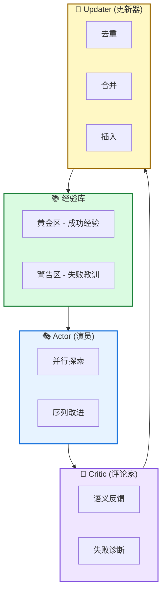

# 🧠 FLEX: 经验前向学习连续智能体进化

**Continuous Agent Evolution via Forward Learning from Experience**

---

## 📄 论文信息

| 项目 | 内容 |
|------|------|
| **arXiv** | 2511.06449 |
| **日期** | 2025 年 11 月 |
| **机构** | 清华大学 AIR + ByteDance Seed |
| **基准** | AIME25 / USPTO50k / ProteinGym |
| **评分** | ⭐⭐⭐⭐⭐ 5.0/5.0 |

---

## 🔗 本体论映射

| 维度 | 标注 |
|------|------|
| **📦 记忆类型** | 经验式 (Experiential) |
| **🏗️ 记忆结构** | 层次化 (Hierarchical) |
| **⚙️ 记忆操作** | 形成 + 进化 + 检索 |
| **💾 记忆载体** | Token 级 (显式文本) |
| **🎯 功能类型** | 学习 + 推理 |
| **🔁 使用模式** | 经验驱动 + 自组织 |
| **✅ 验证公理** | 稳定性 - 可塑性 + 泛化性 |

---

## 🎯 核心主张

### 🤔 问题
LLM 智能体训练后参数冻结，无法像人类一样在部署过程中从经验持续成长，导致在挑战性任务上性能下降。

### 💡 方案
FLEX 提出无需梯度的前向学习范式，通过构建可进化的经验库，使智能体能够从成功和失败中持续反思积累，实现连续进化。

### 🌟 优势
①跨模型继承 (弱模型经验可帮助强模型 +16.7%) ②经验增长缩放律 (性能随经验库规模可预测提升) ③即插即用 (无需重新训练)

---

## 💡 关键洞见

> 学习不应局限于修改模型参数，而应转向构建和利用可进化的经验库。经验以语义形式存储，可跨智能体迁移和继承，实现知识复用。

---

## 📐 方法架构

FLEX 通过 Actor-Critic 前向循环探索经验，元级更新器将经验组织成层次化库，支持三层检索 (战略→模式→实例)。

### 🎭 Actor (演员)
- **并行探索**: 生成多样化推理轨迹
- **序列改进**: 通过并行采样和序列改进探索问题空间

### 🧐 Critic (评论家)
- **语义反馈**: 提供语义反馈，诊断失败原因
- **改进建议**: 生成抽象改进建议，引导 Actor 迭代优化

### 📚 经验库
- **黄金区**: 存储成功经验
- **警告区**: 记录失败教训
- **层次化**: 战略/模式/实例三层组织

### 🔄 Updater (更新器)
- **去重**: 避免冗余存储
- **合并**: 选择性合并相似经验
- **插入**: 分层插入新经验

---

## 📈 实验结果

### AIME25 主结果

| 模型 | Baseline | FLEX | 提升 |
|------|---------|------|------|
| Claude-Sonnet-4 | 40.0% | **63.3%** | **+23.3%** |
| DeepSeek-V3.1 | 56.7% | **66.6%** | **+10.0%** |

### USPTO50k 化学逆合成

| 模型 | Baseline | FLEX | 提升 |
|------|---------|------|------|
| GPT-5 | 9.0% | **16.0%** | **+7.0%** |
| Gemini-2.5-Pro | 9.0% | **18.0%** | **+9.0%** |
| Claude-Sonnet-4.5 | 20.0% | **30.0%** | **+10.0%** |

### ProteinGym 蛋白质适应度

| 模型 | Baseline | FLEX | 提升 |
|------|---------|------|------|
| DeepSeek-V3.1 | 47.9 | **56.8** | **+8.9** |
| GPT-OSS-120B | 47.7 | **57.3** | **+9.6** |
| Claude-Sonnet-4 | 46.0 | **59.7** | **+13.7** |

**关键发现**: FLEX 在所有领域和模型上均实现显著提升。数学推理最高 +23.3%，化学逆合成最高 +10%，蛋白质预测最高 +13.7。训练成本<100 美元。

---

## ✅ 验证的领域公理

### 稳定性 - 可塑性公理
经验库持续积累新知识 (可塑性) 同时保持旧知识不遗忘 (稳定性)，解决灾难性遗忘问题。

### 泛化公理
经验库支持跨模型迁移，弱模型经验可提升强模型性能 (+6.7%~+16.7%)，证明经验具有泛化性。

---

## ⚠️ 局限性

1. **事件分割依赖 LLM**: 当前采用简单的 LLM 管道进行事件分割和关系提取，更细粒度和鲁棒的分割方法可能进一步提升记忆质量
2. **评估范围有限**: 评估集中在 LoCoMo 和 NarrativeQA 两个基准，需要在更广泛的任务和智能体设置中验证适用性
3. **Token 消耗较高**: 虽然构建时间低，但 FLEX 使用更多 tokens（事件提取、关系提取、多路径探索），成本效益需进一步优化

---

## 🔮 未来工作方向

1. 探索更鲁棒的事件分割算法，减少对 LLM 的依赖
2. 扩展到更多任务类型（代码生成、创意写作、多模态）
3. 优化 token 使用效率，研究事件图压缩技术
4. 研究离线构建高质量记忆结构，支持轻量级在线搜索

---

## 🏷️ 关键词

- 前向学习 (Forward Learning)
- 经验库 (Experience Library)
- 无需梯度 (Gradient-free)
- 元 MDP (Meta-MDP)
- Actor-Critic (演员 - 评论家)
- 跨模型继承 (Cross-model Inheritance)
- 缩放律 (Scaling Law)
- 语义反馈 (Semantic Feedback)

---

## 📚 专业名词解释

### 📚 经验库 (Experience Library)

层次化文本存储系统，像「知识插件库」即插即用。分为黄金区 (成功经验) 和警告区 (失败教训)。

### 📚 前向学习 (Forward Learning)

无需梯度反向传播，仅通过前向探索和经验蒸馏实现学习。类似人类「从经验中成长」而非「重新训练大脑」。

### 📚 Meta-MDP

双层优化框架。底层 MDP 负责单样本探索，元级 MDP 负责全局经验库进化。类似「工人 + 经理」协作模式。

---

## 🔗 链接

- **arXiv**: https://arxiv.org/abs/2511.06449
- **HTML 总结**: site/papers/2025/01_2025-11_FLEX-经验前向学习连续智能体进化_2026-03-19.html

---

**📅 总结日期**: 2026-03-19  
**📊 本体模型版本**: v1.2
