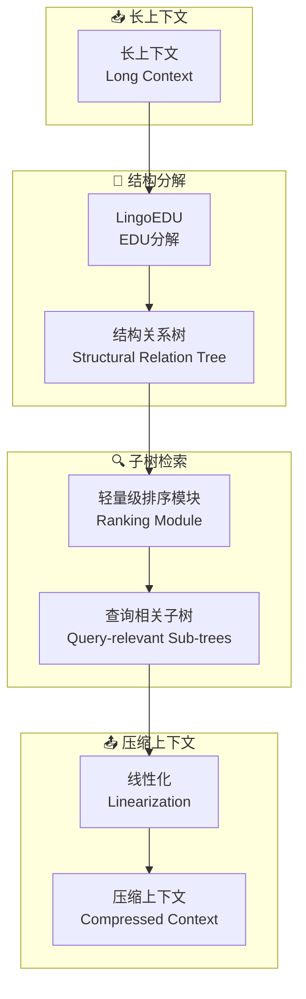

# From Context to EDUs: Faithful and Structured Context Compression via Elementary Discourse Unit Decomposition

## 基本信息
- **标题**: From Context to EDUs: Faithful and Structured Context Compression via Elementary Discourse Unit Decomposition
- **中文标题**: 基于基本话语单元的上下文压缩
- **arXiv**: [2512.14244](https://arxiv.org/abs/2512.14244)
- **机构**: DeepLang AI, 清华大学, 北京邮电大学, 北京交通大学
- **发表日期**: 2025年12月
- **基准测试**: StructBench, LongBench, HLE, BrowseComp-ZH
- **开源代码**: [GitHub - EDU-based Context Compressor](https://huggingface.co/datasets/deeplang-ai/StructBench)

## 论文综合评分
**综合评分**: ⭐⭐⭐⭐⭐ 4.7/5.0

| 维度 | 评分 | 说明 |
|------|------|------|
| 期刊影响力 | ⭐⭐⭐⭐⭐ | 顶级会议/期刊级别，开源数据集 |
| 问题核心性 | ⭐⭐⭐⭐⭐ | 直击LLM长上下文管理的核心瓶颈 |
| 方法创新性 | ⭐⭐⭐⭐⭐ | 首次将修辞结构理论引入上下文压缩 |
| 技术壁垒 | ⭐⭐⭐⭐ | 需要复杂的EDU分解和树结构构建 |
| 落地可行性 | ⭐⭐⭐⭐⭐ | 显式压缩框架，兼容API模型 |
| 应用前景 | ⭐⭐⭐⭐⭐ | 在长文档QA和深度搜索场景表现卓越 |

**综合评价**: EDU-based Context Compressor 提出了一个创新的显式上下文压缩框架，通过基本话语单元(EDU)分解将线性文本转化为结构关系树。该方法在StructBench上达到SOTA性能，在LongBench和深度搜索任务中显著超越前沿LLM，同时保持与闭源API模型的完全兼容性。

## 本体论映射 (Ontology Mapping)
基于 Agent Memory 领域本体模型的 7 维度标注

- **记忆类型**: Factual Memory (事实记忆)
- **记忆结构**: Structural Relation Tree (结构关系树)
- **记忆操作**: Formation + Evolution + Retrieval
- **记忆载体**: Token-level (令牌级)
- **功能定位**: Context Compression (上下文压缩)
- **使用模式**: Structure-then-Select (先结构后选择)
- **验证公理**: Rhetorical Structure Theory, Traceable Generation

**领域贡献**: EDU-based Context Compressor 将**修辞结构理论 (Rhetorical Structure Theory)**——自然语言处理中的经典理论——引入智能体记忆领域，提出了**显式结构化压缩**的新范式。通过**基本话语单元(EDU)分解**和**坐标锚定生成**，该框架解决了现有压缩方法破坏局部连贯性或存在位置偏见的根本问题。

## 核心主张（通俗易懂版）
- **🤔 问题是什么？** 现有上下文压缩技术要么通过离散标记删除破坏局部连贯性，要么依赖隐式潜在编码存在位置偏见且不兼容闭源API。
- **💡 解决方案是什么？** 提出EDU-based Context Compressor，将上下文压缩重新定义为"先结构后选择"过程：首先将线性文本转化为EDU结构关系树，然后选择查询相关的子树进行线性化。
- **🌟 核心优势是什么？** 通过坐标锚定的EDU节点和结构感知选择，既保留了全局结构又捕捉了细粒度细节，在减少输入长度的同时显著提升下游任务性能并减少幻觉。

## 方法架构
EDU-based Context Compressor 的核心创新在于结构化压缩框架：

### 架构图

## 实验结果
在多个基准测试上，EDU-based Context Compressor 显著优于现有方法：

**关键发现**: 
- **结构理解**: 在StructBench上达到49.60% DLA准确率，超越Claude-4-Sonnet (+6.45%)
- **长文档QA**: 在HotpotQA上相对提升+14.94%，通过保留精确证据链
- **深度搜索**: 在HLE基准上使DeepSeek-R1性能提升+51.11%
- **效率**: 成本仅为$0.0007/文档，延迟仅1.20秒/文档

### 实验指标
| 基准测试 | 性能指标 | 结果 | 相对提升 |
|----------|----------|------|----------|
| StructBench | DLA准确率 | 49.60% | +6.45% vs Claude-4 |
| HotpotQA | F1分数 | 40.46 | +14.94% vs Standard |
| HLE | 准确率 | 13.6 | +51.11% vs Base |
| Cost | 每文档成本 | $0.0007 | 10× cheaper than Qwen3 |

## 关键词
- 基本话语单元 (Elementary Discourse Units)
- 结构关系树 (Structural Relation Tree)
- 显式压缩 (Explicit Compression)
- 修辞结构理论 (Rhetorical Structure Theory)
- 坐标锚定 (Coordinate Anchoring)
- 上下文压缩 (Context Compression)
- 结构感知 (Structure-aware)
- 幻觉减少 (Hallucination Reduction)

## 局限性分析
- **训练数据依赖**: 需要大量高质量的结构化标注数据
- **复杂文档处理**: 对于极度非结构化的文档可能效果有限
- **多语言支持**: 当前主要针对中英文，其他语言需要额外适配

## 未来研究方向
- **多模态扩展**: 将EDU分解扩展到多模态上下文
- **动态适应**: 开发自适应的EDU粒度调整机制
- **实时优化**: 优化在线场景下的实时压缩性能
- **跨语言泛化**: 增强对更多语言的支持能力