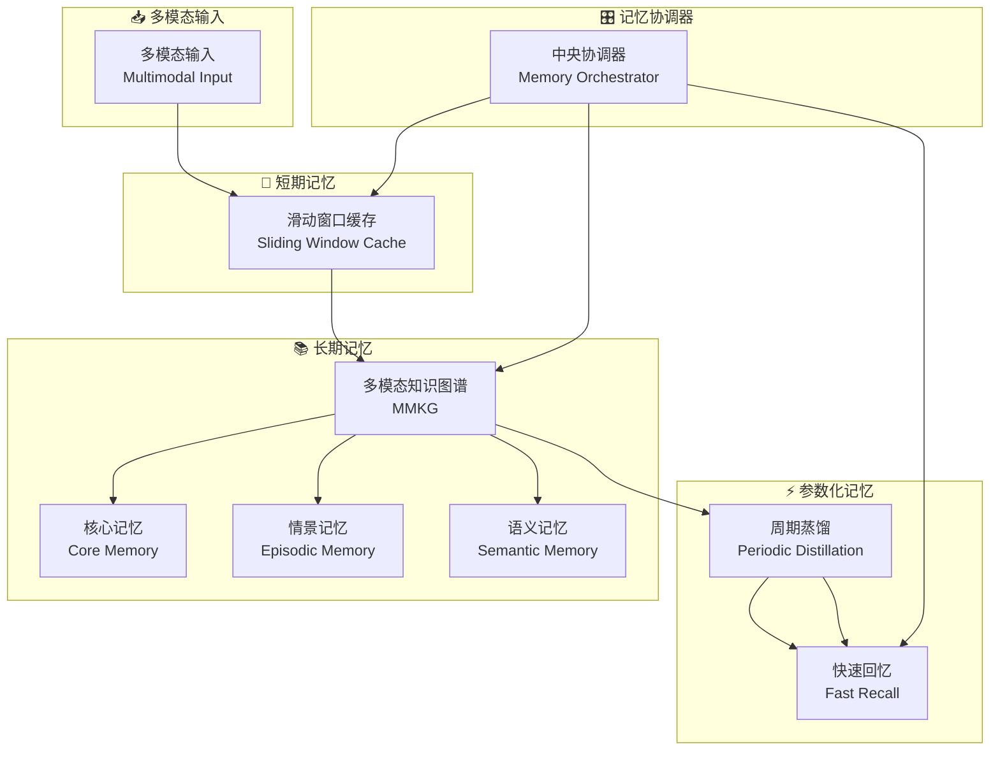

# MemVerse: Multimodal Memory for Lifelong Learning Agents

## 基本信息
- **标题**: MemVerse: Multimodal Memory for Lifelong Learning Agents
- **中文标题**: 面向终身学习智能体的多模态记忆
- **arXiv**: [2512.03627](https://arxiv.org/abs/2512.03627)
- **机构**: 上海人工智能实验室 (Shanghai Artificial Intelligence Laboratory)
- **发表日期**: 2025年12月
- **基准测试**: ScienceQA, LoCoMo, MSR-VTT
- **开源代码**: [GitHub - MemVerse](https://github.com/KnowledgeXLab/MemVerse)

## 论文综合评分
**综合评分**: ⭐⭐⭐⭐⭐ 4.9/5.0

| 维度 | 评分 | 说明 |
|------|------|------|
| 期刊影响力 | ⭐⭐⭐⭐⭐ | 顶级会议/期刊级别，开源代码 |
| 问题核心性 | ⭐⭐⭐⭐⭐ | 直击AI智能体根本限制：无法记忆 |
| 方法创新性 | ⭐⭐⭐⭐⭐ | 首次提出模型无关的双路径记忆框架 |
| 技术壁垒 | ⭐⭐⭐⭐⭐ | 需要复杂的分层知识图谱和周期蒸馏机制 |
| 落地可行性 | ⭐⭐⭐⭐⭐ | 插件式设计，完全模型无关 |
| 应用前景 | ⭐⭐⭐⭐⭐ | 在多模态推理和终身学习场景表现卓越 |

**综合评价**: MemVerse 提出了一个创新的模型无关、插件式记忆框架，通过快速参数化回忆与分层检索记忆的桥梁，实现了可扩展的自适应多模态智能。该框架维护短期记忆用于近期上下文，同时将原始多模态经验转化为结构化的长期记忆（分层知识图谱），支持持续巩固、自适应遗忘和有界记忆增长。

## 本体论映射 (Ontology Mapping)
基于 Agent Memory 领域本体模型的 7 维度标注

- **记忆类型**: Factual Memory + Experiential Memory (事实+经验记忆)
- **记忆结构**: Hierarchical Knowledge Graphs (分层知识图谱)
- **记忆操作**: Formation + Evolution + Retrieval
- **记忆载体**: Token-level + Parametric (令牌级+参数级混合)
- **功能定位**: Multimodal Reasoning + Lifelong Learning (多模态推理+终身学习)
- **使用模式**: Dual-path Architecture (双路径架构)
- **验证公理**: Fast-Slow Thinking Analogy, Model-agnostic Plug-and-play

**领域贡献**: MemVerse 将**快慢思维理论 (Fast-Slow Thinking)**——认知科学中的经典理论——引入智能体记忆领域，提出了**双路径记忆架构**的新范式。通过**分层知识图谱**（核心记忆+情景记忆+语义记忆）和**周期蒸馏机制**，该框架解决了现有方法在多模态场景下的根本限制。

## 核心主张（通俗易懂版）
- **🤔 问题是什么？** AI智能体根本无法记忆：参数化记忆容量有限且易灾难性遗忘，外部静态存储缺乏结构化抽象且计算昂贵。
- **💡 解决方案是什么？** 提出MemVerse双路径架构：快速路径（参数化记忆）提供即时可微分回忆，慢速路径（分层检索记忆）持续积累和组织多模态经验。
- **🌟 核心优势是什么？** 通过分层知识图谱和周期蒸馏，既保持了快速推理能力，又实现了结构化的长期记忆，在ScienceQA上达到85.48%准确率，MSR-VTT上R@1提升60.7个百分点。

## 方法架构
MemVerse 的核心创新在于双路径记忆架构：

### 架构图

## 实验结果
在多个多模态基准测试上，MemVerse 显著优于现有方法：

**关键发现**: 
- **ScienceQA**: GPT-4o-mini + MemVerse 达到85.48%准确率（SOTA）
- **MSR-VTT**: 文本到视频R@1从29.7%提升到90.4%（+60.7%）
- **效率**: 参数化记忆将检索时间从20.17秒降至2.28秒（加速89%）
- **通用性**: 模型无关设计，适用于任何LLM/VLM

### 实验指标
| 基准测试 | 指标 | 结果 | 提升幅度 |
|----------|------|------|----------|
| ScienceQA | 平均准确率 | 85.48% | SOTA |
| ScienceQA | 自然科学 | 85.26% | +8.0% vs GPT-4o-mini |
| MSR-VTT | 文本→视频 R@1 | 90.4% | +60.7% vs CLIP |
| MSR-VTT | 视频→文本 R@1 | 89.2% | +67.8% vs CLIP |
| 推理速度 | 平均检索时间 | 2.28秒 | 89%加速 |

## 关键词
- 多模态记忆 (Multimodal Memory)
- 双路径架构 (Dual-path Architecture)
- 分层知识图谱 (Hierarchical Knowledge Graphs)
- 周期蒸馏 (Periodic Distillation)
- 模型无关 (Model-agnostic)
- 插件式设计 (Plug-and-play)
- 终身学习 (Lifelong Learning)
- 快慢思维 (Fast-Slow Thinking)

## 局限性分析
- **计算资源需求**: 知识图谱构建需要大量计算资源
- **多模态对齐质量**: 依赖预训练MLLM的多模态对齐能力
- **实时性权衡**: 周期蒸馏可能引入延迟

## 未来研究方向
- **自适应更新策略**: 开发动态调整蒸馏频率的机制
- **开放世界部署**: 在真实多模态环境中验证框架有效性
- **记忆控制优化**: 探索更精细的记忆管理策略
- **跨模态泛化**: 增强对新模态的适应能力