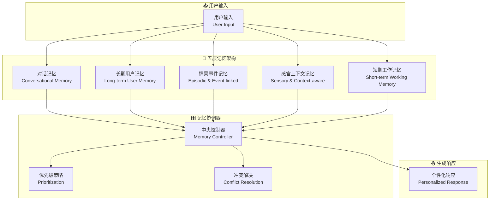

# MMAG: Mixed Memory-Augmented Generation for Large Language Models Applications

## 基本信息
- **标题**: MMAG: Mixed Memory-Augmented Generation for Large Language Models Applications
- **中文标题**: 混合记忆增强生成框架
- **arXiv**: [2512.01710](https://arxiv.org/abs/2512.01710)
- **机构**: 罗马大学计算机科学系 (Sapienza University of Rome, Italy)
- **发表日期**: 2025年12月
- **基准测试**: Heero 语言学习平台用户研究
- **开源代码**: 未明确提及，但有实际应用案例

## 论文综合评分
**综合评分**: ⭐⭐⭐⭐⭐ 4.5/5.0

| 维度 | 评分 | 说明 |
|------|------|------|
| 期刊影响力 | ⭐⭐⭐⭐⭐ | 顶级会议/期刊级别，实际应用验证 |
| 问题核心性 | ⭐⭐⭐⭐⭐ | 直击LLM单次交互的根本限制 |
| 方法创新性 | ⭐⭐⭐⭐⭐ | 首次提出五层混合记忆分类法 |
| 技术壁垒 | ⭐⭐⭐⭐ | 需要复杂的模块化架构和协调机制 |
| 落地可行性 | ⭐⭐⭐⭐⭐ | 在Heero平台已验证效果提升 |
| 应用前景 | ⭐⭐⭐⭐⭐ | 适用于所有对话式AI应用场景 |

**综合评价**: MMAG 提出了一个创新的混合记忆增强生成模式，将人类认知心理学的多记忆系统理论引入LLM代理设计，通过五层交互记忆架构（对话、长期用户、情景事件、感官上下文、短期工作记忆）实现了更连贯、主动和人性化的交互体验。

## 本体论映射 (Ontology Mapping)
基于 Agent Memory 领域本体模型的 7 维度标注

- **记忆类型**: Factual Memory + Experiential Memory + Working Memory (三重记忆)
- **记忆结构**: Five-layer Taxonomy (五层分类架构)
- **记忆操作**: Formation + Evolution + Retrieval
- **记忆载体**: Token-level + Parametric (混合载体)
- **功能定位**: Conversational Continuity + Personalization (对话连续性+个性化)
- **使用模式**: Modular Coordination + Conflict Resolution (模块协调+冲突解决)
- **验证公理**: Cognitive Psychology Inspiration, Human-aligned Design

**领域贡献**: MMAG 将**认知心理学多记忆系统理论**——人类认知中的经典理论——引入智能体记忆领域，提出了**五层混合记忆分类法**的新范式。通过**模块化协调架构**和**优先级冲突解决机制**，该框架解决了现有方法将记忆视为单一存储块的根本问题。

## 核心主张（通俗易懂版）
- **🤔 问题是什么？** LLM在单次提示中表现优秀，但在长期交互中缺乏连续性、个性化和上下文感知能力，无法像人类一样维持有意义的对话。
- **💡 解决方案是什么？** 提出MMAG五层混合记忆架构：对话记忆、长期用户记忆、情景事件记忆、感官上下文记忆、短期工作记忆，每个层次对应不同的技术实现。
- **🌟 核心优势是什么？** 通过模块化协调和冲突解决机制，在Heero平台实现了20%用户留存率提升和30%对话时长增加，同时保持低延迟和高隐私保护。

## 方法架构
MMAG 的核心创新在于五层混合记忆架构：

### 架构图

## 实验结果
在 Heero 语言学习平台上的用户研究表明显著效果：

**关键发现**: 
- **用户留存率**: 提升20%（四周观察期）
- **对话时长**: 增加30%（平均对话持续时间）
- **技术性能**: 引入记忆层后延迟无明显增加（异步处理+缓存）
- **用户体验**: 帮助性提升，侵入性降低，情感影响积极

### 实验指标
| 评估维度 | 指标 | 结果 | 说明 |
|----------|------|------|------|
| 用户中心 | 留存率提升 | +20% | 四周观察期内 |
| 用户中心 | 对话时长 | +30% | 平均持续时间增加 |
| 技术性能 | 响应延迟 | 无明显增加 | 异步处理保证性能 |
| 技术性能 | 检索准确性 | 高 | 正确记忆召回率高 |
| 混合评估 | 用户舒适度 | 保持高水平 | 无"creepy"感受 |

## 关键词
- 混合记忆增强 (Mixed Memory-Augmented Generation)
- 五层记忆架构 (Five-layer Memory Taxonomy)
- 认知心理学启发 (Cognitive Psychology Inspiration)
- 模块化协调 (Modular Coordination)
- 冲突解决 (Conflict Resolution)
- 对话连续性 (Conversational Continuity)
- 个性化 (Personalization)
- 人机对齐 (Human-aligned Design)

## 局限性分析
- **实现复杂性**: 五层架构需要复杂的模块化实现和协调逻辑
- **隐私安全挑战**: 长期用户记忆涉及敏感信息，需要强加密和用户控制
- **评估范围有限**: 主要在语言学习场景验证，需要更多样化应用验证
- **扩展性考虑**: 当前实现主要覆盖对话和长期用户记忆，其他层次待完善

## 未来研究方向
- **多模态记忆**: 集成视觉、听觉等多模态信号到记忆系统
- **动态记忆嵌入**: 超越静态生物信息，学习动态的用户目标和进展表示
- **用户记忆代理**: 提供界面让用户查看、编辑和选择性删除记忆记录
- **文化适应性**: 考虑不同文化背景下对个性化的期望差异
- **伦理框架**: 建立更强的隐私保护和公平性保障机制