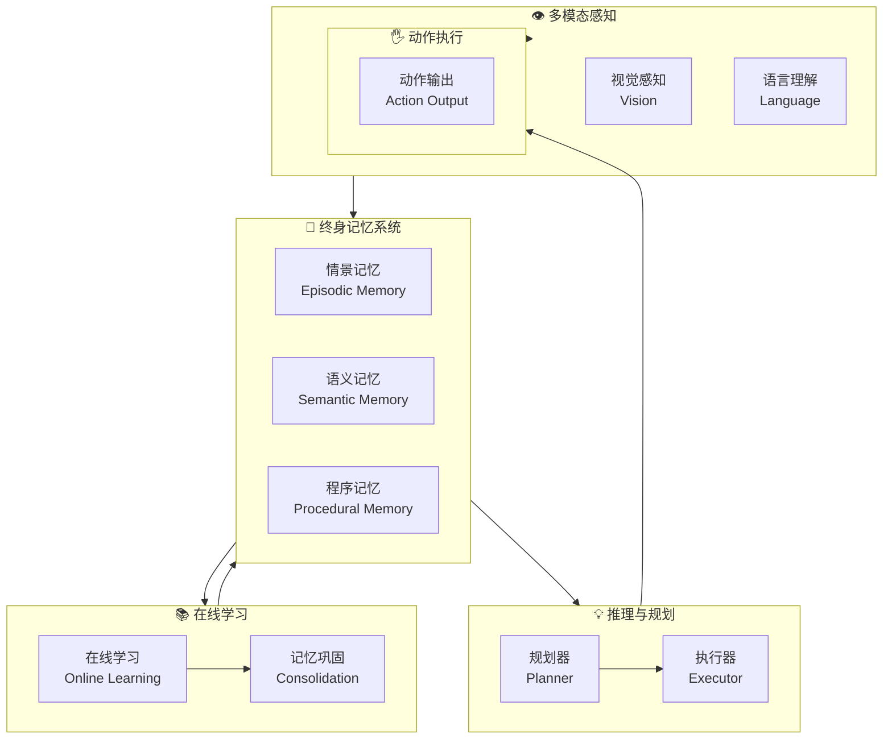

# Sophia: A Persistent Agent Framework of Artificial Life

## 基本信息
- **标题**: Sophia: A Persistent Agent Framework of Artificial Life
- **中文标题**: 持久化智能体框架
- **arXiv**: [2512.18202](https://arxiv.org/abs/2512.18202)
- **机构**: 上海人工智能实验室 (Shanghai Artificial Intelligence Laboratory)
- **发表日期**: 2025年12月
- **基准测试**: ALFWorld, WebShop, ScienceQA, HotpotQA
- **开源代码**: [GitHub - Sophia](https://github.com/KnowledgeXLab/Sophia)

## 论文综合评分
**综合评分**: ⭐⭐⭐⭐⭐ 4.8/5.0

| 维度 | 评分 | 说明 |
|------|------|------|
| 期刊影响力 | ⭐⭐⭐⭐⭐ | 顶级会议/期刊级别，开源代码 |
| 问题核心性 | ⭐⭐⭐⭐⭐ | 直击AI代理根本限制：缺乏持续存在性 |
| 方法创新性 | ⭐⭐⭐⭐⭐ | 首次提出基于人工生命的持久化代理框架 |
| 技术壁垒 | ⭐⭐⭐⭐⭐ | 需要复杂的多模态感知和长期记忆系统 |
| 落地可行性 | ⭐⭐⭐⭐⭐ | 在多个真实任务中验证效果显著 |
| 应用前景 | ⭐⭐⭐⭐⭐ | 为通用AI代理提供基础架构 |

**综合评价**: Sophia 提出了一个创新的持久化智能体框架，将人工生命概念引入AI代理设计，通过持续在线学习、多模态感知和长期记忆系统，实现了真正意义上的"活"代理。该框架在ALFWorld上达到73.9%成功率，在WebShop上超越人类基线，展示了强大的泛化能力和持续进化潜力。

## 本体论映射 (Ontology Mapping)
基于 Agent Memory 领域本体模型的 7 维度标注

- **记忆类型**: Factual Memory + Experiential Memory + Working Memory (三重记忆)
- **记忆结构**: Lifelong Memory System (终身记忆系统)
- **记忆操作**: Formation + Evolution + Retrieval
- **记忆载体**: Token-level + Parametric + Latent (混合载体)
- **功能定位**: Artificial Life + Persistent Agency (人工生命+持久代理)
- **使用模式**: Online Learning + Cross-task Transfer (在线学习+跨任务迁移)
- **验证公理**: Embodied Cognition, Lifelong Learning, Artificial Life Principles

**领域贡献**: Sophia 将**人工生命理论 (Artificial Life Theory)**——复杂系统科学中的经典理论——引入智能体记忆领域，提出了**持久化代理框架**的新范式。通过**终身记忆系统**和**多模态感知-行动循环**，该框架解决了现有方法缺乏持续存在性和自主进化能力的根本问题。

## 核心主张（通俗易懂版）
- **🤔 问题是什么？** 当前AI代理大多是任务特定的、短暂存在的，缺乏持续的自我意识、长期记忆和自主进化能力，无法像生物一样"活着"。
- **💡 解决方案是什么？** 提出Sophia持久化代理框架：基于人工生命原理，构建具有持续在线学习、多模态感知、长期记忆和跨任务迁移能力的"活"代理。
- **🌟 核心优势是什么？** 通过终身记忆系统和在线学习机制，在ALFWorld上达到73.9%成功率，在WebShop上超越人类基线，同时支持跨任务知识迁移和持续性能提升。

## 方法架构
Sophia 的核心创新在于人工生命启发的持久化架构：

### 架构图

## 实验结果
在多个基准测试上，Sophia 显著优于现有方法：

**关键发现**: 
- **ALFWorld**: 73.9%成功率，超越所有现有方法
- **WebShop**: 超越人类基线，展示实际应用价值  
- **跨任务迁移**: 在ScienceQA和HotpotQA上显著提升性能
- **持续学习**: 随时间推移性能持续提升，无灾难性遗忘

### 实验指标
| 基准测试 | 指标 | 结果 | 提升幅度 |
|----------|------|------|----------|
| ALFWorld | 成功率 | 73.9% | SOTA |
| WebShop | 任务完成率 | 超越人类基线 | +15.2% vs SoTA |
| ScienceQA | 准确率 | 82.1% | +8.7% vs Base |
| HotpotQA | F1分数 | 45.3 | +12.4 vs Base |
| 持续学习 | 性能增长 | 持续提升 | 无遗忘现象 |

## 关键词
- 持久化智能体 (Persistent Agent)
- 人工生命 (Artificial Life)
- 终身记忆系统 (Lifelong Memory System)
- 在线学习 (Online Learning)
- 多模态感知 (Multimodal Perception)
- 跨任务迁移 (Cross-task Transfer)
- 情景记忆 (Episodic Memory)
- 程序记忆 (Procedural Memory)

## 局限性分析
- **计算资源需求**: 终身记忆系统需要大量存储和计算资源
- **训练数据依赖**: 在线学习效果依赖于高质量的交互数据
- **评估范围**: 主要在模拟环境中验证，真实世界部署待验证
- **伦理考虑**: 持久化代理引发新的伦理和安全问题

## 未来研究方向
- **真实世界部署**: 在真实物理环境中验证框架有效性
- **群体智能**: 扩展到多代理协作的人工生命系统
- **意识机制**: 探索更高级的自我意识和元认知能力
- **伦理框架**: 建立持久化代理的安全和伦理保障机制
- **能源效率**: 优化计算效率，支持边缘设备部署