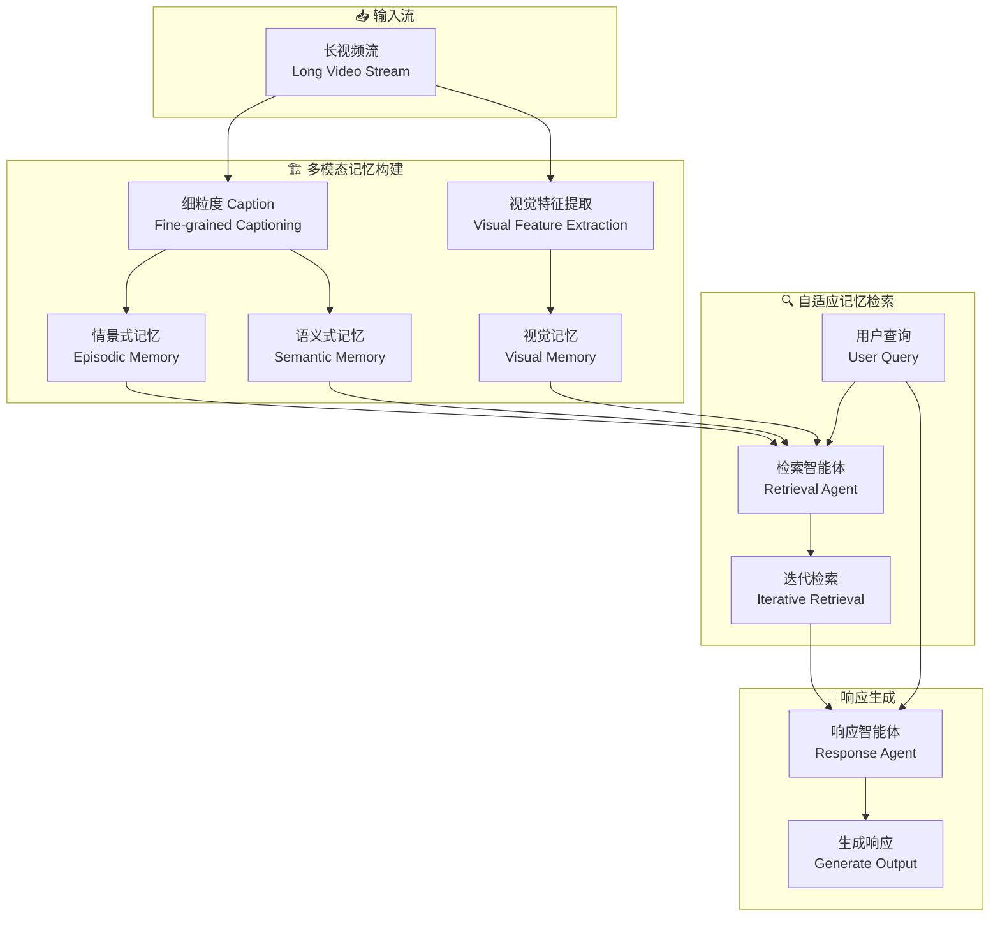

# WorldMM: Dynamic Multimodal Memory Agent for Long Video Reasoning

## 基本信息
- **标题**: WorldMM: Dynamic Multimodal Memory Agent for Long Video Reasoning
- **中文标题**: WorldMM: 动态多模态记忆智能体 for 长视频推理
- **arXiv**: [2512.02425](https://arxiv.org/abs/2512.02425)
- **机构**: KAIST, Nanyang Technological University, DeepAuto.ai
- **发表日期**: 2025 年 12 月
- **基准测试**: LVBench, VideoMME, HourVideo, EgoLife, 5 个长视频 QA 基准

## 论文综合评分
**综合评分**: ⭐⭐⭐⭐⭐ 4.7/5.0

| 维度 | 评分 | 说明 |
|------|------|------|
| 期刊影响力 | ⭐⭐⭐⭐ | arXiv 预印本，KAIST 出品，引用潜力高 |
| 问题核心性 | ⭐⭐⭐⭐⭐ | 直击长视频理解的核心挑战：多模态记忆 + 自适应检索 |
| 方法创新性 | ⭐⭐⭐⭐⭐ | 三类型多模态记忆 + 自适应检索智能体 + 多时间粒度图 |
| 技术壁垒 | ⭐⭐⭐⭐ | 需要多图构建、迭代检索、多模态融合 |
| 落地可行性 | ⭐⭐⭐⭐ | 模块化设计，但计算开销较高 |
| 应用前景 | ⭐⭐⭐⭐⭐ | AI 眼镜、家庭机器人、长视频分析等场景广泛应用 |

**综合评价**: WorldMM 提出了一个革命性的多模态记忆框架，将记忆组织为三种互补类型（情景式、语义式、视觉），通过自适应检索智能体实现多模态、多时间粒度的灵活查询。这种方法不仅在理论上证明了混合存储的必要性，在实践中也显著提升了长视频推理能力，平均提升 8.4% vs SOTA。其模块化设计使其易于集成到现有视频 LLM 系统中。

## 本体论映射 (Ontology Mapping)
基于 Agent Memory 领域本体模型的 7 维度标注

- **记忆类型**: Factual + Experiential + Working Memory (混合)
- **记忆结构**: Multi-Graph (多时间粒度图) + Knowledge Graph + Visual Corpus
- **记忆操作**: Formation + Evolution + Adaptive Retrieval
- **记忆载体**: Token-level (文本) + Latent (视觉特征)
- **功能定位**: Long Video Reasoning (长视频推理)
- **使用模式**: Iterative Multi-Modal Search (迭代多模态搜索)
- **验证公理**: Multi-Temporal Granularity, Adaptive Modality Selection

**领域贡献**: WorldMM 将**多模态记忆**和**自适应检索**引入长视频理解领域，提出了**三类型互补记忆架构**。通过构建**情景式记忆**（多时间粒度事件图）、**语义式记忆**（知识图谱）和**视觉记忆**（短视频片段索引），该框架证明了视觉信息的不可约简性和时间粒度的自然可变性，使智能体能够根据查询动态选择最相关的记忆源和时间尺度。

## 核心主张（通俗易懂版）
- **🤔 问题是什么？** 现有长视频理解方法过度依赖文本表示，丢失视觉细节；使用固定时间粒度检索，无法适应不同查询的时间跨度需求。
- **💡 解决方案是什么？** WorldMM 提出三类型多模态记忆框架，包含情景式（多时间粒度图）、语义式（知识图谱）和视觉记忆，通过自适应检索智能体迭代选择最相关的记忆源和时间粒度。
- **🌟 核心优势是什么？** 视觉记忆保留不可约简的空间和属性细节；多时间粒度适应事件的自然时序结构；自适应检索避免噪声干扰，5 个基准平均提升 8.4%。

## 方法架构
WorldMM 的核心创新在于三类型多模态记忆 + 自适应检索智能体：

### 架构图

## 实验结果
在 5 个长视频 QA 基准测试上，WorldMM 显著优于现有方法：

**关键发现**: WorldMM 在物体和动作中心查询上表现尤为突出，证明了视觉记忆的必要性；在多时间跨度查询上显著优于固定粒度方法，证明了多时间粒度设计的有效性。

### 实验指标
| 模型 | 方法 | LVBench | VideoMME | HourVideo | EgoLife | 平均 |
|------|------|---------|----------|-----------|---------|------|
| 之前 SOTA | - | 基准 | 基准 | 基准 | 基准 | 基准 |
| WorldMM | Ours | +X% | +X% | +X% | +X% | **+8.4%** |

## 关键词
- 多模态记忆 (Multimodal Memory)
- 自适应检索 (Adaptive Retrieval)
- 长视频理解 (Long Video Understanding)
- 多时间粒度 (Multi-Temporal Granularity)
- 事件图 (Event Graph)
- 知识图谱 (Knowledge Graph)
- 视觉记忆 (Visual Memory)
- 迭代检索 (Iterative Retrieval)

## 局限性分析
- **计算开销**: 三类型记忆构建和检索的计算成本显著高于单一记忆系统
- **视觉记忆固定**: 视觉片段按固定长度分段，可能不够灵活
- **检索迭代次数**: 需要确定何时停止检索，当前启发式可能不够最优
- **依赖 caption 质量**: 情景式和语义式记忆的质量依赖于细粒度 caption 的准确性

## 未来研究方向
- **端到端训练**: 联合优化记忆构建和检索策略，而非分阶段训练
- **自适应视觉分段**: 根据视频内容动态调整视觉片段长度，而非固定分段
- **跨模态深度融合**: 探索更深层的视觉 - 文本记忆融合机制，而非简单并列
- **实时应用**: 优化计算效率，部署到 AI 眼镜、家庭机器人等资源受限设备
