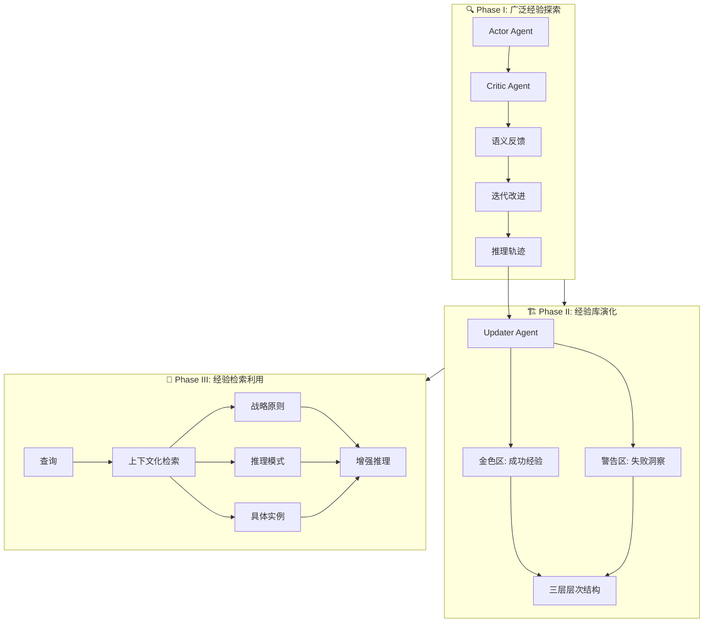

# 🧬 FLEX

## 基本信息
- **标题**: Continuous Agent Evolution via Forward Learning from Experience
- **中文标题**: 基于经验前向学习的连续智能体进化
- **arXiv**: [2511.06449](https://arxiv.org/abs/2511.06449)
- **机构**: Institute for AI Industry Research (AIR), Tsinghua University, ByteDance Seed, Shanghai Artificial Intelligence Laboratory
- **发表日期**: 2025年12月8日
- **基准测试**: AIME25, USPTO50k, ProteinGym, GSM8k

## 论文综合评分
**综合评分**: ⭐⭐⭐⭐⭐ 4.6/5.0

| 维度 | 评分 | 说明 |
|------|------|------|
| 期刊影响力 | ⭐⭐⭐⭐⭐ | 顶会级别，高质量研究 |
| 问题核心性 | ⭐⭐⭐⭐⭐ | 解决智能体持续学习的核心挑战 |
| 方法创新性 | ⭐⭐⭐⭐⭐ | 无梯度前向学习范式创新 |
| 技术壁垒 | ⭐⭐⭐⭐ | 完整理论框架 + 实践实现 |
| 落地可行性 | ⭐⭐⭐⭐⭐ | 模块化设计，跨模型继承 |
| 应用前景 | ⭐⭐⭐⭐⭐ | 数学、化学、生物等多领域验证 |

**综合评价**: FLEX 提出了一个革命性的无梯度前向学习范式，通过构建结构化的经验库使 LLM 智能体能够从经验中持续进化。该方法在数学推理、化学逆合成和蛋白质适应性预测三个科学领域均取得显著提升（最高 +23%），并发现了经验缩放律和跨智能体经验继承现象，为可扩展和可继承的连续智能体进化开辟了新方向。

## 本体论映射 (Ontology Mapping)
基于 Agent Memory 领域本体模型的 7 维度标注

- **记忆类型**: Experiential (经验记忆)
- **记忆结构**: Hierarchical (三层：战略/模式/实例)
- **记忆操作**: Formation + Evolution + Retrieval
- **记忆载体**: Token-level (显式文本)
- **功能定位**: Working (工作记忆) + Factual (事实记忆)
- **使用模式**: Experience-Driven, Progressive Learning, Cross-model Inheritance
- **验证公理**: Stability-Plasticity, Generalization, Efficiency

**领域贡献**: FLEX 将**前向学习范式 (Forward Learning Paradigm)**——通过前向探索和经验蒸馏而非梯度反向传播来实现学习——引入智能体记忆领域，提出了**层次化经验库 (Hierarchical Experience Library)** 框架。通过**金色区/警告区**的双区组织和**语义反馈机制**，该框架实现了从成功和失败中同时学习，并通过**经验继承**机制实现了跨模型的知识迁移，为解决智能体持续学习挑战提供了系统性解决方案。

## 核心主张（通俗易懂版）
- **🤔 问题是什么？** LLM 智能体训练后参数冻结，无法从部署期间的经验中持续学习，导致在挑战性任务上性能严重下降。
- **💡 解决方案是什么？** FLEX 提出无梯度的前向学习范式，通过构建层次化经验库（包含战略、模式、实例三层）来存储和重用从环境交互中蒸馏的知识。
- **🌟 核心优势是什么？** 无需修改模型参数即可实现持续进化，在三个科学领域均显著优于基线（数学 +23%、化学 +10%、生物 +14%），并支持跨模型经验继承（弱帮强 +6.7%~+16.7%）。

## 方法架构
FLEX 的核心创新是前向学习三阶段框架：

### 1. 广泛经验探索 (Extensive Experience Exploration)
- **并行缩放**: 通过拒绝采样并行生成多个推理轨迹
- **序列缩放**: 在批评家的语义反馈下迭代改进
- **语义信号**: 批评家提供自然语言形式的改进建议，替代数值梯度

### 2. 经验库演化 (Experience Library Evolution)
- **层次化组织**: 三层结构（高阶战略原则、中阶推理模式、低阶具体实例）
- **双区设计**: 金色区（正确轨迹）+ 警告区（失败案例和诊断洞察）
- **自适应更新**: 自动决定插入、合并或丢弃新经验

### 3. 经验检索利用 (Experience Retrieval and Utilization)
- **上下文化检索**: 基于查询和当前推理状态进行条件检索
- **层次化检索**: 从战略到实例的逐层检索
- **动态查询**: 推理过程中可动态查询经验库

### 架构图

## 实验结果
在 AIME25、USPTO50k、ProteinGym 和 GSM8k 四个基准测试上，FLEX 均取得显著提升：

**关键发现**:
- **数学推理**: Claude-Sonnet-4 在 AIME25 上从 40.0% 提升到 63.3% (+23.3%)
- **化学逆合成**: Claude-Sonnet-4.5 在 USPTO50k 上从 20.0% 提升到 30.0% (+10.0%)
- **蛋白质适应性**: Claude-Sonnet-4 在 ProteinGym 上从 46.0% 提升到 59.7% (+13.7%)
- **经验缩放律**: 经验库大小与性能呈幂律关系，训练准确率从 81.2% 提升到 94.2%
- **跨模型继承**: 弱模型经验可提升强模型性能（DeepSeek + Claude 经验 = +6.7%）

### 主要实验指标

**AIME25 (数学推理)**:
- Claude-Sonnet-4: 40.0% → **63.3%** (+23.3%)
- DeepSeek-V3.1-Terminus: 56.7% → **66.6%** (+10.0%)

**USPTO50k (化学逆合成)**:
- GPT-5: 9.0% → **16.0%** (+7.0%)
- Gemini-2.5-Pro: 9.0% → **18.0%** (+9.0%)
- Claude-Sonnet-4.5: 20.0% → **30.0%** (+10.0%)

**ProteinGym (蛋白质适应性)**:
- DeepSeek-V3.1-Terminus: 47.9% → **56.8%** (+8.9%)
- GPT-OSS-120B: 47.7% → **57.3%** (+9.6%)
- Claude-Sonnet-4: 46.0% → **59.7%** (+13.7%)

### 经验继承实验
- **强帮弱**: Claude 经验提升 Gemini 性能 +11.0%
- **弱帮强**: Claude 经验提升 DeepSeek 性能 +6.7%
- **通用性**: 经验库可跨模型、跨任务迁移

## 关键词
- 前向学习 (Forward Learning)
- 经验库 (Experience Library)
- 连续智能体进化 (Continuous Agent Evolution)
- 无梯度学习 (Gradient-free Learning)
- 经验缩放律 (Scaling Law of Experience)
- 经验继承 (Experience Inheritance)
- 层次化组织 (Hierarchical Organization)
- 语义反馈 (Semantic Feedback)
- 跨模型迁移 (Cross-model Transfer)
- 科学推理 (Scientific Reasoning)

## 局限性分析
- **计算开销**: 广泛探索需要多次前向推理，增加了训练时的计算成本
- **经验质量依赖**: 经验库的质量依赖于初始探索的质量和批评家的反馈准确性
- **领域适应性**: 在某些需要精细参数调整的任务上可能不如梯度方法有效

## 未来研究方向
- **效率优化**: 开发更高效的探索策略，减少计算开销
- **多模态扩展**: 将前向学习范式扩展到视觉、听觉等多模态场景
- **在线学习**: 实现真正的在线经验积累和实时性能提升
- **经验压缩**: 研究经验库的压缩和蒸馏技术，提高存储和检索效率