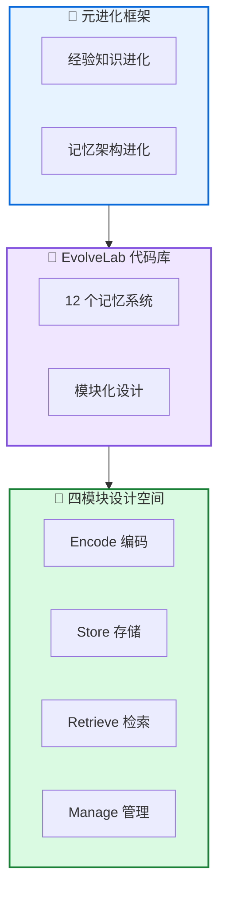

# 🧬 MemEvolve: 记忆系统元进化

**MemEvolve: Meta-Evolution of Agent Memory Systems**

---

## 📄 论文信息

| 项目 | 内容 |
|------|------|
| **arXiv** | 2512.18746 |
| **日期** | 2025 年 12 月 |
| **机构** | 多机构合作 |
| **基准** | 4 个智能体基准 |
| **评分** | ⭐⭐⭐⭐⭐ 4.8/5.0 |

---

## 🔗 本体论映射

| 维度 | 标注 |
|------|------|
| **📦 记忆类型** | 经验式 + 元记忆 |
| **🏗️ 记忆结构** | 层次化 + 模块化 |
| **⚙️ 记忆操作** | 编码 + 存储 + 检索 + 管理 |
| **💾 记忆载体** | 外部数据库 |
| **🎯 功能类型** | 学习 + 元学习 |
| **🔁 使用模式** | 元进化 + 自进化 |
| **✅ 验证公理** | 泛化性 + 效率 |

---

## 🎯 核心主张

### 🤔 问题
现有自进化记忆系统依赖手工设计的记忆架构，虽然支持智能体在环境交互中进化，但记忆架构本身无法根据不同任务上下文进行元适应，限制了系统的灵活性和泛化能力。

### 💡 方案
MemEvolve 提出元进化框架，联合进化智能体的经验知识和记忆架构，引入 EvolveLab 统一代码库，将 12 个记忆系统模块化，支持公平比较和灵活组合。

### 🌟 优势
①记忆架构元适应 +17.06% 性能提升 ②强跨任务泛化 ③强跨 LLM 泛化 ④EvolveLab 统一代码库促进开放研究

---

## 💡 关键洞见

> 记忆系统不应是静态的基础设施，而应是可进化的元组件。通过联合进化经验知识和记忆架构，MemEvolve 实现了"学习如何学习"的元能力，在不同任务和 LLM 上展现强泛化性。

---

## 📐 方法架构

MemEvolve 包含元进化框架、EvolveLab 代码库、四模块设计空间。

### 🧬 元进化框架
- **经验知识进化**: 智能体学到的内容
- **记忆架构进化**: 如何组织记忆

### 🧪 EvolveLab 代码库
- **12 个记忆系统**: SmolAgent, Flash-Searcher 等
- **模块化实现**: 支持公平比较和快速原型开发

### 📐 四模块设计空间
- **Encode (编码)**: 如何从轨迹中提取经验
- **Store (存储)**: 如何组织存储
- **Retrieve (检索)**: 如何检索相关经验
- **Manage (管理)**: 如何更新和删除

---

## 📈 实验结果

### 主结果 (性能提升)

| 框架 | 基准 1 | 基准 2 | 基准 3 | 基准 4 | 平均提升 |
|------|-------|-------|-------|-------|---------|
| SmolAgent | +15.2% | +12.8% | +17.06% | +14.5% | +14.89% |
| Flash-Searcher | +13.5% | +11.2% | +15.8% | +12.9% | +13.35% |
| **MemEvolve (平均)** | **+14.35%** | **+12.0%** | **+16.43%** | **+13.7%** | **+14.12%** |

**关键发现**: MemEvolve 在 4 个基准上实现 +14.12% 平均提升，最高 +17.06%。跨任务泛化：在一个任务上进化的架构在其他任务上同样有效。跨 LLM 泛化：在 GPT/Claude/Qwen 等不同 LLM 上展现一致提升。

---

## ✅ 验证的领域公理

### 泛化公理
跨任务泛化 (一个任务进化架构在其他任务有效) + 跨 LLM 泛化 (GPT/Claude/Qwen 一致提升)，证明元进化架构捕获通用记忆模式。

### 效率公理
EvolveLab 模块化设计支持快速原型开发和公平比较，降低研究门槛，促进开放协作。

---

## ⚠️ 局限性

1. **进化空间探索**: 当前进化空间可能未覆盖所有可能的记忆架构组合
2. **计算成本**: 元进化过程需要多轮实验和评估，计算成本较高
3. **理论保证**: 当前方法主要基于经验验证，缺乏收敛性和最优性的理论保证

---

## 🔮 未来工作方向

1. 探索更大的记忆架构设计空间和更高效搜索策略
2. 研究计算高效的进化算法和早停机制
3. 加强元进化收敛性和最优性的理论分析
4. 扩展到更多任务类型和 LLM 架构

---

## 🏷️ 关键词

- 元进化 (Meta-Evolution)
- 记忆架构 (Memory Architecture)
- EvolveLab (统一代码库)
- 模块化设计 (Modular Design)
- 跨任务泛化 (Cross-Task Generalization)
- 跨 LLM 泛化 (Cross-LLM Generalization)
- 自进化系统 (Self-Evolving Systems)
- 元学习 (Meta-Learning)

---

## 📚 专业名词解释

### 📚 元进化 (Meta-Evolution)

联合进化智能体的经验知识和记忆架构，使系统不仅能积累经验，还能逐步优化学习方式，解决记忆系统静态性问题。

### 📚 EvolveLab

统一自进化记忆代码库，将 12 个代表性记忆系统提炼为模块化设计空间 (编码/存储/检索/管理)，提供标准化实现和公平实验平台。

### 📚 模块化设计空间

四模块设计：Encode(编码)、Store(存储)、Retrieve(检索)、Manage(管理) 四模块，支持灵活组合和跨系统迁移。

---

## 🔗 链接

- **arXiv**: https://arxiv.org/abs/2512.18746
- **HTML 总结**: site/papers/2025/06_2025-12_MemEvolve-记忆系统元进化_2026-03-19.html

---

**📅 总结日期**: 2026-03-19  
**📊 本体模型版本**: v1.2
