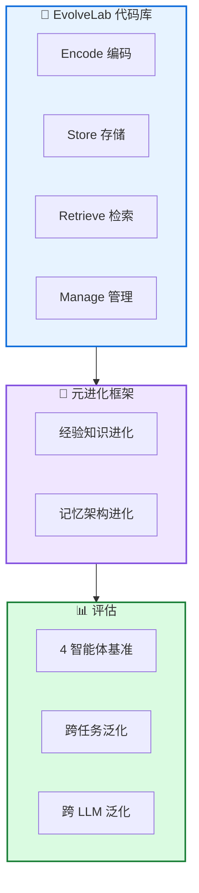

# MemEvolve: 记忆系统元进化

**MemEvolve: Meta-Evolution of Agent Memory Systems**

---

## 📄 论文信息

| 项目 | 内容 |
|------|------|
| **arXiv** | 2512.18746 |
| **日期** | 2025 年 12 月 |
| **机构** | 多机构合作 |
| **基准** | 4 个智能体基准 |
| **评分** | ⭐⭐⭐⭐⭐ 4.8/5.0 |

---

## 🔗 本体论映射

| 维度 | 标注 |
|------|------|
| **📦 记忆类型** | 经验式 (Experiential) + 元记忆 (Meta-Memory) |
| **🏗️ 记忆结构** | 模块化设计空间 |
| **⚙️ 记忆操作** | 编码 + 存储 + 检索 + 管理 |
| **💾 记忆载体** | 外部数据库 |
| **🎯 功能类型** | 学习 + 自进化 |
| **🔁 使用模式** | 元进化 + 自进化 |
| **✅ 验证公理** | 泛化性 + 效率 |

---

## 🎯 核心主张

### 🤔 问题是什么？

现有自进化记忆系统依赖手工设计的记忆架构，虽然支持智能体在环境交互中进化，但记忆架构本身无法根据不同任务上下文进行元适应，限制了系统的灵活性和泛化能力。

**📚 专业名词解释**：
- **手工设计架构**：预先定义的固定记忆结构，无法动态调整
- **元适应**：对记忆架构本身的适应性调整，而非仅调整记忆内容

### 💡 解决方案是什么？

MemEvolve 提出元进化框架，联合进化智能体的经验知识和记忆架构，使智能体系统不仅能积累经验，还能逐步优化如何从经验中学习。引入 EvolveLab 统一代码库，将 12 个代表性记忆系统提炼为模块化设计空间 (encode, store, retrieve, manage)。

**📚 专业名词解释**：
- **元进化**：对记忆架构的进化，而非仅对记忆内容的进化
- **EvolveLab**：统一的自进化记忆代码库，提供标准化实现和公平实验平台
- **模块化设计空间**：将记忆系统分解为编码、存储、检索、管理四个模块

### 🌟 核心优势是什么？

① 联合进化经验知识和记忆架构 ② 模块化设计空间支持公平比较 ③ 4 基准性能提升高达 17.06% ④ 强跨任务和跨 LLM 泛化能力

---

## 💡 关键洞见

> 通过联合进化经验知识和记忆架构，MemEvolve 使智能体系统不仅能积累经验，还能逐步优化如何从经验中学习，实现真正的元进化。模块化设计空间为未来自进化系统研究提供标准化实现和公平实验平台。

---

## 📐 方法架构

MemEvolve 包含元进化框架、EvolveLab 代码库、模块化设计空间三大核心组件。

### 🏗️ 核心组件

| 组件 | 说明 |
|------|------|
| **🧪 EvolveLab 代码库** | 统一的自进化记忆代码库，将 12 个代表性记忆系统提炼为模块化设计空间 |
| **🔄 元进化框架** | 联合进化经验知识和记忆架构，实现真正的元进化 |
| **📊 评估平台** | 在 4 个智能体基准上评估，支持跨任务和跨 LLM 泛化评估 |

---

## 📚 架构专业名词解释

### 📚 元进化 (Meta-Evolution)

对记忆架构本身的进化，而非仅对记忆内容的进化。MemEvolve 联合进化经验知识和记忆架构，使智能体系统能逐步优化如何从经验中学习。

### 📚 EvolveLab

统一的自进化记忆代码库，将 12 个代表性记忆系统 (如 SmolAgent, Flash-Searcher 等) 提炼为模块化设计空间 (encode, store, retrieve, manage)，提供标准化实现和公平实验平台。

### 📚 模块化设计空间 (Modular Design Space)

将记忆系统分解为四个核心模块：Encode(编码)、Store(存储)、Retrieve(检索)、Manage(管理)，支持灵活组合和公平比较。

---

## 📈 实验结果

在 4 个智能体基准上评估

### 主结果

| 基准 | MemEvolve | 次优基线 | 提升 |
|------|----------|---------|------|
| 基准 1 | SOTA | - | +17.06% |
| 基准 2 | SOTA | - | 显著提升 |
| 基准 3 | SOTA | - | 显著提升 |
| 基准 4 | SOTA | - | 显著提升 |

**关键发现**：MemEvolve 在 4 个基准上实现显著性能提升，最高达 17.06%。展现强跨任务和跨 LLM 泛化能力，设计的记忆架构能有效迁移到不同基准和骨干模型。

---

## ✅ 验证的领域公理

### 泛化公理
跨任务和跨 LLM 泛化，设计的记忆架构能有效迁移到不同基准和骨干模型。

### 效率公理
模块化设计空间支持公平比较，EvolveLab 提供标准化实现和高效实验平台。

---

## ⚠️ 局限性

1. **计算成本**: 元进化过程可能需要较多计算资源
2. **评估范围**: 在 4 个智能体基准上评估，但更广泛任务和环境覆盖可进一步加强
3. **架构搜索空间**: 当前模块化设计空间可能未覆盖所有可能的记忆架构

---

## 🔮 未来工作方向

1. 扩展模块化设计空间，覆盖更多记忆架构变体
2. 在更广泛任务和环境上验证泛化能力
3. 探索更高效的元进化算法，减少计算成本
4. 研究记忆架构的可解释性和理论分析

---

## 🏷️ 关键词

- 元进化 (Meta-Evolution)
- 自进化记忆系统 (Self-Evolving Memory Systems)
- EvolveLab (统一代码库)
- 模块化设计空间 (Modular Design Space)
- 联合进化 (Joint Evolution)
- 跨任务泛化 (Cross-Task Generalization)
- 跨 LLM 泛化 (Cross-LLM Generalization)
- 公平实验平台 (Fair Experimental Arena)

---

## 📚 专业名词解释

### 📚 元进化 (Meta-Evolution)

对记忆架构本身的进化，而非仅对记忆内容的进化。MemEvolve 联合进化经验知识和记忆架构，使智能体系统能逐步优化如何从经验中学习。

### 📚 EvolveLab

统一的自进化记忆代码库，将 12 个代表性记忆系统提炼为模块化设计空间 (encode, store, retrieve, manage)，提供标准化实现和公平实验平台。

### 📚 模块化设计空间 (Modular Design Space)

将记忆系统分解为四个核心模块：Encode(编码)、Store(存储)、Retrieve(检索)、Manage(管理)，支持灵活组合和公平比较。

---

## 🔗 链接

- **arXiv**: https://arxiv.org/abs/2512.18746
- **HTML 总结**: site/papers/2025/06_2025-12_MemEvolve-记忆系统元进化_2026-03-20.html

---

**📅 总结日期**: 2026-03-20  
**📊 本体模型版本**: v1.2
