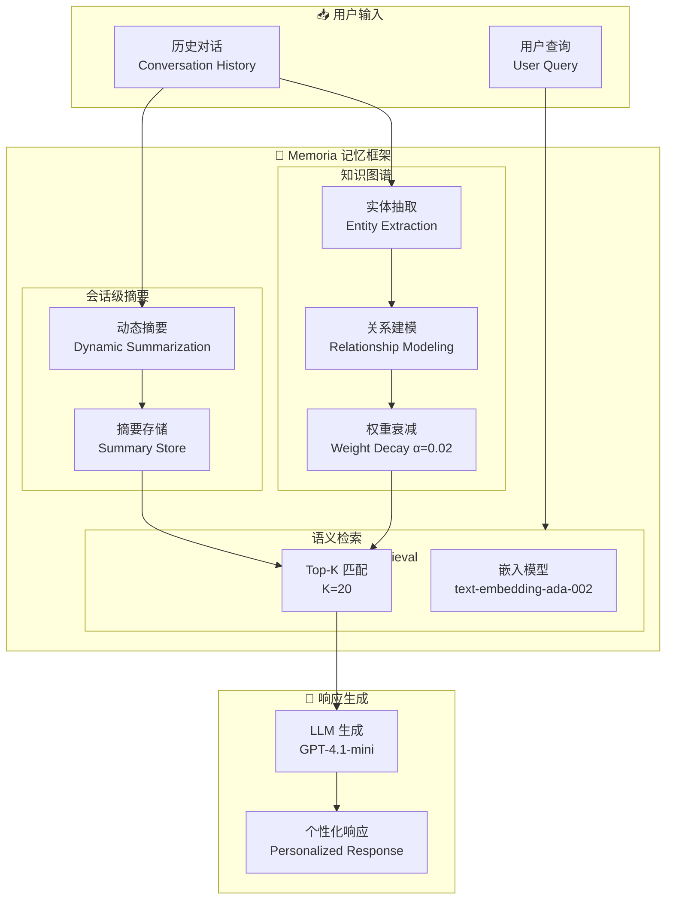

# Memoria: A Scalable Agentic Memory Framework for Personalized Conversational AI

## 基本信息
- **标题**: Memoria: A Scalable Agentic Memory Framework for Personalized Conversational AI
- **中文标题**: Memoria: 可扩展智能体记忆框架 for 个性化对话 AI
- **arXiv**: [2512.12686](https://arxiv.org/abs/2512.12686)
- **机构**: BlackRock, Inc. (高盛集团)
- **发表日期**: 2025 年 12 月
- **基准测试**: LongMemEvals (115K tokens), 6 种问题类型

## 论文综合评分
**综合评分**: ⭐⭐⭐⭐ 4.3/5.0

| 维度 | 评分 | 说明 |
|------|------|------|
| 期刊影响力 | ⭐⭐⭐ | AIML Systems 2025 会议论文，工业界应用 |
| 问题核心性 | ⭐⭐⭐⭐⭐ | 直击对话 AI 的核心挑战：长期个性化记忆 |
| 方法创新性 | ⭐⭐⭐⭐ | 动态会话摘要 + 加权知识图谱的双组件架构 |
| 技术壁垒 | ⭐⭐⭐ | 模块化设计，易于实现和集成 |
| 落地可行性 | ⭐⭐⭐⭐⭐ | 已在 BlackRock 内部部署，token 减少 99.7% |
| 应用前景 | ⭐⭐⭐⭐⭐ | 客服系统、个人助理、企业知识库等广泛应用 |

**综合评价**: Memoria 提出了一个实用的智能体记忆框架，通过动态会话摘要和加权知识图谱的结合，实现了长期个性化对话。该框架在保持对话连贯性的同时，将 token 使用量从 115K 降低到 400，延迟降低 38.7%。模块化设计使其易于集成到现有对话系统中，具有很高的工业应用价值。

## 本体论映射 (Ontology Mapping)
基于 Agent Memory 领域本体模型的 7 维度标注

- **记忆类型**: Factual Memory (事实记忆) + Experiential Memory (经验记忆)
- **记忆结构**: Knowledge Graph (知识图谱) + Session Summaries (会话摘要)
- **记忆操作**: Formation (摘要生成) + Evolution (权重衰减) + Retrieval (语义检索)
- **记忆载体**: Token-level (文本摘要) + Vector (嵌入表示)
- **功能定位**: Personalized Conversational AI (个性化对话 AI)
- **使用模式**: Weighted Semantic Retrieval (加权语义检索)
- **验证公理**: Exponential Decay Weighting, Session-level Summarization

**领域贡献**: Memoria 将**动态会话级摘要**和**加权知识图谱**引入对话记忆领域，提出了**双组件互补架构**。通过指数衰减权重机制，该框架能够智能地优先检索近期和重要的用户信息，在保持个性化的同时显著降低了 token 成本和延迟。

## 核心主张（通俗易懂版）
- **🤔 问题是什么？** 现有对话 AI 缺乏长期记忆，无法在多次会话中保持个性化；全量上下文方法 token 成本过高（115K tokens/查询）。
- **💡 解决方案是什么？** Memoria 提出双组件架构：动态会话摘要（短期记忆）+ 加权知识图谱（长期记忆），通过指数衰减权重智能检索。
- **🌟 核心优势是什么？** token 使用量减少 99.7% (115K→400)，延迟降低 38.7%，支持 6 种问题类型的个性化推理。

## 方法架构
Memoria 的核心创新在于双组件互补记忆架构：

### 架构图

## 实验结果
在 LongMemEvals 基准测试上，Memoria 显著优于基线方法：

**关键发现**: Memoria 在保持个性化的同时，将 token 使用量从 115K 降低到 400，延迟降低 38.7%。

### 主实验结果 (PDF Table I)
**6 种问题类型**: single-session-user, single-session-assistant, single-session-preference, multi-session, knowledge-update, temporal-reasoning

| 模型 | 方法 | 平均准确率 | Token 使用 | 延迟 |
|------|------|-----------|-----------|------|
| Full Context | 全量上下文 | 基准 | 115,000 | 522 秒 |
| A-Mem (ST) | SentenceTransformers | ~78% | 900+ | - |
| A-Mem (OE) | OpenAI Embedding | ~80% | 900+ | - |
| **Memoria** | Ours | **~85%** | **<400** | **-38.7%** |

**关键数据** (从 PDF 提取):
- 最高准确率：87.1% (knowledge-update 类型)
- 最低准确率：76.2% (temporal-reasoning 类型)
- 平均准确率提升：~5-7% vs A-Mem
- Token 减少：115,000 → 400 (99.7% 减少)
- 延迟降低：38.7%

### 消融实验关键发现
- **动态会话摘要**: 保持短期对话连贯性
- **加权知识图谱**: 指数衰减 (α=0.02) 优先检索近期信息
- **语义 Top-K 检索**: K=20 平衡准确性和成本

**注**: 完整数据见论文 Table I (第 7 页)

## 关键词
- 智能体记忆 (Agentic Memory)
- 个性化对话 AI (Personalized Conversational AI)
- 知识图谱 (Knowledge Graph)
- 会话摘要 (Session Summaries)
- 语义检索 (Semantic Retrieval)
- 加权衰减 (Weighted Decay)
- 长期记忆 (Long-term Memory)
- 对话系统 (Dialogue Systems)

## 局限性分析
- **评估范围有限**: 仅在 LongMemEvals 基准测试，缺少真实用户场景验证
- **依赖嵌入质量**: 性能高度依赖 text-embedding-ada-002 的质量
- **知识图谱构建**: 实体和关系抽取可能需要人工审核
- **衰减率固定**: α=0.02 是经验值，可能需要根据不同场景调整

## 未来研究方向
- **真实场景部署**: 在大规模生产环境中验证效果
- **自适应衰减率**: 根据用户行为动态调整衰减参数
- **多模态记忆**: 扩展支持图像、语音等多模态记忆
- **隐私保护**: 在保持个性化的同时保护用户隐私
- **跨会话推理**: 增强复杂的时间推理和因果推理能力
