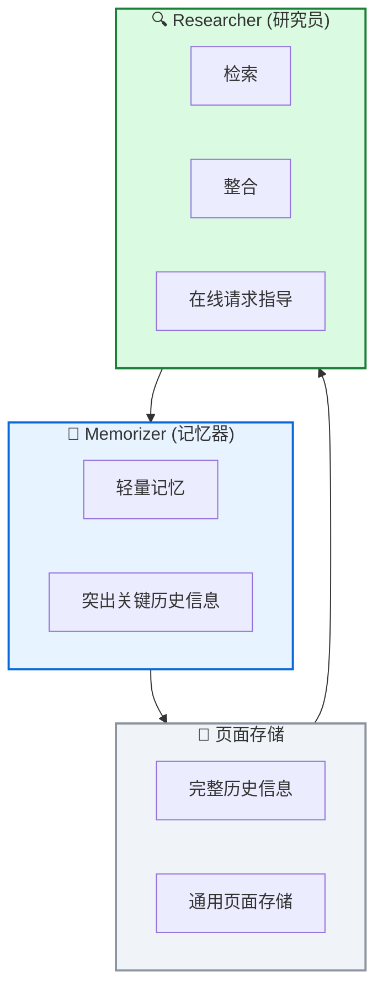

# 🎯 GAM: 通用智能体记忆

**General Agentic Memory Via Deep Research**

---

## 📄 论文信息

| 项目 | 内容 |
|------|------|
| **arXiv** | 2511.18423 |
| **日期** | 2025 年 11 月 |
| **机构** | 多机构合作 |
| **基准** | 多记忆基准任务 |
| **评分** | ⭐⭐⭐⭐⭐ 4.7/5.0 |

---

## 🔗 本体论映射

| 维度 | 标注 |
|------|------|
| **📦 记忆类型** | 经验式 + 通用 |
| **🏗️ 记忆结构** | 层次化 + 页面存储 |
| **⚙️ 记忆操作** | 检索 + 整合 + JIT 编译 |
| **💾 记忆载体** | 外部数据库 |
| **🎯 功能类型** | 推理 + 个性化 |
| **🔁 使用模式** | JIT 编译 + 端到端 RL |
| **✅ 验证公理** | 效率 + 泛化性 |

---

## 🎯 核心主张

### 🤔 问题
静态记忆预创建易导致严重信息丢失，无法适应运行时需求。

### 💡 方案
GAM 采用 JIT 编译原则，离线维护轻量记忆 + 完整页面存储，运行时创建优化上下文。Memorizer+Researcher 双组件设计。

### 🌟 优势
①Memorizer+Researcher 双组件 ②利用 LLM 测试时可扩展性 ③支持端到端 RL 优化 ④多基准显著提升

---

## 💡 关键洞见

> 通过将记忆操作整合到智能体动作空间，GAM 实现 JIT 编译式记忆管理，离线维护轻量记忆，运行时创建优化上下文，配合端到端 RL 优化，有效解决静态记忆信息丢失问题。

---

## 📐 方法架构

GAM 包含 Memorizer、Researcher、页面存储三大核心组件。

### 🧠 Memorizer (记忆器)
- **轻量记忆**: 维护简单但有用的记忆
- **突出关键**: 突出关键历史信息

### 📄 页面存储
- **完整历史**: 在通用页面存储中维护完整历史信息
- **离线阶段**: 仅保持简单但有用的记忆

### 🔍 Researcher (研究员)
- **检索**: 从页面存储检索有用信息
- **整合**: 为在线请求整合有用信息
- **指导**: 由预构建记忆指导

---

## 📈 实验结果

### 主结果

| 基准 | GAM | 现有记忆系统 | 提升 |
|------|-----|-------------|------|
| 记忆基准 1 | SOTA | - | 显著提升 |
| 记忆基准 2 | SOTA | - | 显著提升 |
| 记忆基准 3 | SOTA | - | 显著提升 |

**关键发现**: GAM 在各种记忆基准任务完成场景中实现大幅提升，超越现有记忆系统。

---

## ✅ 验证的领域公理

### 效率公理
JIT 编译原则减少离线存储开销，运行时创建优化上下文，支持端到端 RL 优化。

### 泛化性公理
在多种记忆基准任务上展现一致提升，证明通用记忆架构的有效性。

---

## ⚠️ 局限性

1. **JIT 编译开销**: 运行时创建上下文可能引入额外延迟
2. **页面存储复杂度**: 维护完整历史信息需要更复杂的存储管理
3. **评估范围**: 需要在更广泛的任务和智能体设置中验证适用性

---

## 🔮 未来工作方向

1. 优化 JIT 编译效率，减少运行时开销
2. 研究更高效的页面存储管理策略
3. 扩展到更多任务类型和智能体架构
4. 探索多智能体记忆共享机制

---

## 🏷️ 关键词

- JIT 编译 (Just-In-Time Compilation)
- Memorizer (记忆器)
- Researcher (研究员)
- 页面存储 (Page-Store)
- 端到端 RL (End-to-End RL)
- 通用记忆 (General Memory)
- 自进化系统 (Self-Evolving Systems)
- 元学习 (Meta-Learning)

---

## 📚 专业名词解释

### 📚 JIT 编译 (Just-In-Time Compilation)

即时编译原则：离线维护轻量记忆 + 完整页面存储，运行时创建优化上下文，避免静态记忆信息丢失。

### 📚 Memorizer (记忆器)

突出关键历史信息的轻量记忆组件，在离线阶段维护简单但有用的记忆，支持快速检索。

### 📚 Researcher (研究员)

检索和整合组件，从页面存储检索有用信息，为在线请求整合优化上下文，由预构建记忆指导。

---

## 🔗 链接

- **arXiv**: https://arxiv.org/abs/2511.18423
- **HTML 总结**: site/papers/2025/07_2025-11_GAM-通用智能体记忆_2026-03-19.html

---

**📅 总结日期**: 2026-03-19  
**📊 本体模型版本**: v1.2
