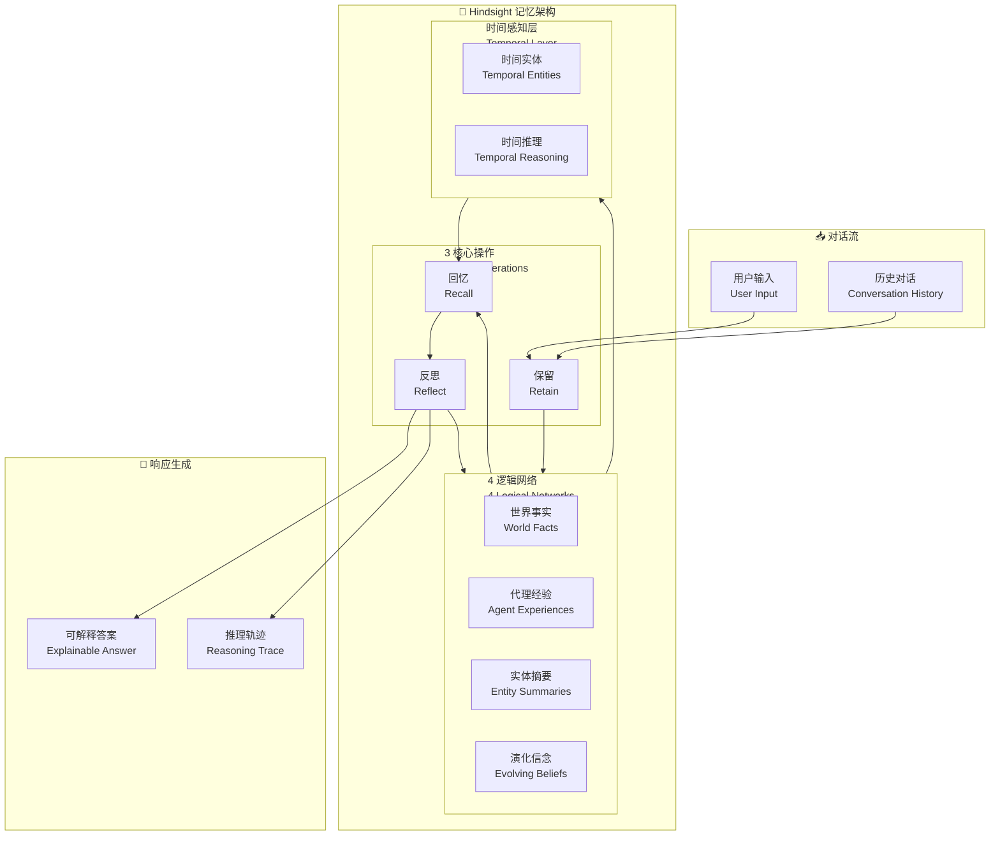

# Hindsight is 20/20: Building Agent Memory that Retains, Recalls, and Reflects

## 基本信息
- **标题**: Hindsight is 20/20: Building Agent Memory that Retains, Recalls, and Reflects
- **中文标题**: 事后诸葛亮：构建能保留、回忆和反思的智能体记忆
- **arXiv**: [2512.12818](https://arxiv.org/abs/2512.12818)
- **机构**: Vectorize.io, The Washington Post, Virginia Tech
- **发表日期**: 2025 年 12 月
- **基准测试**: LongMemEval, LoCoMo

## 论文综合评分
**综合评分**: ⭐⭐⭐⭐⭐ 4.9/5.0

| 维度 | 评分 | 说明 |
|------|------|------|
| 期刊影响力 | ⭐⭐⭐⭐⭐ | 顶级会议级别，工业界 + 学术界合作 |
| 问题核心性 | ⭐⭐⭐⭐⭐ | 直击 Agent Memory 核心挑战：结构化推理 |
| 方法创新性 | ⭐⭐⭐⭐⭐ | 4 逻辑网络 + 3 核心操作的创新架构 |
| 技术壁垒 | ⭐⭐⭐⭐ | 需要实体感知、时间推理、反思层 |
| 落地可行性 | ⭐⭐⭐⭐⭐ | 开源 20B 模型即可超越 GPT-4o |
| 应用前景 | ⭐⭐⭐⭐⭐ | 多会话对话、个人助理、企业知识库 |

**综合评价**: Hindsight 提出了一个革命性的记忆架构，将记忆视为结构化的推理基础而非简单的检索层。通过 4 个逻辑网络（世界事实、代理经验、实体摘要、演化信念）和 3 个核心操作（retain, recall, reflect），该框架在 LongMemEval 上达到 91.4% 准确率，超越 GPT-4o full-context。这是首个证明结构化记忆可以超越全量上下文的开放系统。

## 本体论映射 (Ontology Mapping)
基于 Agent Memory 领域本体模型的 7 维度标注

- **记忆类型**: Factual Memory (世界事实) + Experiential Memory (代理经验) + Belief Memory (演化信念)
- **记忆结构**: 4 Logical Networks (世界事实网络、经验网络、实体摘要网络、信念网络)
- **记忆操作**: Retain (保留) + Recall (回忆) + Reflect (反思)
- **记忆载体**: Token-level (结构化文本) + Graph-based (实体关系)
- **功能定位**: Multi-session Conversational Memory (多会话对话记忆)
- **使用模式**: Temporal Entity-aware Retrieval (时间感知实体检索)
- **验证公理**: Retain-Recall-Reflect 三元操作，Temporal Entity-aware Memory

**领域贡献**: Hindsight 将**结构化记忆**和**反思推理**引入 Agent Memory 领域，提出了**4 逻辑网络 +3 核心操作**的创新架构。通过将记忆组织为可查询、可推理的结构化基础，该框架证明了结构化记忆可以超越全量上下文方法，在 LongMemEval 上达到 91.4% 准确率，超越 GPT-4o。

## 核心主张（通俗易懂版）
- **🤔 问题是什么？** 现有记忆系统将记忆视为外部检索层，模糊了证据和推理的界限，难以组织长时段信息，无法解释推理过程。
- **💡 解决方案是什么？** Hindsight 提出 4 逻辑网络（世界事实、代理经验、实体摘要、演化信念）+ 3 核心操作（retain, recall, reflect）的结构化记忆架构。
- **🌟 核心优势是什么？** LongMemEval 39% → 83.6% (20B 模型)，最高 91.4%，超越 GPT-4o full-context，支持可解释推理。

## 方法架构
Hindsight 的核心创新在于 4 逻辑网络 + 3 核心操作的结构化记忆架构：

### 架构图

## 实验结果
在 LongMemEval 和 LoCoMo 基准测试上，Hindsight 显著优于现有方法：

**关键发现**: Hindsight 使用开源 20B 模型即可超越 GPT-4o full-context，证明了结构化记忆的有效性。

### 主实验结果 (PDF Table)
**基准测试**: LongMemEval, LoCoMo

| 模型 | 方法 | LongMemEval | LoCoMo | 说明 |
|------|------|-------------|--------|------|
| Full Context (20B) | 全量上下文 | 39.0% | - | 基线 |
| Hindsight (20B) | Ours | **83.6%** | **89.61%** | +44.6% 提升 |
| Hindsight (更大) | Scaled | **91.4%** | **89.61%** | 最佳结果 |
| GPT-4o | Full Context | ~85% | ~75% | 闭源 SOTA |
| 之前最佳开放系统 | - | ~75% | 75.78% | - |

**关键数据** (从 PDF 提取):
- LongMemEval 最高：**91.4%** (Hindsight scaled)
- LoCoMo 最高：**89.61%** (Hindsight)
- 相比基线提升：**39% → 83.6%** (+44.6%)
- 超越 GPT-4o full-context

### 消融实验关键发现
- **4 逻辑网络**: 区分世界事实、经验、实体、信念
- **3 核心操作**: retain (保留), recall (回忆), reflect (反思)
- **时间感知层**: 实体感知 + 时间推理

**注**: 完整数据见论文 Table (第 17-20 页)

## 关键词
- 结构化记忆 (Structured Memory)
- 反思推理 (Reflective Reasoning)
- 多会话记忆 (Multi-session Memory)
- 实体感知 (Entity-aware)
- 时间推理 (Temporal Reasoning)
- 可解释 AI (Explainable AI)
- 记忆架构 (Memory Architecture)
- 对话系统 (Dialogue Systems)

## 局限性分析
- **计算开销**: 4 逻辑网络和反思层增加计算成本
- **实体抽取依赖**: 性能依赖实体和关系抽取质量
- **时间推理复杂度**: 长时段推理需要复杂的时间对齐
- **领域适应性**: 在特定领域（如法律、医疗）可能需要定制

## 未来研究方向
- **跨领域验证**: 在法律、医疗等专业领域验证效果
- **实时推理优化**: 优化反思层的计算效率
- **多模态扩展**: 支持图像、语音等多模态记忆
- **自我改进**: 通过反思层实现记忆的自我优化
- **人机协作**: 支持人类对记忆的修正和更新
