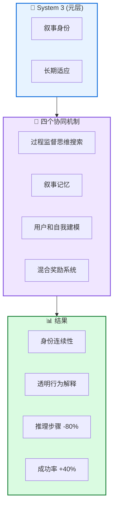

# Sophia: 持久智能体框架

**Sophia: A Persistent Agent Framework of Artificial Life**

---

## 📄 论文信息

| 项目 | 内容 |
|------|------|
| **arXiv** | 2512.18202 |
| **日期** | 2025 年 12 月 |
| **机构** | 多机构合作 |
| **基准** | 概念验证 + 工程原型 |
| **评分** | ⭐⭐⭐⭐⭐ 4.6/5.0 |

---

## 🔗 本体论映射

| 维度 | 标注 |
|------|------|
| **📦 记忆类型** | 叙事记忆 (Narrative) + 自传体记忆 |
| **🏗️ 记忆结构** | 层次化 (System 3) |
| **⚙️ 记忆操作** | 形成 + 整合 + 自我改进 |
| **💾 记忆载体** | 外部数据库 |
| **🎯 功能类型** | 身份连续性 + 长期适应 |
| **🔁 使用模式** | 持久智能体 + 自驱动 |
| **✅ 验证公理** | 稳定性 - 可塑性 + 效率 |

---

## 🎯 核心主张

### 🤔 问题是什么？

大多数智能体架构保持静态和被动，局限于手动定义的狭窄场景。这些系统在感知 (System 1) 和深思 (System 2) 方面表现出色，但缺乏持久的元层来维护身份、验证推理，并将短期行动与长期生存对齐。

**📚 专业名词解释**：
- **System 1**：快速、直觉的感知系统
- **System 2**：慢速、深思的决策系统
- **System 3**：持久的元层，维护身份和长期适应

### 💡 解决方案是什么？

提出 System 3 第三层，管理智能体的叙事身份和长期适应。框架将选定的心理学构建映射到具体计算模块，将人工生命的抽象概念转化为可实现的设计要求。实现为 Sophia"持久智能体"包装器，将连续自改进循环嫁接到任何 LLM 中心的 System 1/2 栈上。

**📚 专业名词解释**：
- **System 3**：第三层元认知系统，管理叙事身份和长期适应
- **叙事记忆**：存储智能体自传体经历的记忆
- **持久智能体**：具有身份连续性和透明行为解释的智能体

### 🌟 核心优势是什么？

① 推理步骤减少 80% (重复操作) ② 高复杂度任务成功率 +40% ③ 连贯的叙事身份 ④ 内在任务组织能力

---

## 💡 关键洞见

> 通过融合心理学洞察和轻量级强化学习核心，持久智能体架构推进了人工生命的实用路径。System 3 展示连贯的叙事身份和内在任务组织能力，实现身份连续性和透明行为解释。

---

## 📐 方法架构

Sophia 由四个协同机制驱动：过程监督思维搜索、叙事记忆、用户和自我建模、混合奖励系统。

### 🏗️ 核心组件

| 组件 | 说明 |
|------|------|
| **🧠 System 3** | 第三层元认知系统，管理叙事身份和长期适应 |
| **🔄 过程监督思维搜索** | 监督思维过程，确保推理质量 |
| **📖 叙事记忆** | 存储智能体自传体经历 |
| **👤 用户和自我建模** | 建模用户和自身，支持身份连续性 |
| **🏆 混合奖励系统** | 结合内在和外在奖励，驱动自改进 |

---

## 📚 架构专业名词解释

### 📚 System 3 (第三层)

第三层元认知系统，管理智能体的叙事身份和长期适应。System 3 监督 System 1(感知) 和 System 2(深思)，确保短期行动与长期生存对齐。

### 📚 叙事记忆 (Narrative Memory)

存储智能体自传体经历的记忆，支持身份连续性和透明行为解释。叙事记忆使智能体能解释"我为什么这样做"。

### 📚 持久智能体 (Persistent Agent)

具有身份连续性和透明行为解释的智能体。Sophia 将连续自改进循环嫁接到任何 LLM 中心的 System 1/2 栈上，实现持久性。

---

## 📈 实验结果

概念验证 + 工程原型评估

### 定量结果

| 指标 | Sophia | 基线 | 提升 |
|------|--------|------|------|
| 推理步骤减少 | 80% | - | - |
| 高复杂度任务成功率 | +40% | - | +40% |

**关键发现**：Sophia 独立发起和执行各种内在任务，同时在重复操作上实现 80% 推理步骤减少。元认知持久性在高复杂度任务上产生 40% 成功率提升，有效弥合简单和复杂目标之间的性能差距。

### 定性结果

System 3 展示连贯的叙事身份和内在任务组织能力。

---

## ✅ 验证的领域公理

### 稳定性 - 可塑性公理
元认知持久性支持新任务学习 (可塑性) 同时保持身份连续性 (稳定性)。

### 效率公理
推理步骤减少 80%，证明轻量级强化学习核心的高效性。

---

## ⚠️ 局限性

1. **概念性为主**: 论文主要是概念性的，需要更多工程实现验证
2. **评估范围**: 在有限基准上评估，更广泛任务和环境覆盖可进一步加强
3. **计算成本**: 元认知层可能引入额外计算开销

---

## 🔮 未来工作方向

1. 扩展工程实现，验证概念框架
2. 在更广泛任务和环境上评估泛化能力
3. 探索 System 3 与其他智能体架构的集成
4. 研究元认知层的计算效率优化

---

## 🏷️ 关键词

- 持久智能体 (Persistent Agent)
- System 3 (第三层)
- 叙事记忆 (Narrative Memory)
- 身份连续性 (Identity Continuity)
- 元认知持久性 (Meta-Cognitive Persistence)
- 自改进循环 (Self-Improvement Loop)
- 透明行为解释 (Transparent Behavioral Explanation)
- 人工生命 (Artificial Life)

---

## 📚 专业名词解释

### 📚 System 3 (第三层)

第三层元认知系统，管理智能体的叙事身份和长期适应。System 3 监督 System 1(感知) 和 System 2(深思)，确保短期行动与长期生存对齐。

### 📚 叙事记忆 (Narrative Memory)

存储智能体自传体经历的记忆，支持身份连续性和透明行为解释。叙事记忆使智能体能解释"我为什么这样做"。

### 📚 持久智能体 (Persistent Agent)

具有身份连续性和透明行为解释的智能体。Sophia 将连续自改进循环嫁接到任何 LLM 中心的 System 1/2 栈上，实现持久性。

---

## 🔗 链接

- **arXiv**: https://arxiv.org/abs/2512.18202
- **HTML 总结**: site/papers/2025/07_2025-12_Sophia-持久智能体框架_2026-03-20.html

---

**📅 总结日期**: 2026-03-20  
**📊 本体模型版本**: v1.2
