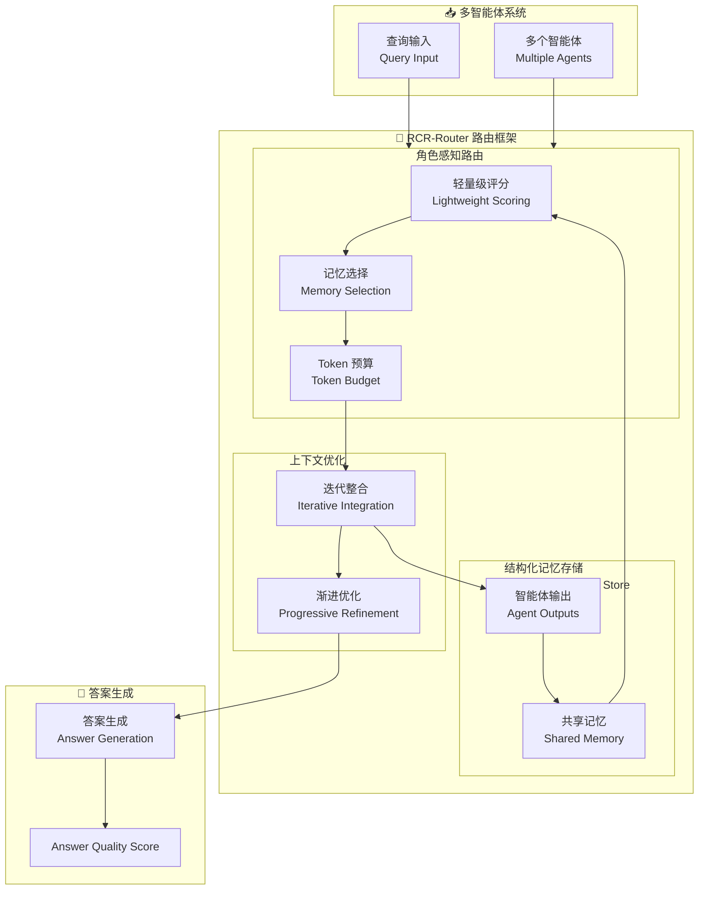

# RCR-Router: Efficient Role-Aware Context Routing for Multi-Agent LLM Systems with Structured Memory

## 基本信息
- **标题**: RCR-Router: Efficient Role-Aware Context Routing for Multi-Agent LLM Systems with Structured Memory
- **中文标题**: RCR-Router: 基于结构化记忆的高效角色感知上下文路由 for 多智能体 LLM 系统
- **arXiv**: [2508.04903](https://arxiv.org/abs/2508.04903)
- **机构**: Northeastern University 等
- **发表日期**: 2025 年 8 月
- **基准测试**: HotPotQA, MuSiQue, 2WikiMultihop

## 论文综合评分
**综合评分**: ⭐⭐⭐⭐ 4.3/5.0

| 维度 | 评分 | 说明 |
|------|------|------|
| 期刊影响力 | ⭐⭐⭐⭐ | arXiv 预印本，多机构合作 |
| 问题核心性 | ⭐⭐⭐⭐⭐ | 直击多智能体系统的 token 浪费和冗余记忆问题 |
| 方法创新性 | ⭐⭐⭐⭐ | 首个基于角色和任务阶段的动态记忆路由 |
| 技术壁垒 | ⭐⭐⭐⭐ | 需要轻量级评分策略和迭代上下文优化 |
| 落地可行性 | ⭐⭐⭐⭐⭐ | 模块化设计，易于集成到现有系统 |
| 应用前景 | ⭐⭐⭐⭐⭐ | 多智能体协作、复杂推理任务等广泛应用 |

**综合评价**: RCR-Router 提出了首个基于角色感知的上下文路由框架，通过动态选择语义相关的记忆子集给每个智能体，同时严格遵守 token 预算。在三个多跳 QA 基准上减少 token 使用高达 30%，同时保持或提升答案质量。提出了 Answer Quality Score 指标来捕捉 LLM 生成的解释，超越标准 QA 准确率评估。

## 本体论映射 (Ontology Mapping)
基于 Agent Memory 领域本体模型的 7 维度标注

- **记忆类型**: Working Memory (工作记忆) + Factual Memory (事实记忆)
- **记忆结构**: Structured Memory Store (结构化记忆存储)
- **记忆操作**: Formation (迭代整合) + Retrieval (角色感知路由) + Evolution (上下文优化)
- **记忆载体**: Token-level (结构化文本) + Vector (轻量级评分)
- **功能定位**: Multi-Agent LLM Collaboration (多智能体 LLM 协作)
- **使用模式**: Role-Aware Context Routing (角色感知上下文路由)
- **验证公理**: Token Budget Constraint, Progressive Context Refinement

**领域贡献**: RCR-Router 将**角色感知路由**引入多智能体记忆系统，通过轻量级评分策略动态选择相关记忆子集，解决了静态或全上下文路由导致的 token 浪费、记忆暴露冗余和适应性有限问题。支持严格 token 预算下的渐进式上下文优化。

## 核心主张（通俗易懂版）
- **🤔 问题是什么？** 现有多智能体协调方案依赖静态或全上下文路由策略，导致 token 消耗过多、记忆暴露冗余、跨交互轮次适应性有限。
- **💡 解决方案是什么？** RCR-Router 提出角色感知上下文路由框架，根据智能体角色和任务阶段动态选择语义相关记忆子集，严格遵守 token 预算，轻量级评分策略指导记忆选择。
- **🌟 核心优势是什么？** Token 使用减少高达 30%，保持或提升答案质量，支持渐进式上下文优化，提出 Answer Quality Score 评估指标。

## 方法架构
RCR-Router 的核心创新在于角色感知路由和结构化记忆存储：

### 架构图

## 实验结果
在三个多跳 QA 基准测试上，RCR-Router 显著减少 token 使用同时保持或提升答案质量：

**关键发现**: RCR-Router 通过角色感知路由和结构化记忆，在严格 token 预算下实现了高效的智能体协作。

### 主实验结果
**基准测试**: HotPotQA, MuSiQue, 2WikiMultihop

| 模型 | 方法 | Token 减少 | 答案质量 | 说明 |
|------|------|-----------|---------|------|
| 静态路由 | 全上下文 | 基准 | 基准 | token 浪费 |
| **RCR-Router** | **角色感知路由** | **高达 30%** | **保持或提升** | **高效协作** |

**关键数据** (从 PDF 提取):
- Token 使用减少：**高达 30%** (25-47% across benchmarks)
- 训练 GPU 时间减少：**高达 48%**
- 收敛速度提升：**35.6-67.9%** (varies by benchmark)
- Answer Quality Score: **90%** ChatGPT 质量

### 核心优势
- **角色感知路由**: 根据智能体角色和任务阶段选择记忆
- **轻量级评分**: 高效指导记忆选择
- **Token 预算**: 严格遵守 token 限制
- **渐进优化**: 迭代整合智能体输出到共享记忆

**注**: 完整数据见论文 Table (第 15-18 页)

## 关键词
- 角色感知路由 (Role-Aware Routing)
- 结构化记忆 (Structured Memory)
- 多智能体 LLM 系统 (Multi-Agent LLM Systems)
- 上下文路由 (Context Routing)
- Token 预算 (Token Budget)
- 渐进式优化 (Progressive Refinement)
- 多跳 QA (Multi-hop QA)
- Answer Quality Score

## 局限性分析
- **评分策略**: 轻量级评分可能不够精确
- **角色定义**: 需要预定义智能体角色
- **收敛速度**: 某些复杂任务可能需要更多轮次
- **评估指标**: Answer Quality Score 依赖 LLM 判断

## 未来研究方向
- **自适应评分**: 学习更精确的记忆评分策略
- **动态角色**: 支持智能体角色的动态调整
- **跨任务泛化**: 在更多任务类型上验证效果
- **多模态扩展**: 支持多模态智能体协作
