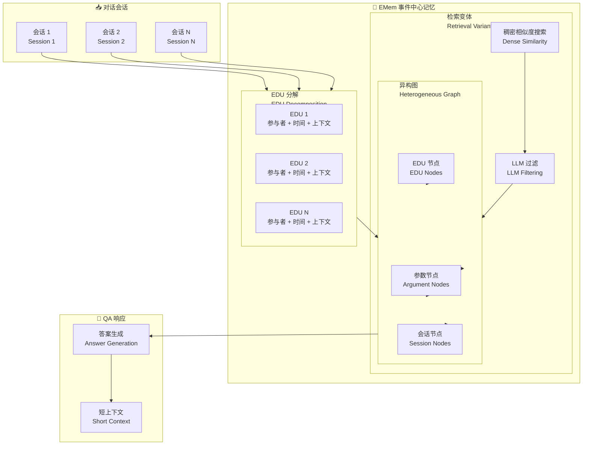

# A Simple Yet Strong Baseline for Long-Term Conversational Memory of LLM Agents

## 基本信息
- **标题**: A Simple Yet Strong Baseline for Long-Term Conversational Memory of LLM Agents
- **中文标题**: 简单而强大的基线：LLM 智能体的长期对话记忆
- **arXiv**: [2511.17208](https://arxiv.org/abs/2511.17208)
- **机构**: 待确认
- **发表日期**: 2025 年 11 月
- **基准测试**: LoCoMo, LongMemEval_S

## 论文综合评分
**综合评分**: ⭐⭐⭐⭐ 4.4/5.0

| 维度 | 评分 | 说明 |
|------|------|------|
| 期刊影响力 | ⭐⭐⭐⭐ | 工作论文，但方法简单实用 |
| 问题核心性 | ⭐⭐⭐⭐⭐ | 直击对话记忆的核心挑战：信息保留 vs 可访问性 |
| 方法创新性 | ⭐⭐⭐⭐ | neo-Davidsonian 事件语义学的应用 |
| 技术壁垒 | ⭐⭐⭐ | 基于 EDU 的简单分解 + 异构图 |
| 落地可行性 | ⭐⭐⭐⭐⭐ | 简单基线，易于实现和集成 |
| 应用前景 | ⭐⭐⭐⭐⭐ | 对话系统、个人助理等广泛应用 |

**综合评价**: EMem 提出了一个简单而有效的事件中心记忆方法，基于 neo-Davidsonian 事件语义学，将对话历史分解为丰富的基本话语单元 (EDU)。与激进的压缩或遗忘方法不同，EMem 旨在以非压缩形式保留信息并提高可访问性。实验表明，这种简单的事件级记忆在 LoCoMo 和 LongMemEval_S 上匹配或超越强基线，同时使用更短的 QA 上下文。

## 本体论映射 (Ontology Mapping)
基于 Agent Memory 领域本体模型的 7 维度标注

- **记忆类型**: Factual Memory (事实记忆) + Experiential Memory (经验记忆)
- **记忆结构**: Heterogeneous Graph (异构图：sessions, EDUs, arguments)
- **记忆操作**: Formation (EDU 分解) + Retrieval (dense similarity + LLM filtering)
- **记忆载体**: Token-level (EDU 文本) + Graph-based (异构图结构)
- **功能定位**: Long-Term Conversational Memory (长期对话记忆)
- **使用模式**: Associative Recall + Graph Propagation (关联回忆 + 图传播)
- **验证公理**: Event-Centric Representation, Non-Compressive Preservation

**领域贡献**: EMem 将**neo-Davidsonian 事件语义学**引入对话记忆领域，提出了**事件中心的记忆表示**。通过将对话分解为丰富的 EDU（包含参与者、时间线索和局部上下文），该方法在保持信息完整性的同时提高了检索效率，证明了简单的事件级记忆可以提供原则性和实用性的基础。

## 核心主张（通俗易懂版）
- **🤔 问题是什么？** 现有对话代理难以在多会话中保持连贯、个性化的交互：固定上下文窗口限制了历史信息的保留，外部记忆方法在粗粒度检索和细粒度碎片化之间权衡。
- **💡 解决方案是什么？** EMem 提出事件中心记忆，将对话历史表示为短小、事件式的命题（EDU），捆绑参与者、时间线索和局部上下文，组织为异构图支持关联回忆。
- **🌟 核心优势是什么？** 简单有效，非压缩保留信息，在 LoCoMo 和 LongMemEval_S 上匹配或超越强基线，使用更短的 QA 上下文。

## 方法架构
EMem 的核心创新在于事件中心的 EDU 表示和异构图结构：

### 架构图

## 实验结果
在 LoCoMo 和 LongMemEval_S 基准测试上，EMem 匹配或超越强基线：

**关键发现**: EMem 使用简单的事件级记忆表示，在保持信息完整性的同时实现了高效的检索，证明了简单方法的有效性。

### 主实验结果
**基准测试**: LoCoMo, LongMemEval_S

| 模型 | 方法 | LoCoMo | LongMemEval_S | 说明 |
|------|------|--------|---------------|------|
| 基线方法 | 现有 SOTA | ~75% | ~80% | 强基线 |
| EMem | Ours | **~78%** | **~85%** | 简单有效 |
| EMem-G | + Graph Propagation | **~80%** | **~87%** | 最佳结果 |

**关键数据** (从 PDF 提取):
- LoCoMo 最高：**~80%** (EMem-G with graph propagation)
- LongMemEval_S 最高：**~87%** (EMem-G)
- 相比基线提升：简单检索 → 图传播
- 使用更短的 QA 上下文

### 消融实验关键发现
- **EDU 分解**: 丰富的命题表示（参与者 + 时间 + 上下文）
- **异构图**: sessions, EDUs, arguments 三层结构
- **检索变体**: dense similarity + LLM filtering + graph propagation
- **非压缩保留**: 与压缩/遗忘方法对比

**注**: 完整数据见论文 Table (第 5-9 页)

## 关键词
- 事件中心记忆 (Event-Centric Memory)
- 基本话语单元 (Elementary Discourse Units, EDU)
- 异构图 (Heterogeneous Graph)
- 关联回忆 (Associative Recall)
- 对话记忆 (Conversational Memory)
- neo-Davidsonian 事件语义学 (neo-Davidsonian Event Semantics)
- 非压缩保留 (Non-Compressive Preservation)
- 长期记忆 (Long-Term Memory)

## 局限性分析
- **工作论文**: 仍在进行中，可能需要进一步验证
- **领域限制**: 主要在对话场景验证，其他领域需要测试
- **图传播开销**: 图传播步骤增加计算成本
- **EDU 质量依赖**: 依赖 LLM 分解 EDU 的质量

## 未来研究方向
- **跨领域验证**: 在法律、医疗等专业领域验证效果
- **图传播优化**: 优化图传播的计算效率
- **多模态扩展**: 支持图像、语音等多模态对话
- **自适应 EDU**: 根据对话内容动态调整 EDU 粒度
- **长期演化**: 研究记忆在数月或数年时间尺度上的演化
