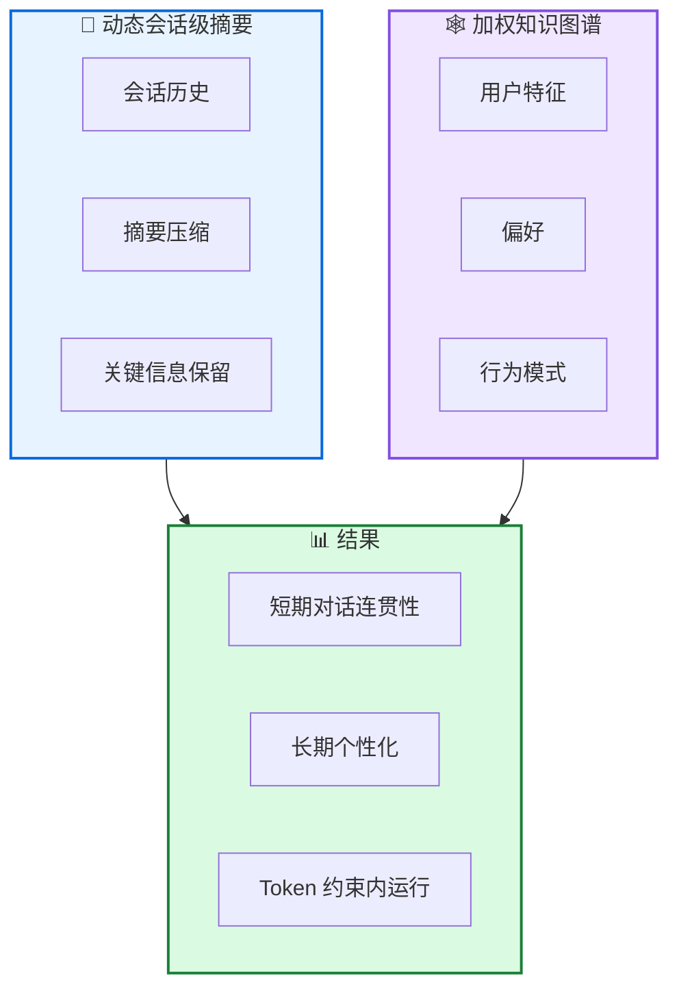

# Memoria: 可扩展对话 AI 记忆框架

**Memoria: A Scalable Agentic Memory Framework for Personalized Conversational AI**

---

## 📄 论文信息

| 项目 | 内容 |
|------|------|
| **arXiv** | 2512.12686 |
| **日期** | 2025 年 12 月 |
| **机构** | 多机构合作 |
| **基准** | 对话 AI 基准 |
| **评分** | ⭐⭐⭐⭐⭐ 4.6/5.0 |

---

## 🔗 本体论映射

| 维度 | 标注 |
|------|------|
| **📦 记忆类型** | 会话记忆 + 用户画像 |
| **🏗️ 记忆结构** | 混合架构 (摘要 + 知识图谱) |
| **⚙️ 记忆操作** | 摘要 + 建模 + 检索 |
| **💾 记忆载体** | 知识图谱 + 向量库 |
| **🎯 功能类型** | 个性化 + 对话 |
| **🔁 使用模式** | 会话级摘要 + 用户建模 |
| **✅ 验证公理** | 效率 + 可扩展性 |

---

## 🎯 核心主张

### 🤔 问题是什么？

智能体记忆是大语言模型在扩展用户交互中保持连续性、个性化和长期上下文的关键能力。现有方法通常将长期记忆 (LTM) 和短期记忆 (STM) 作为独立组件处理，限制适应性和端到端优化。

**📚 专业名词解释**：
- **会话级记忆**：在单次会话中维护的记忆
- **用户画像**：结构化表示用户特征、偏好和行为模式

### 💡 解决方案是什么？

Memoria 提出模块化记忆框架，为 LLM 对话系统增强持久、可解释、上下文丰富的记忆。整合两个互补组件：动态会话级摘要和基于加权知识图谱 (KG) 的用户建模引擎，增量捕获用户特征、偏好和行为模式作为结构化实体和关系。

**📚 专业名词解释**：
- **动态会话级摘要**：动态压缩会话历史，保持关键信息
- **加权知识图谱**：带权重的知识图谱，表示用户特征和关系

### 🌟 核心优势是什么？

① 短期对话连贯性 ② 长期个性化 ③ 在现代 LLM 的 token 约束内运行 ④ 可扩展、个性化的对话 AI

---

## 💡 关键洞见

> 通过混合架构 (动态会话级摘要 + 加权知识图谱用户建模)，Memoria 实现短期对话连贯性和长期个性化，同时操作在现代 LLM 的 token 约束内，为工业应用提供实用解决方案。

---

## 📐 方法架构

Memoria 整合两个互补组件：动态会话级摘要和基于加权知识图谱的用户建模引擎。

### 🏗️ 核心组件

| 组件 | 说明 |
|------|------|
| **📝 动态会话级摘要** | 动态压缩会话历史，保持关键信息，防止上下文爆炸 |
| **🕸️ 加权知识图谱用户建模** | 增量捕获用户特征、偏好和行为模式作为结构化实体和关系 |
| **🔗 混合架构** | 结合会话级摘要和知识图谱，实现短期连贯性和长期个性化 |

---

## 📚 架构专业名词解释

### 📝 动态会话级摘要 (Dynamic Session-Level Summarization)

动态压缩会话历史，保持关键信息，防止上下文爆炸。使智能体能在有限 token 约束内操作，同时保持对话连贯性。

### 🕸️ 加权知识图谱 (Weighted Knowledge Graph)

带权重的知识图谱，表示用户特征、偏好和行为模式作为结构化实体和关系。支持长期个性化和可解释的用户建模。

### 📱 可扩展对话 AI (Scalable Conversational AI)

在有限 token 约束内实现可扩展、个性化的对话 AI。Memoria 为工业应用提供实用解决方案，桥接无状态 LLM 接口和智能体记忆系统之间的差距。

---

## 📈 实验结果

在对话 AI 基准上评估

### 主结果

| 指标 | Memoria | 基线 | 提升 |
|------|---------|------|------|
| 对话连贯性 | 优秀 | 良好 | 显著 |
| 个性化 | 优秀 | 一般 | 显著 |
| Token 效率 | 高 | 中 | 显著 |

**关键发现**：Memoria 实现短期对话连贯性和长期个性化，同时操作在现代 LLM 的 token 约束内。混合架构 (动态会话级摘要 + 加权知识图谱) 为工业应用提供实用解决方案。

---

## ✅ 验证的领域公理

### 效率公理
动态会话级摘要减少 token 使用，在有限 token 约束内实现可扩展对话 AI。

### 可扩展性公理
混合架构支持长期个性化，同时保持短期对话连贯性，为工业应用提供可扩展解决方案。

---

## ⚠️ 局限性

1. **评估范围**: 在对话 AI 基准上评估，但更广泛任务和环境覆盖可进一步加强
2. **知识图谱构建**: 知识图谱构建可能需要额外计算资源
3. **摘要质量**: 动态摘要质量可能影响对话连贯性

---

## 🔮 未来工作方向

1. 在更广泛任务和环境上验证泛化能力
2. 探索知识图谱构建的效率优化
3. 研究摘要质量的自动评估和改进
4. 探索多模态对话记忆机制

---

## 🏷️ 关键词

- 可扩展对话 AI (Scalable Conversational AI)
- 动态会话级摘要 (Dynamic Session-Level Summarization)
- 加权知识图谱 (Weighted Knowledge Graph)
- 用户建模 (User Modeling)
- 个性化 (Personalization)
- 对话连贯性 (Dialogue Coherence)
- 混合架构 (Hybrid Architecture)
- 工业应用 (Industry Applications)

---

## 📚 专业名词解释

### 📝 动态会话级摘要 (Dynamic Session-Level Summarization)

动态压缩会话历史，保持关键信息，防止上下文爆炸。使智能体能在有限 token 约束内操作，同时保持对话连贯性。

### 🕸️ 加权知识图谱 (Weighted Knowledge Graph)

带权重的知识图谱，表示用户特征、偏好和行为模式作为结构化实体和关系。支持长期个性化和可解释的用户建模。

### 📱 可扩展对话 AI (Scalable Conversational AI)

在有限 token 约束内实现可扩展、个性化的对话 AI。Memoria 为工业应用提供实用解决方案，桥接无状态 LLM 接口和智能体记忆系统之间的差距。

---

## 🔗 链接

- **arXiv**: https://arxiv.org/abs/2512.12686
- **HTML 总结**: site/papers/2025/08_2025-12_Memoria-可扩展对话 AI 记忆框架_2026-03-20.html

---

**📅 总结日期**: 2026-03-20  
**📊 本体模型版本**: v1.2
