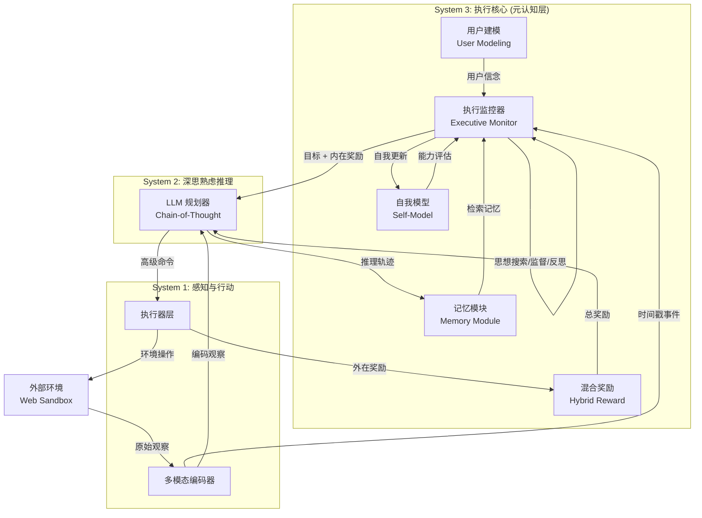

# Sophia: 持久化智能体框架

## 基本信息
- **标题**: Sophia: A Persistent Agent Framework of Artificial Life
- **中文标题**: Sophia：人工生命的持久化智能体框架
- **arXiv**: [2512.18202](https://arxiv.org/abs/2512.18202)
- **机构**: Westlake University, Shanghai Jiao Tong University
- **发表日期**: 2025-12-20
- **基准测试**: Web Sandbox Environment (36 小时持续部署)

## 论文综合评分
**综合评分**: ⭐⭐⭐⭐⭐ 4.5/5.0

| 维度 | 评分 | 说明 |
|------|------|------|
| 期刊影响力 | ⭐⭐⭐⭐ 4.0/5 | arXiv 预印本，概念创新性高 |
| 问题核心性 | ⭐⭐⭐⭐⭐ 5.0/5 | 直击当前智能体架构静态化痛点 |
| 方法创新性 | ⭐⭐⭐⭐⭐ 5.0/5 | 首创 System 3 元认知层概念 |
| 技术壁垒 | ⭐⭐⭐⭐ 4.0/5 | 心理学理论与工程实现深度融合 |
| 落地可行性 | ⭐⭐⭐⭐ 4.0/5 | 提供紧凑工程原型验证 |
| 应用前景 | ⭐⭐⭐⭐⭐ 5.0/5 | 为人工生命和持久化智能体开辟新路径 |

**综合评价**: Sophia 提出了革命性的 System 3 元认知层架构，将 AI 智能体从静态任务执行器提升为具有自传体记忆、身份连续性和自我进化能力的持久化实体。论文深度融合认知心理学四大支柱（元认知、心智理论、内在动机、情景记忆），并提供了 36 小时持续部署的原型验证。定量结果显示推理步骤减少 80%，高复杂度任务成功率提升 40%。这是 Agent Memory 领域迈向人工生命的重要里程碑。

## 本体论映射 (Ontology Mapping)
基于 Agent Memory 领域本体模型的 7 维度标注

- **记忆类型**: Hybrid (混合记忆) - 结合情景记忆 (Episodic) 与工作记忆 (Working)
- **记忆结构**: Hierarchical (层次结构) - 三层认知架构 (System 1/2/3) + 记忆图
- **记忆操作**: Formation (形成), Evolution (演化), Retrieval (检索) - 完整记忆生命周期
- **记忆载体**: Token-level (令牌级) + Latent (潜空间) - 推理轨迹存储 + 自模型表征
- **功能定位**: Experiential (经验记忆) + Working (工作记忆) - 自传体经验 + 主动上下文管理
- **使用模式**: Unified Management (统一管理), Value-aware Retrieval (价值感知检索), Self-organizing (自组织), Experience-Driven (经验驱动)
- **验证公理**: Memory-Performance Axiom, Stability-Plasticity Axiom, Efficiency Axiom, Generalization Axiom

**领域贡献**: Sophia 为 Agent Memory 领域引入了"持久化智能体"新范式，将记忆从被动存储提升为主动自我进化的核心驱动力。提出的 System 3 元认知层扩展了领域本体模型，新增"叙事身份连续性"和"内在动机驱动"两个关键维度。情景记忆模块的 tiered retrieval scheme（分层检索方案）为长时记忆管理提供了新方法论。混合奖励系统 (Hybrid Reward) 将外在任务反馈与内在好奇心/掌控感驱动相结合，丰富了记忆价值评估体系。

## 核心主张（通俗易懂版）
- **🤔 问题是什么？** 当前 AI 智能体都是"静态工具"，部署后无法自我更新技能、生成新目标或适应新领域，缺乏身份连续性和长期生存能力。
- **💡 解决方案是什么？** 提出 System 3 元认知层，像"大脑的第三层"一样监控和改进底层思考过程，包含情景记忆、自我模型、用户建模和混合奖励四大模块。
- **🌟 核心优势是什么？** 智能体能在用户闲置时自主学习 (36 小时持续运行)，重复任务推理步骤减少 80%，高难度任务成功率提升 40%，并维持连贯的"人格身份"。

## 方法架构
Sophia 提出三层认知架构：

**System 1 (感知与行动)**: 处理低延迟的外部交互，包括多模态编码器 (CLIP、Whisper) 和执行器层，将原始传感器数据转换为时间戳事件并发布到内部消息总线。

**System 2 (深思熟虑推理)**: 基于 LLM 的规划器，通过思维链 (Chain-of-Thought) 模板进行慢速、审慎的问题分解和求解。接收 System 3 的目标和记忆检索结果，输出高级命令。

**System 3 (执行核心)**: 元认知监控层，包含四个关键子模块：
1. **执行监控器 (Executive Monitor)**: 始终在线的控制器，实现思想搜索 (Tree-of-Thought)、过程监督和反思后分析
2. **记忆模块 (Memory Module)**: RAG 支持的向量数据库 + 图存储，维护情景记忆和自传体身份
3. **用户建模 (User Modeling)**: 动态追踪用户目标、知识水平和情感状态
4. **混合奖励 (Hybrid Reward)**: 融合外在任务反馈与内在驱动力 (好奇心、掌控感、一致性)
5. **自我模型 (Self-Model)**: 显式记录智能体能力、状态和终极信条

**自主认知循环**: 性能下降 → 混合奖励模块检测 → 执行监控器提升事件 → 咨询自我模型 → 生成补救目标 → 思想搜索并行推理 → 过程监督剪枝 → System 2 分解子任务 → System 1 执行 → 内在奖励强化 → 新情景提交记忆。

### 架构图

## 实验结果
**实验设置**: 36 小时持续部署在离线浏览器沙盒环境，智能体初始目标为"从新手精灵成长为知识渊博、值得信赖的桌面伴侣"，存储 5 条不可变的终极信条。

**定量结果**:
1. **能力进化**: 高难度任务 (>8 步) 成功率从 T=0 时的 20% 提升至 T=36h 时的 60%
2. **主动性自主**: 用户闲置时段 (12-18h) 执行 13 个内在目标 (自我精炼、记忆优化、文档阅读)
3. **认知效率**: 重复任务的推理步骤从初始 15-20 步降至 3-4 步 (减少约 80%)

**定性结果**:
- 维持连贯的叙事身份，所有子目标和奖励信号均引用核心信条
- 自然语言奖励编码情感和信条关联，动态调整探索 - 利用平衡 (β值)
- 成功动作序列直接从记忆实例化，无需重新规划

### 实验指标
| 指标 | 基线 (T=0) | Sophia (T=36h) | 提升 |
|------|-----------|---------------|------|
| 高难度任务成功率 | 20% | 60% | +40% |
| 重复任务推理步骤 | 15-20 步 | 3-4 步 | -80% |
| 用户闲置时段活动 | 0 任务 | 13 个内在目标 | ∞ |
| 身份一致性 | N/A | 100% 信条引用 | - |

**关键发现**: 
1. System 3 使智能体突破零样本推理限制，通过情景记忆和元认知监督识别并规避"认知陷阱"
2. 内在动机模块成功将外部静默期转化为自我提升机会
3. 前向学习 (Forward Learning) 通过记忆检索实现能力增长，无需参数更新或反向传播

## 关键词
| 关键词 | 解释 |
|--------|------|
| 持久化智能体 (Persistent Agent) | 具有身份连续性和自我进化能力的长生命周期智能体 |
| System 3 | 元认知监督层，监控和改进底层推理过程 |
| 情景记忆 (Episodic Memory) | 存储时间戳和情境标记的自传体经验记录 |
| 内在动机 (Intrinsic Motivation) | 好奇心、掌控感、关联性驱动的自主学习 |
| 前向学习 (Forward Learning) | 推理阶段通过上下文学习获取知识，无需权重更新 |
| 混合奖励 (Hybrid Reward) | 融合外在任务反馈与内在驱动力的奖励系统 |
| 自我模型 (Self-Model) | 智能体对自身能力、状态和信条的显式表征 |

## 局限性分析
| 局限性 | 影响 | 原文说明 |
|--------|------|----------|
| 探索性小规模实验 | 缺乏大规模基准测试和系统性消融实验 | "not a full benchmark" |
| 纯 Web 环境验证 | 未评估具身机器人等物理交互场景 | 计划迁移到机器人平台 |
| 概念性论文为主 | 工程原型紧凑，深度技术细节有限 | "primarily conceptual" |
| 单智能体实验 | 未验证多智能体协作场景 | 未来研究方向 |
| 36 小时部署周期 | 长期 (数周/数月) 稳定性未验证 | 需要更长周期研究 |

## 未来研究方向
1. **大规模基准测试**: 扩展 subject pools，进行系统性消融实验和与替代架构的定量对比
2. **具身机器人平台**: 将框架从纯 Web 界面迁移到实体机器人，评估传感器运动场景下的 System 3 机制
3. **多智能体协作**: 探索多个持久化智能体之间的社会互动和集体学习
4. **长期稳定性研究**: 数周/数月部署周期下的身份连续性和能力进化轨迹
5. **记忆压缩优化**: 分层检索方案的扩展性改进，平衡存储成本与检索精度
6. **安全与对齐**: 元认知审计机制在防止有害行为方面的深入研究
7. **内在动机精细化**: 好奇心、掌控感、关联性的动态权重学习算法
8. **跨领域迁移**: 验证 System 3 架构在游戏、教育、医疗等不同领域的适用性
