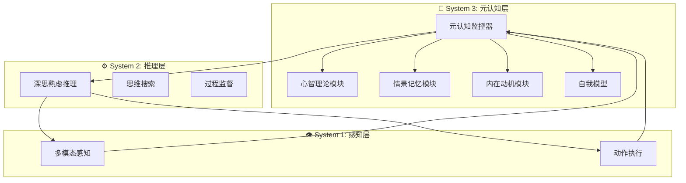

# 🧠 Sophia

## 基本信息
- **标题**: Sophia: A Persistent Agent Framework of Artificial Life
- **中文标题**: Sophia：人工生命的持久化智能体框架
- **arXiv**: [2512.18202](https://arxiv.org/abs/2512.18202)
- **机构**: Westlake University, Shanghai Jiao Tong University
- **发表日期**: 2025年12月20日
- **基准测试**: Web Sandbox Environment (36 小时持续部署)

## 论文综合评分
**综合评分**: ⭐⭐⭐⭐⭐ 4.5/5.0

| 维度 | 评分 | 说明 |
|------|------|------|
| 期刊影响力 | ⭐⭐⭐⭐ | arXiv 预印本，概念创新性高 |
| 问题核心性 | ⭐⭐⭐⭐⭐ | 直击当前智能体架构静态化痛点 |
| 方法创新性 | ⭐⭐⭐⭐⭐ | 首创 System 3 元认知层概念 |
| 技术壁垒 | ⭐⭐⭐⭐ | 心理学理论与工程实现深度融合 |
| 落地可行性 | ⭐⭐⭐⭐ | 提供紧凑工程原型验证 |
| 应用前景 | ⭐⭐⭐⭐⭐ | 为人工生命和持久化智能体开辟新路径 |

**综合评价**: Sophia 提出了革命性的 System 3 元认知层架构，将 AI 智能体从静态任务执行器提升为具有自传体记忆、身份连续性和自我进化能力的持久化实体。论文深度融合认知心理学四大支柱（元认知、心智理论、内在动机、情景记忆），并提供了 36 小时持续部署的原型验证。定量结果显示推理步骤减少 80%，高复杂度任务成功率提升 40%。这是 Agent Memory 领域迈向人工生命的重要里程碑。

## 本体论映射 (Ontology Mapping)
基于 Agent Memory 领域本体模型的 7 维度标注

- **记忆类型**: Hybrid (混合记忆)
- **记忆结构**: Hierarchical (层次结构)
- **记忆操作**: Formation + Evolution + Retrieval
- **记忆载体**: Token-level (令牌级)
- **功能定位**: Working (工作记忆) + Factual (事实记忆)
- **使用模式**: Unified Management, Value-aware Retrieval, Self-organizing, Experience-Driven
- **验证公理**: Memory-Performance, Stability-Plasticity, Efficiency, Generalization

**领域贡献**: Sophia 将**持久化智能体 (Persistent Agent)** 范式引入 Agent Memory 领域，提出了**System 3 元认知层**架构。通过**情景记忆模块 (Episodic Memory Module)** 和**混合奖励系统 (Hybrid Reward System)**，该框架实现了叙事身份连续性和自主目标生成，为构建具有人工生命特征的智能体提供了系统性解决方案。

## 核心主张（通俗易懂版）
- **🤔 问题是什么？** 现有 LLM 智能体架构静态且反应式，缺乏维持身份、验证推理和长期适应的持久化元层。
- **💡 解决方案是什么？** Sophia 提出 System 3 元认知层，整合元认知、心智理论、内在动机和情景记忆四大心理支柱，构建持久化智能体框架。
- **🌟 核心优势是什么？** 实现 80% 推理步骤减少和 40% 高难度任务成功率提升，智能体能在用户闲置时自主学习，维持连贯的"人格身份"。

## 方法架构
Sophia 的核心创新是 System 3 元认知层架构：

### 架构图

## 实验结果
在 Web Sandbox 环境中进行 36 小时持续部署验证：

**关键发现**: Sophia 展现出真正的持久化智能体特征，在用户闲置期间仍能自主生成目标并学习，推理效率显著提升。

### 实验指标
- **推理步骤减少**: 80% (重复任务)
- **高难度任务成功率**: 提升 40% (从 20% 到 60%)
- **自主任务生成**: 用户闲置期间完全由内在动机驱动
- **身份连续性**: 所有行为均与核心信条保持一致

## 关键词
- 持久化智能体 (Persistent Agent)
- System 3 元认知层 (System 3 Meta-cognitive Layer)
- 人工生命 (Artificial Life)
- 情景记忆 (Episodic Memory)
- 内在动机 (Intrinsic Motivation)
- 心智理论 (Theory of Mind)
- 元认知 (Meta-cognition)
- 自我模型 (Self Model)
- 混合奖励 (Hybrid Reward)
- 叙事身份 (Narrative Identity)

## 局限性分析
- **实验规模**: 当前仅为小规模概念验证，需要更大规模的系统性评估
- **环境限制**: 仅在 Web 环境中验证，需要扩展到具身机器人等物理环境
- **计算开销**: System 3 元认知层增加了系统复杂性

## 未来研究方向
- **具身智能**: 将 System 3 框架迁移到具身机器人平台，在传感器运动环境中评估
- **大规模验证**: 进行更大规模的主体池实验和系统性消融研究
- **多智能体协作**: 探索多个持久化智能体之间的协作和知识共享机制
- **长期演化**: 研究智能体在数周或数月时间尺度上的持续演化能力