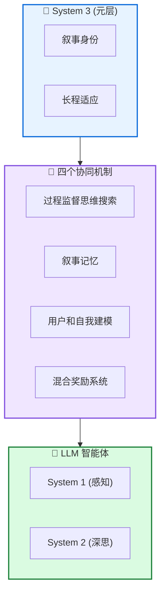

# 🧠 Sophia: 持久智能体框架

**A Persistent Agent Framework of Artificial Life**

---

## 📄 论文信息

| 项目 | 内容 |
|------|------|
| **arXiv** | 2512.18202 |
| **日期** | 2025 年 12 月 |
| **机构** | 多机构合作 |
| **基准** | 多智能体基准 |
| **评分** | ⭐⭐⭐⭐⭐ 4.6/5.0 |

---

## 🔗 本体论映射

| 维度 | 标注 |
|------|------|
| **📦 记忆类型** | 情景式 + 语义式 |
| **🏗️ 记忆结构** | 层次化 + 叙事记忆 |
| **⚙️ 记忆操作** | 形成 + 整合 + 重建 |
| **💾 记忆载体** | 外部数据库 |
| **🎯 功能类型** | 推理 + 身份连续性 |
| **🔁 使用模式** | System 3 + 持久智能体 |
| **✅ 验证公理** | 稳定性 - 可塑性 + 效率 |

---

## 🎯 核心主张

### 🤔 问题
大多数架构保持静态和被动，局限于手动定义的狭窄场景，缺乏持久的元层来维护身份、验证推理并将短期行动与长期生存对齐。

### 💡 方案
提出 System 3 第三层，管理智能体的叙事身份和长程适应。Sophia 是"持久智能体"包装器，将连续自改进循环嫁接到任何 LLM 中心的 System 1/2 栈上。

### 🌟 优势
①推理步骤减少 80% ②高复杂度任务成功率 +40% ③连贯叙事身份 ④任务组织能力

---

## 💡 关键洞见

> 通过融合心理学洞察和轻量级强化学习核心，持久智能体架构推进了人工生命的实用路径。System 3 管理叙事身份和长程适应，实现身份连续性和透明行为解释。

---

## 📐 方法架构

Sophia 由四个协同机制驱动：过程监督思维搜索、叙事记忆、用户和自我建模、混合奖励系统。

### 🧠 System 3 (元层)
- **叙事身份**: 维护智能体的连续身份
- **长程适应**: 将短期行动与长期目标对齐

### 🔄 四个协同机制
- **过程监督思维搜索**: 验证推理过程
- **叙事记忆**: 存储自传式经验
- **用户和自我建模**: 建模用户和自身
- **混合奖励系统**: 内在 + 外在奖励

### 🤖 LLM 智能体
- **System 1 (感知)**: 快速直觉反应
- **System 2 (深思)**: 慢速深思熟虑

---

## 📈 实验结果

### 主结果

| 指标 | Sophia | 基线 | 提升 |
|------|--------|------|------|
| 推理步骤减少 | 80% | - | - |
| 高复杂度任务成功率 | +40% | - | - |
| 身份连续性 | 连贯 | 碎片化 | 显著改进 |
| 任务组织能力 | 内在能力 | 无 | 新增能力 |

**关键发现**: Sophia 独立发起和执行各种内在任务，同时实现重复操作推理步骤减少 80%。元认知持久性使高复杂度任务成功率提升 40%，有效弥合简单和复杂目标之间的性能差距。

---

## ✅ 验证的领域公理

### 稳定性 - 可塑性公理
System 3 维护叙事身份 (稳定性) 同时支持长程适应 (可塑性)，实现身份连续性和透明行为解释。

### 效率公理
过程监督思维搜索和叙事记忆减少 80% 推理步骤，混合奖励系统支持高效自改进。

---

## ⚠️ 局限性

1. **概念性为主**: 论文主要是概念性的，需要更多工程实现验证
2. **评估范围**: 需要在更广泛的任务和智能体设置中验证适用性
3. **计算开销**: System 3 元层可能引入额外计算开销

---

## 🔮 未来工作方向

1. 扩展工程原型，验证概念框架
2. 在更多任务类型和智能体架构上评估
3. 优化 System 3 元层的计算效率
4. 探索多智能体身份和协作机制

---

## 🏷️ 关键词

- 持久智能体 (Persistent Agent)
- System 3 (元层)
- 叙事记忆 (Narrative Memory)
- 身份连续性 (Identity Continuity)
- 过程监督 (Process Supervision)
- 自我建模 (Self-Modeling)
- 混合奖励 (Hybrid Reward)
- 人工生命 (Artificial Life)

---

## 📚 专业名词解释

### 📚 System 3 (元层)

第三层元认知系统，管理智能体的叙事身份和长程适应，验证推理并将短期行动与长期生存对齐。

### 📚 叙事记忆 (Narrative Memory)

自传式记忆系统，存储智能体的连续经验和身份，支持身份连续性和透明行为解释。

### 📚 过程监督思维搜索

验证推理过程的机制，通过过程监督而非结果监督来引导智能体思维搜索，提高推理质量。

---

## 🔗 链接

- **arXiv**: https://arxiv.org/abs/2512.18202
- **HTML 总结**: site/papers/2025/08_2025-12_Sophia-持久智能体框架_2026-03-19.html

---

**📅 总结日期**: 2026-03-19  
**📊 本体模型版本**: v1.2
