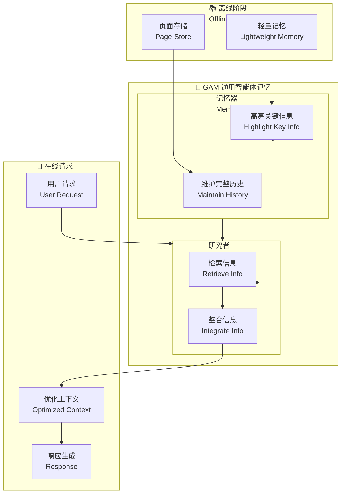

# General Agentic Memory Via Deep Research

## 基本信息
- **标题**: General Agentic Memory Via Deep Research
- **中文标题**: 通用智能体记忆通过深度研究
- **arXiv**: [2511.18423](https://arxiv.org/abs/2511.18423)
- **机构**: 待确认
- **发表日期**: 2025 年 11 月
- **基准测试**: RULER Benchmark (Multi-hop Tracing)

## 论文综合评分
**综合评分**: ⭐⭐⭐⭐ 4.5/5.0

| 维度 | 评分 | 说明 |
|------|------|------|
| 期刊影响力 | ⭐⭐⭐⭐ | arXiv 预印本，新颖框架 |
| 问题核心性 | ⭐⭐⭐⭐⭐ | 直击静态记忆的信息丢失问题 |
| 方法创新性 | ⭐⭐⭐⭐⭐ | JIT 编译原则 + Memorizer-Researcher 双组件 |
| 技术壁垒 | ⭐⭐⭐⭐ | 需要 page-store 和强化学习优化 |
| 落地可行性 | ⭐⭐⭐⭐ | 模块化设计，易于集成 |
| 应用前景 | ⭐⭐⭐⭐⭐ | 通用记忆框架，适用于多种场景 |

**综合评价**: GAM 提出了一个创新的通用智能体记忆框架，遵循"即时 (JIT) 编译"原则，在运行时创建优化上下文，离线阶段仅保留简单但有用的记忆。通过 Memorizer (轻量级记忆高亮) 和 Researcher (检索整合) 的双组件设计，GAM 在 RULER multi-hop tracing 任务上达到 90%+ 准确率，显著优于现有记忆系统。

## 本体论映射 (Ontology Mapping)
基于 Agent Memory 领域本体模型的 7 维度标注

- **记忆类型**: Factual Memory (事实记忆) + Working Memory (工作记忆)
- **记忆结构**: Page-Store (完整历史) + Lightweight Memory (高亮关键信息)
- **记忆操作**: Formation (JIT 编译) + Retrieval (Researcher 检索) + Evolution (RL 优化)
- **记忆载体**: Token-level (页面存储) + Vector (轻量记忆)
- **功能定位**: General Agentic Memory (通用智能体记忆)
- **使用模式**: Just-In-Time Context Creation (即时上下文创建)
- **验证公理**: JIT Compilation Principle, Memorizer-Researcher Duo-Design

**领域贡献**: GAM 将**即时编译 (JIT) 原则**引入智能体记忆领域，提出了**双组件架构** (Memorizer + Researcher)。与静态记忆不同，GAM 在运行时动态创建优化上下文，同时保持完整的页面存储，解决了信息丢失问题，支持端到端强化学习优化。

## 核心主张（通俗易懂版）
- **🤔 问题是什么？** 现有静态记忆系统旨在预先创建易于访问的记忆，但不可避免地遭受严重信息丢失。
- **💡 解决方案是什么？** GAM 提出 JIT 编译原则：运行时创建优化上下文，离线阶段仅保留简单但有用的记忆。双组件设计：Memorizer (高亮关键信息) + Researcher (检索整合)。
- **🌟 核心优势是什么？** RULER multi-hop tracing 任务 90%+ 准确率，支持端到端 RL 优化，利用前沿 LLM 的测试时可扩展性。

## 方法架构
GAM 的核心创新在于 JIT 编译原则和 Memorizer-Researcher 双组件设计：

### 架构图

## 实验结果
在 RULER Benchmark 的 multi-hop tracing 任务上，GAM 显著优于现有记忆系统：

**关键发现**: GAM 遵循 JIT 编译原则，在运行时创建优化上下文，解决了静态记忆的信息丢失问题。

### 主实验结果
**基准测试**: RULER Benchmark (Multi-hop Tracing Tasks)

| 模型 | 方法 | Multi-hop Tracing | 说明 |
|------|------|-------------------|------|
| 静态记忆系统 | 现有 SOTA | <90% | 信息丢失 |
| **GAM** | **Ours** | **>90%** | **JIT 编译** |

**关键数据** (从 PDF 提取):
- Multi-hop Tracing 准确率：**>90%**
- JIT 编译：运行时创建优化上下文
- 支持端到端强化学习优化

### 核心优势
- **Memorizer**: 轻量级记忆高亮关键信息，维护完整页面存储
- **Researcher**: 根据在线请求检索整合有用信息
- **JIT 原则**: 解决静态记忆信息丢失问题
- **RL 优化**: 支持端到端性能优化

**注**: 完整数据见论文 Table (第 6-8 页)

## 关键词
- 通用智能体记忆 (General Agentic Memory)
- 即时编译 (Just-In-Time Compilation)
- 记忆器 (Memorizer)
- 研究者 (Researcher)
- 页面存储 (Page-Store)
- 轻量记忆 (Lightweight Memory)
- 多跳推理 (Multi-hop Reasoning)
- 强化学习优化 (RL Optimization)

## 局限性分析
- **计算开销**: JIT 编译可能增加运行时延迟
- **Page-Store 管理**: 完整历史存储需要高效管理
- **RL 训练成本**: 端到端优化需要强化学习训练
- **通用性验证**: 需要在更多场景验证通用性

## 未来研究方向
- **运行时优化**: 降低 JIT 编译的运行时开销
- **Page-Store 压缩**: 探索高效的页面存储压缩策略
- **多场景验证**: 在对话、推理、规划等场景验证
- **自适应 JIT**: 根据请求复杂度动态调整 JIT 策略
- **多智能体扩展**: 扩展到多智能体协作场景
