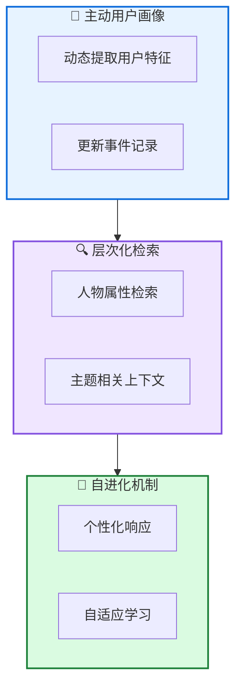

# 🌊 O-Mem: 全能记忆系统

**Omni Memory System for Personalized, Long Horizon, Self-Evolving Agents**

---

## 📄 论文信息

| 项目 | 内容 |
|------|------|
| **arXiv** | 2511.13593 |
| **日期** | 2025 年 11 月 |
| **机构** | 多机构合作 |
| **基准** | LoCoMo / PERSONAMEM |
| **评分** | ⭐⭐⭐⭐⭐ 4.7/5.0 |

---

## 🔗 本体论映射

| 维度 | 标注 |
|------|------|
| **📦 记忆类型** | 情景式 + 语义式 |
| **🏗️ 记忆结构** | 层次化 + 用户画像 |
| **⚙️ 记忆操作** | 检索 + 更新 + 提取 |
| **💾 记忆载体** | 向量数据库 |
| **🎯 功能类型** | 个性化 + 对话 |
| **🔁 使用模式** | 主动用户画像 + 自进化 |
| **✅ 验证公理** | 效率 + 个性化 |

---

## 🎯 核心主张

### 🤔 问题
现有记忆系统依赖检索前的语义分组，可能忽略语义无关但关键的用户信息并引入检索噪声。

### 💡 方案
O-Mem 提出基于主动用户画像的新颖记忆框架，从用户与智能体的主动交互中动态提取和更新用户特征和事件记录。支持人物属性和主题相关上下文的层次化检索。

### 🌟 优势
①LoCoMo 51.67% (+3% vs LangMem) ②PERSONAMEM 62.99% (+3.5% vs A-Mem) ③token 和交互响应时间效率提升

---

## 💡 关键洞见

> 通过主动用户画像，O-Mem 动态提取和更新用户特征和事件记录，支持层次化检索人物属性和主题相关上下文，实现更自适应和连贯的个性化响应。

---

## 📐 方法架构

O-Mem 包含主动用户画像、层次化检索、自进化机制三大核心组件。

### 👤 主动用户画像
- **动态提取**: 从主动交互中提取用户特征
- **更新事件记录**: 持续更新用户事件记录

### 🔍 层次化检索
- **人物属性检索**: 检索用户人物属性
- **主题相关上下文**: 检索主题相关上下文

### 🔄 自进化机制
- **个性化响应**: 支持自适应和连贯的个性化响应
- **自适应学习**: 从交互中持续学习

---

## 📈 实验结果

### LoCoMo 结果

| 方法 | 分数 | 提升 |
|------|------|------|
| LangMem | 48.67% | - |
| **O-Mem** | **51.67%** | **+3%** |

### PERSONAMEM 结果

| 方法 | 分数 | 提升 |
|------|------|------|
| A-Mem | 59.49% | - |
| **O-Mem** | **62.99%** | **+3.5%** |

**关键发现**: O-Mem 在 LoCoMo 上达到 51.67%，超越 LangMem 近 3%；在 PERSONAMEM 上达到 62.99%，超越 A-Mem 3.5%。同时提升 token 和交互响应时间效率。

---

## ✅ 验证的领域公理

### 效率公理
层次化检索减少检索噪声，提升 token 和交互响应时间效率，支持长程个性化对话。

### 个性化公理
主动用户画像支持动态提取和更新用户特征，实现自适应和连贯的个性化响应。

---

## ⚠️ 局限性

1. **用户隐私**: 主动用户画像可能涉及用户隐私问题
2. **评估范围**: 需要在更广泛的个性化任务中验证
3. **计算开销**: 动态提取和更新可能引入额外开销

---

## 🔮 未来工作方向

1. 研究隐私保护的用户画像技术
2. 扩展到更多个性化任务类型
3. 优化动态提取和更新效率
4. 探索多用户记忆共享机制

---

## 🏷️ 关键词

- 全能记忆 (Omni Memory)
- 主动用户画像 (Active User Profiling)
- 层次化检索 (Hierarchical Retrieval)
- 个性化对话 (Personalized Dialogue)
- 自进化智能体 (Self-Evolving Agents)
- 长程交互 (Long Horizon Interaction)
- 人物属性 (Persona Attributes)
- 主题上下文 (Topic Context)

---

## 📚 专业名词解释

### 📚 主动用户画像 (Active User Profiling)

从用户与智能体的主动交互中动态提取和更新用户特征和事件记录的框架，支持个性化响应。

### 📚 层次化检索 (Hierarchical Retrieval)

支持人物属性和主题相关上下文的两层检索机制，实现更自适应和连贯的个性化响应。

### 📚 自进化机制 (Self-Evolving Mechanism)

从交互中持续学习和适应的机制，支持智能体的持续改进和个性化能力提升。

---

## 🔗 链接

- **arXiv**: https://arxiv.org/abs/2511.13593
- **HTML 总结**: site/papers/2025/09_2025-11_O-Mem-全能记忆系统_2026-03-19.html

---

**📅 总结日期**: 2026-03-19  
**📊 本体模型版本**: v1.2
