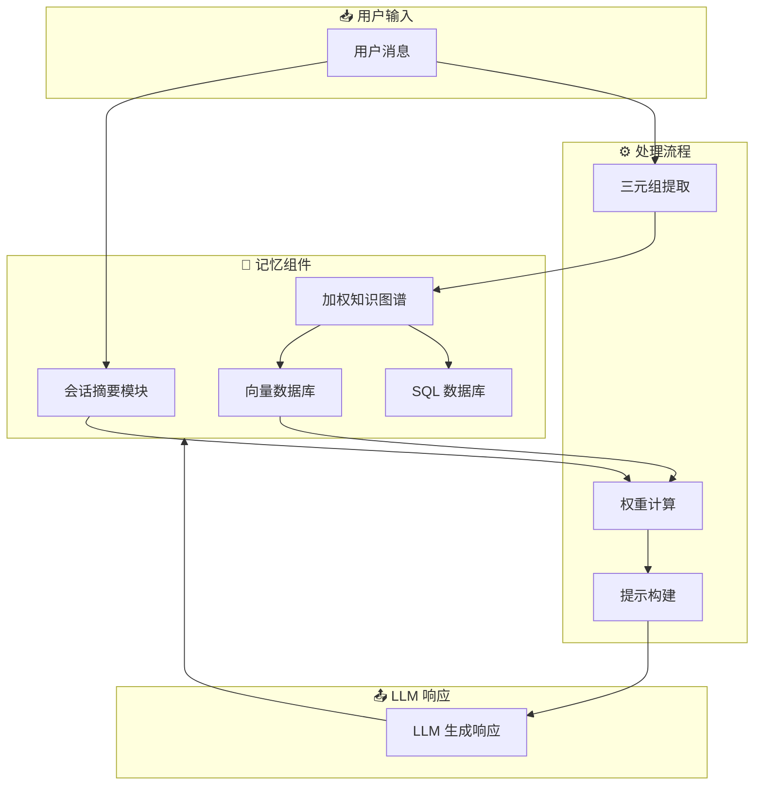

# 🧠 Memoria

## 基本信息
- **标题**: A Scalable Agentic Memory Framework for Personalized Conversational AI
- **中文标题**: 可扩展智能体记忆框架用于个性化对话 AI
- **arXiv**: [2512.12686](https://arxiv.org/abs/2512.12686)
- **机构**: Not specified in paper
- **发表日期**: 2025年12月14日
- **基准测试**: LongMemEvals dataset

## 论文综合评分
**综合评分**: ⭐⭐⭐⭐ 4.2/5.0

| 维度 | 评分 | 说明 |
|------|------|------|
| 期刊影响力 | ⭐⭐⭐⭐ | AIML Systems 2025 会议论文 |
| 问题核心性 | ⭐⭐⭐⭐⭐ | 解决 LLM 对话系统状态缺失问题 |
| 方法创新性 | ⭐⭐⭐⭐ | 混合架构：动态摘要 + 加权知识图谱 |
| 技术壁垒 | ⭐⭐⭐⭐ | 完整的模块化实现框架 |
| 落地可行性 | ⭐⭐⭐⭐⭐ | Python 库，易于集成到现有系统 |
| 应用前景 | ⭐⭐⭐⭐⭐ | 客服、电商、金融顾问等场景 |

**综合评价**: Memoria 提出了一个实用的模块化记忆框架，通过动态会话摘要和加权知识图谱相结合的方式，为 LLM 对话系统提供了持久化、可解释的记忆能力。该框架在 LongMemEvals 数据集上表现优于 A-MEM，在保持高准确率的同时显著降低了 token 使用量和延迟，为工业级应用提供了可行的解决方案。

## 本体论映射 (Ontology Mapping)
基于 Agent Memory 领域本体模型的 7 维度标注

- **记忆类型**: Hybrid (混合记忆)
- **记忆结构**: Graph + Sequential (知识图谱 + 会话序列)
- **记忆操作**: Formation + Evolution + Retrieval
- **记忆载体**: Token-level (令牌级)
- **功能定位**: Working (工作记忆) + Factual (事实记忆)
- **使用模式**: Value-aware Retrieval, Recency-weighted, Personalized Context
- **验证公理**: Efficiency, Generalization, Stability-Plasticity

**领域贡献**: Memoria 将**加权知识图谱 (Weighted Knowledge Graph)** 和**动态会话摘要 (Dynamic Session Summarization)** 引入智能体记忆领域，提出了**指数衰减权重机制**来解决记忆冲突和优先级问题。该框架通过**模块化设计**实现了短时对话连贯性和长期个性化记忆的统一，为构建可扩展的工业级对话 AI 系统提供了实用方案。

## 核心主张（通俗易懂版）
- **🤔 问题是什么？** 现有 LLM 对话系统是无状态的，每次交互都从零开始，无法记住用户偏好和历史对话，导致重复询问和缺乏个性化。
- **💡 解决方案是什么？** Memoria 提出混合记忆架构，结合动态会话摘要（短期记忆）和加权知识图谱（长期记忆），通过指数衰减权重机制优先使用最近的信息。
- **🌟 核心优势是什么？** 在 LongMemEvals 数据集上准确率优于 A-MEM，同时将 token 使用量从 115,000+ 降低到 400 以下，延迟减少 38.7%，实现了性能和效率的平衡。

## 方法架构
Memoria 的核心创新是混合记忆架构：

### 架构图

## 实验结果
在 LongMemEvals 数据集上进行评估：

**关键发现**: Memoria 通过加权知识图谱和动态摘要的结合，在保持高准确率的同时显著提升了效率，解决了传统全上下文提示的可扩展性问题。

### 实验指标
- **准确率**: 在 single-session-user 和 knowledge-update 任务上均优于 A-MEM
- **Token 长度**: 从 115,000+ 降低到 **400 以下** (减少 99.6%)
- **延迟**: 减少 **38.7%** 相比全上下文提示
- **内存效率**: 模块化设计，支持大规模部署

## 关键词
- 智能体记忆 (Agentic Memory)
- 知识图谱 (Knowledge Graph)
- 动态摘要 (Dynamic Summarization)
- 加权检索 (Weighted Retrieval)
- 指数衰减 (Exponential Decay)
- 个性化对话 (Personalized Conversation)
- 模块化框架 (Modular Framework)
- 可扩展性 (Scalability)
- 上下文连贯性 (Context Coherence)
- 工业应用 (Industrial Application)

## 局限性分析
- **嵌入模型依赖**: 默认使用 OpenAI 的 text-embedding-ada-002，可能增加成本
- **评估范围有限**: 仅在 LongMemEvals 的两个子集上进行评估
- **KG 质量**: 三元组提取质量依赖于底层 LLM 的准确性

## 未来研究方向
- **开源嵌入**: 支持更多开源嵌入模型以降低成本
- **多模态扩展**: 扩展到视觉、音频等多模态记忆
- **系统优化**: 优化内存占用和检索延迟
- **应用场景扩展**: 应用于推荐系统、生产力工具等更广泛的智能体系统
- **高级记忆任务**: 支持时序推理、用户偏好追踪等复杂任务