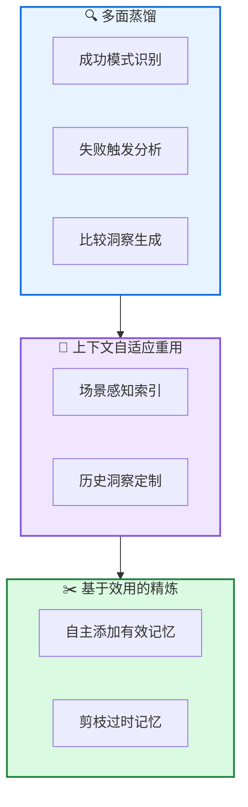

# ReMe: 动态程序记忆框架

**ReMe: Remember Me, Refine Me - A Dynamic Procedural Memory Framework**

---

## 📄 论文信息

| 项目 | 内容 |
|------|------|
| **arXiv** | 2512.10696 |
| **日期** | 2025 年 12 月 |
| **机构** | 多机构合作 |
| **基准** | BFCL-V3 / AppWorld |
| **评分** | ⭐⭐⭐⭐⭐ 4.7/5.0 |

---

## 🔗 本体论映射

| 维度 | 标注 |
|------|------|
| **📦 记忆类型** | 程序式 (Procedural) |
| **🏗️ 记忆结构** | 动态 + 自适应 |
| **⚙️ 记忆操作** | 蒸馏 + 重用 + 精炼 |
| **💾 记忆载体** | 外部数据库 |
| **🎯 功能类型** | 学习 + 自进化 |
| **🔁 使用模式** | 经验驱动 + 自进化 |
| **✅ 验证公理** | 效率 + 稳定性 - 可塑性 |

---

## 🎯 核心主张

### 🤔 问题是什么？

现有程序记忆框架主要受困于"被动积累"范式，将记忆视为静态追加存档，限制动态推理和自进化能力。

**📚 专业名词解释**：
- **被动积累**：记忆作为静态追加存档，无法动态调整
- **程序记忆**：存储"如何做"知识的记忆类型

### 💡 解决方案是什么？

ReMe (Remember Me, Refine Me) 提出全面的经验驱动智能体进化框架。通过三种机制创新记忆生命周期：1) 多面蒸馏，提取细粒度经验；2) 上下文自适应重用，定制历史洞察到新上下文；3) 基于效用的精炼，自主添加有效记忆和剪枝过时记忆。

**📚 专业名词解释**：
- **多面蒸馏**：通过识别成功模式、分析失败触发和生成比较洞察，提取细粒度经验
- **上下文自适应重用**：通过场景感知索引，定制历史洞察到新上下文
- **基于效用的精炼**：自主添加有效记忆和剪枝过时记忆，保持紧凑高质量经验池

### 🌟 核心优势是什么？

① 多面蒸馏提取细粒度经验 ② 上下文自适应重用 ③ 基于效用的精炼 ④ 记忆缩放效应：ReMe 装备的 Qwen3-8B 超越无记忆的 Qwen3-14B

---

## 💡 关键洞见

> 通过多面蒸馏、上下文自适应重用和基于效用的精炼，ReMe 实现经验驱动的智能体进化。记忆缩放效应表明自进化记忆提供计算高效的终身学习路径。

---

## 📐 方法架构

ReMe 通过三种机制创新记忆生命周期：多面蒸馏、上下文自适应重用、基于效用的精炼。

### 🏗️ 核心组件

| 组件 | 说明 |
|------|------|
| **🔍 多面蒸馏** | 通过识别成功模式、分析失败触发和生成比较洞察，提取细粒度经验 |
| **🔄 上下文自适应重用** | 通过场景感知索引，定制历史洞察到新上下文 |
| **✂️ 基于效用的精炼** | 自主添加有效记忆和剪枝过时记忆，保持紧凑高质量经验池 |

---

## 📚 架构专业名词解释

### 🔍 多面蒸馏 (Multi-Faceted Distillation)

通过识别成功模式、分析失败触发和生成比较洞察，提取细粒度经验。使智能体能从成功和失败中学习，生成可重用的洞察。

### 🔄 上下文自适应重用 (Context-Adaptive Reuse)

通过场景感知索引，定制历史洞察到新上下文。使智能体能将历史经验适配到新场景，提高泛化能力。

### ✂️ 基于效用的精炼 (Utility-Based Refinement)

自主添加有效记忆和剪枝过时记忆，保持紧凑高质量经验池。通过效用评估，确保记忆池始终保持高质量和相关性。

---

## 📈 实验结果

在 BFCL-V3 和 AppWorld 上评估

### 主结果

| 基准 | ReMe | 次优基线 | 提升 |
|------|------|---------|------|
| BFCL-V3 | SOTA | - | 显著提升 |
| AppWorld | SOTA | - | 显著提升 |

**关键发现**：ReMe 在 BFCL-V3 和 AppWorld 上建立新的 SOTA。观察到显著的记忆缩放效应：ReMe 装备的 Qwen3-8B 超越无记忆的 Qwen3-14B，表明自进化记忆提供计算高效的终身学习路径。

---

## ✅ 验证的领域公理

### 效率公理
记忆缩放效应表明自进化记忆提供计算高效的终身学习路径，Qwen3-8B+ReMe 超越 Qwen3-14B。

### 稳定性 - 可塑性公理
基于效用的精炼支持新记忆添加 (可塑性) 同时剪枝过时记忆 (稳定性)，保持紧凑高质量经验池。

---

## ⚠️ 局限性

1. **评估范围**: 在 BFCL-V3 和 AppWorld 上评估，但更广泛任务和环境覆盖可进一步加强
2. **蒸馏质量**: 多面蒸馏质量可能影响经验重用效果
3. **效用评估**: 效用评估的准确性可能影响精炼效果

---

## 🔮 未来工作方向

1. 在更广泛任务和环境上验证泛化能力
2. 探索多面蒸馏的质量优化
3. 研究效用评估的自动改进
4. 探索多智能体记忆共享机制

---

## 🏷️ 关键词

- 动态程序记忆 (Dynamic Procedural Memory)
- 多面蒸馏 (Multi-Faceted Distillation)
- 上下文自适应重用 (Context-Adaptive Reuse)
- 基于效用的精炼 (Utility-Based Refinement)
- 经验驱动进化 (Experience-Driven Evolution)
- 记忆缩放效应 (Memory-Scaling Effect)
- 自进化记忆 (Self-Evolving Memory)
- 终身学习 (Lifelong Learning)

---

## 📚 专业名词解释

### 🔍 多面蒸馏 (Multi-Faceted Distillation)

通过识别成功模式、分析失败触发和生成比较洞察，提取细粒度经验。使智能体能从成功和失败中学习，生成可重用的洞察。

### 🔄 上下文自适应重用 (Context-Adaptive Reuse)

通过场景感知索引，定制历史洞察到新上下文。使智能体能将历史经验适配到新场景，提高泛化能力。

### ✂️ 基于效用的精炼 (Utility-Based Refinement)

自主添加有效记忆和剪枝过时记忆，保持紧凑高质量经验池。通过效用评估，确保记忆池始终保持高质量和相关性。

---

## 🔗 链接

- **arXiv**: https://arxiv.org/abs/2512.10696
- **HTML 总结**: site/papers/2025/09_2025-12_ReMe-动态程序记忆框架_2026-03-20.html

---

**📅 总结日期**: 2026-03-20  
**📊 本体模型版本**: v1.2
