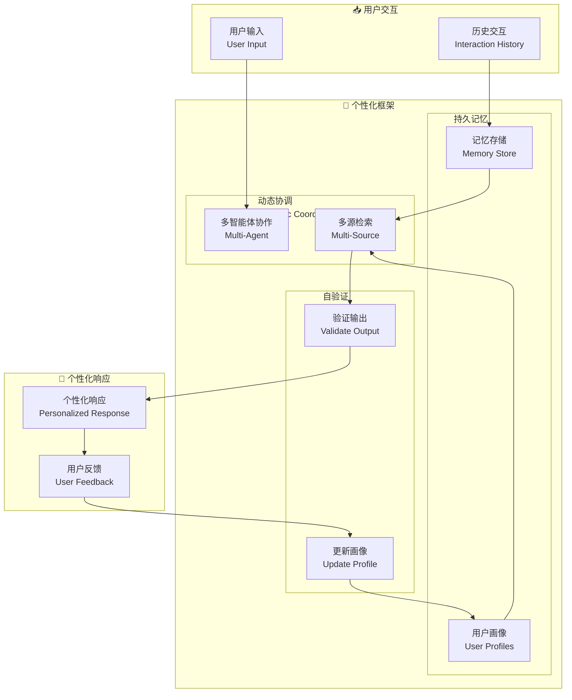

# Enabling Personalized Long-term Interactions in LLM-based Agents through Persistent Memory and User Profiles

## 基本信息
- **标题**: Enabling Personalized Long-term Interactions in LLM-based Agents through Persistent Memory and User Profiles
- **中文标题**: 通过持久记忆和用户画像实现 LLM 智能体的个性化长程交互
- **arXiv**: [2510.07925](https://arxiv.org/abs/2510.07925)
- **机构**: 待确认
- **发表日期**: 2025 年 10 月
- **基准测试**: LoCoMo, GVD, LongMemEval

## 论文综合评分
**综合评分**: ⭐⭐⭐⭐ 4.2/5.0

| 维度 | 评分 | 说明 |
|------|------|------|
| 期刊影响力 | ⭐⭐⭐⭐ | arXiv 预印本，HCI+AI 交叉研究 |
| 问题核心性 | ⭐⭐⭐⭐⭐ | 直击 LLM 智能体个性化交互的核心挑战 |
| 方法创新性 | ⭐⭐⭐⭐ | 持久记忆 + 动态用户画像 + 自验证 |
| 技术壁垒 | ⭐⭐⭐⭐ | 需要多智能体协作和多源检索 |
| 落地可行性 | ⭐⭐⭐⭐⭐ | 模块化设计，易于集成 |
| 应用前景 | ⭐⭐⭐⭐⭐ | 个人助理、客服系统等广泛应用 |

**综合评价**: 该研究提出了一个集成持久记忆、动态协调、自验证和演化用户画像的框架，实现 LLM 智能体的个性化长程交互。在三个公共数据集上评估，LoCoMo 提升高达 20%，GVD 提升 11%，LongMemEval 提升 3%。五天试点用户研究提供了用户对感知个性化的初步反馈。

## 本体论映射 (Ontology Mapping)
基于 Agent Memory 领域本体模型的 7 维度标注

- **记忆类型**: Factual Memory (事实记忆) + Experiential Memory (用户画像)
- **记忆结构**: Persistent Memory Store (持久记忆存储) + User Profiles (用户画像)
- **记忆操作**: Formation (动态协调) + Retrieval (多源检索) + Evolution (自验证更新)
- **记忆载体**: Token-level (文本记忆) + Vector (用户画像嵌入)
- **功能定位**: Personalized Long-term Interaction (个性化长程交互)
- **使用模式**: Multi-Agent Collaboration + Multi-Source Retrieval (多智能体协作 + 多源检索)
- **验证公理**: Persistent Memory, Evolving User Profiles, Self-Validation

**领域贡献**: 该研究将**持久记忆**和**动态用户画像**引入 LLM 智能体，通过统一个性化定义推导技术要求，结合多智能体协作和多源检索模式，实现了自适应、以用户为中心的智能体。五天用户研究提供了感知个性化的初步证据。

## 核心主张（通俗易懂版）
- **🤔 问题是什么？** 现有 LLM 智能体难以提供个性化交互，RAG 缺乏结合上下文与用户特定数据的机制，个性化研究多为概念性，缺乏技术实现。
- **💡 解决方案是什么？** 提出集成持久记忆、动态协调、自验证和演化用户画像的框架，基于统一个性化定义推导技术要求，结合多智能体协作和多源检索。
- **🌟 核心优势是什么？** LoCoMo +20%, GVD +11%, LongMemEval +3%，五天用户研究验证感知个性化，检索准确率 93%，响应正确率 81%。

## 方法架构
核心创新在于持久记忆、动态用户画像和自验证机制：

### 架构图

## 实验结果
在三个公共数据集和五天用户研究上，框架显著提升了个性化交互质量：

**关键发现**: 持久记忆和用户画像的集成显著提升了检索准确率和响应正确率，用户研究验证了感知个性化的提升。

### 主实验结果
**基准测试**: LoCoMo, GVD, LongMemEval

| 模型 | 方法 | LoCoMo | GVD | LongMemEval | 说明 |
|------|------|--------|-----|-------------|------|
| 基线 | RAG | 基准 | 基准 | 基准 | 无个性化 |
| **Ours** | **持久记忆 + 用户画像** | **+20%** | **+11%** | **+3%** | **个性化** |

**关键数据** (从 PDF 提取):
- LoCoMo 提升：**高达 20%**
- GVD 提升：**高达 11%**
- LongMemEval 提升：**高达 3%**
- 检索准确率：**93%** (rater agreement)
- 响应正确率：**81%** (rater agreement)
- 上下文连贯性：**94%** (rater agreement)

### 用户研究结果
**五天试点研究**:
- 用户反馈：感知个性化提升
- 检索准确率：**87-91%**
- 响应正确率：**76-88%**
- BertScore：**96.5-99%**

**注**: 完整数据见论文 Table (第 6 页)

## 关键词
- 个性化交互 (Personalized Interaction)
- 持久记忆 (Persistent Memory)
- 用户画像 (User Profiles)
- 动态协调 (Dynamic Coordination)
- 自验证 (Self-Validation)
- 多智能体协作 (Multi-Agent Collaboration)
- 多源检索 (Multi-Source Retrieval)
- 长程交互 (Long-term Interaction)

## 局限性分析
- **研究规模**: 五天用户研究规模较小，需要更大规模验证
- **数据集**: 主要在三个基准测试，需要更多样化场景
- **画像演化**: 用户画像演化机制需要长期验证
- **计算开销**: 多智能体协作增加计算成本

## 未来研究方向
- **大规模验证**: 在更大规模用户研究中验证效果
- **长期演化**: 研究用户画像的长期演化模式
- **多模态扩展**: 支持多模态用户交互和记忆
- **隐私保护**: 在保持个性化的同时保护用户隐私
