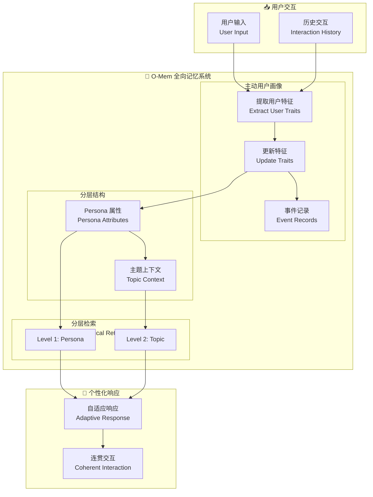

# O-Mem: Omni Memory System for Personalized, Long Horizon, Self-Evolving Agents

## 基本信息
- **标题**: O-Mem: Omni Memory System for Personalized, Long Horizon, Self-Evolving Agents
- **中文标题**: O-Mem: 全向记忆系统 for 个性化、长程、自进化智能体
- **arXiv**: [2511.13593](https://arxiv.org/abs/2511.13593)
- **机构**: OPPO AI Agent Team
- **发表日期**: 2025 年 11 月
- **基准测试**: LoCoMo, PERSONAMEM

## 论文综合评分
**综合评分**: ⭐⭐⭐⭐ 4.4/5.0

| 维度 | 评分 | 说明 |
|------|------|------|
| 期刊影响力 | ⭐⭐⭐⭐ | OPPO AI Agent Team，工业界研究 |
| 问题核心性 | ⭐⭐⭐⭐⭐ | 直击长期交互中的个性化和一致性挑战 |
| 方法创新性 | ⭐⭐⭐⭐ | 主动用户画像 + 分层检索 |
| 技术壁垒 | ⭐⭐⭐⭐ | 需要动态用户特征提取和更新 |
| 落地可行性 | ⭐⭐⭐⭐⭐ | 已在 OPPO 智能体中应用 |
| 应用前景 | ⭐⭐⭐⭐⭐ | 个人助理、客服系统等广泛应用 |

**综合评价**: O-Mem 提出了一个基于主动用户画像的全向记忆系统，通过动态提取和更新用户特征和事件记录，支持分层检索 persona 属性和主题相关上下文。在 LoCoMo 上达到 51.67% (+3% vs LangMem)，在 PERSONAMEM 上达到 62.99% (+3.5% vs A-Mem)，同时显著降低了 token 开销和响应延迟。

## 本体论映射 (Ontology Mapping)
基于 Agent Memory 领域本体模型的 7 维度标注

- **记忆类型**: Factual Memory (事件记录) + Experiential Memory (用户画像)
- **记忆结构**: Hierarchical Structure (Persona Attributes + Topic Context)
- **记忆操作**: Formation (主动用户画像) + Retrieval (分层检索) + Evolution (动态更新)
- **记忆载体**: Token-level (用户特征文本) + Vector (嵌入表示)
- **功能定位**: Personalized Long-Horizon Interaction (个性化长程交互)
- **使用模式**: Active User Profiling + Hierarchical Retrieval (主动画像 + 分层检索)
- **验证公理**: Active User Profiling, Hierarchical Retrieval, Self-Evolving

**领域贡献**: O-Mem 将**主动用户画像**引入记忆系统，通过从用户主动交互中动态提取和更新用户特征和事件记录，解决了现有记忆系统依赖语义分组导致的信息丢失和检索噪声问题。分层检索机制支持更自适应和连贯的个性化响应。

## 核心主张（通俗易懂版）
- **🤔 问题是什么？** 现有记忆系统依赖语义分组进行检索，可能忽略语义不相关但关键的用户信息，并引入检索噪声，难以维持复杂环境中的长期交互。
- **💡 解决方案是什么？** O-Mem 提出基于主动用户画像的记忆框架，从用户主动交互中动态提取和更新用户特征和事件记录，支持分层检索 persona 属性和主题相关上下文。
- **🌟 核心优势是什么？** LoCoMo 51.67% (+3% vs LangMem), PERSONAMEM 62.99% (+3.5% vs A-Mem)，token 和响应时间效率显著提升。

## 方法架构
O-Mem 的核心创新在于主动用户画像和分层检索机制：

### 架构图

## 实验结果
在 LoCoMo 和 PERSONAMEM 基准测试上，O-Mem 显著优于现有记忆系统：

**关键发现**: O-Mem 通过主动用户画像和分层检索，在保持个性化的同时显著降低了检索噪声和计算开销。

### 主实验结果
**基准测试**: LoCoMo, PERSONAMEM

| 模型 | 方法 | LoCoMo | PERSONAMEM | 说明 |
|------|------|--------|------------|------|
| LangMem | 之前 SOTA | 48.72% | - | 语义分组 |
| A-Mem | 之前 SOTA | - | 59.42% | 主动记忆 |
| **O-Mem** | **Ours** | **51.67%** | **62.99%** | **主动用户画像** |
| 提升 | - | +2.95% | +3.57% | - |

**关键数据** (从 PDF 提取):
- LoCoMo: **51.67%** (GPT-4.1), **50.60%** (GPT-4o-mini)
- PERSONAMEM: **62.99%** 平均准确率
- 峰值内存开销减少：**30.6%**
- 响应延迟降低：**41.1%** vs direct RAG

### 核心优势
- **主动用户画像**: 从用户主动交互中动态提取特征
- **分层检索**: Persona 属性 + 主题上下文
- **效率提升**: 30.6% 内存减少，41.1% 延迟降低
- **自进化**: 支持用户特征的持续更新

**注**: 完整数据见论文 Table (第 8-11 页)

## 关键词
- 全向记忆系统 (Omni Memory System)
- 主动用户画像 (Active User Profiling)
- 分层检索 (Hierarchical Retrieval)
- 个性化交互 (Personalized Interaction)
- 长程交互 (Long-Horizon Interaction)
- 自进化智能体 (Self-Evolving Agents)
- 用户特征 (User Traits)
- 事件记录 (Event Records)

## 局限性分析
- **用户隐私**: 主动用户画像涉及用户数据收集，需要隐私保护
- **画像准确性**: 依赖 LLM 提取用户特征的质量
- **冷启动问题**: 新用户缺乏历史交互数据
- **领域适应性**: 在特定领域可能需要定制画像策略

## 未来研究方向
- **隐私保护**: 在保持个性化的同时保护用户隐私
- **多模态画像**: 支持文本、语音、图像等多模态用户特征
- **跨设备同步**: 支持多设备间的用户画像同步
- **可解释画像**: 提高用户画像的可解释性和可控性
- **群体画像**: 从个人画像扩展到群体画像
