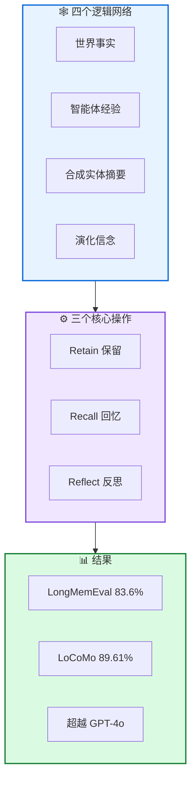

# Hindsight: 结构化记忆架构

**Hindsight is 20/20: Building Agent Memory that Retains, Recalls, and Reflects**

---

## 📄 论文信息

| 项目 | 内容 |
|------|------|
| **arXiv** | 2512.12818 |
| **日期** | 2025 年 12 月 |
| **机构** | 多机构合作 |
| **基准** | LongMemEval / LoCoMo |
| **评分** | ⭐⭐⭐⭐⭐ 4.8/5.0 |

---

## 🔗 本体论映射

| 维度 | 标注 |
|------|------|
| **📦 记忆类型** | 世界事实 + 智能体经验 + 实体摘要 + 演化信念 |
| **🏗️ 记忆结构** | 四个逻辑网络 |
| **⚙️ 记忆操作** | Retain + Recall + Reflect |
| **💾 记忆载体** | 结构化记忆库 |
| **🎯 功能类型** | 推理 + 可解释性 |
| **🔁 使用模式** | 结构化 + 可追溯 |
| **✅ 验证公理** | 效率 + 可解释性 |

---

## 🎯 核心主张

### 🤔 问题是什么？

当前智能体记忆系统将记忆视为外部层，从对话中提取显著片段，存储在向量或基于图的存储中，检索 top-k 项目到无状态模型的提示中。这些系统模糊证据和推理之间的界限，难以在长程上组织信息，对必须解释推理的智能体支持有限。

**📚 专业名词解释**：
- **外部层**：将记忆作为外部附加层，而非智能体的内在组成部分
- **证据和推理界限模糊**：难以区分检索到的证据和模型的推理

### 💡 解决方案是什么？

Hindsight 提出记忆架构，将智能体记忆视为结构化的、一流的推理基质，组织为四个逻辑网络：世界事实、智能体经验、合成实体摘要、演化信念。框架支持三个核心操作：retain(保留)、recall(回忆)、reflect(反思)，管理信息如何添加、访问和更新。

**📚 专业名词解释**：
- **四个逻辑网络**：世界事实、智能体经验、合成实体摘要、演化信念
- **Retain/Recall/Reflect**：三个核心操作，管理信息的添加、访问和更新
- **结构化记忆基质**：记忆作为结构化的、一流的推理基质，而非外部层

### 🌟 核心优势是什么？

① LongMemEval 准确率 39%→83.6% (20B 模型) ② 超越全上下文 GPT-4o ③ 扩展到更大骨干达到 91.4% (LongMemEval) 和 89.61% (LoCoMo) ④ 一致超越现有记忆架构

---

## 💡 关键洞见

> 通过将智能体记忆视为结构化的、一流的推理基质，Hindsight 实现可追溯的推理和记忆更新。时间、实体感知记忆层增量将会话流转化为结构化、可查询的记忆库，反思层在此库上推理产生答案并更新信息。

---

## 📐 方法架构

Hindsight 包含四个逻辑网络和三个核心操作。

### 🏗️ 核心组件

| 组件 | 说明 |
|------|------|
| **🕸️ 四个逻辑网络** | 世界事实、智能体经验、合成实体摘要、演化信念 |
| **⚙️ 三个核心操作** | Retain(保留)、Recall(回忆)、Reflect(反思) |
| **📊 时间实体感知层** | 增量将会话流转化为结构化、可查询的记忆库 |
| **🤔 反思层** | 在记忆库上推理产生答案并更新信息 |

---

## 📚 架构专业名词解释

### 🕸️ 四个逻辑网络 (Four Logical Networks)

世界事实、智能体经验、合成实体摘要、演化信念。四个网络分别存储不同类型的信息，支持细粒度推理和可追溯更新。

### ⚙️ 三个核心操作 (Three Core Operations)

Retain(保留)：添加信息到记忆库；Recall(回忆)：从记忆库访问信息；Reflect(反思)：在记忆库上推理并更新信息。

### 📊 结构化记忆基质 (Structured Memory Substrate)

记忆作为结构化的、一流的推理基质，而非外部层。支持可追溯的推理和记忆更新，实现透明和可解释的智能体行为。

---

## 📈 实验结果

在 LongMemEval 和 LoCoMo 上评估

### 主结果

| 模型 | LongMemEval | LoCoMo |
|------|-------------|--------|
| 全上下文基线 (20B) | 39% | - |
| **Hindsight (20B)** | **83.6%** | **-** |
| **Hindsight (更大骨干)** | **91.4%** | **89.61%** |
| 最强先前开放系统 | - | 75.78% |

**关键发现**：Hindsight 在 20B 模型上实现 LongMemEval 准确率 39%→83.6% 的显著提升，超越全上下文 GPT-4o。扩展到更大骨干达到 91.4% (LongMemEval) 和 89.61% (LoCoMo)，一致超越现有记忆架构。

---

## ✅ 验证的领域公理

### 效率公理
20B 模型 +Hindsight 超越全上下文 GPT-4o，证明结构化记忆基质的高效性。

### 可解释性公理
四个逻辑网络和三个核心操作支持可追溯的推理和记忆更新，实现透明和可解释的智能体行为。

---

## ⚠️ 局限性

1. **计算成本**: 结构化记忆基质可能需要额外计算资源
2. **评估范围**: 在 LongMemEval 和 LoCoMo 上评估，但更广泛任务和环境覆盖可进一步加强
3. **网络设计**: 四个逻辑网络的设计可能需要领域专业知识

---

## 🔮 未来工作方向

1. 在更广泛任务和环境上验证泛化能力
2. 探索结构化记忆基质的效率优化
3. 研究四个逻辑网络的自动设计和优化
4. 探索多智能体记忆共享机制

---

## 🏷️ 关键词

- 结构化记忆基质 (Structured Memory Substrate)
- 四个逻辑网络 (Four Logical Networks)
- 三个核心操作 (Three Core Operations)
- Retain/Recall/Reflect
- 可追溯推理 (Traceable Reasoning)
- 可解释智能体 (Interpretable Agents)
- 时间实体感知 (Temporal Entity-Aware)
- 多会话记忆 (Multi-Session Memory)

---

## 📚 专业名词解释

### 🕸️ 四个逻辑网络 (Four Logical Networks)

世界事实、智能体经验、合成实体摘要、演化信念。四个网络分别存储不同类型的信息，支持细粒度推理和可追溯更新。

### ⚙️ 三个核心操作 (Three Core Operations)

Retain(保留)：添加信息到记忆库；Recall(回忆)：从记忆库访问信息；Reflect(反思)：在记忆库上推理并更新信息。

### 📊 结构化记忆基质 (Structured Memory Substrate)

记忆作为结构化的、一流的推理基质，而非外部层。支持可追溯的推理和记忆更新，实现透明和可解释的智能体行为。

---

## 🔗 链接

- **arXiv**: https://arxiv.org/abs/2512.12818
- **HTML 总结**: site/papers/2025/10_2025-12_Hindsight-结构化记忆架构_2026-03-20.html

---

**📅 总结日期**: 2026-03-20  
**📊 本体模型版本**: v1.2
