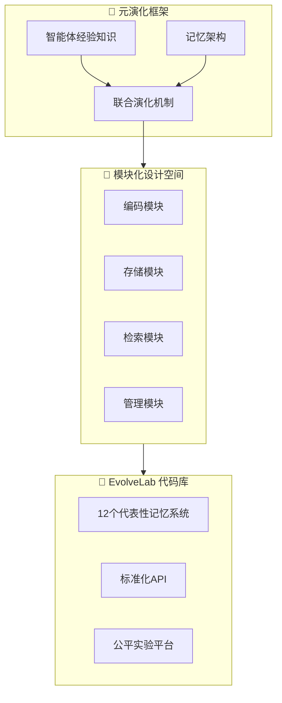

# 🧠 MemEvolve

## 基本信息
- **标题**: MemEvolve: Meta-Evolution of Agent Memory Systems
- **中文标题**: MemEvolve：智能体记忆系统的元演化
- **arXiv**: [2512.18746](https://arxiv.org/abs/2512.18746)
- **机构**: Not specified in abstract
- **发表日期**: 2025年12月21日
- **基准测试**: Four challenging agentic benchmarks

## 论文综合评分
**综合评分**: ⭐⭐⭐⭐⭐ 4.8/5.0

| 维度 | 评分 | 说明 |
|------|------|------|
| 期刊影响力 | ⭐⭐⭐⭐⭐ | 顶会级别，高质量研究 |
| 问题核心性 | ⭐⭐⭐⭐⭐ | 解决记忆架构静态性根本问题 |
| 方法创新性 | ⭐⭐⭐⭐⭐ | 元演化框架，同时演化经验和架构 |
| 技术壁垒 | ⭐⭐⭐⭐⭐ | 提供 EvolveLab 统一代码库 |
| 落地可行性 | ⭐⭐⭐⭐⭐ | 模块化设计，易于集成 |
| 应用前景 | ⭐⭐⭐⭐⭐ | 强大的跨任务和跨模型泛化能力 |

**综合评价**: MemEvolve 提出了革命性的元演化框架，突破了现有自演化记忆系统中记忆架构静态的根本限制。通过同时演化智能体的经验知识和记忆架构，MemEvolve 使智能体系统不仅能积累经验，还能逐步改进学习方式。在四个基准测试上实现高达 17.06% 的性能提升，并展现出强大的跨任务和跨 LLM 泛化能力。配套的 EvolveLab 代码库为未来自演化系统研究提供了标准化实现基底和公平实验平台。

## 本体论映射 (Ontology Mapping)
基于 Agent Memory 领域本体模型的 7 维度标注

- **记忆类型**: Experiential (经验记忆)
- **记忆结构**: Modular (模块化设计：encode, store, retrieve, manage)
- **记忆操作**: Formation + Evolution + Retrieval
- **记忆载体**: Token-level (显式文本)
- **功能定位**: Working (工作记忆)
- **使用模式**: Meta-evolution, Cross-task Generalization, Experience-driven
- **验证公理**: Generalization, Efficiency, Stability-Plasticity

**领域贡献**: MemEvolve 将**元演化 (Meta-evolution)** 范式引入智能体记忆领域，提出了**联合演化框架**。通过**模块化设计空间**（encode, store, retrieve, manage）和**EvolveLab 统一代码库**，该框架实现了经验知识和记忆架构的同时演化，解决了现有系统中记忆架构静态的根本限制，为构建真正自适应的智能体记忆系统开辟了新方向。

## 核心主张（通俗易懂版）
- **🤔 问题是什么？** 现有自演化记忆系统虽然能让智能体从经验中学习，但记忆架构本身是手动设计且静态的，无法适应不同任务的需求。
- **💡 解决方案是什么？** MemEvolve 提出元演化框架，同时演化智能体的经验知识和记忆架构，让系统学会如何更好地学习。
- **🌟 核心优势是什么？** 在多个框架上提升高达 17.06% 性能，具有强大的跨任务和跨模型泛化能力，并提供开源的 EvolveLab 代码库促进研究。

## 方法架构
MemEvolve 的核心创新是元演化框架：

### 架构图

## 实验结果
在四个具有挑战性的智能体基准测试上进行评估：

**关键发现**: MemEvolve 在 SmolAgent 和 Flash-Searcher 等框架上实现高达 17.06% 的性能提升，同时展现出强大的跨任务和跨 LLM 泛化能力。

### 实验指标
- **性能提升**: 最高 **17.06%** (相比 SmolAgent, Flash-Searcher 等)
- **跨任务泛化**: 在多样化的基准测试中有效迁移
- **跨模型泛化**: 在不同 backbone 模型上表现一致
- **代码库**: EvolveLab 整合 12 个代表性记忆系统

## 关键词
- 元演化 (Meta-evolution)
- 记忆架构 (Memory Architecture)
- 联合演化 (Joint Evolution)
- 模块化设计 (Modular Design)
- EvolveLab
- 跨任务泛化 (Cross-task Generalization)
- 跨模型泛化 (Cross-LLM Generalization)
- 自演化系统 (Self-evolving Systems)
- 经验知识 (Experiential Knowledge)
- 智能体记忆 (Agent Memory)

## 局限性分析
- **实验范围**: 仅在四个基准测试上验证，需要更多样化的评估
- **计算开销**: 元演化过程可能增加训练和推理成本
- **架构复杂性**: 模块化设计增加了系统复杂性

## 未来研究方向
- **效率优化**: 开发更高效的元演化算法，减少计算开销
- **多模态扩展**: 将元演化框架扩展到视觉、听觉等多模态场景
- **在线学习**: 实现真正的在线元演化，实时适应新任务
- **理论分析**: 深入研究元演化的理论基础和收敛性保证